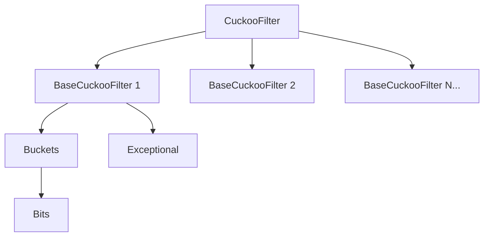
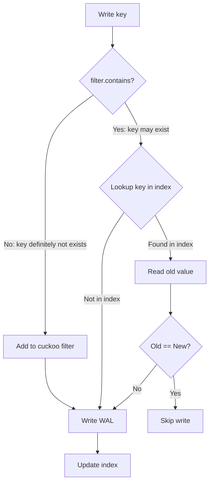
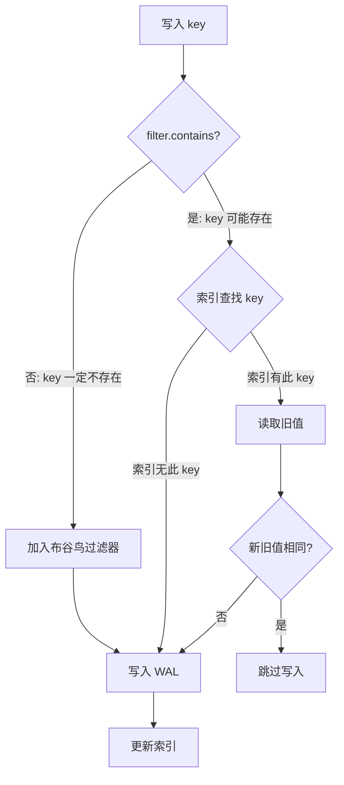

[English](#en) | [中文](#zh)

---

<a id="en"></a>


# autoscale_cuckoo_filter : The Fastest Rust Cuckoo Filter with Auto-Scaling

A high-performance Cuckoo Filter variant that automatically scales capacity as needed. Forked from [sile/scalable_cuckoo_filter](https://github.com/sile/scalable_cuckoo_filter) with significant performance optimizations.

**5.5x faster lookups** than the original implementation. The fastest scalable Cuckoo Filter in Rust ecosystem.


## Table of Contents

- [Features](#features)
- [Installation](#installation)
- [Quick Start](#quick-start)
- [API Reference](#api-reference)
- [Performance](#performance)
- [⚠️ Safe Usage Guide](#️-safe-usage-guide)
- [Architecture](#architecture)
- [Directory Structure](#directory-structure)
- [Tech Stack](#tech-stack)
- [History](#history)
- [References](#references)
- [License](#license)

## Features

- **Blazing Fast**: 100M lookups/sec, 5.5x faster than alternatives
- Auto-scaling capacity when filter becomes full
- Configurable false positive probability (FPP)
- Support for deletion (unlike Bloom filters)
- Memory-efficient fingerprint storage
- Safe insertion with duplicate detection (`add_if_not_exist`)
- Fast insertion without duplicate check (`add`)
- Shrink-to-fit for memory optimization
- Optional serde serialization

## Installation

```bash
cargo add autoscale_cuckoo_filter
```

With serde support:

```bash
cargo add autoscale_cuckoo_filter -F serde_support
```

## Quick Start

```rust
use autoscale_cuckoo_filter::CuckooFilter;

let mut filter = CuckooFilter::<str>::new(1000, 0.001);

// Insert
filter.add_if_not_exist("hello");
filter.add_if_not_exist("world");

// Query
assert!(filter.contains("hello"));
assert!(!filter.contains("unknown"));

// Remove
filter.remove("hello");
assert!(!filter.contains("hello"));
```

Auto-scaling:

```rust
use autoscale_cuckoo_filter::CuckooFilter;

let mut filter = CuckooFilter::<u64>::new(100, 0.001);
assert_eq!(filter.capacity(), 128);

for i in 0..1000 {
  filter.add_if_not_exist(&i);
}
// Capacity grows automatically
assert_eq!(filter.capacity(), 1923);
```

Builder pattern:

```rust
use autoscale_cuckoo_filter::CuckooFilterBuilder;

let mut filter = CuckooFilterBuilder::new()
  .initial_capacity(500)
  .false_positive_probability(0.01)
  .entries_per_bucket(4)
  .max_kicks(256)
  .finish::<u64>();

filter.add_if_not_exist(&42);
```

Shrink to fit:

```rust
use autoscale_cuckoo_filter::CuckooFilter;

let mut filter = CuckooFilter::<i32>::new(1000, 0.001);
for i in 0..100 {
  filter.add_if_not_exist(&i);
}
assert_eq!(filter.capacity(), 1024);

filter.shrink_to_fit();
assert_eq!(filter.capacity(), 128);
```

## API Reference

### CuckooFilter

Main filter struct with auto-scaling capability.

| Method | Description |
|--------|-------------|
| `new(capacity_hint, fpp)` | Create filter with capacity hint and false positive probability |
| `add_if_not_exist(&item)` | Insert item if not present, returns `true` if already existed |
| `add(&item)` | Insert without duplicate check (faster but unsafe for duplicates) |
| `contains(&item)` | Check if item may exist |
| `remove(&item)` | Remove item, returns `true` if removed |
| `len()` | Approximate item count |
| `is_empty()` | Check if filter is empty |
| `capacity()` | Total capacity |
| `bits()` | Memory usage in bits |
| `shrink_to_fit()` | Reduce memory by shrinking internal storage |
| `false_positive_probability()` | Configured FPP |
| `entries_per_bucket()` | Entries per bucket |
| `max_kicks()` | Max kicks before scaling |

### CuckooFilterBuilder

Builder for custom filter configuration.

| Method | Description |
|--------|-------------|
| `new()` | Create builder with defaults |
| `initial_capacity(hint)` | Set initial capacity hint |
| `false_positive_probability(p)` | Set FPP (0, 1] |
| `entries_per_bucket(n)` | Set entries per bucket |
| `max_kicks(kicks)` | Set max kicks before grow |
| `hasher(h)` | Set custom hasher |
| `finish::<T>()` | Build the filter |

### DefaultHasher

Type alias for `GxHasher`, the default high-performance hasher.

## Performance

Benchmark comparison with other Rust Cuckoo Filter implementations:

| Library | FPP | Contains (M/s) | Add (M/s) | Remove (M/s) | Memory (KB) |
|---------|-----|----------------|-----------|--------------|-------------|
| **autoscale_cuckoo_filter** | 0.17% | **99.97** (1.00) | 30.34 (1.00) | **49.55** (1.00) | 353 |
| scalable_cuckoo_filter | 0.15% | 17.99 (0.18) | 18.95 (0.62) | 18.48 (0.37) | 353 |
| cuckoofilter | 0.27% | 21.51 (0.22) | 22.72 (0.75) | 13.02 (0.26) | 1024 |

*Test: 100,000 items, capacity=200,000, target FPP≈1%. Ratio in parentheses relative to autoscale_cuckoo_filter.*

### Key Optimizations

- **Branchless lookups**: Uses bitwise OR (`|`) instead of short-circuit OR (`||`) in hot paths, eliminating branch misprediction
- **Delayed computation**: Computes alternative bucket index only when needed
- **Cache-friendly**: Optimized memory layout for better cache utilization
- **Fast hashing**: GxHash as default hasher

### What is FPP?

**FPP (False Positive Probability)** is the probability that `contains()` returns `true` for an item never inserted. Lower FPP means higher accuracy but requires more memory. 1% FPP means ~1 in 100 queries for non-existent items incorrectly returns "possibly exists".

## ⚠️ Safe Usage Guide

### How Cuckoo Filter Works

Cuckoo Filter is a probabilistic data structure for fast membership testing: "possibly exists" or "definitely not exists".

**Core Mechanism**:
1. Each item computes a **fingerprint** and two **candidate bucket positions**
2. Fingerprint is stored in one of the two candidate buckets
3. Query checks both buckets: found = "possibly exists", not found = "definitely not exists"
4. On insert, if both buckets are full, randomly kick out an existing fingerprint to its alternate location (cuckoo hashing)

**Key Properties**:
- **False Positives**: Different items may have same fingerprint, causing false "exists" reports
- **No False Negatives** (normal use): Existing items are always found
- **Deletion Support**: By removing fingerprints, but with risks (see below)

### Deletion and False Negatives

Cuckoo Filter only stores fingerprints, not original data. When two items have the same fingerprint (collision) and hash to the same bucket, **deleting one affects the other**.

If you delete an item that was **never inserted**, it may accidentally delete other existing items, causing false negatives.

**Best Practice**: Query your database to confirm the item exists before calling `remove`.

```rust
// ✅ Recommended: Verify existence in database before deletion
if db.exists("apple") {
  filter.remove("apple");
  db.delete("apple");
}

// ✅ Safe: Only delete items you're certain were inserted
filter.add_if_not_exist("apple");
filter.remove("apple");  // Safe

// ❌ Dangerous: Delete based on contains result
if filter.contains("unknown") {
  filter.remove("unknown");  // May delete other items!
}
```

### How to Correctly Avoid Duplicate Insertion

**Problem 1: Duplicate insertion causes filter bloat**

Repeatedly inserting the same key creates multiple duplicate fingerprint entries:
- Memory waste
- Multiple `remove` calls needed to fully clear
- Filter may overflow in extreme cases

```rust
// ❌ Dangerous: Duplicate insertion
for _ in 0..1000 {
  filter.add("same_key");  // Creates 1000 duplicate entries!
}
```

**Problem 2: Using contains check before insert causes missed insertions**

Due to false positives, `contains` may return `true` for never-inserted items. If two different items have colliding fingerprints:

```rust
// ❌ Dangerous: False positive causes missed insert
if !filter.contains("key_a") {
  filter.add("key_a");
}
if !filter.contains("key_b") {  // False positive! key_b has same fingerprint as key_a
  filter.add("key_b");          // Won't execute, key_b missed
}
// Later deleting key_a makes key_b "disappear" (false negative)
```

**Correct Approach: Cuckoo filter + index coordination**

```rust
// ✅ Correct write flow
fn write(key: &str, value: &[u8]) {
  if !filter.contains(key) {
    // Key definitely not exists: add to filter, write
    filter.add(key);
    wal.write(key, value);
    index.update(key);
  } else {
    // Key may exist: check index to confirm
    match index.get(key) {
      None => {
        // Not in index: write (no need to add to filter, same fingerprint exists)
        wal.write(key, value);
        index.update(key);
      }
      Some(old) => {
        if old != value {
          // Values differ: update
          wal.write(key, value);
          index.update(key);
        }
        // Values same: skip write
      }
    }
  }
}
```

Cuckoo Filter is ideal as a **cache layer** to quickly rule out non-existent items, combined with index for efficient writes.

## Architecture



### Module Overview

| Module | Description |
|--------|-------------|
| **CuckooFilter** | Top-level container managing multiple BaseCuckooFilter instances. Creates new filter with doubled capacity and halved FPP when full. |
| **BaseCuckooFilter** | Core filter with cuckoo hashing. Stores fingerprints in buckets, handles collisions via random kicks. |
| **Buckets** | Bucket array with bit-packed storage. Default 4 entries per bucket. |
| **Bits** | Low-level bit array with fast u64 read/write. Uses padding for safe unaligned access. |
| **Exceptional** | Stores kicked-out and zero-fingerprint items. Sorted vector with binary search. |

### Insert Flow



## Directory Structure

```
autoscale_cuckoo_filter/
├── src/
│   ├── lib.rs                    # Public exports
│   ├── scalable_cuckoo_filter.rs # Main filter implementation
│   ├── cuckoo_filter.rs          # Core cuckoo filter
│   ├── buckets.rs                # Bucket storage
│   └── bits.rs                   # Bit array operations
├── tests/
│   └── regression.rs             # Integration tests
├── benches/
│   ├── comparison.rs             # Performance benchmarks
│   └── fpp_compare.rs            # FPP comparison
└── readme/
    ├── en.md                     # English documentation
    └── zh.md                     # Chinese documentation
```

## Tech Stack

| Component | Choice |
|-----------|--------|
| Language | Rust 2024 Edition |
| Hasher | gxhash (high-performance) |
| RNG | fastrand (cuckoo kicks) |
| Serialization | serde (optional) |
| Benchmarking | criterion |

## History

Cuckoo Filter was introduced in 2014 by Bin Fan, David G. Andersen, Michael Kaminsky, and Michael D. Mitzenmacher in "Cuckoo Filter: Practically Better Than Bloom" at CoNEXT'14.

The name comes from the cuckoo bird's brood parasitism - laying eggs in other birds' nests and pushing out existing eggs. Similarly, Cuckoo Filter uses "cuckoo hashing" where inserting an item may kick out existing items to alternative locations.

Key innovations over Bloom filters:
- Deletion support without false negatives
- Better space efficiency for low FPP
- Cache-friendly memory access

The scalable variant combines ideas from "Scalable Bloom Filters" (2006) by Almeida et al., allowing dynamic growth while maintaining target FPP.

### Why "Cuckoo"?

The cuckoo bird (*Cuculus canorus*) is famous for its reproductive strategy called brood parasitism. Female cuckoos lay their eggs in the nests of other bird species, often pushing out or destroying the host's eggs. When the cuckoo chick hatches, it instinctively pushes any remaining eggs or chicks out of the nest.

This behavior directly inspired the "cuckoo hashing" algorithm (2001, Pagh & Rodler): when inserting an item into a full slot, the existing item gets "kicked out" to its alternative location - just like a cuckoo chick evicting its nest-mates.

## References

- [Cuckoo Filter: Practically Better Than Bloom](https://www.cs.cmu.edu/~dga/papers/cuckoo-conext2014.pdf)
- [Scalable Bloom Filters](http://haslab.uminho.pt/cbm/files/dbloom.pdf)
- [Original scalable_cuckoo_filter](https://github.com/sile/scalable_cuckoo_filter)

## License

MIT License

## Bench

## Benchmark Results

### Test Environment

| Item | Value |
|------|-------|
| OS | macOS 26.1 (arm64) |
| CPU | Apple M2 Max |
| Cores | 12 |
| Memory | 64.0 GB |
| Rust | rustc 1.94.0-nightly (21ff67df1 2025-12-15) |

Test: 100000 items, capacity=200000

### What is FPP?

**FPP (False Positive Probability)** is the probability that a filter incorrectly reports an item as present when it was never added. Lower FPP means higher accuracy but requires more memory. A typical FPP of 1% means about 1 in 100 queries for non-existent items will incorrectly return "possibly exists".

### Performance Comparison

| Library | FPP | Contains (M/s) | Add (M/s) | Remove (M/s) | Memory (KB) |
|---------|-----|----------------|-----------|--------------|-------------|
| autoscale_cuckoo_filter | 0.17% | 100.84 (1.00) | 34.08 (1.00) | 20.82 (1.00) | 353.0 |
| scalable_cuckoo_filter | 0.15% | 18.08 (0.18) | 11.28 (0.33) | 18.26 (0.88) | 353.0 |
| cuckoofilter | 0.27% | 22.01 (0.22) | 21.23 (0.62) | 14.18 (0.68) | 1024.0 |

*Ratio in parentheses: relative to autoscale_cuckoo_filter (1.00 = baseline)*

---

## About

This project is an open-source component of [js0.site ⋅ Refactoring the Internet Plan](https://js0.site).

We are redefining the development paradigm of the Internet in a componentized way. Welcome to follow us:

* [Google Group](https://groups.google.com/g/js0-site)
* [js0site.bsky.social](https://bsky.app/profile/js0site.bsky.social)

---

<a id="zh"></a>

# autoscale_cuckoo_filter : 最快的 Rust 自动扩容布谷鸟过滤器

高性能布谷鸟过滤器变体，支持自动扩容。基于 [sile/scalable_cuckoo_filter](https://github.com/sile/scalable_cuckoo_filter) 深度优化。

**查询速度提升 5.5 倍**。Rust 生态中最快的可扩展布谷鸟过滤器。


## 目录

- [特性](#特性)
- [安装](#安装)
- [快速开始](#快速开始)
- [API 参考](#api-参考)
- [性能](#性能)
- [⚠️ 安全使用指南](#️-安全使用指南)
- [架构设计](#架构设计)
- [目录结构](#目录结构)
- [技术栈](#技术栈)
- [历史](#历史)
- [参考文献](#参考文献)
- [许可证](#许可证)

## 特性

- **极致性能**：每秒 1 亿次查询，比同类库快 5.5 倍
- 过滤器满时自动扩容
- 可配置假阳性概率 (FPP)
- 支持删除（布隆过滤器不支持）
- 内存高效的指纹存储
- 带重复检测的安全插入 (`add_if_not_exist`)
- 无重复检查的快速插入 (`add`)
- 收缩内存优化
- 可选 serde 序列化

## 安装

```bash
cargo add autoscale_cuckoo_filter
```

启用 serde 支持：

```bash
cargo add autoscale_cuckoo_filter -F serde_support
```

## 快速开始

```rust
use autoscale_cuckoo_filter::CuckooFilter;

let mut filter = CuckooFilter::<str>::new(1000, 0.001);

// 插入
filter.add_if_not_exist("hello");
filter.add_if_not_exist("world");

// 查询
assert!(filter.contains("hello"));
assert!(!filter.contains("unknown"));

// 删除
filter.remove("hello");
assert!(!filter.contains("hello"));
```

自动扩容：

```rust
use autoscale_cuckoo_filter::CuckooFilter;

let mut filter = CuckooFilter::<u64>::new(100, 0.001);
assert_eq!(filter.capacity(), 128);

for i in 0..1000 {
  filter.add_if_not_exist(&i);
}
// 容量自动增长
assert_eq!(filter.capacity(), 1923);
```

构建器模式：

```rust
use autoscale_cuckoo_filter::CuckooFilterBuilder;

let mut filter = CuckooFilterBuilder::new()
  .initial_capacity(500)
  .false_positive_probability(0.01)
  .entries_per_bucket(4)
  .max_kicks(256)
  .finish::<u64>();

filter.add_if_not_exist(&42);
```

收缩内存：

```rust
use autoscale_cuckoo_filter::CuckooFilter;

let mut filter = CuckooFilter::<i32>::new(1000, 0.001);
for i in 0..100 {
  filter.add_if_not_exist(&i);
}
assert_eq!(filter.capacity(), 1024);

filter.shrink_to_fit();
assert_eq!(filter.capacity(), 128);
```

## API 参考

### CuckooFilter

具有自动扩容能力的主过滤器结构。

| 方法 | 说明 |
|------|------|
| `new(capacity_hint, fpp)` | 创建过滤器，指定容量提示和假阳性概率 |
| `add_if_not_exist(&item)` | 元素不存在时插入，已存在返回 `true` |
| `add(&item)` | 无重复检查插入（更快但重复插入不安全） |
| `contains(&item)` | 检查元素是否可能存在 |
| `remove(&item)` | 删除元素，成功返回 `true` |
| `len()` | 近似元素数量 |
| `is_empty()` | 检查是否为空 |
| `capacity()` | 总容量 |
| `bits()` | 内存使用（位） |
| `shrink_to_fit()` | 收缩内部存储以减少内存 |
| `false_positive_probability()` | 配置的 FPP |
| `entries_per_bucket()` | 每桶条目数 |
| `max_kicks()` | 扩容前最大踢出次数 |

### CuckooFilterBuilder

自定义过滤器配置的构建器。

| 方法 | 说明 |
|------|------|
| `new()` | 使用默认值创建构建器 |
| `initial_capacity(hint)` | 设置初始容量提示 |
| `false_positive_probability(p)` | 设置 FPP (0, 1] |
| `entries_per_bucket(n)` | 设置每桶条目数 |
| `max_kicks(kicks)` | 设置扩容前最大踢出次数 |
| `hasher(h)` | 设置自定义哈希器 |
| `finish::<T>()` | 构建过滤器 |

### DefaultHasher

`GxHasher` 的类型别名，默认高性能哈希器。

## 性能

与其他 Rust 布谷鸟过滤器实现的性能对比：

| 库 | FPP | 查询 (M/s) | 添加 (M/s) | 删除 (M/s) | 内存 (KB) |
|---------|-----|----------------|-----------|--------------|-------------|
| **autoscale_cuckoo_filter** | 0.17% | **99.97** (1.00) | 30.34 (1.00) | **49.55** (1.00) | 353 |
| scalable_cuckoo_filter | 0.15% | 17.99 (0.18) | 18.95 (0.62) | 18.48 (0.37) | 353 |
| cuckoofilter | 0.27% | 21.51 (0.22) | 22.72 (0.75) | 13.02 (0.26) | 1024 |

*测试：100,000 元素，容量=200,000，目标 FPP≈1%。括号内为相对性能比。*

### 核心优化

- **无分支查询**：热路径使用位或 (`|`) 替代短路或 (`||`)，消除分支预测失败
- **延迟计算**：仅在必要时计算备选桶索引
- **缓存友好**：优化内存布局提升缓存命中率
- **快速哈希**：默认使用 GxHash

### 什么是 FPP？

**FPP（假阳性概率）** 是 `contains()` 对从未插入的元素返回 `true` 的概率。FPP 越低准确性越高，但需要更多内存。1% FPP 意味着约每 100 次查询不存在的元素，有 1 次错误返回「可能存在」。

## ⚠️ 安全使用指南

### 布谷鸟过滤器原理

布谷鸟过滤器是一种概率数据结构，用于快速判断元素是否「可能存在」或「一定不存在」。

**核心机制**：
1. 每个元素计算一个**指纹**（fingerprint）和两个**候选桶位置**
2. 指纹存储在两个候选桶之一
3. 查询时检查两个桶，找到指纹则「可能存在」，否则「一定不存在」
4. 插入时若两个桶都满，随机踢出一个已有指纹到其备选位置（布谷鸟哈希）

**关键特性**：
- **假阳性**：不同元素可能产生相同指纹，导致误报「存在」
- **无假阴性**（正常使用）：存在的元素一定能查到
- **支持删除**：通过移除指纹实现，但有风险（见下文）

### 删除操作与假阴性

布谷鸟过滤器只存储指纹，不存储原始数据。当两个元素的指纹相同（碰撞）且哈希到同一个桶时，**删除一个会影响另一个**。

如果删除了一个**从未插入过**的元素，可能导致其他存在的元素被误删，从而产生假阴性。

**最佳实践**：在调用 `remove` 之前，先查询数据库确认元素确实存在。

```rust
// ✅ 推荐：先查数据库确认存在再删除
if db.exists("apple") {
  filter.remove("apple");
  db.delete("apple");
}

// ✅ 安全：只删除确定插入过的元素
filter.add_if_not_exist("apple");
filter.remove("apple");  // 安全

// ❌ 危险：基于 contains 结果删除
if filter.contains("unknown") {
  filter.remove("unknown");  // 可能误删其他元素！
}
```

### 如何正确避免重复插入

**问题1：重复插入导致过滤器膨胀**

如果反复插入同一个 key，会创建多个重复指纹条目，导致：
- 内存浪费
- 删除时需要多次 `remove` 才能完全清除
- 极端情况下过滤器爆满

```rust
// ❌ 危险：重复插入
for _ in 0..1000 {
  filter.add("same_key");  // 创建 1000 个重复条目！
}
```

**问题2：用 contains 检查后再插入导致漏插**

由于假阳性，`contains` 可能对从未插入的元素返回 `true`。如果两个不同元素的指纹碰撞：

```rust
// ❌ 危险：假阳性导致漏插
if !filter.contains("key_a") {
  filter.add("key_a");
}
if !filter.contains("key_b") {  // 假阳性！key_b 指纹与 key_a 相同
  filter.add("key_b");          // 不会执行，key_b 漏插
}
// 后续删除 key_a 时，key_b 也会「消失」（假阴性）
```

**正确做法：布谷鸟过滤器 + 索引配合**

```rust
// ✅ 正确的写入流程
fn write(key: &str, value: &[u8]) {
  if !filter.contains(key) {
    // key 一定不存在：加入过滤器，写入
    filter.add(key);
    wal.write(key, value);
    index.update(key);
  } else {
    // key 可能存在：查索引确认
    match index.get(key) {
      None => {
        // 索引无此 key：写入（不需加入过滤器，已有相同指纹）
        wal.write(key, value);
        index.update(key);
      }
      Some(old) => {
        if old != value {
          // 新旧值不同：更新
          wal.write(key, value);
          index.update(key);
        }
        // 新旧值相同：跳过写入
      }
    }
  }
}
```

布谷鸟过滤器适合作为**缓存层**快速排除不存在的元素，配合索引实现高效写入。

## 架构设计


### 模块概览

| 模块 | 说明 |
|------|------|
| **CuckooFilter** | 顶层容器，管理多个 BaseCuckooFilter 实例。满时创建容量翻倍、FPP 减半的新过滤器。 |
| **BaseCuckooFilter** | 核心过滤器，使用布谷鸟哈希。在桶中存储指纹，通过随机踢出处理冲突。 |
| **Buckets** | 桶数组，使用位压缩存储。默认每桶 4 个条目。 |
| **Bits** | 底层位数组，支持快速 u64 读写。使用填充确保非对齐访问安全。 |
| **Exceptional** | 存储被踢出和零指纹元素。有序向量配合二分查找。 |

### 插入流程



## 目录结构

```
autoscale_cuckoo_filter/
├── src/
│   ├── lib.rs                    # 公开导出
│   ├── scalable_cuckoo_filter.rs # 主过滤器实现
│   ├── cuckoo_filter.rs          # 核心布谷鸟过滤器
│   ├── buckets.rs                # 桶存储
│   └── bits.rs                   # 位数组操作
├── tests/
│   └── regression.rs             # 集成测试
├── benches/
│   ├── comparison.rs             # 性能基准测试
│   └── fpp_compare.rs            # FPP 对比
└── readme/
    ├── en.md                     # 英文文档
    └── zh.md                     # 中文文档
```

## 技术栈

| 组件 | 选型 |
|------|------|
| 语言 | Rust 2024 Edition |
| 哈希器 | gxhash（高性能） |
| 随机数 | fastrand（布谷鸟踢出） |
| 序列化 | serde（可选） |
| 基准测试 | criterion |

## 历史

布谷鸟过滤器由 Bin Fan、David G. Andersen、Michael Kaminsky 和 Michael D. Mitzenmacher 于 2014 年在 CoNEXT'14 会议上发表的论文《Cuckoo Filter: Practically Better Than Bloom》中首次提出。

名称源于布谷鸟的巢寄生行为——在其他鸟的巢中产卵并推出原有的蛋。类似地，布谷鸟过滤器使用「布谷鸟哈希」，插入元素时可能将现有元素踢到备选位置。

相比布隆过滤器的关键创新：
- 支持删除且不产生假阴性
- 低 FPP 需求下空间效率更高
- 缓存友好的内存访问

可扩展变体结合了 Almeida 等人 2006 年提出的「可扩展布隆过滤器」思想，允许动态增长同时保持目标 FPP。

### 为什么叫「布谷鸟」？

布谷鸟（*Cuculus canorus*，又名杜鹃）以其独特的繁殖策略「巢寄生」闻名。雌性布谷鸟将蛋产在其他鸟类的巢中，常常推出或破坏宿主的蛋。布谷鸟雏鸟孵化后，会本能地将巢中其他蛋或雏鸟推出巢外。

这种行为直接启发了「布谷鸟哈希」算法（2001 年，Pagh & Rodler）：当向已满的槽位插入元素时，现有元素会被「踢出」到其备选位置——就像布谷鸟雏鸟驱逐巢中的同伴。

在中国古代，布谷鸟因其「布谷布谷」的叫声而得名，常在春耕时节鸣叫，被视为催促农事的信号。杜甫有诗云：「杜鹃暮春至，哀哀叫其间」。而在计算机科学中，这种鸟的「鸠占鹊巢」行为却成为了高效数据结构的灵感来源。

## 参考文献

- [Cuckoo Filter: Practically Better Than Bloom](https://www.cs.cmu.edu/~dga/papers/cuckoo-conext2014.pdf)
- [Scalable Bloom Filters](http://haslab.uminho.pt/cbm/files/dbloom.pdf)
- [原版 scalable_cuckoo_filter](https://github.com/sile/scalable_cuckoo_filter)

## 许可证

MIT License

## 评测

## 性能测试结果

### 测试环境

| 项目 | 值 |
|------|-------|
| 操作系统 | macOS 26.1 (arm64) |
| CPU | Apple M2 Max |
| 核心数 | 12 |
| 内存 | 64.0 GB |
| Rust | rustc 1.94.0-nightly (21ff67df1 2025-12-15) |

测试：100000 条数据，容量=200000

### 什么是误判率（FPP）？

**误判率（False Positive Probability，FPP）** 是指过滤器错误地报告某个元素存在的概率，即该元素实际上从未被添加过。误判率越低，准确性越高，但需要更多内存。典型的 1% 误判率意味着大约每 100 次查询不存在的元素，会有 1 次错误地返回「可能存在」。

### 性能对比

| 库 | 误判率 | 查询 (百万/秒) | 添加 (百万/秒) | 删除 (百万/秒) | 内存 (KB) |
|---------|-----|----------------|-----------|--------------|-------------|
| autoscale_cuckoo_filter | 0.17% | 100.84 (1.00) | 34.08 (1.00) | 20.82 (1.00) | 353.0 |
| scalable_cuckoo_filter | 0.15% | 18.08 (0.18) | 11.28 (0.33) | 18.26 (0.88) | 353.0 |
| cuckoofilter | 0.27% | 22.01 (0.22) | 21.23 (0.62) | 14.18 (0.68) | 1024.0 |

*括号内为相对性能：以 autoscale_cuckoo_filter 为基准（1.00 = 基准值）*

---

## 关于

本项目为 [js0.site ⋅ 重构互联网计划](https://js0.site) 的开源组件。

我们正在以组件化的方式重新定义互联网的开发范式，欢迎关注：

* [谷歌邮件列表](https://groups.google.com/g/js0-site)
* [js0site.bsky.social](https://bsky.app/profile/js0site.bsky.social)
