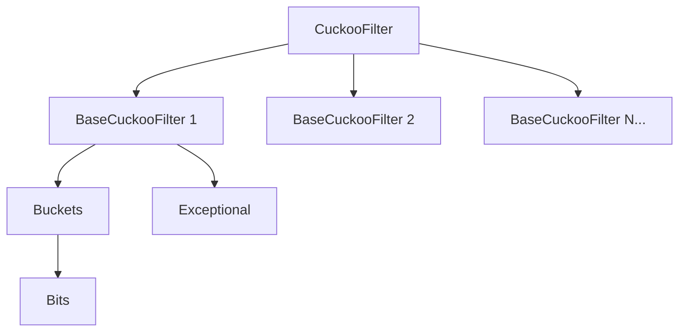
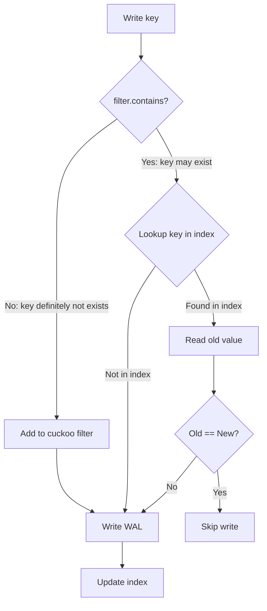

# autoscale_cuckoo_filter : The Fastest Rust Cuckoo Filter with Auto-Scaling

A high-performance Cuckoo Filter variant that automatically scales capacity as needed. Forked from [sile/cuckoo_filter](https://github.com/sile/cuckoo_filter) with significant performance optimizations.

**5.5x faster lookups** than the original implementation. The fastest scalable Cuckoo Filter in Rust ecosystem.


## Table of Contents

- [Features](#features)
- [Installation](#installation)
- [Quick Start](#quick-start)
- [API Reference](#api-reference)
- [Performance](#performance)
- [⚠️ Safe Usage Guide](#️-safe-usage-guide)
- [Architecture](#architecture)
- [Directory Structure](#directory-structure)
- [Tech Stack](#tech-stack)
- [History](#history)
- [References](#references)
- [License](#license)

## Features

- **Blazing Fast**: 100M lookups/sec, 5.5x faster than alternatives
- Auto-scaling capacity when filter becomes full
- Configurable false positive probability (FPP)
- Support for deletion (unlike Bloom filters)
- Memory-efficient fingerprint storage
- Safe insertion with duplicate detection (`add_if_not_exist`)
- Fast insertion without duplicate check (`add`)
- Shrink-to-fit for memory optimization
- Optional serde serialization

## Installation

```bash
cargo add autoscale_cuckoo_filter
```

With serde support:

```bash
cargo add autoscale_cuckoo_filter -F bitcode
```

## Quick Start

```rust
use autoscale_cuckoo_filter::CuckooFilter;

let mut filter = CuckooFilter::<str>::new(1000, 0.001);

// Insert
filter.add_if_not_exist("hello");
filter.add_if_not_exist("world");

// Query
assert!(filter.contains("hello"));
assert!(!filter.contains("unknown"));

// Remove
filter.remove("hello");
assert!(!filter.contains("hello"));
```

Auto-scaling:

```rust
use autoscale_cuckoo_filter::CuckooFilter;

let mut filter = CuckooFilter::<u64>::new(100, 0.001);
assert_eq!(filter.capacity(), 128);

for i in 0..1000 {
  filter.add_if_not_exist(&i);
}
// Capacity grows automatically
assert_eq!(filter.capacity(), 1923);
```

Builder pattern:

```rust
use autoscale_cuckoo_filter::CuckooFilterBuilder;

let mut filter = CuckooFilterBuilder::new()
  .initial_capacity(500)
  .false_positive_probability(0.01)
  .entries_per_bucket(4)
  .max_kicks(256)
  .finish::<u64>();

filter.add_if_not_exist(&42);
```

Shrink to fit:

```rust
use autoscale_cuckoo_filter::CuckooFilter;

let mut filter = CuckooFilter::<i32>::new(1000, 0.001);
for i in 0..100 {
  filter.add_if_not_exist(&i);
}
assert_eq!(filter.capacity(), 1024);

filter.shrink_to_fit();
assert_eq!(filter.capacity(), 128);
```

## API Reference

### CuckooFilter

Main filter struct with auto-scaling capability.

| Method | Description |
|--------|-------------|
| `new(capacity_hint, fpp)` | Create filter with capacity hint and false positive probability |
| `add_if_not_exist(&item)` | Insert item if not present, returns `true` if already existed |
| `add(&item)` | Insert without duplicate check (faster but unsafe for duplicates) |
| `contains(&item)` | Check if item may exist |
| `remove(&item)` | Remove item, returns `true` if removed |
| `len()` | Approximate item count |
| `is_empty()` | Check if filter is empty |
| `capacity()` | Total capacity |
| `bits()` | Memory usage in bits |
| `shrink_to_fit()` | Reduce memory by shrinking internal storage |
| `false_positive_probability()` | Configured FPP |
| `entries_per_bucket()` | Entries per bucket |
| `max_kicks()` | Max kicks before scaling |

### CuckooFilterBuilder

Builder for custom filter configuration.

| Method | Description |
|--------|-------------|
| `new()` | Create builder with defaults |
| `initial_capacity(hint)` | Set initial capacity hint |
| `false_positive_probability(p)` | Set FPP (0, 1] |
| `entries_per_bucket(n)` | Set entries per bucket |
| `max_kicks(kicks)` | Set max kicks before grow |
| `hasher(h)` | Set custom hasher |
| `finish::<T>()` | Build the filter |

### DefaultHasher

Type alias for `GxHasher`, the default high-performance hasher.

## Performance

Benchmark comparison with other Rust Cuckoo Filter implementations:

| Library | FPP | Contains (M/s) | Add (M/s) | Remove (M/s) | Memory (KB) |
|---------|-----|----------------|-----------|--------------|-------------|
| **autoscale_cuckoo_filter** | 0.17% | **99.97** (1.00) | 30.34 (1.00) | **49.55** (1.00) | 353 |
| cuckoo_filter | 0.15% | 17.99 (0.18) | 18.95 (0.62) | 18.48 (0.37) | 353 |
| cuckoofilter | 0.27% | 21.51 (0.22) | 22.72 (0.75) | 13.02 (0.26) | 1024 |

*Test: 100,000 items, capacity=200,000, target FPP≈1%. Ratio in parentheses relative to autoscale_cuckoo_filter.*

### Key Optimizations

- **Branchless lookups**: Uses bitwise OR (`|`) instead of short-circuit OR (`||`) in hot paths, eliminating branch misprediction
- **Delayed computation**: Computes alternative bucket index only when needed
- **Cache-friendly**: Optimized memory layout for better cache utilization
- **Fast hashing**: GxHash as default hasher

### What is FPP?

**FPP (False Positive Probability)** is the probability that `contains()` returns `true` for an item never inserted. Lower FPP means higher accuracy but requires more memory. 1% FPP means ~1 in 100 queries for non-existent items incorrectly returns "possibly exists".

## ⚠️ Safe Usage Guide

### How Cuckoo Filter Works

Cuckoo Filter is a probabilistic data structure for fast membership testing: "possibly exists" or "definitely not exists".

**Core Mechanism**:
1. Each item computes a **fingerprint** and two **candidate bucket positions**
2. Fingerprint is stored in one of the two candidate buckets
3. Query checks both buckets: found = "possibly exists", not found = "definitely not exists"
4. On insert, if both buckets are full, randomly kick out an existing fingerprint to its alternate location (cuckoo hashing)

**Key Properties**:
- **False Positives**: Different items may have same fingerprint, causing false "exists" reports
- **No False Negatives** (normal use): Existing items are always found
- **Deletion Support**: By removing fingerprints, but with risks (see below)

### Deletion and False Negatives

Cuckoo Filter only stores fingerprints, not original data. When two items have the same fingerprint (collision) and hash to the same bucket, **deleting one affects the other**.

If you delete an item that was **never inserted**, it may accidentally delete other existing items, causing false negatives.

**Best Practice**: Query your database to confirm the item exists before calling `remove`.

```rust
// ✅ Recommended: Verify existence in database before deletion
if db.exists("apple") {
  filter.remove("apple");
  db.delete("apple");
}

// ✅ Safe: Only delete items you're certain were inserted
filter.add_if_not_exist("apple");
filter.remove("apple");  // Safe

// ❌ Dangerous: Delete based on contains result
if filter.contains("unknown") {
  filter.remove("unknown");  // May delete other items!
}
```

### How to Correctly Avoid Duplicate Insertion

**Problem 1: Duplicate insertion causes filter bloat**

Repeatedly inserting the same key creates multiple duplicate fingerprint entries:
- Memory waste
- Multiple `remove` calls needed to fully clear
- Filter may overflow in extreme cases

```rust
// ❌ Dangerous: Duplicate insertion
for _ in 0..1000 {
  filter.add("same_key");  // Creates 1000 duplicate entries!
}
```

**Problem 2: Using contains check before insert causes missed insertions**

Due to false positives, `contains` may return `true` for never-inserted items. If two different items have colliding fingerprints:

```rust
// ❌ Dangerous: False positive causes missed insert
if !filter.contains("key_a") {
  filter.add("key_a");
}
if !filter.contains("key_b") {  // False positive! key_b has same fingerprint as key_a
  filter.add("key_b");          // Won't execute, key_b missed
}
// Later deleting key_a makes key_b "disappear" (false negative)
```

**Correct Approach: Cuckoo filter + index coordination**

```rust
// ✅ Correct write flow
fn write(key: &str, value: &[u8]) {
  if !filter.contains(key) {
    // Key definitely not exists: add to filter, write
    filter.add(key);
    wal.write(key, value);
    index.update(key);
  } else {
    // Key may exist: check index to confirm
    match index.get(key) {
      None => {
        // Not in index: write (no need to add to filter, same fingerprint exists)
        wal.write(key, value);
        index.update(key);
      }
      Some(old) => {
        if old != value {
          // Values differ: update
          wal.write(key, value);
          index.update(key);
        }
        // Values same: skip write
      }
    }
  }
}
```

Cuckoo Filter is ideal as a **cache layer** to quickly rule out non-existent items, combined with index for efficient writes.

## Architecture



### Module Overview

| Module | Description |
|--------|-------------|
| **CuckooFilter** | Top-level container managing multiple BaseCuckooFilter instances. Creates new filter with doubled capacity and halved FPP when full. |
| **BaseCuckooFilter** | Core filter with cuckoo hashing. Stores fingerprints in buckets, handles collisions via random kicks. |
| **Buckets** | Bucket array with bit-packed storage. Default 4 entries per bucket. |
| **Bits** | Low-level bit array with fast u64 read/write. Uses padding for safe unaligned access. |
| **Exceptional** | Stores kicked-out and zero-fingerprint items. Sorted vector with binary search. |

### Insert Flow



## Directory Structure

```
autoscale_cuckoo_filter/
├── src/
│   ├── lib.rs                    # Public exports
│   ├── cuckoo_filter.rs # Main filter implementation
│   ├── cuckoo_filter.rs          # Core cuckoo filter
│   ├── buckets.rs                # Bucket storage
│   └── bits.rs                   # Bit array operations
├── tests/
│   └── regression.rs             # Integration tests
├── benches/
│   ├── comparison.rs             # Performance benchmarks
│   └── fpp_compare.rs            # FPP comparison
└── readme/
    ├── en.md                     # English documentation
    └── zh.md                     # Chinese documentation
```

## Tech Stack

| Component | Choice |
|-----------|--------|
| Language | Rust 2024 Edition |
| Hasher | gxhash (high-performance) |
| RNG | fastrand (cuckoo kicks) |
| Serialization | serde (optional) |
| Benchmarking | criterion |

## History

Cuckoo Filter was introduced in 2014 by Bin Fan, David G. Andersen, Michael Kaminsky, and Michael D. Mitzenmacher in "Cuckoo Filter: Practically Better Than Bloom" at CoNEXT'14.

The name comes from the cuckoo bird's brood parasitism - laying eggs in other birds' nests and pushing out existing eggs. Similarly, Cuckoo Filter uses "cuckoo hashing" where inserting an item may kick out existing items to alternative locations.

Key innovations over Bloom filters:
- Deletion support without false negatives
- Better space efficiency for low FPP
- Cache-friendly memory access

The scalable variant combines ideas from "Scalable Bloom Filters" (2006) by Almeida et al., allowing dynamic growth while maintaining target FPP.

### Why "Cuckoo"?

The cuckoo bird (*Cuculus canorus*) is famous for its reproductive strategy called brood parasitism. Female cuckoos lay their eggs in the nests of other bird species, often pushing out or destroying the host's eggs. When the cuckoo chick hatches, it instinctively pushes any remaining eggs or chicks out of the nest.

This behavior directly inspired the "cuckoo hashing" algorithm (2001, Pagh & Rodler): when inserting an item into a full slot, the existing item gets "kicked out" to its alternative location - just like a cuckoo chick evicting its nest-mates.

## References

- [Cuckoo Filter: Practically Better Than Bloom](https://www.cs.cmu.edu/~dga/papers/cuckoo-conext2014.pdf)
- [Scalable Bloom Filters](http://haslab.uminho.pt/cbm/files/dbloom.pdf)
- [Original cuckoo_filter](https://github.com/sile/cuckoo_filter)

## License

MIT License
