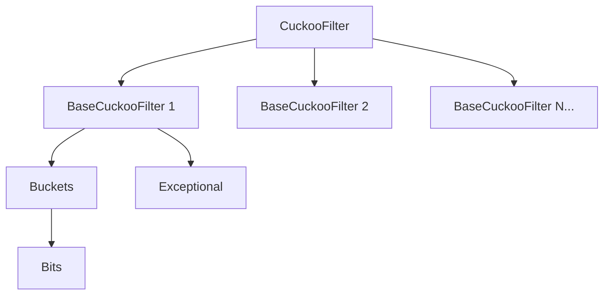
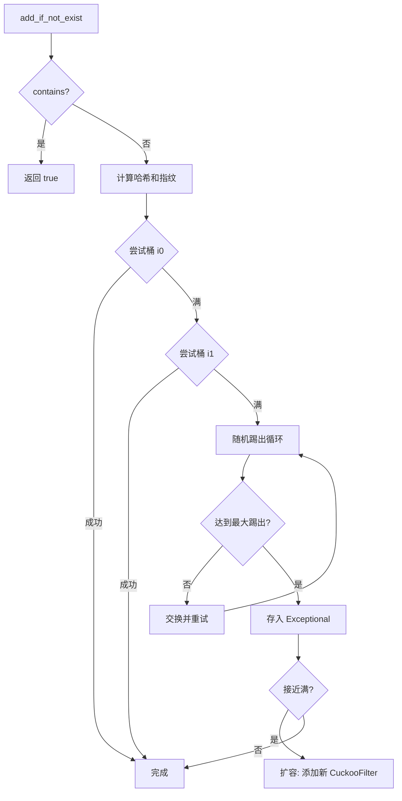

# autoscale_cuckoo_filter : 最快的 Rust 自动扩容布谷鸟过滤器

高性能布谷鸟过滤器变体，支持自动扩容。基于 [sile/scalable_cuckoo_filter](https://github.com/sile/scalable_cuckoo_filter) 深度优化。

**查询速度提升 5.5 倍**。Rust 生态中最快的可扩展布谷鸟过滤器。


## 目录

- [特性](#特性)
- [安装](#安装)
- [快速开始](#快速开始)
- [API 参考](#api-参考)
- [性能](#性能)
- [⚠️ 安全使用指南](#️-安全使用指南)
- [架构设计](#架构设计)
- [目录结构](#目录结构)
- [技术栈](#技术栈)
- [历史](#历史)
- [参考文献](#参考文献)
- [许可证](#许可证)

## 特性

- **极致性能**：每秒 1 亿次查询，比同类库快 5.5 倍
- 过滤器满时自动扩容
- 可配置假阳性概率 (FPP)
- 支持删除（布隆过滤器不支持）
- 内存高效的指纹存储
- 带重复检测的安全插入 (`add_if_not_exist`)
- 无重复检查的快速插入 (`add`)
- 收缩内存优化
- 可选 serde 序列化

## 安装

```bash
cargo add autoscale_cuckoo_filter
```

启用 serde 支持：

```bash
cargo add autoscale_cuckoo_filter -F serde_support
```

## 快速开始

```rust
use autoscale_cuckoo_filter::CuckooFilter;

let mut filter = CuckooFilter::<str>::new(1000, 0.001);

// 插入
filter.add_if_not_exist("hello");
filter.add_if_not_exist("world");

// 查询
assert!(filter.contains("hello"));
assert!(!filter.contains("unknown"));

// 删除
filter.remove("hello");
assert!(!filter.contains("hello"));
```

自动扩容：

```rust
use autoscale_cuckoo_filter::CuckooFilter;

let mut filter = CuckooFilter::<u64>::new(100, 0.001);
assert_eq!(filter.capacity(), 128);

for i in 0..1000 {
  filter.add_if_not_exist(&i);
}
// 容量自动增长
assert_eq!(filter.capacity(), 1923);
```

构建器模式：

```rust
use autoscale_cuckoo_filter::CuckooFilterBuilder;

let mut filter = CuckooFilterBuilder::new()
  .initial_capacity(500)
  .false_positive_probability(0.01)
  .entries_per_bucket(4)
  .max_kicks(256)
  .finish::<u64>();

filter.add_if_not_exist(&42);
```

收缩内存：

```rust
use autoscale_cuckoo_filter::CuckooFilter;

let mut filter = CuckooFilter::<i32>::new(1000, 0.001);
for i in 0..100 {
  filter.add_if_not_exist(&i);
}
assert_eq!(filter.capacity(), 1024);

filter.shrink_to_fit();
assert_eq!(filter.capacity(), 128);
```

## API 参考

### CuckooFilter

具有自动扩容能力的主过滤器结构。

| 方法 | 说明 |
|------|------|
| `new(capacity_hint, fpp)` | 创建过滤器，指定容量提示和假阳性概率 |
| `add_if_not_exist(&item)` | 元素不存在时插入，已存在返回 `true` |
| `add(&item)` | 无重复检查插入（更快但重复插入不安全） |
| `contains(&item)` | 检查元素是否可能存在 |
| `remove(&item)` | 删除元素，成功返回 `true` |
| `len()` | 近似元素数量 |
| `is_empty()` | 检查是否为空 |
| `capacity()` | 总容量 |
| `bits()` | 内存使用（位） |
| `shrink_to_fit()` | 收缩内部存储以减少内存 |
| `false_positive_probability()` | 配置的 FPP |
| `entries_per_bucket()` | 每桶条目数 |
| `max_kicks()` | 扩容前最大踢出次数 |

### CuckooFilterBuilder

自定义过滤器配置的构建器。

| 方法 | 说明 |
|------|------|
| `new()` | 使用默认值创建构建器 |
| `initial_capacity(hint)` | 设置初始容量提示 |
| `false_positive_probability(p)` | 设置 FPP (0, 1] |
| `entries_per_bucket(n)` | 设置每桶条目数 |
| `max_kicks(kicks)` | 设置扩容前最大踢出次数 |
| `hasher(h)` | 设置自定义哈希器 |
| `finish::<T>()` | 构建过滤器 |

### DefaultHasher

`GxHasher` 的类型别名，默认高性能哈希器。

## 性能

与其他 Rust 布谷鸟过滤器实现的性能对比：

| 库 | FPP | 查询 (M/s) | 添加 (M/s) | 删除 (M/s) | 内存 (KB) |
|---------|-----|----------------|-----------|--------------|-------------|
| **autoscale_cuckoo_filter** | 0.17% | **99.97** (1.00) | 30.34 (1.00) | **49.55** (1.00) | 353 |
| scalable_cuckoo_filter | 0.15% | 17.99 (0.18) | 18.95 (0.62) | 18.48 (0.37) | 353 |
| cuckoofilter | 0.27% | 21.51 (0.22) | 22.72 (0.75) | 13.02 (0.26) | 1024 |

*测试：100,000 元素，容量=200,000，目标 FPP≈1%。括号内为相对性能比。*

### 核心优化

- **无分支查询**：热路径使用位或 (`|`) 替代短路或 (`||`)，消除分支预测失败
- **延迟计算**：仅在必要时计算备选桶索引
- **缓存友好**：优化内存布局提升缓存命中率
- **快速哈希**：默认使用 GxHash

### 什么是 FPP？

**FPP（假阳性概率）** 是 `contains()` 对从未插入的元素返回 `true` 的概率。FPP 越低准确性越高，但需要更多内存。1% FPP 意味着约每 100 次查询不存在的元素，有 1 次错误返回「可能存在」。

## ⚠️ 安全使用指南

### 布谷鸟过滤器原理

布谷鸟过滤器是一种概率数据结构，用于快速判断元素是否「可能存在」或「一定不存在」。

**核心机制**：
1. 每个元素计算一个**指纹**（fingerprint）和两个**候选桶位置**
2. 指纹存储在两个候选桶之一
3. 查询时检查两个桶，找到指纹则「可能存在」，否则「一定不存在」
4. 插入时若两个桶都满，随机踢出一个已有指纹到其备选位置（布谷鸟哈希）

**关键特性**：
- **假阳性**：不同元素可能产生相同指纹，导致误报「存在」
- **无假阴性**（正常使用）：存在的元素一定能查到
- **支持删除**：通过移除指纹实现，但有风险（见下文）

### 删除操作与假阴性

布谷鸟过滤器只存储指纹，不存储原始数据。当两个元素的指纹相同（碰撞）且哈希到同一个桶时，**删除一个会影响另一个**。

如果删除了一个**从未插入过**的元素，可能导致其他存在的元素被误删，从而产生假阴性。

**最佳实践**：在调用 `remove` 之前，先查询数据库确认元素确实存在。

```rust
// ✅ 推荐：先查数据库确认存在再删除
if db.exists("apple") {
  filter.remove("apple");
  db.delete("apple");
}

// ✅ 安全：只删除确定插入过的元素
filter.add_if_not_exist("apple");
filter.remove("apple");  // 安全

// ❌ 危险：基于 contains 结果删除
if filter.contains("unknown") {
  filter.remove("unknown");  // 可能误删其他元素！
}
```

### 如何正确避免重复插入

**问题1：重复插入导致过滤器膨胀**

如果反复插入同一个 key，会创建多个重复指纹条目，导致：
- 内存浪费
- 删除时需要多次 `remove` 才能完全清除
- 极端情况下过滤器爆满

```rust
// ❌ 危险：重复插入
for _ in 0..1000 {
  filter.add("same_key");  // 创建 1000 个重复条目！
}
```

**问题2：用 contains 检查后再插入导致漏插**

由于假阳性，`contains` 可能对从未插入的元素返回 `true`。如果两个不同元素的指纹碰撞：

```rust
// ❌ 危险：假阳性导致漏插
if !filter.contains("key_a") {
  filter.add("key_a");
}
if !filter.contains("key_b") {  // 假阳性！key_b 指纹与 key_a 相同
  filter.add("key_b");          // 不会执行，key_b 漏插
}
// 后续删除 key_a 时，key_b 也会「消失」（假阴性）
```

**正确做法：用数据库作为真实来源**

```rust
// ✅ 正确：数据库检查 + 过滤器插入
if !db.exists("key") {
  db.insert("key");
  filter.add("key");  // 或 filter.add_if_not_exist("key")
}

// ✅ 查询时：过滤器预筛 + 数据库确认
if filter.contains("key") {
  if db.exists("key") {
    // 确实存在
  }
}
```

布谷鸟过滤器适合作为**缓存层**快速排除不存在的元素，但不应作为唯一的存在性判断依据。

## 架构设计



### 模块概览

| 模块 | 说明 |
|------|------|
| **CuckooFilter** | 顶层容器，管理多个 BaseCuckooFilter 实例。满时创建容量翻倍、FPP 减半的新过滤器。 |
| **BaseCuckooFilter** | 核心过滤器，使用布谷鸟哈希。在桶中存储指纹，通过随机踢出处理冲突。 |
| **Buckets** | 桶数组，使用位压缩存储。默认每桶 4 个条目。 |
| **Bits** | 底层位数组，支持快速 u64 读写。使用填充确保非对齐访问安全。 |
| **Exceptional** | 存储被踢出和零指纹元素。有序向量配合二分查找。 |

### 插入流程



## 目录结构

```
autoscale_cuckoo_filter/
├── src/
│   ├── lib.rs                    # 公开导出
│   ├── scalable_cuckoo_filter.rs # 主过滤器实现
│   ├── cuckoo_filter.rs          # 核心布谷鸟过滤器
│   ├── buckets.rs                # 桶存储
│   └── bits.rs                   # 位数组操作
├── tests/
│   └── regression.rs             # 集成测试
├── benches/
│   ├── comparison.rs             # 性能基准测试
│   └── fpp_compare.rs            # FPP 对比
└── readme/
    ├── en.md                     # 英文文档
    └── zh.md                     # 中文文档
```

## 技术栈

| 组件 | 选型 |
|------|------|
| 语言 | Rust 2024 Edition |
| 哈希器 | gxhash（高性能） |
| 随机数 | fastrand（布谷鸟踢出） |
| 序列化 | serde（可选） |
| 基准测试 | criterion |

## 历史

布谷鸟过滤器由 Bin Fan、David G. Andersen、Michael Kaminsky 和 Michael D. Mitzenmacher 于 2014 年在 CoNEXT'14 会议上发表的论文《Cuckoo Filter: Practically Better Than Bloom》中首次提出。

名称源于布谷鸟的巢寄生行为——在其他鸟的巢中产卵并推出原有的蛋。类似地，布谷鸟过滤器使用「布谷鸟哈希」，插入元素时可能将现有元素踢到备选位置。

相比布隆过滤器的关键创新：
- 支持删除且不产生假阴性
- 低 FPP 需求下空间效率更高
- 缓存友好的内存访问

可扩展变体结合了 Almeida 等人 2006 年提出的「可扩展布隆过滤器」思想，允许动态增长同时保持目标 FPP。

### 为什么叫「布谷鸟」？

布谷鸟（*Cuculus canorus*，又名杜鹃）以其独特的繁殖策略「巢寄生」闻名。雌性布谷鸟将蛋产在其他鸟类的巢中，常常推出或破坏宿主的蛋。布谷鸟雏鸟孵化后，会本能地将巢中其他蛋或雏鸟推出巢外。

这种行为直接启发了「布谷鸟哈希」算法（2001 年，Pagh & Rodler）：当向已满的槽位插入元素时，现有元素会被「踢出」到其备选位置——就像布谷鸟雏鸟驱逐巢中的同伴。

在中国古代，布谷鸟因其「布谷布谷」的叫声而得名，常在春耕时节鸣叫，被视为催促农事的信号。杜甫有诗云：「杜鹃暮春至，哀哀叫其间」。而在计算机科学中，这种鸟的「鸠占鹊巢」行为却成为了高效数据结构的灵感来源。

## 参考文献

- [Cuckoo Filter: Practically Better Than Bloom](https://www.cs.cmu.edu/~dga/papers/cuckoo-conext2014.pdf)
- [Scalable Bloom Filters](http://haslab.uminho.pt/cbm/files/dbloom.pdf)
- [原版 scalable_cuckoo_filter](https://github.com/sile/scalable_cuckoo_filter)

## 许可证

MIT License
