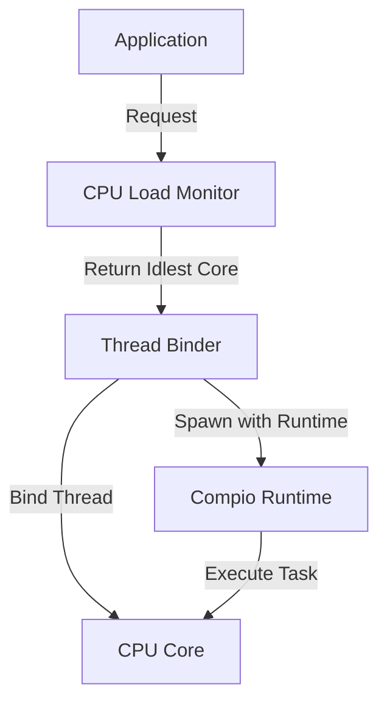
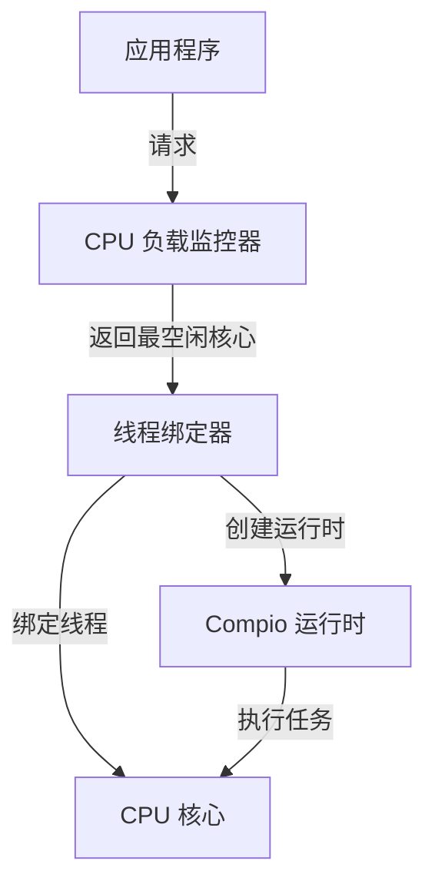

[English](#en) | [中文](#zh)

---

<a id="en"></a>

# cpu_bind : Bind threads to the idlest CPU core

## Table of Contents

- [Project Overview](#project-overview)
- [Usage](#usage)
- [Features](#features)
- [Design](#design)
- [Tech Stack](#tech-stack)
- [Project Structure](#project-structure)
- [API Reference](#api-reference)
- [Historical Context](#historical-context)

## Project Overview

`cpu_bind` provides efficient CPU core binding for Rust applications. It automatically detects the idlest CPU core and binds threads to it, optimizing performance for CPU-intensive workloads. The library integrates seamlessly with compio runtime, enabling thread spawning with CPU affinity control.

## Usage

### Bind Current Thread

```rust
use cpu_bind::bind;
use log::info;

fn main() {
  let core_id = bind();
  info!("bound to core {core_id}");
}
```

### Spawn Thread on Idlest CPU

```rust
use cpu_bind::spawn;
use log::info;

fn main() {
  let handle = spawn(|rt| {
    rt.block_on(async {
      info!("running on compio runtime");
      42
    })
  });
  let result = handle.join().expect("thread panicked").unwrap();
  assert_eq!(result, 42);
  info!("spawn result: {result}");
}
```

## Features

- Automatic CPU load detection
- Thread binding to idlest core
- Integration with compio runtime
- Zero-cost abstraction
- Cross-platform support

## Design

The library follows a simple workflow:



1. Application requests thread binding or spawning
2. CPU load monitor identifies the idlest core
3. Thread binder performs CPU affinity operation
4. Thread executes on the assigned core
5. Compio runtime manages async operations

## Tech Stack

- **compio-runtime**: High-performance async runtime
- **core-affinity**: CPU affinity control
- **cpu-load**: Real-time CPU load monitoring

## Project Structure

```
cpu_bind/
├── src/
│   └── lib.rs          # Core library implementation
├── tests/
│   └── main.rs         # Test suite and usage examples
├── Cargo.toml          # Package configuration
└── README.md           # Project documentation
```

## API Reference

### `spawn`

Spawn thread with compio runtime bound to the idlest CPU.

```rust
pub fn spawn<F, T>(f: F) -> JoinHandle<io::Result<T>>
where
  F: FnOnce(&Runtime) -> T + Send + 'static,
  T: Send + 'static,
```

**Parameters:**
- `f`: Closure accepting runtime reference, returning value

**Returns:**
- `JoinHandle<io::Result<T>>`: Thread join handle

### `bind`

Bind current thread to the idlest CPU.

```rust
pub fn bind() -> usize
```

**Returns:**
- `usize`: Core ID of the bound CPU

## Historical Context

CPU affinity control has evolved significantly since early multiprocessor systems. The concept emerged in the 1970s with mainframe computers, where operating systems needed to manage processor allocation efficiently. Early implementations were manual and required explicit specification of processor assignments.

The introduction of symmetric multiprocessing (SMP) in the 1990s brought sophisticated scheduling algorithms. Linux added CPU affinity support in kernel 2.5.8 (2002), enabling developers to pin threads to specific cores. This capability became crucial for performance-critical applications like databases and high-frequency trading systems.

### Moore's Law and the Shift to Multi-Core

In 1965, Gordon Moore observed that the number of transistors on silicon chips doubled approximately every year. This observation, later refined to every 18-24 months, became known as Moore's Law. For decades, this drove performance improvements through increasing clock speeds and transistor density. However, by the mid-2000s, physical limitations such as heat dissipation and power consumption made further frequency scaling impractical. The industry pivot to multi-core architectures marked a fundamental shift, making CPU affinity control increasingly important for performance optimization.

### Early Batch Processing Scheduling

The earliest computer systems, like the "Trilobite" operating system from the rCore-OS project, ran single applications in isolation. As systems evolved to support multiple users, scheduling became essential. The "Coelacanth" operating system introduced simple "rank-based" scheduling, executing applications sequentially. The "Eoraptor" system advanced to queue-based first-come-first-serve scheduling, while the "Coelophysis" system introduced time-slice round-robin scheduling to ensure fairness among users.

### Linux Scheduler Evolution

Linux has undergone several major scheduler redesigns. The O(1) scheduler (2001) addressed scalability issues with fixed-priority preemptive scheduling. The Completely Fair Scheduler (CFS) introduced in 2007 replaced fixed time slices with dynamic allocation using virtual runtime and red-black trees. This provided better fairness for interactive and batch workloads. Recent developments include energy-aware scheduling and support for heterogeneous architectures with different core types (big.LITTLE, performance cores vs efficiency cores).

### NUMA Architecture

Non-Uniform Memory Access (NUMA) architecture emerged to address memory access latency in large-scale multiprocessor systems. In NUMA systems, each processor has local memory with low access latency, while accessing remote memory incurs higher latency. NUMA-aware scheduling strategies have become critical for performance in modern data centers, where improper thread placement can increase memory access latency by 2-3 times.

Modern cloud computing and containerization have renewed interest in CPU binding. With shared infrastructure and noisy neighbor problems, explicit CPU affinity helps maintain consistent performance and reduce latency variability. The `cpu_bind` library continues this tradition, providing Rust developers with tools to optimize thread placement in modern multi-core environments.

---

## About

This project is an open-source component of [js0.site ⋅ Refactoring the Internet Plan](https://js0.site).

We are redefining the development paradigm of the Internet in a componentized way. Welcome to follow us:

* [Google Group](https://groups.google.com/g/js0-site)
* [js0site.bsky.social](https://bsky.app/profile/js0site.bsky.social)

---

<a id="zh"></a>

# cpu_bind : 将线程绑定到最空闲 CPU 核心

## 目录

- [项目概述](#项目概述)
- [使用演示](#使用演示)
- [特性介绍](#特性介绍)
- [设计思路](#设计思路)
- [技术堆栈](#技术堆栈)
- [目录结构](#目录结构)
- [API 说明](#api-说明)
- [历史背景](#历史背景)

## 项目概述

`cpu_bind` 为 Rust 应用提供高效的 CPU 核心绑定功能。它自动检测最空闲的 CPU 核心并将线程绑定到该核心，优化 CPU 密集型工作负载性能。库与 compio 运行时无缝集成，支持带 CPU 亲和性控制的线程创建。

## 使用演示

### 绑定当前线程

```rust
use cpu_bind::bind;
use log::info;

fn main() {
  let core_id = bind();
  info!("bound to core {core_id}");
}
```

### 在最空闲 CPU 上创建线程

```rust
use cpu_bind::spawn;
use log::info;

fn main() {
  let handle = spawn(|rt| {
    rt.block_on(async {
      info!("running on compio runtime");
      42
    })
  });
  let result = handle.join().expect("thread panicked").unwrap();
  assert_eq!(result, 42);
  info!("spawn result: {result}");
}
```

## 特性介绍

- 自动 CPU 负载检测
- 线程绑定到最空闲核心
- 与 compio 运行时集成
- 零成本抽象
- 跨平台支持

## 设计思路

库采用简单工作流程：



1. 应用程序请求线程绑定或创建
2. CPU 负载监控器识别最空闲核心
3. 线程绑定器执行 CPU 亲和性操作
4. 线程在指定核心上执行
5. Compio 运行时管理异步操作

## 技术堆栈

- **compio-runtime**: 高性能异步运行时
- **core-affinity**: CPU 亲和性控制
- **cpu-load**: 实时 CPU 负载监控

## 目录结构

```
cpu_bind/
├── src/
│   └── lib.rs          # 核心库实现
├── tests/
│   └── main.rs         # 测试套件和使用示例
├── Cargo.toml          # 包配置
└── README.md           # 项目文档
```

## API 说明

### `spawn`

在最空闲 CPU 上创建带 compio 运行时的线程。

```rust
pub fn spawn<F, T>(f: F) -> JoinHandle<io::Result<T>>
where
  F: FnOnce(&Runtime) -> T + Send + 'static,
  T: Send + 'static,
```

**参数:**
- `f`: 接受运行时引用的闭包，返回值

**返回:**
- `JoinHandle<io::Result<T>>`: 线程连接句柄

### `bind`

将当前线程绑定到最空闲 CPU。

```rust
pub fn bind() -> usize
```

**返回:**
- `usize`: 绑定的 CPU 核心 ID

## 历史背景

CPU 亲和性控制自早期多处理器系统以来经历了显著演进。该概念起源于 20 世纪 70 年代的大型机时代，操作系统需要高效管理处理器分配。早期实现依赖手动指定处理器分配。

对称多处理（SMP）技术在 20 世纪 90 年代引入了复杂的调度算法。Linux 在内核 2.5.8 版本（2002 年）添加了 CPU 亲和性支持，使开发者能够将线程固定到特定核心。该能力对数据库和高频交易系统等性能关键应用至关重要。

### 摩尔定律与多核转型

1965 年，戈登·摩尔观察到硅芯片上的晶体管数量大约每年翻一番。这一观察后来被修正为每 18-24 个月，被称为摩尔定律。几十年来，这通过提高时钟频率和晶体管密度推动了性能提升。然而，到 21 世纪中期，散热和功耗等物理限制使得进一步频率扩展变得不切实际。行业向多核架构的转变标志着根本性转变，使 CPU 亲和性控制对性能优化变得日益重要。

### 早期批处理调度

最早的计算机系统，如 rCore-OS 项目的"三叶虫"操作系统，在隔离环境中运行单个应用程序。随着系统演进到支持多用户，调度变得至关重要。"腔棘鱼"操作系统引入了简单的"排名"调度，按顺序执行应用程序。"始初龙"系统推进到基于队列的先来先服务调度，而"腔骨龙"系统引入时间片轮转调度，以确保用户间的公平性。

### Linux 调度器演进

Linux 经历了几次主要的调度器重新设计。O(1) 调度器（2001 年）通过固定优先级抢占式调度解决了可扩展性问题。2007 年引入的完全公平调度器（CFS）用虚拟运行时间和红黑树的动态分配替代了固定时间片。这为交互式和批处理工作负载提供了更好的公平性。近期发展包括能效感知调度和对异构架构的支持（big.LITTLE、性能核心 vs 能效核心）。

### NUMA 架构

非统一内存访问（NUMA）架构的出现解决了大规模多处理器系统中的内存访问延迟问题。在 NUMA 系统中，每个处理器具有低访问延迟的本地内存，而访问远程内存会产生更高延迟。NUMA 感知调度策略在现代数据中心中变得至关重要，不当的线程放置可能使内存访问延迟增加 2-3 倍。

现代云计算和容器化重新激发了对 CPU 绑定的关注。在共享基础设施和嘈杂邻居问题中，显式 CPU 亲和性有助于维持一致性能并降低延迟波动。`cpu_bind` 库延续这一传统，为 Rust 开发者提供在现代多核环境中优化线程放置的工具。

---

## 关于

本项目为 [js0.site ⋅ 重构互联网计划](https://js0.site) 的开源组件。

我们正在以组件化的方式重新定义互联网的开发范式，欢迎关注：

* [谷歌邮件列表](https://groups.google.com/g/js0-site)
* [js0site.bsky.social](https://bsky.app/profile/js0site.bsky.social)
