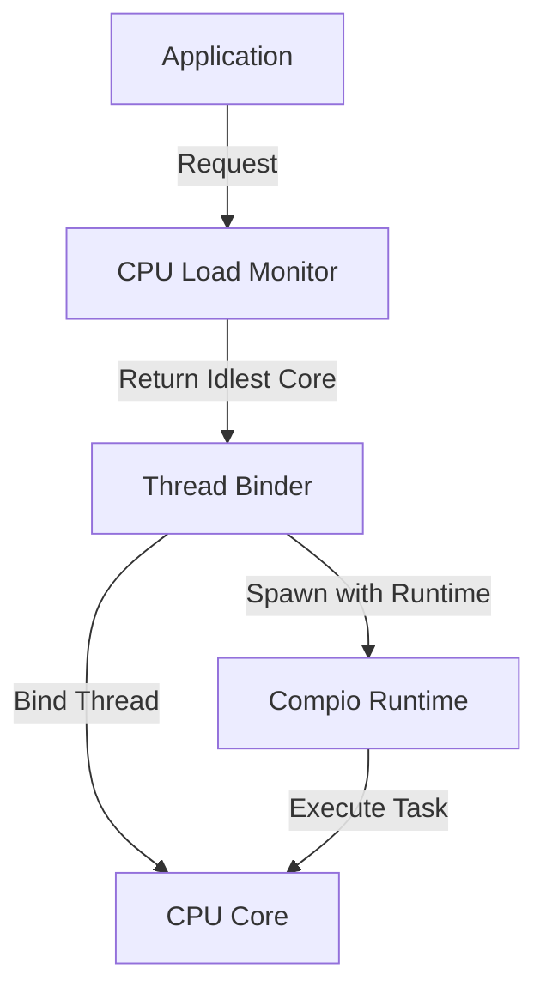

# cpu_bind : Bind threads to the idlest CPU core

## Table of Contents

- [Project Overview](#project-overview)
- [Usage](#usage)
- [Features](#features)
- [Design](#design)
- [Tech Stack](#tech-stack)
- [Project Structure](#project-structure)
- [API Reference](#api-reference)
- [Historical Context](#historical-context)

## Project Overview

`cpu_bind` provides efficient CPU core binding for Rust applications. It automatically detects the idlest CPU core and binds threads to it, optimizing performance for CPU-intensive workloads. The library integrates seamlessly with compio runtime, enabling thread spawning with CPU affinity control.

## Usage

### Bind Current Thread

```rust
use cpu_bind::bind;
use log::info;

fn main() {
  let core_id = bind();
  info!("bound to core {core_id}");
}
```

### Spawn Thread on Idlest CPU

```rust
use cpu_bind::spawn;
use log::info;

fn main() {
  let handle = spawn(|rt| {
    rt.block_on(async {
      info!("running on compio runtime");
      42
    })
  });
  let result = handle.join().expect("thread panicked").unwrap();
  assert_eq!(result, 42);
  info!("spawn result: {result}");
}
```

## Features

- Automatic CPU load detection
- Thread binding to idlest core
- Integration with compio runtime
- Zero-cost abstraction
- Cross-platform support

## Design

The library follows a simple workflow:



1. Application requests thread binding or spawning
2. CPU load monitor identifies the idlest core
3. Thread binder performs CPU affinity operation
4. Thread executes on the assigned core
5. Compio runtime manages async operations

## Tech Stack

- **compio-runtime**: High-performance async runtime
- **core-affinity**: CPU affinity control
- **cpu-load**: Real-time CPU load monitoring

## Project Structure

```
cpu_bind/
├── src/
│   └── lib.rs          # Core library implementation
├── tests/
│   └── main.rs         # Test suite and usage examples
├── Cargo.toml          # Package configuration
└── README.md           # Project documentation
```

## API Reference

### `spawn`

Spawn thread with compio runtime bound to the idlest CPU.

```rust
pub fn spawn<F, T>(f: F) -> JoinHandle<io::Result<T>>
where
  F: FnOnce(&Runtime) -> T + Send + 'static,
  T: Send + 'static,
```

**Parameters:**
- `f`: Closure accepting runtime reference, returning value

**Returns:**
- `JoinHandle<io::Result<T>>`: Thread join handle

### `bind`

Bind current thread to the idlest CPU.

```rust
pub fn bind() -> usize
```

**Returns:**
- `usize`: Core ID of the bound CPU

## Historical Context

CPU affinity control has evolved significantly since early multiprocessor systems. The concept emerged in the 1970s with mainframe computers, where operating systems needed to manage processor allocation efficiently. Early implementations were manual and required explicit specification of processor assignments.

The introduction of symmetric multiprocessing (SMP) in the 1990s brought sophisticated scheduling algorithms. Linux added CPU affinity support in kernel 2.5.8 (2002), enabling developers to pin threads to specific cores. This capability became crucial for performance-critical applications like databases and high-frequency trading systems.

### Moore's Law and the Shift to Multi-Core

In 1965, Gordon Moore observed that the number of transistors on silicon chips doubled approximately every year. This observation, later refined to every 18-24 months, became known as Moore's Law. For decades, this drove performance improvements through increasing clock speeds and transistor density. However, by the mid-2000s, physical limitations such as heat dissipation and power consumption made further frequency scaling impractical. The industry pivot to multi-core architectures marked a fundamental shift, making CPU affinity control increasingly important for performance optimization.

### Early Batch Processing Scheduling

The earliest computer systems, like the "Trilobite" operating system from the rCore-OS project, ran single applications in isolation. As systems evolved to support multiple users, scheduling became essential. The "Coelacanth" operating system introduced simple "rank-based" scheduling, executing applications sequentially. The "Eoraptor" system advanced to queue-based first-come-first-serve scheduling, while the "Coelophysis" system introduced time-slice round-robin scheduling to ensure fairness among users.

### Linux Scheduler Evolution

Linux has undergone several major scheduler redesigns. The O(1) scheduler (2001) addressed scalability issues with fixed-priority preemptive scheduling. The Completely Fair Scheduler (CFS) introduced in 2007 replaced fixed time slices with dynamic allocation using virtual runtime and red-black trees. This provided better fairness for interactive and batch workloads. Recent developments include energy-aware scheduling and support for heterogeneous architectures with different core types (big.LITTLE, performance cores vs efficiency cores).

### NUMA Architecture

Non-Uniform Memory Access (NUMA) architecture emerged to address memory access latency in large-scale multiprocessor systems. In NUMA systems, each processor has local memory with low access latency, while accessing remote memory incurs higher latency. NUMA-aware scheduling strategies have become critical for performance in modern data centers, where improper thread placement can increase memory access latency by 2-3 times.

Modern cloud computing and containerization have renewed interest in CPU binding. With shared infrastructure and noisy neighbor problems, explicit CPU affinity helps maintain consistent performance and reduce latency variability. The `cpu_bind` library continues this tradition, providing Rust developers with tools to optimize thread placement in modern multi-core environments.