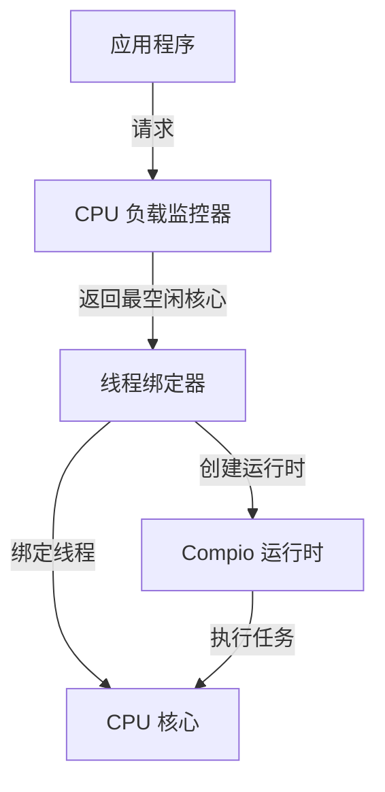

# cpu_bind : 将线程绑定到最空闲 CPU 核心

## 目录

- [项目概述](#项目概述)
- [使用演示](#使用演示)
- [特性介绍](#特性介绍)
- [设计思路](#设计思路)
- [技术堆栈](#技术堆栈)
- [目录结构](#目录结构)
- [API 说明](#api-说明)
- [历史背景](#历史背景)

## 项目概述

`cpu_bind` 为 Rust 应用提供高效的 CPU 核心绑定功能。它自动检测最空闲的 CPU 核心并将线程绑定到该核心，优化 CPU 密集型工作负载性能。库与 compio 运行时无缝集成，支持带 CPU 亲和性控制的线程创建。

## 使用演示

### 绑定当前线程

```rust
use cpu_bind::bind;
use log::info;

fn main() {
  let core_id = bind();
  info!("bound to core {core_id}");
}
```

### 在最空闲 CPU 上创建线程

```rust
use cpu_bind::spawn;
use log::info;

fn main() {
  let handle = spawn(|rt| {
    rt.block_on(async {
      info!("running on compio runtime");
      42
    })
  });
  let result = handle.join().expect("thread panicked").unwrap();
  assert_eq!(result, 42);
  info!("spawn result: {result}");
}
```

## 特性介绍

- 自动 CPU 负载检测
- 线程绑定到最空闲核心
- 与 compio 运行时集成
- 零成本抽象
- 跨平台支持

## 设计思路

库采用简单工作流程：



1. 应用程序请求线程绑定或创建
2. CPU 负载监控器识别最空闲核心
3. 线程绑定器执行 CPU 亲和性操作
4. 线程在指定核心上执行
5. Compio 运行时管理异步操作

## 技术堆栈

- **compio-runtime**: 高性能异步运行时
- **core-affinity**: CPU 亲和性控制
- **cpu-load**: 实时 CPU 负载监控

## 目录结构

```
cpu_bind/
├── src/
│   └── lib.rs          # 核心库实现
├── tests/
│   └── main.rs         # 测试套件和使用示例
├── Cargo.toml          # 包配置
└── README.md           # 项目文档
```

## API 说明

### `spawn`

在最空闲 CPU 上创建带 compio 运行时的线程。

```rust
pub fn spawn<F, T>(f: F) -> JoinHandle<io::Result<T>>
where
  F: FnOnce(&Runtime) -> T + Send + 'static,
  T: Send + 'static,
```

**参数:**
- `f`: 接受运行时引用的闭包，返回值

**返回:**
- `JoinHandle<io::Result<T>>`: 线程连接句柄

### `bind`

将当前线程绑定到最空闲 CPU。

```rust
pub fn bind() -> usize
```

**返回:**
- `usize`: 绑定的 CPU 核心 ID

## 历史背景

CPU 亲和性控制自早期多处理器系统以来经历了显著演进。该概念起源于 20 世纪 70 年代的大型机时代，操作系统需要高效管理处理器分配。早期实现依赖手动指定处理器分配。

对称多处理（SMP）技术在 20 世纪 90 年代引入了复杂的调度算法。Linux 在内核 2.5.8 版本（2002 年）添加了 CPU 亲和性支持，使开发者能够将线程固定到特定核心。该能力对数据库和高频交易系统等性能关键应用至关重要。

### 摩尔定律与多核转型

1965 年，戈登·摩尔观察到硅芯片上的晶体管数量大约每年翻一番。这一观察后来被修正为每 18-24 个月，被称为摩尔定律。几十年来，这通过提高时钟频率和晶体管密度推动了性能提升。然而，到 21 世纪中期，散热和功耗等物理限制使得进一步频率扩展变得不切实际。行业向多核架构的转变标志着根本性转变，使 CPU 亲和性控制对性能优化变得日益重要。

### 早期批处理调度

最早的计算机系统，如 rCore-OS 项目的"三叶虫"操作系统，在隔离环境中运行单个应用程序。随着系统演进到支持多用户，调度变得至关重要。"腔棘鱼"操作系统引入了简单的"排名"调度，按顺序执行应用程序。"始初龙"系统推进到基于队列的先来先服务调度，而"腔骨龙"系统引入时间片轮转调度，以确保用户间的公平性。

### Linux 调度器演进

Linux 经历了几次主要的调度器重新设计。O(1) 调度器（2001 年）通过固定优先级抢占式调度解决了可扩展性问题。2007 年引入的完全公平调度器（CFS）用虚拟运行时间和红黑树的动态分配替代了固定时间片。这为交互式和批处理工作负载提供了更好的公平性。近期发展包括能效感知调度和对异构架构的支持（big.LITTLE、性能核心 vs 能效核心）。

### NUMA 架构

非统一内存访问（NUMA）架构的出现解决了大规模多处理器系统中的内存访问延迟问题。在 NUMA 系统中，每个处理器具有低访问延迟的本地内存，而访问远程内存会产生更高延迟。NUMA 感知调度策略在现代数据中心中变得至关重要，不当的线程放置可能使内存访问延迟增加 2-3 倍。

现代云计算和容器化重新激发了对 CPU 绑定的关注。在共享基础设施和嘈杂邻居问题中，显式 CPU 亲和性有助于维持一致性能并降低延迟波动。`cpu_bind` 库延续这一传统，为 Rust 开发者提供在现代多核环境中优化线程放置的工具。