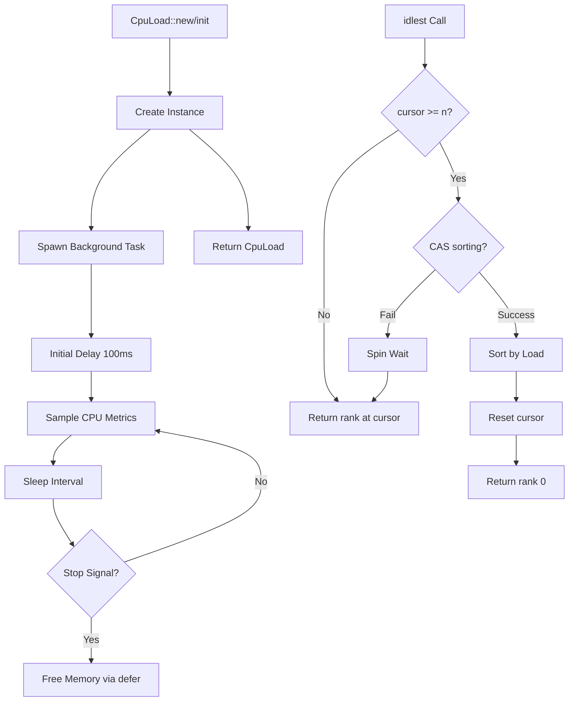

# cpu_load : Lock-free CPU Monitoring for Async Rust

## Table of Contents

- [Overview](#overview)
- [Features](#features)
- [Usage](#usage)
- [API Reference](#api-reference)
- [Design](#design)
- [Tech Stack](#tech-stack)
- [Project Structure](#project-structure)
- [History](#history)

## Overview

cpu_load is high-performance Rust library for real-time CPU load monitoring and intelligent core selection, built on the **compio** async ecosystem.

Traditional CPU load APIs (like `sysinfo`) require waiting ~200ms between calls to get accurate readings. This library solves that problem by running background sampling tasks, allowing instant access to pre-collected metrics without blocking.

The library continuously samples CPU usage in background tasks, maintaining up-to-date load metrics for global CPU and individual cores. Through atomic operations and lock-free data structures, it delivers high-performance monitoring suitable for concurrent applications.

## Features

- Background real-time CPU metrics sampling
- Lock-free atomic operations for concurrent access
- Intelligent core selection via lazy round-robin algorithm
- Global static instance `CPU_LOAD` for convenient access
- Standard Rust iterator pattern support
- Zero runtime allocation with pre-allocated structures
- Seamless compio async runtime integration

## Usage

### Global Static Instance

```rust
use cpu_load::CPU_LOAD;

// Global CPU load (0-100)
let global = CPU_LOAD.global();
println!("Global: {global}%");

// Get idlest core for task assignment
let core = CPU_LOAD.idlest();
println!("Idlest core: {core}");

// Iterate all core loads
for (i, load) in CPU_LOAD.into_iter().enumerate() {
  println!("Core {i}: {load}%");
}
```

### Custom Instance

```rust
use cpu_load::CpuLoad;

// Default 1s sampling interval
let monitor = CpuLoad::new();

// Specific core load
if let Some(load) = monitor.core(0) {
  println!("Core 0: {load}%");
}

// Core count
println!("Cores: {}", monitor.len());
```

### Custom Sampling Interval

```rust
use std::time::Duration;
use cpu_load::CpuLoad;

// Custom 500ms sampling interval
let monitor = CpuLoad::init(Duration::from_millis(500));
```

### Iterator Pattern

```rust
use cpu_load::CPU_LOAD;

// Collect to vector
let loads: Vec<u8> = CPU_LOAD.into_iter().collect();

// Filter high-load cores
let high: Vec<usize> = CPU_LOAD
  .into_iter()
  .enumerate()
  .filter(|(_, load)| *load > 80)
  .map(|(i, _)| i)
  .collect();

// Calculate average
let avg = CPU_LOAD.into_iter().map(|x| x as u32).sum::<u32>() / CPU_LOAD.len() as u32;
```

## API Reference

### CPU_LOAD

Global static instance with default 1s sampling interval. Lazily initialized on first access.

```rust
pub static CPU_LOAD: CpuLoad;
```

### CpuLoad

Main structure for CPU load monitoring.

| Method | Description |
|--------|-------------|
| `new() -> Self` | Create monitor with default 1s interval |
| `init(interval: Duration) -> Self` | Create monitor with custom sampling interval |
| `global(&self) -> u8` | Current global CPU load (0-100) |
| `core(&self, idx: usize) -> Option<u8>` | Specific core load (0-100) |
| `len(&self) -> usize` | Number of CPU cores |
| `is_empty(&self) -> bool` | Check if no cores |
| `idlest(&self) -> usize` | Index of idlest CPU core |

Implements `Default` trait, equivalent to `CpuLoad::new()`.

### CpuLoadIter

Iterator over core loads, implements `Iterator<Item = u8>` and `ExactSizeIterator`.

```rust
impl<'a> IntoIterator for &'a CpuLoad {
  type Item = u8;
  type IntoIter = CpuLoadIter<'a>;
}
```

## Design



### Key Principles

**Lock-free Design**: All shared state uses atomic operations. The `sorting` flag acts as lightweight spinlock only during rank array updates.

**Lazy Evaluation**: Core sorting occurs only when cursor exhausts rank array, amortizing sort cost across multiple `idlest()` calls.

**Memory Safety**: Raw pointer with `AtomicPtr` enables Arc-free design. Background task owns memory via `defer`, ensuring cleanup on drop.

**Zero Allocation**: Pre-allocated `Box<[AtomicU8]>` for core loads and `Box<[UnsafeCell<usize>]>` for rank array. No runtime heap allocation.

## Tech Stack

| Component | Purpose |
|-----------|---------|
| Rust 2024 | Modern language features |
| compio | Async runtime (io-uring/IOCP) |
| sysinfo | Cross-platform system info |
| static_init | Lazy static initialization |
| defer-lite | RAII cleanup guarantee |

### compio Ecosystem

compio leverages platform-specific I/O primitives:

- **Linux**: io-uring for high-throughput I/O
- **Windows**: IOCP for optimal performance
- **Cross-platform**: Consistent API

## Project Structure

```
cpu_load/
├── src/
│   ├── lib.rs      # Core implementation, CpuLoad struct, CPU_LOAD static
│   └── iter.rs     # CpuLoadIter iterator
├── tests/
│   └── main.rs     # Integration tests
├── readme/
│   ├── en.md       # English documentation
│   └── zh.md       # Chinese documentation
└── Cargo.toml
```

## History

CPU load monitoring traces back to early Unix systems where `load average` measured system demand—average processes in run queue over 1, 5, and 15 minutes.

The mid-2000s shift from single-core to multi-core processors created need for per-core tracking. This library builds on that evolution with real-time per-core metrics.

The lazy round-robin algorithm draws inspiration from distributed system load balancers. Rather than maintaining continuously sorted lists (computationally expensive), it uses on-demand sorting triggered by access patterns. This approach mirrors the "power of two choices" algorithm used in modern load balancers like Nginx and HAProxy.

Lock-free programming became essential with multi-core CPUs. The CAS (Compare-And-Swap) operation used in `idlest()` is fundamental to concurrent data structures, first implemented in hardware by IBM System 370 in 1970.

Fun fact: The term "load average" was coined by the TENEX operating system in the early 1970s at BBN Technologies. TENEX later influenced Unix development, and the concept persists in modern systems via `/proc/loadavg` on Linux.
