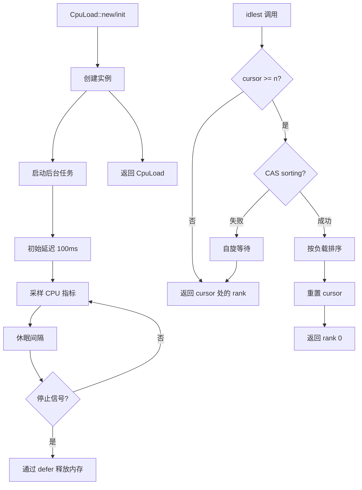

# cpu_load : 异步 Rust 无锁 CPU 监控

## 目录

- [概述](#概述)
- [特性](#特性)
- [使用](#使用)
- [API 参考](#api-参考)
- [设计](#设计)
- [技术栈](#技术栈)
- [项目结构](#项目结构)
- [历史](#历史)

## 概述

cpu_load 是高性能 Rust 库，用于实时 CPU 负载监控和智能核心选择，基于 **compio** 异步生态系统构建。

传统 CPU 负载 API（如 `sysinfo`）每次调用需等待约 200ms 才能获取准确读数。本库通过后台采样任务解决此问题，允许即时访问预采集的指标，无需阻塞等待。

库在后台任务中持续采样 CPU 使用率，维护全局 CPU 和各核心的最新负载指标。通过原子操作和无锁数据结构，为并发应用提供高性能监控。

## 特性

- 后台实时采样 CPU 指标
- 无锁原子操作支持并发访问
- 惰性轮询算法实现智能核心选择
- 全局静态实例 `CPU_LOAD` 便捷访问
- 标准 Rust 迭代器模式支持
- 预分配结构实现零运行时分配
- 无缝集成 compio 异步运行时

## 使用

### 全局静态实例

```rust
use cpu_load::CPU_LOAD;

// 全局 CPU 负载 (0-100)
let global = CPU_LOAD.global();
println!("全局: {global}%");

// 获取最空闲核心用于任务分配
let core = CPU_LOAD.idlest();
println!("最空闲核心: {core}");

// 遍历所有核心负载
for (i, load) in CPU_LOAD.into_iter().enumerate() {
  println!("核心 {i}: {load}%");
}
```

### 自定义实例

```rust
use cpu_load::CpuLoad;

// 默认 1 秒采样间隔
let monitor = CpuLoad::new();

// 指定核心负载
if let Some(load) = monitor.core(0) {
  println!("核心 0: {load}%");
}

// 核心数
println!("核心数: {}", monitor.len());
```

### 自定义采样间隔

```rust
use std::time::Duration;
use cpu_load::CpuLoad;

// 自定义采样间隔 500ms
let monitor = CpuLoad::init(Duration::from_millis(500));
```

### 迭代器模式

```rust
use cpu_load::CPU_LOAD;

// 收集到向量
let loads: Vec<u8> = CPU_LOAD.into_iter().collect();

// 过滤高负载核心
let high: Vec<usize> = CPU_LOAD
  .into_iter()
  .enumerate()
  .filter(|(_, load)| *load > 80)
  .map(|(i, _)| i)
  .collect();

// 计算平均值
let avg = CPU_LOAD.into_iter().map(|x| x as u32).sum::<u32>() / CPU_LOAD.len() as u32;
```

## API 参考

### CPU_LOAD

全局静态实例，默认 1 秒采样间隔。首次访问时惰性初始化。

```rust
pub static CPU_LOAD: CpuLoad;
```

### CpuLoad

CPU 负载监控主结构体。

| 方法 | 描述 |
|------|------|
| `new() -> Self` | 使用默认 1 秒间隔创建监控器 |
| `init(interval: Duration) -> Self` | 使用自定义采样间隔创建监控器 |
| `global(&self) -> u8` | 当前全局 CPU 负载 (0-100) |
| `core(&self, idx: usize) -> Option<u8>` | 指定核心负载 (0-100) |
| `len(&self) -> usize` | CPU 核心数 |
| `is_empty(&self) -> bool` | 检查是否无核心 |
| `idlest(&self) -> usize` | 最空闲 CPU 核心索引 |

实现 `Default` trait，等同于 `CpuLoad::new()`。

### CpuLoadIter

核心负载迭代器，实现 `Iterator<Item = u8>` 和 `ExactSizeIterator`。

```rust
impl<'a> IntoIterator for &'a CpuLoad {
  type Item = u8;
  type IntoIter = CpuLoadIter<'a>;
}
```

## 设计



### 核心原则

**无锁设计**：所有共享状态使用原子操作。`sorting` 标志仅在更新 rank 数组时作为轻量级自旋锁。

**惰性求值**：仅当 cursor 耗尽 rank 数组时才排序，将排序成本分摊到多次 `idlest()` 调用。

**内存安全**：裸指针配合 `AtomicPtr` 实现无 Arc 设计。后台任务通过 `defer` 拥有内存，确保 drop 时清理。

**零分配**：预分配 `Box<[AtomicU8]>` 存储核心负载，`Box<[UnsafeCell<usize>]>` 存储 rank 数组。运行时无堆分配。

## 技术栈

| 组件 | 用途 |
|------|------|
| Rust 2024 | 现代语言特性 |
| compio | 异步运行时 (io-uring/IOCP) |
| sysinfo | 跨平台系统信息 |
| static_init | 惰性静态初始化 |
| defer-lite | RAII 清理保证 |

### compio 生态系统

compio 利用平台特定 I/O 原语：

- **Linux**：io-uring 实现高吞吐 I/O
- **Windows**：IOCP 实现最佳性能
- **跨平台**：一致的 API

## 项目结构

```
cpu_load/
├── src/
│   ├── lib.rs      # 核心实现、CpuLoad 结构体、CPU_LOAD 静态变量
│   └── iter.rs     # CpuLoadIter 迭代器
├── tests/
│   └── main.rs     # 集成测试
├── readme/
│   ├── en.md       # 英文文档
│   └── zh.md       # 中文文档
└── Cargo.toml
```

## 历史

CPU 负载监控可追溯到早期 Unix 系统，`load average` 衡量系统需求——1、5、15 分钟内运行队列中的平均进程数。

2000 年代中期从单核到多核处理器的转变产生了对每核心跟踪的需求。本库在此演进基础上提供实时每核心指标。

惰性轮询算法灵感来自分布式系统负载均衡器。它不维护连续排序列表（计算成本高），而是根据访问模式按需排序。这种方法类似于 Nginx 和 HAProxy 等现代负载均衡器使用的"二选一"算法。

无锁编程随多核 CPU 变得至关重要。`idlest()` 中使用的 CAS（比较并交换）操作是并发数据结构的基础，最早由 IBM System 370 在 1970 年实现于硬件。

趣闻："load average" 术语由 BBN Technologies 在 1970 年代初的 TENEX 操作系统中创造。TENEX 后来影响了 Unix 开发，该概念通过 Linux 的 `/proc/loadavg` 延续至今。
