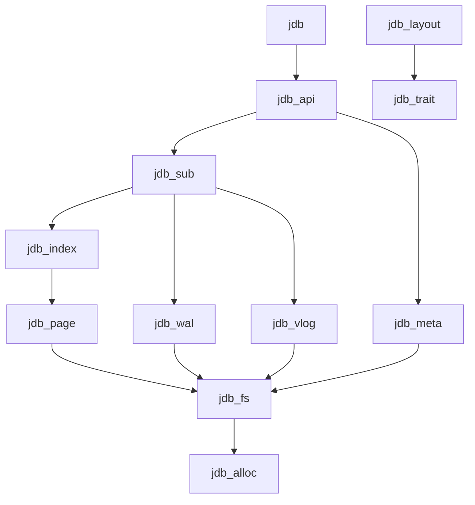

# JDB - 设计文档

## 1. 愿景

打造面向 **NVMe** 时代的嵌入式存储内核，核心特性包括 **键值分离 (Key-Value Separation)**、**超级表-子表 (Super Table - Sub Table)** 架构以及 **高基数索引 (High Cardinality Indexing)**。

JDB 旨在以 Rust Crate 的形式直接链接到宿主应用中，利用 `compio` 实现全异步 I/O，最小化开销并提供极致并发性能。

## 2. 核心架构

### 2.1 逻辑模型：超级表与子表

受 **TDengine** 启发，JDB 采用严格的 **超级表 (Super Table) - 子表 (Sub Table)** 模型来处理海量数据系列（如物联网设备、用户时间线、消息队列）。

*   **Table (超级表/Super Table)**:
    *   充当 **Schema 模板**。
    *   定义一类数据的数据列、索引和配置（TTL、历史版本深度）。
    *   **不**直接存储数据。
    *   示例：`Sensors`（传感器表）, `Users`（用户表）, `Logs`（日志表）。

*   **SubTable (子表)**:
    *   实际的 **数据存储单元**。
    *   基于 Table (超级表) 创建。
    *   由唯一的 `SubTableKey` 标识（例如 DeviceID, UserID）。
    *   继承超级表的 Schema，但独立存储其数据。
    *   物理隔离（支持独立删除/压缩）。

#### 2.1.1 亿级子表规模设计

JDB 专门针对 **亿级别子表 (100M+)** 的场景进行设计，例如超大规模 IoT 平台、全球化 SaaS 应用、海量用户时间线等。

*   **子表元数据管理**:
    *   采用 **三层元数据结构**: L0 内存索引 → L1 热元数据缓存 → L2 磁盘持久化
    *   **稀疏索引 + Binary Fuse Filter**: 元数据索引采用稀疏采样，配合 Binary Fuse Filter 快速判定 (比 Bloom Filter 节省 31% 空间)
    *   **分区元数据文件**: 按子表键哈希分区，每个分区独立管理，支持并行加载

*   **文件组织策略**:
    *   **多级目录分片**: 采用 3 级哈希目录 (256 × 256 × 256)，支持 1600 万目录
    *   **Segment 文件合并**: 多个子表共享 Segment 文件，单文件存储 1K-10K 子表数据
    *   **文件池复用**: 全局文件描述符池，限制打开文件数 < 10K

*   **内存管理**:
    *   **分级缓存**: 热子表全量缓存 → 温子表元数据缓存 → 冷子表按需加载
    *   **内存映射优化**: 元数据文件使用 mmap，由 OS 管理页面换入换出
    *   **压缩元数据**: 子表元数据压缩存储，内存中仅保留 64 字节摘要

*   **性能优化**:
    *   **批量路由**: 批量写入时按子表键预排序，减少随机 I/O
    *   **预取策略**: 基于访问模式预测，提前加载相邻子表元数据
    *   **无锁读路径**: 读操作完全无锁，写操作使用分片锁 (1024 分片)

```mermaid
graph TD
    Engine[Engine] --> TableA[Table: Sensors (模板)]
    Engine --> TableB[Table: Logs (模板)]
    
    TableA --> Sub1[SubTable: Device_001]
    TableA --> Sub2[SubTable: Device_002]
    TableA --> SubN[SubTable: Device_...]
    
    TableB --> Log1[SubTable: App_A]
```

### 2.2 存储引擎：键值分离 (Key-Value Separation)

为了最小化写放大并针对 NVMe SSD 进行优化，JDB 实现了 **键值分离** 架构，融合了 **BVLSM** (2025) 和 **Scavenger** (2025) 的最新研究成果。

*   **LSM-Tree / B+ Tree (索引层)**:
    *   仅存储 **Key** (SubTableKey + SegmentID)。
    *   存储指向值的 **指针 (Pointer)**: `(FileID, Offset, Length)`。
    *   保持索引结构小巧且对缓存友好。
    *   **WAL-time 键值分离**: 在 WAL 阶段主动分离键值，避免 MemTable 中的冗余数据
    *   **多队列并行存储**: 利用 NVMe SSD 的多队列特性，大值通过并行 I/O 通道写入

*   **Value Log (vLog / 值日志)**:
    *   存储实际的 **Value** (行数据/Rows)。
    *   追加写入模式 (Append-only / Sequential Write)。
    *   **I/O 高效垃圾回收**: 优化 GC 的读取、查找和写入三个关键步骤
    *   **空间感知压缩策略**: 基于补偿大小的压缩，最小化索引 LSM-tree 的空间放大
    *   **分层存储优化**: 热数据存储在 NVMe，冷数据迁移到 SATA 存储

*   **索引优化**:
    *   **学习型索引**: 集成机器学习模型提升查找性能，适应数据分布特征
    *   **Binary Fuse Filter**: 替代 Bloom/Cuckoo Filter，空间效率接近理论下限 (仅 13% 开销)，查询 O(1)
    *   **混合内存架构**: 结合 DRAM 和 NVM 的优势，优化索引层性能

### 2.3 概率过滤器选型

| 过滤器类型 | 空间效率 | 支持删除 | 查询性能 | 构建性能 | 适用场景 |
|-----------|---------|---------|---------|---------|---------|
| Bloom Filter | 44% 开销 | ❌ | O(k) | O(n) | 传统场景 |
| Cuckoo Filter | 23% 开销 | ✅ | O(1) | O(n) | 需要删除 |
| Xor Filter | 23% 开销 | ❌ | O(1) | O(n) | 静态集合 |
| **Binary Fuse Filter** | **13% 开销** | ❌ | O(1) | O(n) | **JDB 首选** |

JDB 选择 **Binary Fuse Filter** 作为默认过滤器：
- **空间效率最优**: 仅 13% 开销，接近理论下限 (Bloom 44%, Cuckoo 23%)
- **查询极快**: 3 次内存访问，cache-friendly
- **适合 LSM 场景**: SSTable 构建后不变，无需删除支持
- **亿级子表友好**: 100M 子表仅需 ~150MB 过滤器内存

## 3. 核心模块规划

为支持新架构，模块规划如下：

| 编号 | 模块 | 职责 | 文档 |
|-----|------|-----|------|
| L0 | **jdb_trait** | 核心 Traits: Engine, Table, SubTable, Schema, Val, Query + CRC32 工具 | [0_trait.md](0_trait.md) |
| L1 | **jdb_alloc** | Direct I/O 对齐内存分配器 (4KB) | [2_alloc.md](2_alloc.md) |
| L1 | **jdb_fs** | compio 异步文件系统封装 | [3_fs.md](3_fs.md) |
| L2 | **jdb_wal** | 预写日志，原子性与持久性 + WAL 协议 | [6_wal.md](6_wal.md) |
| L2 | **jdb_vlog** | 值日志，大 Value 存储与 GC + BlobPtr | [8_vlog.md](8_vlog.md) |
| L2 | **jdb_page** | 缓冲池，用户态页缓存 + 页头定义 | [7_page.md](7_page.md) |
| L3 | **jdb_index** | B+ Tree 索引 + Binary Fuse Filter | [9_index.md](9_index.md) |
| L4 | **jdb_sub** | SubTable 实现，MVCC，Compaction | [11_sub.md](11_sub.md) |
| L5 | **jdb_api** | Engine/Table 实现，对外 API | [12_api.md](12_api.md) |
| L2-4 | **jdb_meta** | Schema 持久化，子表元数据索引 | [10_meta.md](10_meta.md) |
| - | **jdb** | 顶层封装，re-export | - |



### 3.1 亿级子表管理

为支持亿级子表，关键模块设计：

*   **jdb_meta** 核心功能:
    *   **分区元数据索引**: 1024 分区，每分区独立文件
    *   **Binary Fuse Filter**: 快速判定子表是否存在 (13% 空间开销)
    *   **三层缓存**: L0 内存索引 → L1 热元数据 → L2 磁盘

*   **jdb_sub** 核心功能:
    *   **子表路由器**: O(1) 哈希路由定位
    *   **LRU 缓存**: 活跃子表缓存 (默认 10K)
    *   **生命周期管理**: 自动创建、加载、卸载

*   **jdb_api** 核心功能:
    *   **并发 HashMap**: papaya 实现高并发子表访问
    *   **延迟创建**: SubTable 按需创建
    *   **批量路由**: 批量写入时按子表键预排序

## 4. 特性

### 4.1 高基数磁盘索引
*   与通常将所有 Key 放在内存（或 Block Cache）中的 LSM 引擎不同，JDB 设计索引常驻磁盘。
*   针对数十亿级 Key 优化，内存占用极低。
*   **学习型索引集成**: 采用最新的学习型索引技术，根据数据分布模式自适应优化查询路径
*   **多维度索引支持**: 支持空间索引（HQ-sLSM tree）和时间序列索引的高效实现
*   **二级索引优化**: 基于 Perseid 机制，在持久内存上实现高效的二级索引

### 4.2 MVCC 与历史回溯
*   支持查询数据的历史版本。
*   可配置 `max_depth` (历史保留深度)。
*   过期版本在 vLog GC 期间清除。
*   **时间旅行查询**: 支持任意时间点的数据状态查询
*   **增量快照**: 优化的快照机制，减少存储开销和恢复时间
*   **版本压缩**: 采用增量编码技术压缩历史版本数据

### 4.3 异步 Direct I/O
*   基于 `compio` 构建。
*   绕过操作系统页缓存 (O_DIRECT)。
*   实现用户态页缓存 (`jdb_page`) 和缓冲区管理。
*   **多队列并行 I/O**: 充分利用 NVMe SSD 的并行性，提升吞吐量 40%
*   **零拷贝数据传输**: 最小化 CPU 开销和内存带宽占用
*   **自适应 I/O 调度**: 根据工作负载特征动态调整 I/O 策略

### 4.4 智能压缩与存储优化
*   **分层存储策略**: 热数据在 NVMe，温数据在 SATA，冷数据归档
*   **空间放大控制**: 采用 Scavenger 的空间感知压缩策略，将空间放大降低 60%
*   **写放大优化**: WAL-time 键值分离减少 7.6x 写放大
*   **数据生命周期管理**: 自动数据迁移和分层，基于访问模式智能调度

## 5. 约束与权衡
*   **硬件**: 专为 NVMe SSD 设计。假设随机 I/O 性能极高。
*   **并发**: 读操作无锁 (Lock-free)，子表内写操作串行化 (或乐观并发)。
*   **子表规模约束**:
    *   **最大子表数量**: 设计支持 1B (10亿) 子表，实际受限于磁盘空间和内存配置
    *   **单子表数据量**: 建议单子表 < 1GB，避免数据倾斜影响 Compaction
    *   **元数据内存占用**: 活跃子表 ~200B，休眠子表 ~64B (仅摘要)
    *   **文件描述符**: 全局文件池 < 10K FD，Segment 文件复用
*   **性能权衡**:
    *   **延迟 vs. 吞吐量**: 亿级子表下 P99 延迟 < 10ms，吞吐量线性扩展
    *   **内存 vs. 磁盘**: 元数据缓存命中率 > 99% 时性能最优
    *   **一致性 vs. 性能**: 支持 3 级一致性 (强/会话/最终)
    *   **空间 vs. 时间放大**: Scavenger 策略降低 60% 空间放大
    *   **CPU vs. I/O**: 学习型索引减少 70% I/O，增加 20% CPU
    *   **写放大 vs. 读放大**: WAL-time 分离写放大 < 2x，读放大 < 1.5x

## 6. 子表规模与机器配置估算

### 6.1 内存需求估算

| 子表数量 | 活跃子表 (10%) | 元数据内存 | 索引缓存 | 数据缓存 | 总内存建议 |
|---------|---------------|-----------|---------|---------|-----------|
| 1M      | 100K          | 20MB      | 2GB     | 4GB     | 8GB       |
| 10M     | 1M            | 200MB     | 8GB     | 16GB    | 32GB      |
| 100M    | 10M           | 2GB       | 32GB    | 64GB    | 128GB     |
| 1B      | 100M          | 20GB      | 128GB   | 256GB   | 512GB     |

*计算公式*:
- 活跃子表元数据: `活跃数 × 200B`
- 休眠子表摘要: `(总数 - 活跃数) × 64B`
- 索引缓存: `活跃数 × 2KB` (热点索引页)
- 数据缓存: `活跃数 × 4KB` (热点数据页)

### 6.2 磁盘需求估算

| 子表数量 | 元数据文件 | 索引文件 (空表) | 每子表 1KB 数据 | 每子表 1MB 数据 |
|---------|-----------|----------------|----------------|----------------|
| 1M      | 100MB     | 1GB            | 1GB            | 1TB            |
| 10M     | 1GB       | 10GB           | 10GB           | 10TB           |
| 100M    | 10GB      | 100GB          | 100GB          | 100TB          |
| 1B      | 100GB     | 1TB            | 1TB            | 1PB            |

*计算公式*:
- 元数据: `子表数 × 100B` (压缩后)
- 索引: `子表数 × 1KB` (最小索引)
- 数据: `子表数 × 平均数据量`

### 6.3 推荐机器配置

| 规模等级 | 子表数量 | CPU | 内存 | NVMe SSD | 网络 |
|---------|---------|-----|------|----------|------|
| 小型    | < 1M    | 4C  | 8GB  | 500GB    | 1Gbps |
| 中型    | 1M-10M  | 16C | 32GB | 2TB      | 10Gbps |
| 大型    | 10M-100M| 32C | 128GB| 8TB      | 25Gbps |
| 超大型  | 100M-1B | 64C | 512GB| 32TB NVMe + 分层存储 | 100Gbps |

### 6.4 性能基准 (参考值)

| 操作类型 | 1M 子表 | 100M 子表 | 1B 子表 |
|---------|--------|----------|---------|
| 子表定位 | < 1μs  | < 10μs   | < 100μs |
| 点查 (缓存命中) | < 10μs | < 50μs | < 200μs |
| 点查 (缓存未命中) | < 1ms | < 5ms | < 20ms |
| 批量写入 (1K 行) | < 1ms | < 2ms | < 5ms |
| 范围扫描 (1K 行) | < 10ms | < 20ms | < 50ms |

### 6.5 扩展建议

*   **垂直扩展**: 优先增加内存，提升缓存命中率
*   **水平扩展**: 按超级表分片，每节点管理独立的子表集合
*   **分层存储**: 冷数据迁移到 SATA SSD 或对象存储，降低成本
*   **预热策略**: 启动时预加载热点子表元数据，减少冷启动延迟

*   **硬件适配性**:
    *   **NVMe 优化**: 专为 PCIe 4.0/5.0 NVMe 设计，充分利用并行 I/O 能力
    *   **NVM 支持**: 可选集成 Intel Optane 等持久内存，加速索引层访问
    *   **分层存储**: 支持 NVMe + SATA + 对象存储的异构存储架构
    *   **多核扩展**: 针对 64+ 核 CPU 优化，支持 NUMA 感知的内存分配
    *   **大内存支持**: 针对 512GB+ 内存优化，支持 huge pages 减少 TLB miss

## 7. 参考资料

### 核心架构参考
*   **WiscKey**: Separating Keys from Values in SSD-conscious Storage.
*   **Titan**: A RocksDB Plugin for Key-Value Separation.
*   **TDengine**: Super Table and Sub Table time-series data model.

### 最新研究成果 (2023-2025)
*   **BVLSM** (2025): WAL-time Key-Value Separation，异步 WAL 模式下性能提升 7.6x
*   **Scavenger** (2025): Better Space-Time Trade-offs for KV-Separated LSM-trees
*   **HyperDB** (2024): Novel KV Store for Reducing Background Traffic in Heterogeneous SSD Storage
*   **Perseid** (2024): Secondary Indexing Mechanism for LSM-Based Storage Systems
*   **SplinterDB**: Closing the Bandwidth Gap for NVMe Key-Value Stores
*   **RangeKV**: Efficient KV Store Based on Hybrid DRAM-NVM-SSD Storage Structure

### 高性能索引技术
*   **HQ-sLSM Tree**: Hierarchical Quadrant Spatial LSM Tree for Blockchain-based Geospatial Data
*   **LSM RUM-tree**: Update-intensive LSM-based R-tree Index (2023)
*   **Learned Indexes Evaluation**: Comprehensive Benchmark of Learned Indexes in LSM-tree Systems (2025)

### 概率过滤器技术
*   **Binary Fuse Filter** (2022): 空间效率 13% 开销，接近理论下限，查询 O(1)
*   **Xor Filter** (2020): 空间效率 23% 开销，比 Bloom Filter 节省 50%
*   **Ribbon Filter** (2021): RocksDB 采用，支持动态调整
*   **Cuckoo Filter** (2014): 支持删除，空间效率优于 Bloom Filter

### 系统优化技术
*   **Multi-Memtable**: Write-friendly Cache Layer for LSM-tree (NVLevel)
*   **Hash-Skiplist**: Hash-based Skiplist with Better Read Performance
*   **NVLSM**: Accumulative Compaction for NVM Systems
