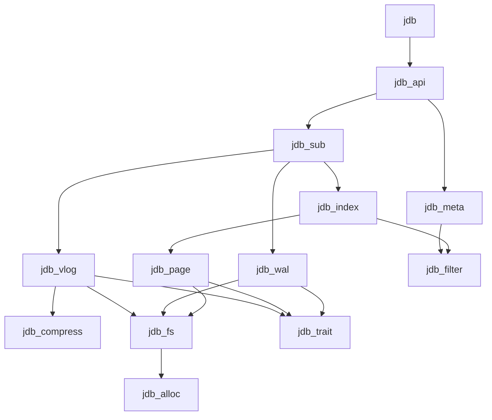

# JDB 模块架构

设计目标: 面向 NVMe 的嵌入式、全异步、亿级子表、高基数磁盘索引存储内核。

## 1. 核心技术栈

| 组件 | 选型 | 理由 |
|-----|------|-----|
| 异步运行时 | compio | io_uring/IOCP 全异步 |
| 哈希 | gxhash | SIMD 加速 |
| 校验和 | crc_fast | PCLMULQDQ 加速 |
| 序列化 | bitcode | 极速二进制 |
| 字符串 | hipstr | SSO + Arc |
| 并发字典 | papaya | 高性能 HashMap |
| 过滤器 | xorf | Binary Fuse Filter |
| 压缩 | lz4_flex/zstd | 快速/高压缩率 |

## 2. 超级表-子表模型

```
Engine
  └── Table (Schema 模板)
        ├── SubTable (数据存储)
        └── SubTable ...
```

- **Table**: Schema 模板，定义列、索引、TTL
- **SubTable**: 实际存储单元，物理隔离

## 3. 模块实现顺序

按依赖关系排序，编号即实现顺序：

| 编号 | 模块 | 职责 | 依赖 |
|-----|------|------|-----|
| 01 | jdb_trait | 核心 trait 定义 + CRC32 工具 | - |
| 02 | jdb_alloc | 4KB 对齐分配器 | - |
| 03 | jdb_fs | compio 文件封装 | alloc |
| 04 | jdb_filter | Binary Fuse Filter | - |
| 05 | jdb_compress | LZ4/Zstd 压缩 | - |
| 06 | jdb_wal | 预写日志 + WAL 协议 | fs, trait |
| 07 | jdb_page | 缓冲池管理 + 页头定义 | fs, trait |
| 08 | jdb_vlog | 值日志 (KV分离) + BlobPtr | fs, compress, trait |
| 09 | jdb_index | B+ 树索引 | page, filter |
| 10 | jdb_meta | 元数据管理 | fs, filter |
| 11 | jdb_sub | 子表实现 | wal, page, vlog, index |
| 12 | jdb_api | Engine/Table API | sub, meta |

## 4. 层级架构

```
┌─────────────────────────────────────────────────────────┐
│ L6: API        jdb_api (Engine/Table)                   │
├─────────────────────────────────────────────────────────┤
│ L5: Core       jdb_sub (SubTable, MVCC, Compaction)     │
├─────────────────────────────────────────────────────────┤
│ L4: Index      jdb_index (B+ Tree + Filter)             │
├─────────────────────────────────────────────────────────┤
│ L3: Storage    jdb_wal | jdb_page | jdb_vlog            │
├─────────────────────────────────────────────────────────┤
│ L2: IO         jdb_fs | jdb_alloc | jdb_filter/compress │
├─────────────────────────────────────────────────────────┤
│ L0: Trait      jdb_trait (包含 CRC32 工具)              │
└─────────────────────────────────────────────────────────┘
         jdb_meta (横跨 L2-L4)
```

## 5. 依赖图



## 6. 参考文献

- **TreeLine** (VLDB 2022): Page Grouping
- **Titan/BlobDB**: KV Separation + Level Merge GC
- **Binary Fuse Filter** (2022): 13% 空间开销
- **TDengine**: Super Table / Sub Table 模型
- **BVLSM** (2025): WAL-time KV Separation
