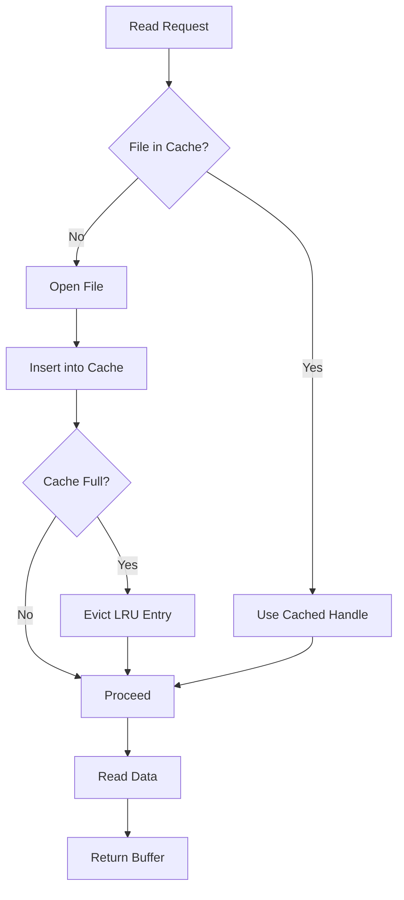

# file_lru : Efficient file handle caching for WAL random reads

## Table of Contents

- [Project Overview](#project-overview)
- [Usage](#usage)
- [Features](#features)
- [Design](#design)
- [Tech Stack](#tech-stack)
- [Directory Structure](#directory-structure)
- [API Reference](#api-reference)
- [Historical Context](#historical-context)

---

## Project Overview

file_lru provides efficient file handle caching for WAL (Write-Ahead Log) random reads. It implements LRU (Least Recently Used) cache strategy to manage file handles, reducing I/O overhead and improving read performance.

The library integrates with compio async runtime, offering zero-copy data reading capabilities. It maintains file handles in memory cache, automatically opening files on demand and evicting least recently used files when cache reaches capacity.

---

## Usage

```rust
use file_lru::FileLru;
use std::path::PathBuf;

#[tokio::main]
async fn main() -> std::io::Result<()> {
  // Create FileLru with directory and cache size
  let mut file_lru = FileLru::new("/path/to/wal/dir", 100);

  // Read data from file_id at offset into buffer (zero-copy)
  let mut buffer = vec![0u8; 4096];
  file_lru.read_into(12345, buffer, 1024).await?;

  // Evict file from cache (keeps file on disk)
  file_lru.evict(12345);

  // Remove file from cache and delete from disk
  file_lru.rm(12345);

  Ok(())
}
```

---

## Features

- **LRU Cache**: Automatically manages file handles using least recently used eviction policy
- **Zero-Copy Reading**: Direct data transfer to caller buffer without intermediate copies
- **Async I/O**: Built on compio async runtime for efficient non-blocking operations
- **Background Deletion**: File deletion runs in background tasks to avoid blocking
- **Minimum Cache Protection**: Enforces minimum cache size of 16 to prevent thrashing

---

## Design

### Cache Workflow



### Module Flow

When read request arrives:

1. Check if file handle exists in cache
2. If cached, reuse handle directly
3. If not cached, open file and insert into cache
4. If cache full, evict least recently used entry
5. Perform zero-copy read into caller buffer
6. Return buffer to caller

File removal operations:

- `evict()`: Removes handle from cache, disk file remains
- `rm()`: Removes handle from cache, spawns background task to delete disk file

---

## Tech Stack

### Core Dependencies

- **compio** (0.17.0): Async I/O runtime with zero-copy support
- **compio-fs** (0.10.0): Async file system operations
- **hashlink** (0.11.0): LRU cache implementation
- **ider** (0.1.7): Path generation utilities
- **jdb_lru** (0.1.8): LRU data structure
- **log** (0.4.29): Logging framework

### Development Dependencies

- **aok** (0.1.18): Error handling utilities
- **log_init** (0.1.34): Logging initialization
- **static_init** (1.0.4): Static initialization

---

## Directory Structure

```
file_lru/
├── src/
│   └── lib.rs          # Core FileLru implementation
├── tests/
│   └── main.rs         # Test cases
├── readme/
│   ├── en.md           # English documentation
│   └── zh.md           # Chinese documentation
├── Cargo.toml          # Package configuration
├── README.mdt          # Documentation template
└── test.sh             # Test script
```

---

## API Reference

### FileLru

WAL block cache with file handle cache.

#### Fields

- `dir: PathBuf` - Directory path for WAL files
- `cache: Lru<u64, File>` - LRU cache mapping file IDs to file handles

#### Methods

##### `new(dir: impl Into<PathBuf>, cache_size: usize) -> Self`

Create FileLru instance from directory path and cache size.

**Parameters:**
- `dir`: Directory path containing WAL files
- `cache_size`: Maximum number of file handles to cache (minimum 16)

**Returns:**
- `FileLru` instance

##### `async fn read_into<B: IoBufMut>(&mut self, file_id: u64, buf: B, offset: u64) -> std::io::Result<B>`

Read data at offset into caller buffer with zero-copy.

**Parameters:**
- `file_id`: Unique file identifier
- `buf`: Caller-provided buffer for data
- `offset`: Byte offset in file to start reading

**Returns:**
- `Result<B>`: Filled buffer or I/O error

##### `fn evict(&mut self, file_id: u64)`

Remove file handle from cache without deleting disk file.

**Parameters:**
- `file_id`: File identifier to evict

##### `fn rm(&mut self, file_id: u64)`

Remove file handle from cache and delete from disk in background.

**Parameters:**
- `file_id`: File identifier to remove

---

## Historical Context

The concept of LRU caching traces back to 1960s when computer scientists developed algorithms to manage limited memory resources efficiently. The LRU algorithm was formalized in 1965 by Peter J. Denning in his work on virtual memory systems.

Write-Ahead Logging (WAL) became prominent in database systems during 1970s and 1980s. The technique ensures data integrity by writing changes to log before applying to main storage. Modern databases like PostgreSQL, SQLite, and MySQL all rely on WAL for durability and crash recovery.

The combination of LRU caching with WAL optimization represents decades of evolution in storage systems. Early implementations used simple file handle pools, while modern solutions leverage async I/O and zero-copy techniques to maximize throughput on NVMe SSDs and high-performance storage devices.

Rust's ownership model and async capabilities make it ideal for building such performance-critical systems, providing memory safety without runtime overhead.