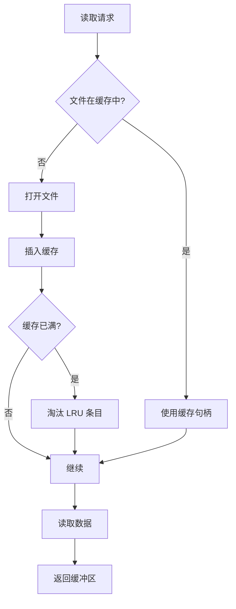

# file_lru : 高效 WAL 随机读取的文件句柄缓存

## 目录

- [项目概述](#项目概述)
- [使用示例](#使用示例)
- [特性](#特性)
- [设计思路](#设计思路)
- [技术栈](#技术栈)
- [目录结构](#目录结构)
- [API 说明](#api-说明)
- [历史背景](#历史背景)

---

## 项目概述

file_lru 为 WAL（预写日志）随机读取提供高效文件句柄缓存。它采用 LRU（最近最少使用）缓存策略管理文件句柄，降低 I/O 开销，提升读取性能。

该库集成 compio 异步运行时，支持零拷贝数据读取。它在内存中维护文件句柄缓存，按需自动打开文件，当缓存达到容量上限时淘汰最近最少使用的文件。

---

## 使用示例

```rust
use file_lru::FileLru;
use std::path::PathBuf;

#[tokio::main]
async fn main() -> std::io::Result<()> {
  // 创建 FileLru 实例，指定目录和缓存大小
  let mut file_lru = FileLru::new("/path/to/wal/dir", 100);

  // 从 file_id 的 offset 处读取数据到缓冲区（零拷贝）
  let mut buffer = vec![0u8; 4096];
  file_lru.read_into(12345, buffer, 1024).await?;

  // 从缓存移除文件（保留磁盘文件）
  file_lru.evict(12345);

  // 从缓存移除文件并从磁盘删除
  file_lru.rm(12345);

  Ok(())
}
```

---

## 特性

- **LRU 缓存**：采用最近最少使用淘汰策略自动管理文件句柄
- **零拷贝读取**：直接将数据传输到调用者缓冲区，无需中间拷贝
- **异步 I/O**：基于 compio 异步运行时，高效非阻塞操作
- **后台删除**：文件删除在后台任务中执行，避免阻塞
- **最小缓存保护**：强制最小缓存大小 16，防止缓存颠簸

---

## 设计思路

### 缓存流程



### 模块调用流程

读取请求到达时：

1. 检查文件句柄是否存在于缓存
2. 若已缓存，直接复用句柄
3. 若未缓存，打开文件并插入缓存
4. 若缓存已满，淘汰最近最少使用的条目
5. 执行零拷贝读取到调用者缓冲区
6. 返回缓冲区给调用者

文件移除操作：

- `evict()`：从缓存移除句柄，磁盘文件保留
- `rm()`：从缓存移除句柄，启动后台任务删除磁盘文件

---

## 技术栈

### 核心依赖

- **compio** (0.17.0)：支持零拷贝的异步 I/O 运行时
- **compio-fs** (0.10.0)：异步文件系统操作
- **hashlink** (0.11.0)：LRU 缓存实现
- **ider** (0.1.7)：路径生成工具
- **jdb_lru** (0.1.8)：LRU 数据结构
- **log** (0.4.29)：日志框架

### 开发依赖

- **aok** (0.1.18)：错误处理工具
- **log_init** (0.1.34)：日志初始化
- **static_init** (1.0.4)：静态初始化

---

## 目录结构

```
file_lru/
├── src/
│   └── lib.rs          # FileLru 核心实现
├── tests/
│   └── main.rs         # 测试用例
├── readme/
│   ├── en.md           # 英文文档
│   └── zh.md           # 中文文档
├── Cargo.toml          # 包配置
├── README.mdt          # 文档模板
└── test.sh             # 测试脚本
```

---

## API 说明

### FileLru

WAL 块缓存（含文件句柄缓存）。

#### 字段

- `dir: PathBuf` - WAL 文件目录路径
- `cache: Lru<u64, File>` - LRU 缓存，映射文件 ID 到文件句柄

#### 方法

##### `new(dir: impl Into<PathBuf>, cache_size: usize) -> Self`

从目录路径和缓存大小创建 FileLru 实例。

**参数：**
- `dir`：包含 WAL 文件的目录路径
- `cache_size`：最大缓存文件句柄数量（最小 16）

**返回：**
- `FileLru` 实例

##### `async fn read_into<B: IoBufMut>(&mut self, file_id: u64, buf: B, offset: u64) -> std::io::Result<B>`

在偏移处读取数据到调用者缓冲区（零拷贝）。

**参数：**
- `file_id`：唯一文件标识符
- `buf`：调用者提供的数据缓冲区
- `offset`：文件中开始读取的字节偏移

**返回：**
- `Result<B>`：填充后的缓冲区或 I/O 错误

##### `fn evict(&mut self, file_id: u64)`

从缓存移除文件句柄，不删除磁盘文件。

**参数：**
- `file_id`：要淘汰的文件标识符

##### `fn rm(&mut self, file_id: u64)`

从缓存移除文件句柄，并在后台删除磁盘文件。

**参数：**
- `file_id`：要移除的文件标识符

---

## 历史背景

LRU 缓存概念可追溯至 1960 年代，当时计算机科学家开发算法以高效管理有限内存资源。LRU 算法由 Peter J. Denning 于 1965 年在其虚拟内存系统研究中正式提出。

预写日志（WAL）在 1970 年代和 1980 年代数据库系统中变得重要。该技术通过在写入主存储前先将更改记录到日志，确保数据完整性。现代数据库如 PostgreSQL、SQLite 和 MySQL 均依赖 WAL 实现持久性和崩溃恢复。

LRU 缓存与 WAL 优化的结合代表了存储系统数十年的演进。早期实现使用简单文件句柄池，现代方案则利用异步 I/O 和零拷贝技术，在 NVMe SSD 和高性能存储设备上最大化吞吐量。

Rust 的所有权模型和异步能力使其成为构建此类性能关键系统的理想选择，在无运行时开销的前提下提供内存安全。