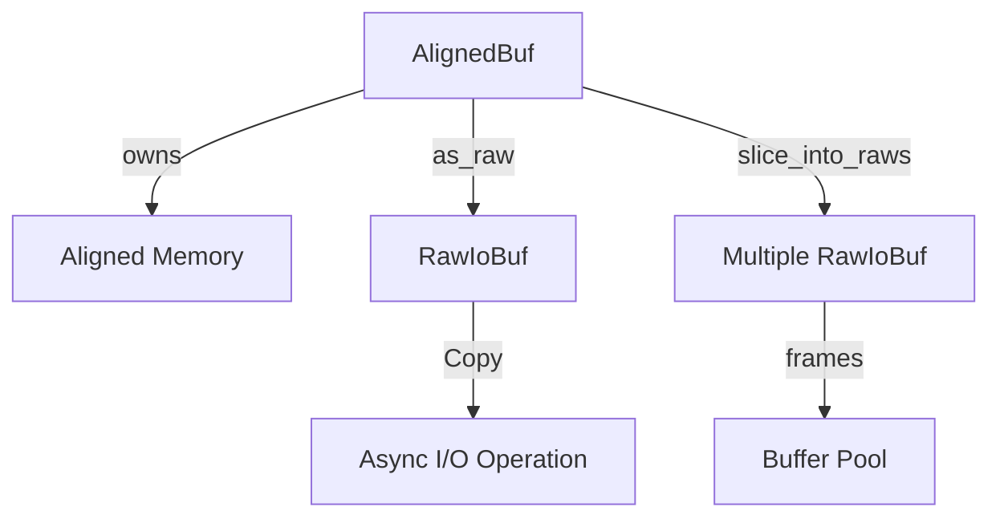
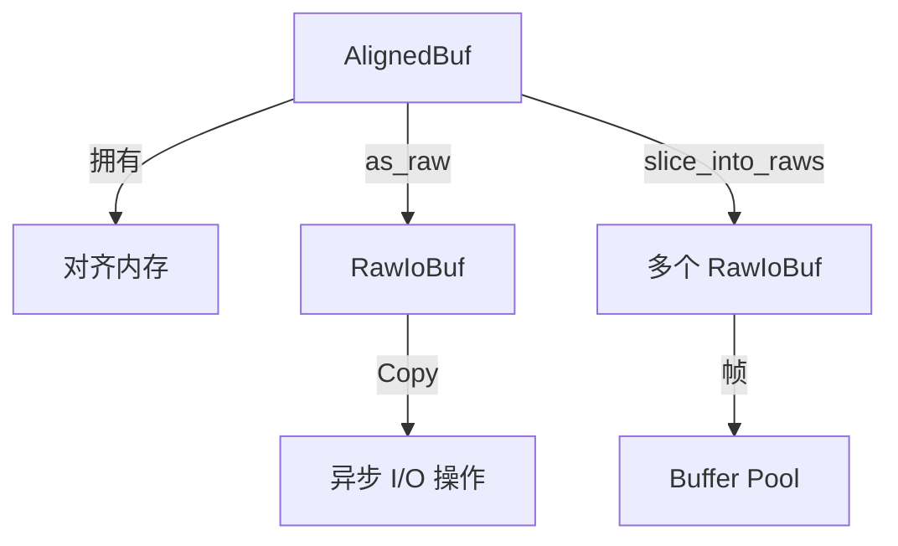

[English](#en) | [中文](#zh)

---

<a id="en"></a>

# jdb_alloc : Aligned Memory Allocator for Direct I/O

## Table of Contents

- [Overview](#overview)
- [Features](#features)
- [Installation](#installation)
- [Usage](#usage)
- [API Reference](#api-reference)
- [Design](#design)
- [Tech Stack](#tech-stack)
- [Project Structure](#project-structure)
- [History](#history)

## Overview

`jdb_alloc` provides 4KB-aligned memory allocation for Direct I/O operations. It offers two core types:

- `AlignedBuf`: Owning buffer with automatic memory management
- `RawIoBuf`: Non-owning, `Copy` buffer for zero-copy async I/O

Designed for high-performance database storage engines and Buffer Pool implementations.

## Features

- 4KB alignment for Direct I/O (O_DIRECT)
- Zero-copy buffer slicing
- `Copy` semantics for async I/O compatibility
- Arena-style memory management
- Integration with [compio](https://github.com/compio-rs/compio) async runtime
- OS-optimized zero page allocation (COW)

## Installation

```bash
cargo add jdb_alloc
```

## Usage

### Basic Allocation

```rust
use jdb_alloc::{AlignedBuf, PAGE_SIZE};

// Allocate zeroed 4KB page
let buf = AlignedBuf::page().unwrap();
assert_eq!(buf.len(), PAGE_SIZE);

// Allocate with custom size
let mut buf = AlignedBuf::zeroed(8192).unwrap();
buf.as_mut()[0] = 42;
```

### Zero-Copy I/O

```rust
use jdb_alloc::AlignedBuf;

let mut buf = AlignedBuf::zeroed(4096).unwrap();

// Convert to RawIoBuf for async I/O
let raw = unsafe { buf.as_raw() };

// RawIoBuf is Copy, can be passed to async operations
// while retaining local reference
```

### Buffer Pool Arena Pattern

```rust
use jdb_alloc::{AlignedBuf, RawIoBuf, PAGE_SIZE};

// Allocate large arena (e.g., 32KB = 8 pages)
let arena = AlignedBuf::zeroed(PAGE_SIZE * 8).unwrap();

// Slice into frames
let frames: Vec<RawIoBuf> = unsafe {
  arena.slice_into_raws(PAGE_SIZE).collect()
};

assert_eq!(frames.len(), 8);
```

### Extend Buffer

```rust
use jdb_alloc::AlignedBuf;

let mut buf = AlignedBuf::with_cap(4096).unwrap();
buf.extend(b"hello").unwrap();
buf.extend(b" world").unwrap();
assert_eq!(&buf[..], b"hello world");
```

## API Reference

### Constants

| Name | Value | Description |
|------|-------|-------------|
| `PAGE_SIZE` | 4096 | Standard page size |
| `ALIGNMENT` | 4096 | Direct I/O alignment requirement |

### AlignedBuf

Owning aligned buffer. Releases memory on drop.

| Method | Description |
|--------|-------------|
| `with_cap(cap)` | Create with capacity (uninitialized) |
| `zeroed(size)` | Create zeroed buffer |
| `page()` | Create 4KB zeroed page |
| `as_raw()` | Convert to `RawIoBuf` (unsafe) |
| `as_raw_view()` | Get `RawIoBuf` view (unsafe) |
| `slice_into_raws(chunk)` | Slice into multiple `RawIoBuf` (unsafe) |
| `extend(data)` | Append data |
| `try_clone()` | Clone without panic on OOM |
| `into_raw_parts()` | Deconstruct (leak memory) |
| `from_raw_parts(ptr, len, cap)` | Reconstruct (unsafe) |

### RawIoBuf

Non-owning buffer wrapper. Implements `Copy` for async I/O ergonomics.

| Method | Description |
|--------|-------------|
| `new(ptr, cap)` | Create wrapper (unsafe) |
| `with_len(len)` | Set length (chainable) |
| `from_slice(slice)` | Create from mutable slice |
| `slice(offset, len)` | Slice for reading (unsafe) |
| `slice_data(offset, len)` | Slice for writing (unsafe) |
| `slice_unchecked(offset, len)` | Slice without checks (unsafe) |
| `as_slice()` | Get byte slice |
| `as_mut_slice()` | Get mutable byte slice |

### Compio Integration

Both types implement:
- `IoBuf` - Read buffer trait
- `IoBufMut` - Write buffer trait
- `SetBufInit` - Initialize buffer length

## Design

### Architecture



### Memory Layout

```
AlignedBuf (Owning)
┌─────────────────────────────────────┐
│ ptr: NonNull<u8>  (4KB aligned)     │
│ len: usize        (initialized)     │
│ cap: usize        (allocated)       │
└─────────────────────────────────────┘
           │
           ▼
RawIoBuf (Non-owning, Copy)
┌─────────────────────────────────────┐
│ ptr: *mut u8      (borrowed)        │
│ len: usize                          │
│ cap: usize                          │
└─────────────────────────────────────┘
```

### Call Flow

1. Allocate `AlignedBuf` as arena
2. Slice into `RawIoBuf` frames via `slice_into_raws`
3. Pass `RawIoBuf` to async I/O (Copy semantics)
4. I/O completion updates buffer content
5. Arena (`AlignedBuf`) manages lifetime

## Tech Stack

| Component | Technology |
|-----------|------------|
| Language | Rust 2024 Edition |
| Async I/O | compio-buf |
| Error Handling | thiserror |
| Memory | std::alloc (aligned) |

## Project Structure

```
jdb_alloc/
├── src/
│   ├── lib.rs      # Core types: AlignedBuf, RawIoBuf
│   └── error.rs    # Error definitions
├── tests/
│   └── main.rs     # Unit tests
├── readme/
│   ├── en.md       # English documentation
│   └── zh.md       # Chinese documentation
└── Cargo.toml
```

## History

Direct I/O emerged in the 1990s as databases sought to bypass the OS page cache for predictable performance. The `O_DIRECT` flag, introduced in Linux 2.4.10 (2001), requires strict alignment—typically 512 bytes for older disks, 4KB for modern SSDs.

The 4KB alignment matches the standard page size on most architectures, a design dating back to the VAX-11/780 (1977) which popularized 512-byte disk sectors and 4KB virtual memory pages.

Modern NVMe SSDs with 4KB logical blocks make this alignment even more critical. Misaligned I/O can cause read-modify-write cycles, degrading performance by 2-10x.

This library draws inspiration from database systems like PostgreSQL's buffer manager and RocksDB's aligned buffer implementation, optimized for Rust's ownership model and async I/O patterns.

---

## About

This project is an open-source component of [js0.site ⋅ Refactoring the Internet Plan](https://js0.site).

We are redefining the development paradigm of the Internet in a componentized way. Welcome to follow us:

* [Google Group](https://groups.google.com/g/js0-site)
* [js0site.bsky.social](https://bsky.app/profile/js0site.bsky.social)

---

<a id="zh"></a>

# jdb_alloc : Direct I/O 对齐内存分配器

## 目录

- [概述](#概述)
- [特性](#特性)
- [安装](#安装)
- [使用](#使用)
- [API 参考](#api-参考)
- [设计](#设计)
- [技术栈](#技术栈)
- [项目结构](#项目结构)
- [历史](#历史)

## 概述

`jdb_alloc` 提供 4KB 对齐的内存分配，用于 Direct I/O 操作。核心类型：

- `AlignedBuf`: 拥有所有权的缓冲区，自动管理内存
- `RawIoBuf`: 无所有权、可 `Copy` 的缓冲区，用于零拷贝异步 I/O

专为高性能数据库存储引擎和 Buffer Pool 设计。

## 特性

- 4KB 对齐，支持 Direct I/O (O_DIRECT)
- 零拷贝缓冲区切片
- `Copy` 语义，兼容异步 I/O
- Arena 风格内存管理
- 集成 [compio](https://github.com/compio-rs/compio) 异步运行时
- OS 优化的零页分配 (COW)

## 安装

```bash
cargo add jdb_alloc
```

## 使用

### 基础分配

```rust
use jdb_alloc::{AlignedBuf, PAGE_SIZE};

// 分配零初始化的 4KB 页
let buf = AlignedBuf::page().unwrap();
assert_eq!(buf.len(), PAGE_SIZE);

// 自定义大小分配
let mut buf = AlignedBuf::zeroed(8192).unwrap();
buf.as_mut()[0] = 42;
```

### 零拷贝 I/O

```rust
use jdb_alloc::AlignedBuf;

let mut buf = AlignedBuf::zeroed(4096).unwrap();

// 转换为 RawIoBuf 用于异步 I/O
let raw = unsafe { buf.as_raw() };

// RawIoBuf 是 Copy 的，可传递给异步操作
// 同时保留本地引用
```

### Buffer Pool Arena 模式

```rust
use jdb_alloc::{AlignedBuf, RawIoBuf, PAGE_SIZE};

// 分配大型 arena（如 32KB = 8 页）
let arena = AlignedBuf::zeroed(PAGE_SIZE * 8).unwrap();

// 切分为帧
let frames: Vec<RawIoBuf> = unsafe {
  arena.slice_into_raws(PAGE_SIZE).collect()
};

assert_eq!(frames.len(), 8);
```

### 扩展缓冲区

```rust
use jdb_alloc::AlignedBuf;

let mut buf = AlignedBuf::with_cap(4096).unwrap();
buf.extend(b"hello").unwrap();
buf.extend(b" world").unwrap();
assert_eq!(&buf[..], b"hello world");
```

## API 参考

### 常量

| 名称 | 值 | 描述 |
|------|-------|-------------|
| `PAGE_SIZE` | 4096 | 标准页大小 |
| `ALIGNMENT` | 4096 | Direct I/O 对齐要求 |

### AlignedBuf

拥有所有权的对齐缓冲区。Drop 时释放内存。

| 方法 | 描述 |
|--------|-------------|
| `with_cap(cap)` | 创建指定容量（未初始化） |
| `zeroed(size)` | 创建零初始化缓冲区 |
| `page()` | 创建 4KB 零初始化页 |
| `as_raw()` | 转换为 `RawIoBuf` (unsafe) |
| `as_raw_view()` | 获取 `RawIoBuf` 视图 (unsafe) |
| `slice_into_raws(chunk)` | 切分为多个 `RawIoBuf` (unsafe) |
| `extend(data)` | 追加数据 |
| `try_clone()` | 克隆，OOM 时不 panic |
| `into_raw_parts()` | 解构（泄漏内存） |
| `from_raw_parts(ptr, len, cap)` | 重建 (unsafe) |

### RawIoBuf

无所有权的缓冲区包装器。实现 `Copy` 以便于异步 I/O。

| 方法 | 描述 |
|--------|-------------|
| `new(ptr, cap)` | 创建包装器 (unsafe) |
| `with_len(len)` | 设置长度（链式调用） |
| `from_slice(slice)` | 从可变切片创建 |
| `slice(offset, len)` | 切片用于读取 (unsafe) |
| `slice_data(offset, len)` | 切片用于写入 (unsafe) |
| `slice_unchecked(offset, len)` | 无检查切片 (unsafe) |
| `as_slice()` | 获取字节切片 |
| `as_mut_slice()` | 获取可变字节切片 |

### Compio 集成

两种类型都实现：
- `IoBuf` - 读缓冲区 trait
- `IoBufMut` - 写缓冲区 trait
- `SetBufInit` - 初始化缓冲区长度

## 设计

### 架构



### 内存布局

```
AlignedBuf (拥有所有权)
┌─────────────────────────────────────┐
│ ptr: NonNull<u8>  (4KB 对齐)        │
│ len: usize        (已初始化)        │
│ cap: usize        (已分配)          │
└─────────────────────────────────────┘
           │
           ▼
RawIoBuf (无所有权, Copy)
┌─────────────────────────────────────┐
│ ptr: *mut u8      (借用)            │
│ len: usize                          │
│ cap: usize                          │
└─────────────────────────────────────┘
```

### 调用流程

1. 分配 `AlignedBuf` 作为 arena
2. 通过 `slice_into_raws` 切分为 `RawIoBuf` 帧
3. 将 `RawIoBuf` 传递给异步 I/O（Copy 语义）
4. I/O 完成后更新缓冲区内容
5. Arena (`AlignedBuf`) 管理生命周期

## 技术栈

| 组件 | 技术 |
|-----------|------------|
| 语言 | Rust 2024 Edition |
| 异步 I/O | compio-buf |
| 错误处理 | thiserror |
| 内存 | std::alloc (对齐) |

## 项目结构

```
jdb_alloc/
├── src/
│   ├── lib.rs      # 核心类型: AlignedBuf, RawIoBuf
│   └── error.rs    # 错误定义
├── tests/
│   └── main.rs     # 单元测试
├── readme/
│   ├── en.md       # 英文文档
│   └── zh.md       # 中文文档
└── Cargo.toml
```

## 历史

Direct I/O 诞生于 1990 年代，数据库系统为获得可预测的性能而绕过 OS 页缓存。Linux 2.4.10 (2001) 引入的 `O_DIRECT` 标志要求严格对齐——旧磁盘通常 512 字节，现代 SSD 为 4KB。

4KB 对齐与大多数架构的标准页大小一致，这一设计可追溯到 VAX-11/780 (1977)，它普及了 512 字节磁盘扇区和 4KB 虚拟内存页。

现代 NVMe SSD 采用 4KB 逻辑块，使对齐更加关键。未对齐的 I/O 会导致读-修改-写循环，性能下降 2-10 倍。

本库借鉴了 PostgreSQL 缓冲区管理器和 RocksDB 对齐缓冲区实现，针对 Rust 所有权模型和异步 I/O 模式优化。

---

## 关于

本项目为 [js0.site ⋅ 重构互联网计划](https://js0.site) 的开源组件。

我们正在以组件化的方式重新定义互联网的开发范式，欢迎关注：

* [谷歌邮件列表](https://groups.google.com/g/js0-site)
* [js0site.bsky.social](https://bsky.app/profile/js0site.bsky.social)
