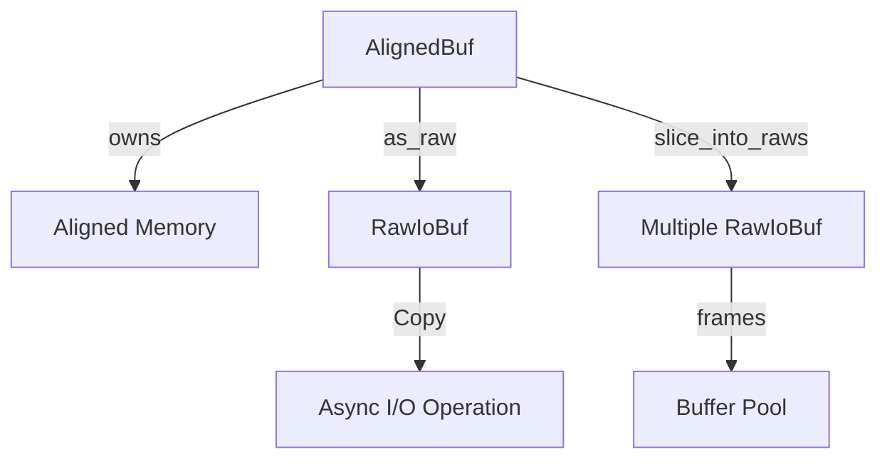

# jdb_alloc : Aligned Memory Allocator for Direct I/O

## Table of Contents

- [Overview](#overview)
- [Features](#features)
- [Installation](#installation)
- [Usage](#usage)
- [API Reference](#api-reference)
- [Design](#design)
- [Tech Stack](#tech-stack)
- [Project Structure](#project-structure)
- [History](#history)

## Overview

`jdb_alloc` provides 4KB-aligned memory allocation for Direct I/O operations. It offers two core types:

- `AlignedBuf`: Owning buffer with automatic memory management
- `RawIoBuf`: Non-owning, `Copy` buffer for zero-copy async I/O

Designed for high-performance database storage engines and Buffer Pool implementations.

## Features

- 4KB alignment for Direct I/O (O_DIRECT)
- Zero-copy buffer slicing
- `Copy` semantics for async I/O compatibility
- Arena-style memory management
- Integration with [compio](https://github.com/compio-rs/compio) async runtime
- OS-optimized zero page allocation (COW)

## Installation

```bash
cargo add jdb_alloc
```

## Usage

### Basic Allocation

```rust
use jdb_alloc::{AlignedBuf, PAGE_SIZE};

// Allocate zeroed 4KB page
let buf = AlignedBuf::page().unwrap();
assert_eq!(buf.len(), PAGE_SIZE);

// Allocate with custom size
let mut buf = AlignedBuf::zeroed(8192).unwrap();
buf.as_mut()[0] = 42;
```

### Zero-Copy I/O

```rust
use jdb_alloc::AlignedBuf;

let mut buf = AlignedBuf::zeroed(4096).unwrap();

// Convert to RawIoBuf for async I/O
let raw = unsafe { buf.as_raw() };

// RawIoBuf is Copy, can be passed to async operations
// while retaining local reference
```

### Buffer Pool Arena Pattern

```rust
use jdb_alloc::{AlignedBuf, RawIoBuf, PAGE_SIZE};

// Allocate large arena (e.g., 32KB = 8 pages)
let arena = AlignedBuf::zeroed(PAGE_SIZE * 8).unwrap();

// Slice into frames
let frames: Vec<RawIoBuf> = unsafe {
  arena.slice_into_raws(PAGE_SIZE).collect()
};

assert_eq!(frames.len(), 8);
```

### Extend Buffer

```rust
use jdb_alloc::AlignedBuf;

let mut buf = AlignedBuf::with_cap(4096).unwrap();
buf.extend(b"hello").unwrap();
buf.extend(b" world").unwrap();
assert_eq!(&buf[..], b"hello world");
```

## API Reference

### Constants

| Name | Value | Description |
|------|-------|-------------|
| `PAGE_SIZE` | 4096 | Standard page size |
| `ALIGNMENT` | 4096 | Direct I/O alignment requirement |

### AlignedBuf

Owning aligned buffer. Releases memory on drop.

| Method | Description |
|--------|-------------|
| `with_cap(cap)` | Create with capacity (uninitialized) |
| `zeroed(size)` | Create zeroed buffer |
| `page()` | Create 4KB zeroed page |
| `as_raw()` | Convert to `RawIoBuf` (unsafe) |
| `as_raw_view()` | Get `RawIoBuf` view (unsafe) |
| `slice_into_raws(chunk)` | Slice into multiple `RawIoBuf` (unsafe) |
| `extend(data)` | Append data |
| `try_clone()` | Clone without panic on OOM |
| `into_raw_parts()` | Deconstruct (leak memory) |
| `from_raw_parts(ptr, len, cap)` | Reconstruct (unsafe) |

### RawIoBuf

Non-owning buffer wrapper. Implements `Copy` for async I/O ergonomics.

| Method | Description |
|--------|-------------|
| `new(ptr, cap)` | Create wrapper (unsafe) |
| `with_len(len)` | Set length (chainable) |
| `from_slice(slice)` | Create from mutable slice |
| `slice(offset, len)` | Slice for reading (unsafe) |
| `slice_data(offset, len)` | Slice for writing (unsafe) |
| `slice_unchecked(offset, len)` | Slice without checks (unsafe) |
| `as_slice()` | Get byte slice |
| `as_mut_slice()` | Get mutable byte slice |

### Compio Integration

Both types implement:
- `IoBuf` - Read buffer trait
- `IoBufMut` - Write buffer trait
- `SetBufInit` - Initialize buffer length

## Design

### Architecture



### Memory Layout

```
AlignedBuf (Owning)
┌─────────────────────────────────────┐
│ ptr: NonNull<u8>  (4KB aligned)     │
│ len: usize        (initialized)     │
│ cap: usize        (allocated)       │
└─────────────────────────────────────┘
           │
           ▼
RawIoBuf (Non-owning, Copy)
┌─────────────────────────────────────┐
│ ptr: *mut u8      (borrowed)        │
│ len: usize                          │
│ cap: usize                          │
└─────────────────────────────────────┘
```

### Call Flow

1. Allocate `AlignedBuf` as arena
2. Slice into `RawIoBuf` frames via `slice_into_raws`
3. Pass `RawIoBuf` to async I/O (Copy semantics)
4. I/O completion updates buffer content
5. Arena (`AlignedBuf`) manages lifetime

## Tech Stack

| Component | Technology |
|-----------|------------|
| Language | Rust 2024 Edition |
| Async I/O | compio-buf |
| Error Handling | thiserror |
| Memory | std::alloc (aligned) |

## Project Structure

```
jdb_alloc/
├── src/
│   ├── lib.rs      # Core types: AlignedBuf, RawIoBuf
│   └── error.rs    # Error definitions
├── tests/
│   └── main.rs     # Unit tests
├── readme/
│   ├── en.md       # English documentation
│   └── zh.md       # Chinese documentation
└── Cargo.toml
```

## History

Direct I/O emerged in the 1990s as databases sought to bypass the OS page cache for predictable performance. The `O_DIRECT` flag, introduced in Linux 2.4.10 (2001), requires strict alignment—typically 512 bytes for older disks, 4KB for modern SSDs.

The 4KB alignment matches the standard page size on most architectures, a design dating back to the VAX-11/780 (1977) which popularized 512-byte disk sectors and 4KB virtual memory pages.

Modern NVMe SSDs with 4KB logical blocks make this alignment even more critical. Misaligned I/O can cause read-modify-write cycles, degrading performance by 2-10x.

This library draws inspiration from database systems like PostgreSQL's buffer manager and RocksDB's aligned buffer implementation, optimized for Rust's ownership model and async I/O patterns.
