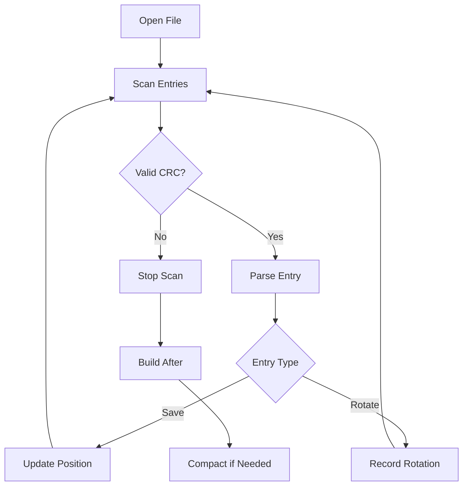
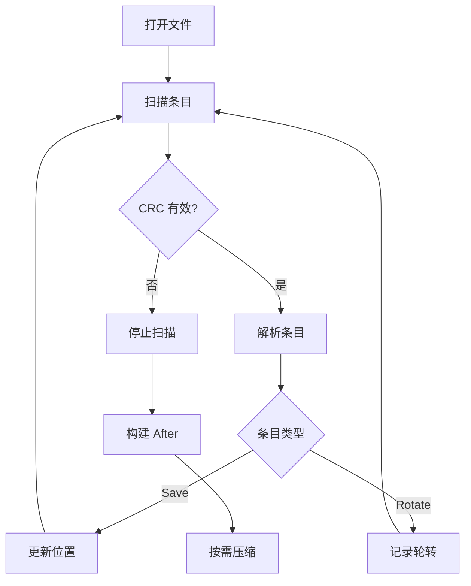

[English](#en) | [中文](#zh)

---

<a id="en"></a>

# jdb_ckp : Async Checkpoint Manager for WAL Recovery

## Table of Contents

- [Overview](#overview)
- [Features](#features)
- [Usage](#usage)
- [API Reference](#api-reference)
- [Design](#design)
- [Tech Stack](#tech-stack)
- [Directory Structure](#directory-structure)
- [History](#history)

## Overview

jdb_ckp provides checkpoint management for Write-Ahead Log (WAL) based databases.

It tracks WAL positions and rotation events, enabling fast crash recovery without replaying entire logs.

## Features

- Async I/O via compio
- CRC32 integrity verification
- Automatic compaction
- Corruption-tolerant recovery
- Zero-copy parsing

## Usage

```rust
use std::path::Path;
use jdb_ckp::{open, Conf};

async fn example() -> jdb_ckp::Result<()> {
  let dir = Path::new("/tmp/db");

  // Open with custom config
  let conf = [
    Conf::Truncate(1024),  // Compact after 1024 entries
    Conf::Keep(3),         // Keep 3 checkpoints
  ];
  let (mut ckp, after) = open(dir, &conf).await?;

  // Recover from last checkpoint
  if let Some(a) = after {
    println!("Resume from wal_id={}, offset={}", a.wal_id, a.offset);
    for rotate_id in &a.rotate_wal_ids {
      println!("Pending rotate: {rotate_id}");
    }
  }

  // Write checkpoint
  ckp.set_wal_ptr(1, 4096).await?;

  // Record WAL rotation
  ckp.rotate(2).await?;

  // Query last position
  if let Some((wal_id, offset)) = ckp.wal_id_offset() {
    println!("Last: wal_id={wal_id}, offset={offset}");
  }

  Ok(())
}
```

## API Reference

### Functions

#### `open(dir: &Path, conf: &[Conf]) -> Result<(Ckp, Option<After>)>`

Open or create checkpoint manager.

Returns `Ckp` instance and optional `After` for recovery.

### Structs

#### `Ckp`

Checkpoint manager.

Methods:
- `set_wal_ptr(wal_id, offset)` - Write checkpoint position
- `rotate(wal_id)` - Record WAL file rotation
- `wal_id_offset()` - Get last saved position

#### `After`

Recovery information from last checkpoint.

Fields:
- `wal_id` - WAL file ID
- `offset` - Position in WAL
- `rotate_wal_ids` - Pending rotation IDs

### Enums

#### `Conf`

Configuration options.

Variants:
- `Truncate(usize)` - Compaction threshold (default: 65536)
- `Keep(usize)` - Checkpoints to retain (default: 3)

#### `Error`

Error types.

Variants:
- `Io` - I/O error

## Design

### File Format

```
┌───────┬──────┬─────────┬──────────┬───────┐
│ magic │ kind │ wal_id  │ [offset] │ crc32 │
│  1B   │  1B  │   8B    │   8B     │  4B   │
└───────┴──────┴─────────┴──────────┴───────┘
```

- Save entry: 22 bytes (with offset)
- Rotate entry: 14 bytes (without offset)

### Recovery Flow



### Compaction

When entry count exceeds threshold:

1. Filter outdated rotations
2. Write valid entries to temp file
3. Atomic rename

## Tech Stack

| Component | Library |
|-----------|---------|
| Async I/O | compio |
| CRC32 | crc32fast |
| Zero-copy | zerocopy |
| Error | thiserror |
| Stream | futures |

## Directory Structure

```
jdb_ckp/
├── src/
│   ├── lib.rs      # Public API, open()
│   ├── ckp.rs      # Ckp struct, set/rotate
│   ├── disk.rs     # Disk serialization
│   ├── row.rs      # Binary format constants
│   ├── load.rs     # Recovery parser
│   ├── rewrite.rs  # Compaction
│   └── error.rs    # Error types
├── tests/
│   └── checkpoint.rs
└── readme/
    ├── en.md
    └── zh.md
```

## History

The concept of checkpointing in databases dates back to the 1970s.

IBM's System R (1974) introduced the checkpoint mechanism to reduce recovery time after crashes.

The technique was formalized in the ARIES (Algorithm for Recovery and Isolation Exploiting Semantics) paper by C. Mohan et al. in 1992.

ARIES introduced the concept of "fuzzy checkpoints" - allowing transactions to continue during checkpoint operations.

Modern databases like PostgreSQL, MySQL, and SQLite all implement variations of WAL checkpointing.

The term "Write-Ahead Logging" emphasizes that log records must be written before data pages - ensuring durability even during power failures.

---

## About

This project is an open-source component of [js0.site ⋅ Refactoring the Internet Plan](https://js0.site).

We are redefining the development paradigm of the Internet in a componentized way. Welcome to follow us:

* [Google Group](https://groups.google.com/g/js0-site)
* [js0site.bsky.social](https://bsky.app/profile/js0site.bsky.social)

---

<a id="zh"></a>

# jdb_ckp : 异步检查点管理器，加速 WAL 恢复

## 目录

- [概述](#概述)
- [特性](#特性)
- [使用](#使用)
- [API 参考](#api-参考)
- [设计](#设计)
- [技术栈](#技术栈)
- [目录结构](#目录结构)
- [历史](#历史)

## 概述

jdb_ckp 为基于 WAL（预写日志）的数据库提供检查点管理。

追踪 WAL 位置和轮转事件，实现快速崩溃恢复，无需重放完整日志。

## 特性

- 基于 compio 的异步 I/O
- CRC32 完整性校验
- 自动压缩
- 容错恢复
- 零拷贝解析

## 使用

```rust
use std::path::Path;
use jdb_ckp::{open, Conf};

async fn example() -> jdb_ckp::Result<()> {
  let dir = Path::new("/tmp/db");

  // 使用自定义配置打开
  let conf = [
    Conf::Truncate(1024),  // 1024 条目后压缩
    Conf::Keep(3),         // 保留 3 个检查点
  ];
  let (mut ckp, after) = open(dir, &conf).await?;

  // 从上次检查点恢复
  if let Some(a) = after {
    println!("从 wal_id={}, offset={} 恢复", a.wal_id, a.offset);
    for rotate_id in &a.rotate_wal_ids {
      println!("待处理轮转: {rotate_id}");
    }
  }

  // 写入检查点
  ckp.set_wal_ptr(1, 4096).await?;

  // 记录 WAL 轮转
  ckp.rotate(2).await?;

  // 查询最后位置
  if let Some((wal_id, offset)) = ckp.wal_id_offset() {
    println!("最后: wal_id={wal_id}, offset={offset}");
  }

  Ok(())
}
```

## API 参考

### 函数

#### `open(dir: &Path, conf: &[Conf]) -> Result<(Ckp, Option<After>)>`

打开或创建检查点管理器。

返回 `Ckp` 实例和可选的 `After` 用于恢复。

### 结构体

#### `Ckp`

检查点管理器。

方法：
- `set_wal_ptr(wal_id, offset)` - 写入检查点位置
- `rotate(wal_id)` - 记录 WAL 文件轮转
- `wal_id_offset()` - 获取最后保存的位置

#### `After`

上次检查点的恢复信息。

字段：
- `wal_id` - WAL 文件 ID
- `offset` - WAL 中的位置
- `rotate_wal_ids` - 待处理的轮转 ID

### 枚举

#### `Conf`

配置选项。

变体：
- `Truncate(usize)` - 压缩阈值（默认：65536）
- `Keep(usize)` - 保留的检查点数（默认：3）

#### `Error`

错误类型。

变体：
- `Io` - I/O 错误

## 设计

### 文件格式

```
┌───────┬──────┬─────────┬──────────┬───────┐
│ magic │ kind │ wal_id  │ [offset] │ crc32 │
│  1B   │  1B  │   8B    │   8B     │  4B   │
└───────┴──────┴─────────┴──────────┴───────┘
```

- Save 条目：22 字节（含 offset）
- Rotate 条目：14 字节（不含 offset）

### 恢复流程



### 压缩

当条目数超过阈值时：

1. 过滤过期轮转
2. 写入有效条目到临时文件
3. 原子重命名

## 技术栈

| 组件 | 库 |
|------|-----|
| 异步 I/O | compio |
| CRC32 | crc32fast |
| 零拷贝 | zerocopy |
| 错误处理 | thiserror |
| 流处理 | futures |

## 目录结构

```
jdb_ckp/
├── src/
│   ├── lib.rs      # 公开 API，open()
│   ├── ckp.rs      # Ckp 结构体，set/rotate
│   ├── disk.rs     # 磁盘序列化
│   ├── row.rs      # 二进制格式常量
│   ├── load.rs     # 恢复解析器
│   ├── rewrite.rs  # 压缩
│   └── error.rs    # 错误类型
├── tests/
│   └── checkpoint.rs
└── readme/
    ├── en.md
    └── zh.md
```

## 历史

数据库检查点概念可追溯至 1970 年代。

IBM System R（1974）引入检查点机制，减少崩溃后的恢复时间。

该技术在 1992 年 C. Mohan 等人的 ARIES（利用语义的恢复与隔离算法）论文中被形式化。

ARIES 引入"模糊检查点"概念——允许事务在检查点操作期间继续执行。

PostgreSQL、MySQL、SQLite 等现代数据库都实现了 WAL 检查点的变体。

"预写日志"强调日志记录必须在数据页之前写入——即使断电也能确保持久性。

---

## 关于

本项目为 [js0.site ⋅ 重构互联网计划](https://js0.site) 的开源组件。

我们正在以组件化的方式重新定义互联网的开发范式，欢迎关注：

* [谷歌邮件列表](https://groups.google.com/g/js0-site)
* [js0site.bsky.social](https://bsky.app/profile/js0site.bsky.social)
