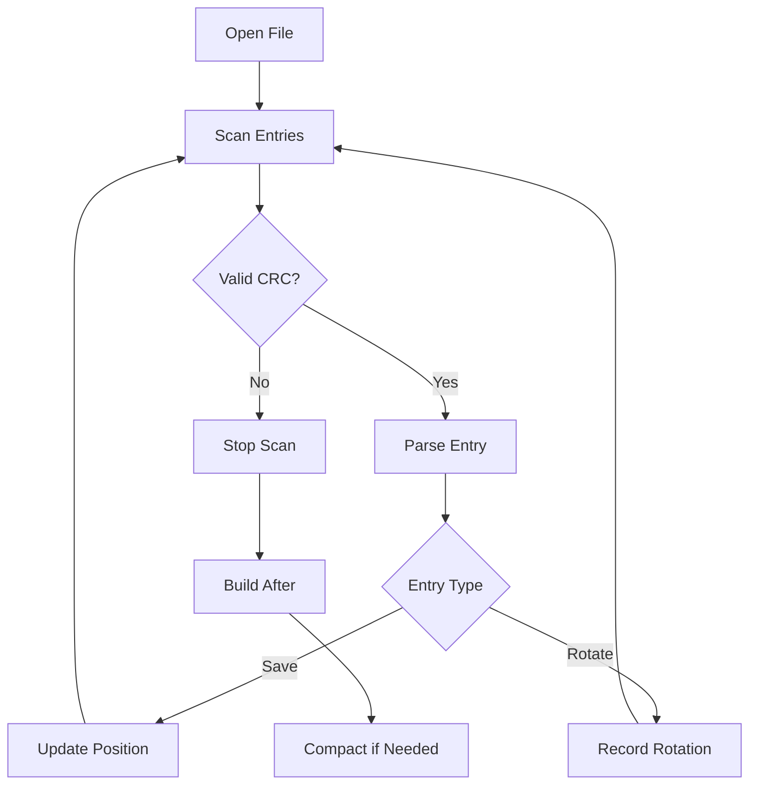

# jdb_ckp : Async Checkpoint Manager for WAL Recovery

## Table of Contents

- [Overview](#overview)
- [Features](#features)
- [Usage](#usage)
- [API Reference](#api-reference)
- [Design](#design)
- [Tech Stack](#tech-stack)
- [Directory Structure](#directory-structure)
- [History](#history)

## Overview

jdb_ckp provides checkpoint management for Write-Ahead Log (WAL) based databases.

It tracks WAL positions and rotation events, enabling fast crash recovery without replaying entire logs.

## Features

- Async I/O via compio
- CRC32 integrity verification
- Automatic compaction
- Corruption-tolerant recovery
- Zero-copy parsing

## Usage

```rust
use std::path::Path;
use jdb_ckp::{open, Conf};

async fn example() -> jdb_ckp::Result<()> {
  let dir = Path::new("/tmp/db");

  // Open with custom config
  let conf = [
    Conf::Truncate(1024),  // Compact after 1024 entries
    Conf::Keep(3),         // Keep 3 checkpoints
  ];
  let (mut ckp, after) = open(dir, &conf).await?;

  // Recover from last checkpoint
  if let Some(a) = after {
    println!("Resume from wal_id={}, offset={}", a.wal_id, a.offset);
    for rotate_id in &a.rotate_wal_id_li {
      println!("Pending rotate: {rotate_id}");
    }
  }

  // Write checkpoint
  ckp.set_wal_ptr(1, 4096).await?;

  // Record WAL rotation
  ckp.rotate(2).await?;

  // Query last position
  if let Some((wal_id, offset)) = ckp.wal_id_offset() {
    println!("Last: wal_id={wal_id}, offset={offset}");
  }

  Ok(())
}
```

## API Reference

### Functions

#### `open(dir: &Path, conf: &[Conf]) -> Result<(Ckp, Option<After>)>`

Open or create checkpoint manager.

Returns `Ckp` instance and optional `After` for recovery.

### Structs

#### `Ckp`

Checkpoint manager.

Methods:
- `set_wal_ptr(wal_id, offset)` - Write checkpoint position
- `rotate(wal_id)` - Record WAL file rotation
- `wal_id_offset()` - Get last saved position

#### `After`

Recovery information from last checkpoint.

Fields:
- `wal_id` - WAL file ID
- `offset` - Position in WAL
- `rotate_wal_id_li` - Pending rotation IDs

### Enums

#### `Conf`

Configuration options.

Variants:
- `Truncate(usize)` - Compaction threshold (default: 65536)
- `Keep(usize)` - Checkpoints to retain (default: 3)

#### `Error`

Error types.

Variants:
- `Io` - I/O error

## Design

### File Format

```
┌───────┬──────┬─────────┬──────────┬───────┐
│ magic │ kind │ wal_id  │ [offset] │ crc32 │
│  1B   │  1B  │   8B    │   8B     │  4B   │
└───────┴──────┴─────────┴──────────┴───────┘
```

- Save entry: 22 bytes (with offset)
- Rotate entry: 14 bytes (without offset)

### Recovery Flow



### Compaction

When entry count exceeds threshold:

1. Filter outdated rotations
2. Write valid entries to temp file
3. Atomic rename

## Tech Stack

| Component | Library |
|-----------|---------|
| Async I/O | compio |
| CRC32 | crc32fast |
| Zero-copy | zerocopy |
| Error | thiserror |
| Stream | futures |

## Directory Structure

```
jdb_ckp/
├── src/
│   ├── lib.rs      # Public API, open()
│   ├── ckp.rs      # Ckp struct, set/rotate
│   ├── disk.rs     # Disk serialization
│   ├── row.rs      # Binary format constants
│   ├── load.rs     # Recovery parser
│   ├── rewrite.rs  # Compaction
│   └── error.rs    # Error types
├── tests/
│   └── checkpoint.rs
└── readme/
    ├── en.md
    └── zh.md
```

## History

The concept of checkpointing in databases dates back to the 1970s.

IBM's System R (1974) introduced the checkpoint mechanism to reduce recovery time after crashes.

The technique was formalized in the ARIES (Algorithm for Recovery and Isolation Exploiting Semantics) paper by C. Mohan et al. in 1992.

ARIES introduced the concept of "fuzzy checkpoints" - allowing transactions to continue during checkpoint operations.

Modern databases like PostgreSQL, MySQL, and SQLite all implement variations of WAL checkpointing.

The term "Write-Ahead Logging" emphasizes that log records must be written before data pages - ensuring durability even during power failures.
