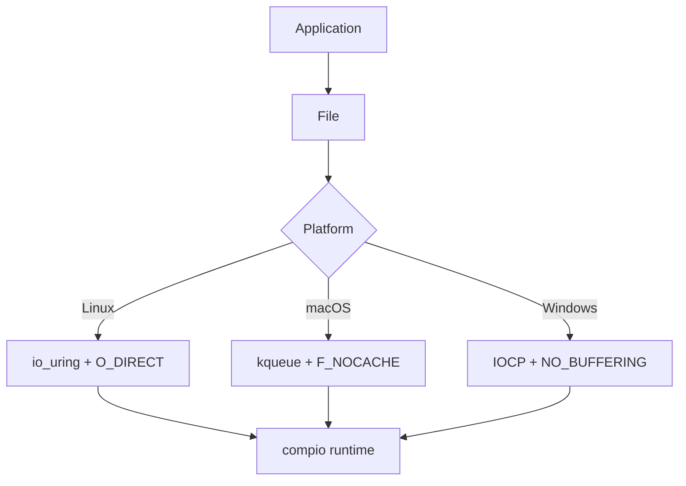
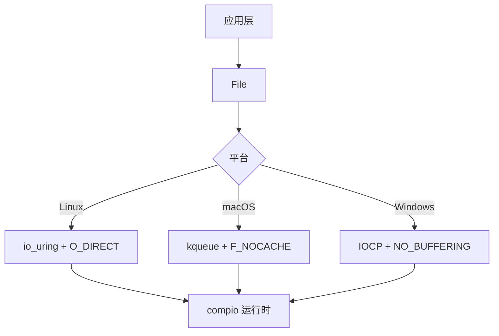

[English](#en) | [中文](#zh)

---

<a id="en"></a>

# jdb_fs : Async Direct I/O for Database Storage

High-performance async file I/O library with Direct I/O support, built on [compio](https://github.com/compio-rs/compio).

## Table of Contents

- [Features](#features)
- [Installation](#installation)
- [Usage](#usage)
- [API Reference](#api-reference)
- [Architecture](#architecture)
- [Directory Structure](#directory-structure)
- [Tech Stack](#tech-stack)
- [History](#history)

## Features

- Async Direct I/O bypassing OS page cache
- Zero-copy I/O via `BorrowedFd` on Unix (no Arc overhead)
- Page-aligned read/write with runtime alignment checks
- WAL mode with `O_DSYNC` for durability
- Cross-platform: Linux (io_uring + O_DIRECT), macOS (kqueue + F_NOCACHE), Windows (IOCP + NO_BUFFERING)
- Space preallocation via `fallocate`/`F_PREALLOCATE`/`SetFileInformationByHandle`

## Installation

```toml
[dependencies]
jdb_fs = "0.1"
jdb_alloc = "0.1"  # for AlignedBuf
```

## Usage

```rust
use jdb_alloc::{AlignedBuf, PAGE_SIZE};
use jdb_fs::File;

async fn example() -> jdb_fs::Result<()> {
  // Create file
  let file = File::create("/tmp/test.dat").await?;

  // Write page-aligned data
  let mut buf = AlignedBuf::zeroed(PAGE_SIZE)?;
  buf[0..5].copy_from_slice(b"hello");
  file.write_at(buf, 0).await?;
  file.sync_data().await?;

  // Read back
  let buf = AlignedBuf::with_cap(PAGE_SIZE)?;
  let buf = file.read_at(buf, 0).await?;
  assert_eq!(&buf[0..5], b"hello");

  Ok(())
}
```

WAL mode with synchronous durability:

```rust
let wal = File::open_wal("/tmp/wal.log").await?;
// Writes are durable on return (O_DSYNC)
```

## API Reference

### File

Async file wrapper with Direct I/O.

| Method | Description |
|--------|-------------|
| `open(path)` | Open read-only |
| `create(path)` | Create new file (truncate if exists) |
| `open_rw(path)` | Open read-write (create if not exists) |
| `open_wal(path)` | Open for WAL with O_DSYNC |
| `read_at(buf, offset)` | Read at offset (page-aligned) |
| `write_at(buf, offset)` | Write at offset (page-aligned) |
| `size()` | Get file size |
| `sync_all()` | Sync data and metadata |
| `sync_data()` | Sync data only |
| `preallocate(len)` | Preallocate disk space |

### Error

| Variant | Description |
|---------|-------------|
| `Io` | System I/O error |
| `Alloc` | Memory allocation error |
| `Alignment` | Buffer/offset not page-aligned |
| `ShortRead` | Read fewer bytes than expected |
| `ShortWrite` | Wrote fewer bytes than expected |
| `Join` | spawn_blocking task failed |
| `Overflow` | File size exceeds i64 |

### Constants

- `PAGE_SIZE`: System page size (re-exported from jdb_alloc)

## Architecture



Call flow for `write_at`:

1. Check alignment (offset & len must be PAGE_SIZE aligned)
2. Borrow raw fd via `BorrowedFd` (zero-copy)
3. Submit `WriteAt` op to compio runtime
4. io_uring/kqueue/IOCP completes async
5. Return buffer ownership to caller

## Directory Structure

```
jdb_fs/
├── src/
│   ├── lib.rs      # Public exports
│   ├── file.rs     # File struct and async methods
│   ├── error.rs    # Error types (thiserror)
│   └── os/         # Platform-specific implementations
│       ├── mod.rs
│       ├── linux.rs   # O_DIRECT, fallocate
│       ├── macos.rs   # F_NOCACHE, F_PREALLOCATE
│       └── windows.rs # FILE_FLAG_NO_BUFFERING
├── tests/
│   └── main.rs     # Integration tests
└── Cargo.toml
```

## Tech Stack

| Component | Technology |
|-----------|------------|
| Async Runtime | [compio](https://github.com/compio-rs/compio) |
| Linux I/O | io_uring |
| macOS I/O | kqueue |
| Windows I/O | IOCP |
| Error Handling | thiserror |
| Memory Alignment | jdb_alloc |

## History

io_uring was introduced in Linux kernel 5.1 (March 2019) by Jens Axboe, the block I/O maintainer. Before io_uring, Linux async I/O (AIO) required complex setup and had significant limitations. Axboe designed io_uring with shared ring buffers between kernel and userspace, eliminating syscall overhead for high-throughput scenarios.

Direct I/O (`O_DIRECT`) has been part of Linux since kernel 2.4. It bypasses the page cache, giving databases direct control over caching and ensuring predictable I/O latency. Database engines like MySQL InnoDB, PostgreSQL, and RocksDB rely heavily on Direct I/O for consistent performance.

The combination of io_uring + Direct I/O represents the state-of-the-art for database storage engines on Linux, achieving millions of IOPS on modern NVMe drives.

---

## About

This project is an open-source component of [js0.site ⋅ Refactoring the Internet Plan](https://js0.site).

We are redefining the development paradigm of the Internet in a componentized way. Welcome to follow us:

* [Google Group](https://groups.google.com/g/js0-site)
* [js0site.bsky.social](https://bsky.app/profile/js0site.bsky.social)

---

<a id="zh"></a>

# jdb_fs : 数据库存储异步直接 I/O

高性能异步文件 I/O 库，支持 Direct I/O，基于 [compio](https://github.com/compio-rs/compio) 构建。

## 目录

- [特性](#特性)
- [安装](#安装)
- [使用](#使用)
- [API 参考](#api-参考)
- [架构](#架构)
- [目录结构](#目录结构)
- [技术栈](#技术栈)
- [历史](#历史)

## 特性

- 异步 Direct I/O，绕过操作系统页缓存
- Unix 上通过 `BorrowedFd` 实现零拷贝 I/O（无 Arc 开销）
- 页对齐读写，运行时对齐检查
- WAL 模式，`O_DSYNC` 保证持久性
- 跨平台：Linux (io_uring + O_DIRECT)、macOS (kqueue + F_NOCACHE)、Windows (IOCP + NO_BUFFERING)
- 通过 `fallocate`/`F_PREALLOCATE`/`SetFileInformationByHandle` 预分配空间

## 安装

```toml
[dependencies]
jdb_fs = "0.1"
jdb_alloc = "0.1"  # 用于 AlignedBuf
```

## 使用

```rust
use jdb_alloc::{AlignedBuf, PAGE_SIZE};
use jdb_fs::File;

async fn example() -> jdb_fs::Result<()> {
  // 创建文件
  let file = File::create("/tmp/test.dat").await?;

  // 写入页对齐数据
  let mut buf = AlignedBuf::zeroed(PAGE_SIZE)?;
  buf[0..5].copy_from_slice(b"hello");
  file.write_at(buf, 0).await?;
  file.sync_data().await?;

  // 读取
  let buf = AlignedBuf::with_cap(PAGE_SIZE)?;
  let buf = file.read_at(buf, 0).await?;
  assert_eq!(&buf[0..5], b"hello");

  Ok(())
}
```

WAL 模式，同步持久化：

```rust
let wal = File::open_wal("/tmp/wal.log").await?;
// 写入返回时数据已落盘 (O_DSYNC)
```

## API 参考

### File

支持 Direct I/O 的异步文件封装。

| 方法 | 描述 |
|------|------|
| `open(path)` | 只读打开 |
| `create(path)` | 创建新文件（存在则截断） |
| `open_rw(path)` | 读写打开（不存在则创建） |
| `open_wal(path)` | WAL 模式打开，启用 O_DSYNC |
| `read_at(buf, offset)` | 指定偏移读取（页对齐） |
| `write_at(buf, offset)` | 指定偏移写入（页对齐） |
| `size()` | 获取文件大小 |
| `sync_all()` | 同步数据和元数据 |
| `sync_data()` | 仅同步数据 |
| `preallocate(len)` | 预分配磁盘空间 |

### Error

| 变体 | 描述 |
|------|------|
| `Io` | 系统 I/O 错误 |
| `Alloc` | 内存分配错误 |
| `Alignment` | 缓冲区/偏移未页对齐 |
| `ShortRead` | 读取字节数不足 |
| `ShortWrite` | 写入字节数不足 |
| `Join` | spawn_blocking 任务失败 |
| `Overflow` | 文件大小超出 i64 |

### 常量

- `PAGE_SIZE`：系统页大小（从 jdb_alloc 重导出）

## 架构



`write_at` 调用流程：

1. 检查对齐（offset 和 len 必须 PAGE_SIZE 对齐）
2. 通过 `BorrowedFd` 借用原始 fd（零拷贝）
3. 向 compio 运行时提交 `WriteAt` 操作
4. io_uring/kqueue/IOCP 异步完成
5. 将缓冲区所有权返回调用方

## 目录结构

```
jdb_fs/
├── src/
│   ├── lib.rs      # 公开导出
│   ├── file.rs     # File 结构体和异步方法
│   ├── error.rs    # 错误类型 (thiserror)
│   └── os/         # 平台特定实现
│       ├── mod.rs
│       ├── linux.rs   # O_DIRECT, fallocate
│       ├── macos.rs   # F_NOCACHE, F_PREALLOCATE
│       └── windows.rs # FILE_FLAG_NO_BUFFERING
├── tests/
│   └── main.rs     # 集成测试
└── Cargo.toml
```

## 技术栈

| 组件 | 技术 |
|------|------|
| 异步运行时 | [compio](https://github.com/compio-rs/compio) |
| Linux I/O | io_uring |
| macOS I/O | kqueue |
| Windows I/O | IOCP |
| 错误处理 | thiserror |
| 内存对齐 | jdb_alloc |

## 历史

io_uring 由 Jens Axboe（Linux 块 I/O 维护者）在 2019 年 3 月引入 Linux 内核 5.1。在 io_uring 之前，Linux 异步 I/O (AIO) 设置复杂且限制颇多。Axboe 设计 io_uring 时采用内核与用户空间共享环形缓冲区，在高吞吐场景下消除系统调用开销。

Direct I/O (`O_DIRECT`) 自 Linux 内核 2.4 起就已存在。它绕过页缓存，让数据库直接控制缓存策略，确保 I/O 延迟可预测。MySQL InnoDB、PostgreSQL、RocksDB 等数据库引擎都重度依赖 Direct I/O 以获得稳定性能。

io_uring + Direct I/O 的组合代表了 Linux 数据库存储引擎的最先进技术，在现代 NVMe 驱动器上可达数百万 IOPS。

---

## 关于

本项目为 [js0.site ⋅ 重构互联网计划](https://js0.site) 的开源组件。

我们正在以组件化的方式重新定义互联网的开发范式，欢迎关注：

* [谷歌邮件列表](https://groups.google.com/g/js0-site)
* [js0site.bsky.social](https://bsky.app/profile/js0site.bsky.social)
