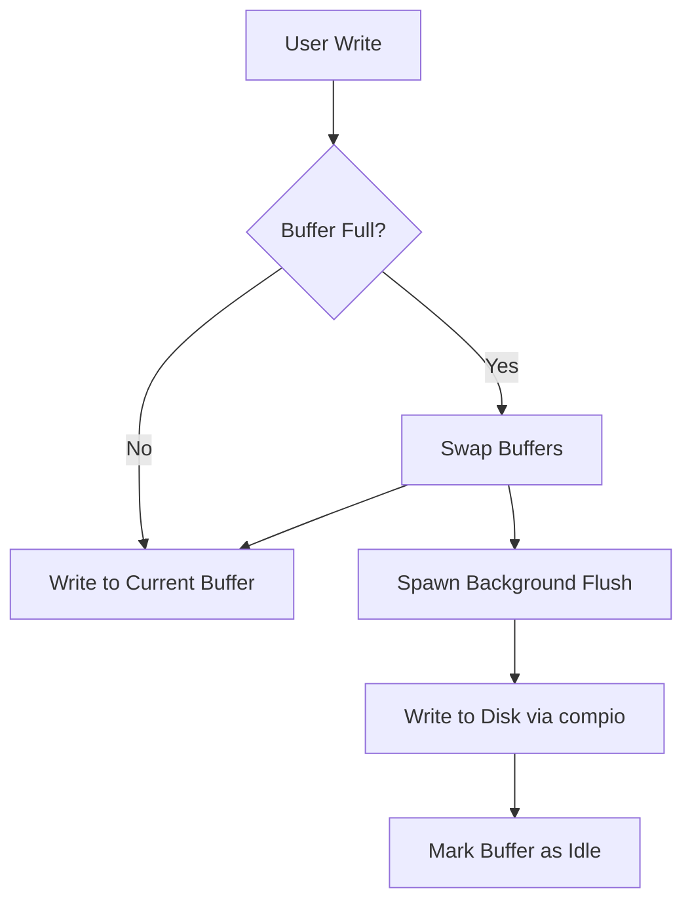
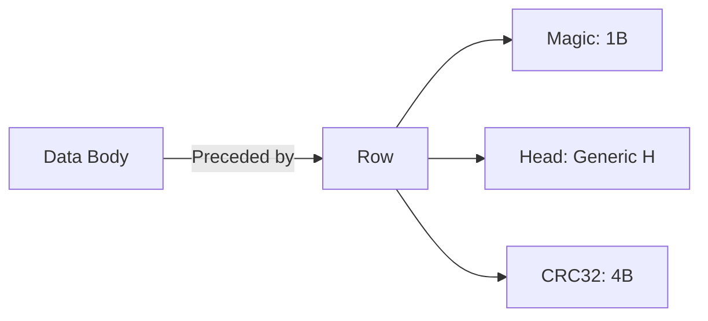

# jdb_fs : High-Performance Log-Structured File Storage

- [Introduction](#introduction)
- [Usage](#usage)
- [Features](#features)
- [Design Concept](#design-concept)
- [Tech Stack](#tech-stack)
- [Directory Structure](#directory-structure)
- [API Description](#api-description)
- [Historical Anecdote](#historical-anecdote)

## Introduction

jdb_fs provides high-performance file storage primitives designed for log-structured data. 
It leverages completion-based asynchronous IO to achieve high throughput and low latency.
Core components include double-buffered file writers, atomic file updates, and log-item encoding.

## Usage

### Atomic Write

Ensure data integrity by writing to a temporary file and renaming it upon success.

```rust
use jdb_fs::AtomWrite;
use compio::io::AsyncWriteExt;

#[compio::main]
async fn main() -> std::io::Result<()> {
  let mut writer = AtomWrite::open("config.json").await?;
  writer.write_all(b"{\"key\": \"value\"}").await.0?;
  writer.rename().await?;
  Ok(())
}
```

### Double-Buffered File

Optimize write performance with background flushing.

```rust
use jdb_fs::BufFile;
use compio::io::AsyncWrite;

#[compio::test]
async fn test_write() {
  let file = compio_fs::OpenOptions::new()
    .write(true)
    .create(true)
    .open("test.dat")
    .await
    .unwrap();
    
  let mut f = BufFile::new(file, 0);
  f.write(b"data").await;
  f.flush().await;
}
```

## Features

- **Completion-based IO**: Built on `compio` for efficient asynchronous operations.
- **Atomic Operations**: Safe file updates via temporary file swapping and exclusive locks.
- **Zero-Copy**: Minimal memory overhead using `zerocopy` for header parsing.
- **Log-Structured**: Optimized for append-only workloads with built-in CRC32 verification.
- **Double Buffering**: Background flush tasks prevent blocking the main write path.

## Design Concept

### BufFile Architecture

The `BufFile` maintains two internal buffers to ensure continuous write availability.



### Item Storage Format

Each record is stored as a `Row` followed by optional data body.



## Tech Stack

- **Runtime**: [compio](https://github.com/compio-rs/compio) - Completion-based async runtime.
- **Integrity**: [crc32fast](https://github.com/srijs/rust-crc32fast) - High-performance CRC32 calculation.
- **Serialization**: [zerocopy](https://github.com/google/zerocopy) - Zero-overhead memory layout management.
- **Path Utilities**: [add_ext](https://github.com/js0/add_ext) - Extension management for temporary files.

## Directory Structure

```
.
├── src/
│   ├── lib.rs          # Project entrance & core exports
│   ├── atom_write.rs   # Atomic file update logic
│   ├── buf/            # Buffered writer implementation
│   ├── file/           # Double-buffered file management
│   ├── item/           # Log item encoding & decoding
│   ├── load.rs         # Item loading & iteration
│   └── push.rs         # Batch data ingestion
└── tests/              # Performance & correctness tests
```

## API Description

### Core Types

- `BufFile`: Double-buffered file wrapper with background flush capabilities.
- `AtomWrite`: Atomic writer using "write-then-rename" strategy.
- `Row<H>`: Fundamental storage unit containing magic, header, and checksum.

### Traits

- `Item`: Defines magic byte and header type for log records.
- `DataLen`: Allows headers to specify length of associated data body.

### Functions

- `read_write`: Utility to open files for concurrent read/write operations.
- `push_iter`: Helper to ingest iterators into log-structured storage.

## Historical Anecdote

The Log-Structured File System (LFS) was introduced by Mendel Rosenblum and John Ousterhout in 1991. 
The concept was born from the observation that while CPUs and memory grew faster, disk seek times remained a bottleneck. 
By treating the disk as an append-only log, LFS transformed random writes into sequential ones, maximizing disk throughput.
This design choice later sparked a famous academic debate with Margo Seltzer regarding cleaning overhead.
Today, the same philosophy powers high-performance storage engines and SSD wear-leveling algorithms.