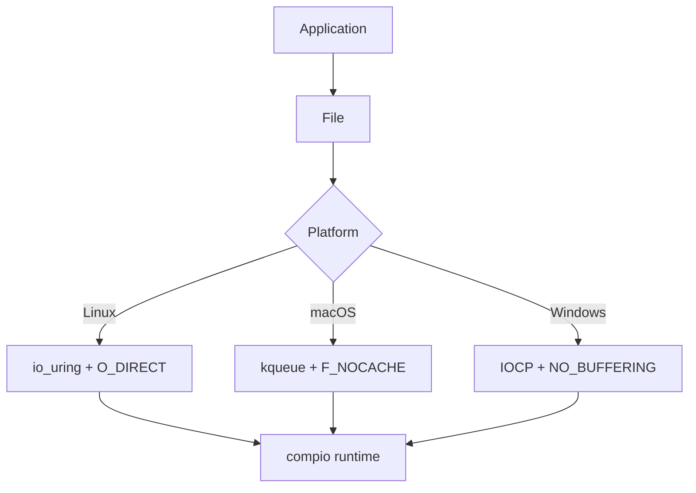

# jdb_fs : Async Direct I/O for Database Storage

High-performance async file I/O library with Direct I/O support, built on [compio](https://github.com/compio-rs/compio).

## Table of Contents

- [Features](#features)
- [Installation](#installation)
- [Usage](#usage)
- [API Reference](#api-reference)
- [Architecture](#architecture)
- [Directory Structure](#directory-structure)
- [Tech Stack](#tech-stack)
- [History](#history)

## Features

- Async Direct I/O bypassing OS page cache
- Zero-copy I/O via `BorrowedFd` on Unix (no Arc overhead)
- Page-aligned read/write with runtime alignment checks
- WAL mode with `O_DSYNC` for durability
- Cross-platform: Linux (io_uring + O_DIRECT), macOS (kqueue + F_NOCACHE), Windows (IOCP + NO_BUFFERING)
- Space preallocation via `fallocate`/`F_PREALLOCATE`/`SetFileInformationByHandle`

## Installation

```toml
[dependencies]
jdb_fs = "0.1"
jdb_alloc = "0.1"  # for AlignedBuf
```

## Usage

```rust
use jdb_alloc::{AlignedBuf, PAGE_SIZE};
use jdb_fs::File;

async fn example() -> jdb_fs::Result<()> {
  // Create file
  let file = File::create("/tmp/test.dat").await?;

  // Write page-aligned data
  let mut buf = AlignedBuf::zeroed(PAGE_SIZE)?;
  buf[0..5].copy_from_slice(b"hello");
  file.write_at(buf, 0).await?;
  file.sync_data().await?;

  // Read back
  let buf = AlignedBuf::with_cap(PAGE_SIZE)?;
  let buf = file.read_at(buf, 0).await?;
  assert_eq!(&buf[0..5], b"hello");

  Ok(())
}
```

WAL mode with synchronous durability:

```rust
let wal = File::open_wal("/tmp/wal.log").await?;
// Writes are durable on return (O_DSYNC)
```

## API Reference

### File

Async file wrapper with Direct I/O.

| Method | Description |
|--------|-------------|
| `open(path)` | Open read-only |
| `create(path)` | Create new file (truncate if exists) |
| `open_rw(path)` | Open read-write (create if not exists) |
| `open_wal(path)` | Open for WAL with O_DSYNC |
| `read_at(buf, offset)` | Read at offset (page-aligned) |
| `write_at(buf, offset)` | Write at offset (page-aligned) |
| `size()` | Get file size |
| `sync_all()` | Sync data and metadata |
| `sync_data()` | Sync data only |
| `preallocate(len)` | Preallocate disk space |

### Error

| Variant | Description |
|---------|-------------|
| `Io` | System I/O error |
| `Alloc` | Memory allocation error |
| `Alignment` | Buffer/offset not page-aligned |
| `ShortRead` | Read fewer bytes than expected |
| `ShortWrite` | Wrote fewer bytes than expected |
| `Join` | spawn_blocking task failed |
| `Overflow` | File size exceeds i64 |

### Constants

- `PAGE_SIZE`: System page size (re-exported from jdb_alloc)

## Architecture



Call flow for `write_at`:

1. Check alignment (offset & len must be PAGE_SIZE aligned)
2. Borrow raw fd via `BorrowedFd` (zero-copy)
3. Submit `WriteAt` op to compio runtime
4. io_uring/kqueue/IOCP completes async
5. Return buffer ownership to caller

## Directory Structure

```
jdb_fs/
├── src/
│   ├── lib.rs      # Public exports
│   ├── file.rs     # File struct and async methods
│   ├── error.rs    # Error types (thiserror)
│   └── os/         # Platform-specific implementations
│       ├── mod.rs
│       ├── linux.rs   # O_DIRECT, fallocate
│       ├── macos.rs   # F_NOCACHE, F_PREALLOCATE
│       └── windows.rs # FILE_FLAG_NO_BUFFERING
├── tests/
│   └── main.rs     # Integration tests
└── Cargo.toml
```

## Tech Stack

| Component | Technology |
|-----------|------------|
| Async Runtime | [compio](https://github.com/compio-rs/compio) |
| Linux I/O | io_uring |
| macOS I/O | kqueue |
| Windows I/O | IOCP |
| Error Handling | thiserror |
| Memory Alignment | jdb_alloc |

## History

io_uring was introduced in Linux kernel 5.1 (March 2019) by Jens Axboe, the block I/O maintainer. Before io_uring, Linux async I/O (AIO) required complex setup and had significant limitations. Axboe designed io_uring with shared ring buffers between kernel and userspace, eliminating syscall overhead for high-throughput scenarios.

Direct I/O (`O_DIRECT`) has been part of Linux since kernel 2.4. It bypasses the page cache, giving databases direct control over caching and ensuring predictable I/O latency. Database engines like MySQL InnoDB, PostgreSQL, and RocksDB rely heavily on Direct I/O for consistent performance.

The combination of io_uring + Direct I/O represents the state-of-the-art for database storage engines on Linux, achieving millions of IOPS on modern NVMe drives.
