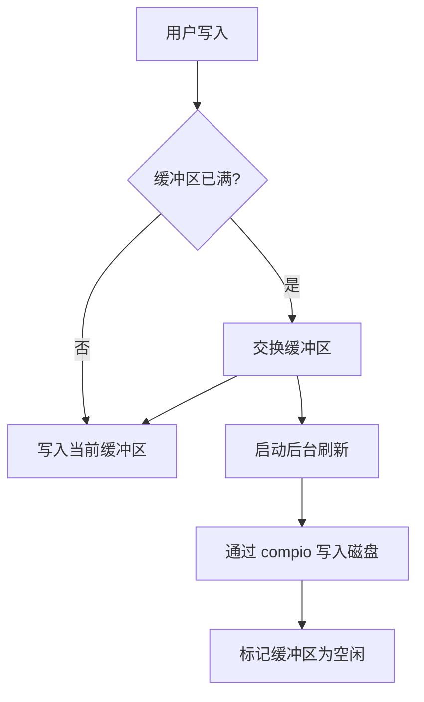
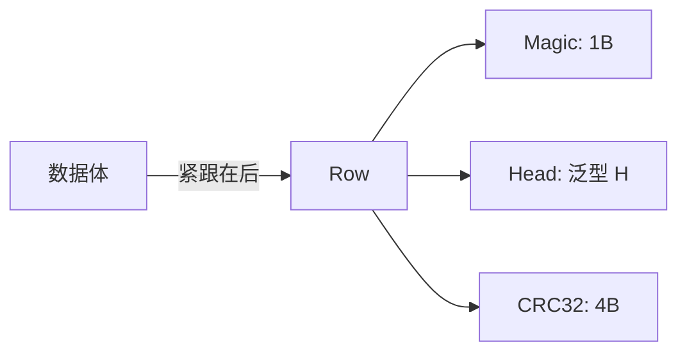

# jdb_fs : 高性能日志结构文件存储

- [项目介绍](#项目介绍)
- [使用演示](#使用演示)
- [特性介绍](#特性介绍)
- [设计思路](#设计思路)
- [技术堆栈](#技术堆栈)
- [目录结构](#目录结构)
- [API 说明](#api-说明)
- [历史小故事](#历史小故事)

## 项目介绍

jdb_fs 提供专为日志结构数据设计的高性能文件存储原语。
其利用基于完成（Completion-based）的异步 IO 提高吞吐量并降低延迟。
核心组件包括双缓冲文件写入器、原子文件更新和日志条目编码。

## 使用演示

### 原子写入

通过向临时文件写入并在成功后重命名，确保数据完整性。

```rust
use jdb_fs::AtomWrite;
use compio::io::AsyncWriteExt;

#[compio::main]
async fn main() -> std::io::Result<()> {
  let mut writer = AtomWrite::open("config.json").await?;
  writer.write_all(b"{\"key\": \"value\"}").await.0?;
  writer.rename().await?;
  Ok(())
}
```

### 双缓冲文件

通过后台异步刷新优化写入性能。

```rust
use jdb_fs::BufFile;
use compio::io::AsyncWrite;

#[compio::test]
async fn test_write() {
  let file = compio_fs::OpenOptions::new()
    .write(true)
    .create(true)
    .open("test.dat")
    .await
    .unwrap();
    
  let mut f = BufFile::new(file, 0);
  f.write(b"data").await;
  f.flush().await;
}
```

## 特性介绍

- **完成式 IO**: 基于 `compio` 实现高效异步操作。
- **原子操作**: 通过临时文件交换和排他锁实现安全的文件更新。
- **零拷贝**: 使用 `zerocopy` 进行头部解析，减少内存开销。
- **日志结构**: 为追加写负载优化，内置 CRC32 校验。
- **双重缓冲**: 后台刷新任务避免阻塞主写入流程。

## 设计思路

### BufFile 架构

`BufFile` 维护两个内部缓冲区，确保写入操作的持续可用性。



### 条目存储格式

每条记录由 `Row` 头部及可选的数据体组成。



## 技术堆栈

- **运行时**: [compio](https://github.com/compio-rs/compio) - 基于完成的异步运行时。
- **一致性**: [crc32fast](https://github.com/srijs/rust-crc32fast) - 高性能 CRC32 计算。
- **序列化**: [zerocopy](https://github.com/google/zerocopy) - 零开销内存布局管理。
- **路径工具**: [add_ext](https://github.com/js0/add_ext) - 临时文件扩展名管理。

## 目录结构

```
.
├── src/
│   ├── lib.rs          # 项目入口与核心导出
│   ├── atom_write.rs   # 原子文件更新逻辑
│   ├── buf/            # 缓冲写入器实现
│   ├── file/           # 双缓冲文件管理
│   ├── item/           # 日志条目编码与解码
│   ├── load.rs         # 条目加载与迭代
│   └── push.rs         # 批量数据推入
└── tests/              # 性能与正确性测试
```

## API 说明

### 核心类型

- `BufFile`: 支持后台刷新的双缓冲文件封装。
- `AtomWrite`: 采用“先写后改名”策略的原子写入器。
- `Row<H>`: 基础存储单元，包含幻数、头部和校验和。

### Trait

- `Item`: 定义日志记录的幻数和头部类型。
- `DataLen`: 允许头部指定关联数据体的长度。

### 关键函数

- `read_write`: 打开文件进行并发读写的工具函数。
- `push_iter`: 将迭代器数据推入日志结构存储的辅助工具。

## 历史小故事

日志结构文件系统 (LFS) 由 Mendel Rosenblum 和 John Ousterhout 于 1991 年提出。
该概念源于一项观察：尽管 CPU 和内存速度飞快，但磁盘寻道时间始终是瓶颈。
通过将磁盘视为仅追加写入的日志，LFS 将随机写转换为顺序写，最大限度提升了磁盘吞吐量。
这一设计后来引发了与 Margo Seltzer 关于清理开销的著名学术辩论。
如今，同样的哲学仍在驱动高性能存储引擎和 SSD 磨损均衡算法。