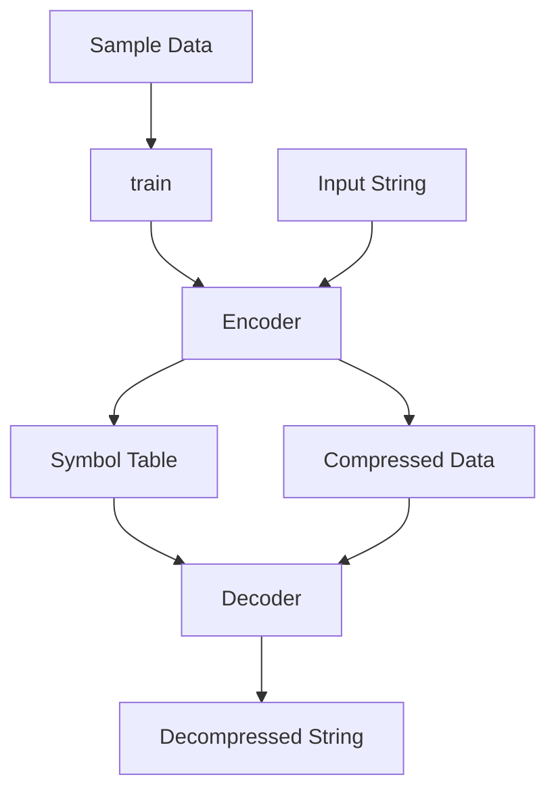

# jdb_fsst : Fast Static Symbol Table compression for fast random access

jdb_fsst implements Fast Static Symbol Table (FSST) algorithm for compressing string data in high-performance databases and search engines. Unlike block-based compression, it allows fast random access to compressed strings without decompressing surrounding data.

Compared to [fsst](https://crates.io/crates/fsst): 1.3x faster encoding, 1.9x faster batch decoding, 18x faster random decoding.


- [Usage](#usage)
- [Features](#features)
- [Design](#design)
- [Tech Stack](#tech-stack)
- [Directory Structure](#directory-structure)
- [API Reference](#api-reference)
- [Benchmark](#benchmark)
- [History](#history)

## Usage

```rust
use jdb_fsst::train;
use jdb_fsst::decode::Decode;

fn main() {
  let lines = vec![
    "hello world".as_bytes(),
    "fsst is fast".as_bytes(),
    "compression for databases".as_bytes(),
  ];

  // 1. Train encoder using sample data
  let encoder = train(&lines).expect("training failed");
  
  // 2. Derive decoder from encoder
  let decoder = Decode::from(&encoder);

  // 3. Encode data
  let mut encoded = Vec::new();
  encoder.encode(lines[0], &mut encoded);

  // 4. Decode data
  let mut decoded = Vec::new();
  decoder.decode(&encoded, &mut decoded);

  assert_eq!(decoded, lines[0]);
}
```

## Features

- High performance: Over 6GB/s batch decoding throughput on modern hardware.
- Random access: Individual strings can be decompressed independently with high efficiency.
- Stable Rust: Implemented using standard Rust without requiring nightly features.
- SWAR optimization: Efficient bulk processing using SIMD-within-a-register techniques.

## Design

The following diagram illustrates the workflow of jdb_fsst:



## Tech Stack

- **Language**: Rust
- **Optimization**: SWAR (SIMD within a register)
- **Serialization**: bitcode
- **Memory**: Zero-copy style pointer arithmetic for hot paths

## Directory Structure

- `src/`: Core implementation logic.
  - `lib.rs`: Library entry and public API.
  - `encode.rs`: Compression logic.
  - `decode.rs`: Decompression logic.
  - `symbol.rs`: FSST symbol representation.
  - `table/`: Symbol table management and construction.
- `tests/`: Integration tests and usage examples.
- `benches/`: Performance benchmarks.

## API Reference

### Functions

- `train<T: AsRef<[u8]>>(items: &[T]) -> io::Result<encode::Encode>`
  Trains an encoder based on provided sample data.

### Data Structures

- `encode::Encode`
  Finalized encoder.
  - `encode(&self, data: &[u8], out: &mut Vec<u8>) -> usize`: Compresses data.
- `decode::Decode`
  Finalized decoder.
  - `decode(&self, data: &[u8], out: &mut Vec<u8>) -> usize`: Batch decompress or decompress a single item.
  - `decode_boxed(&self, data: &[u8]) -> Box<[u8]>`: Handy decoder returning boxed slice.

## Benchmark

Test environment: Apple M2 Max, macOS, Rust 1.87

Test data: 1MB English and Chinese text files

| Metric | fsst | jdb_fsst | Speedup |
|--------|------|----------|---------|
| Encoding (MB/s) | 267 | 352 | 1.32x |
| Batch Decoding (MB/s) | 3562 | 6668 | 1.87x |
| Random Decoding (MB/s) | 156 | 2936 | 18.8x |
| Compression Ratio | 52.67% | 50.45% | +2.2% |

## History

FSST was introduced by Peter Boncz, Thomas Neumann, and Viktor Leis at VLDB 2020. It emerged from research in column-store databases where string processing often dominates execution time. Traditional LZ77-based methods like Zstd or Snappy offer good ratios but fail to provide the granularity needed for row-level access in analytical queries. FSST bridges this gap by maintaining symbols in a compact 2KB table, allowing modern CPUs to process codes at near-memory bandwidth speeds.