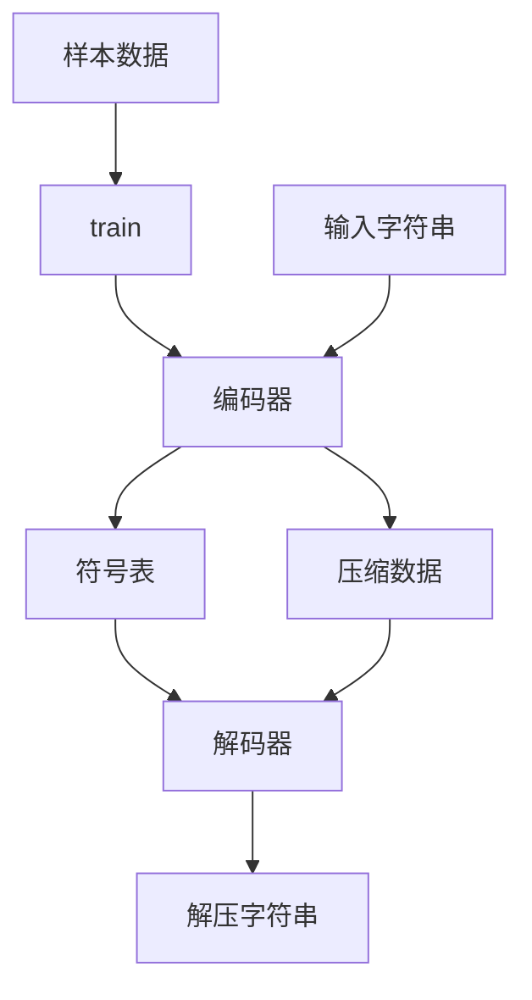

# jdb_fsst : 针对快速随机访问优化的静态符号表压缩

jdb_fsst 实现了快速静态符号表 (FSST) 算法，专为高性能数据库和搜索引擎中的字符串压缩设计。与块压缩不同，它支持在不解压周边数据的情况下快速随机访问单个字符串。

相比 [fsst](https://crates.io/crates/fsst)：编码快 1.3 倍，批量解码快 1.9 倍，随机解码快 18 倍。


- [使用演示](#使用演示)
- [项目特性](#项目特性)
- [设计思路](#设计思路)
- [技术堆栈](#技术堆栈)
- [目录结构](#目录结构)
- [API 说明](#api-说明)
- [性能测试](#性能测试)
- [历史背景](#历史背景)

## 使用演示

```rust
use jdb_fsst::train;
use jdb_fsst::decode::Decode;

fn main() {
  let lines = vec![
    "hello world".as_bytes(),
    "fsst is fast".as_bytes(),
    "compression for databases".as_bytes(),
  ];

  // 1. 使用样本数据训练编码器
  let encoder = train(&lines).expect("训练失败");
  
  // 2. 从编码器导出解码器
  let decoder = Decode::from(&encoder);

  // 3. 编码数据
  let mut encoded = Vec::new();
  encoder.encode(lines[0], &mut encoded);

  // 4. 解码数据
  let mut decoded = Vec::new();
  decoder.decode(&encoded, &mut decoded);

  assert_eq!(decoded, lines[0]);
}
```

## 项目特性

- 极致性能：在现代硬件上，批量解码吞吐量超过 6GB/s。
- 随机访问：支持高效的单字符串独立解压，无需上下文。
- 稳定 Rust：完全使用稳定版 Rust 实现，不依赖 nightly 特性。
- SWAR 优化：通过“寄存器内 SIMD”技术实现高效的批量数据处理。

## 设计思路

以下图表展示了 jdb_fsst 的工作流程：



## 技术堆栈

- **编程语言**：Rust
- **核心算法**：FSST
- **性能优化**：SWAR（寄存器内 SIMD）
- **序列化**：bitcode
- **内存管理**：热点路径采用零拷贝指针运算

## 目录结构

- `src/`: 核心实现逻辑。
  - `lib.rs`: 库入口及公共 API。
  - `encode.rs`: 压缩逻辑。
  - `decode.rs`: 解压逻辑。
  - `symbol.rs`: FSST 符号表示。
  - `table/`: 符号表管理与构建。
- `tests/`: 集成测试与使用示例。
- `benches/`: 性能基准测试。

## API 说明

### 函数

- `train<T: AsRef<[u8]>>(items: &[T]) -> io::Result<encode::Encode>`
  根据提供的样本数据训练并生成编码器。

### 数据结构

- `encode::Encode`
  固化的编码器对象。
  - `encode(&self, data: &[u8], out: &mut Vec<u8>) -> usize`: 执行数据压缩。
- `decode::Decode`
  固化的解码器对象。
  - `decode(&self, data: &[u8], out: &mut Vec<u8>) -> usize`: 执行批量或单项目随机解压。
  - `decode_boxed(&self, data: &[u8]) -> Box<[u8]>`: 返回 Box 切片的便捷解压方法。

## 性能测试

测试环境：Apple M2 Max，macOS，Rust 1.87

测试数据：1MB 中英文文本文件

| 指标 | fsst | jdb_fsst | 提升 |
|------|------|----------|------|
| 编码 (MB/s) | 267 | 352 | 1.32x |
| 批量解码 (MB/s) | 3562 | 6668 | 1.87x |
| 随机解码 (MB/s) | 156 | 2936 | 18.8x |
| 压缩率 | 52.67% | 50.45% | +2.2% |

## 历史背景

FSST 算法由 Peter Boncz、Thomas Neumann 和 Viktor Leis 在 VLDB 2020 大会上提出。该算法源于列存数据库的研究，旨在解决字符串处理占据大量执行时间的问题。传统的基于 LZ77 的方法（如 Zstd 或 Snappy）虽然压缩率高，但在分析型查询中无法提供行级访问所需的灵活性。FSST 通过将常用符号维护在一个仅 2KB 的小型表中，使现代 CPU 能以接近内存带宽的速度处理编码。