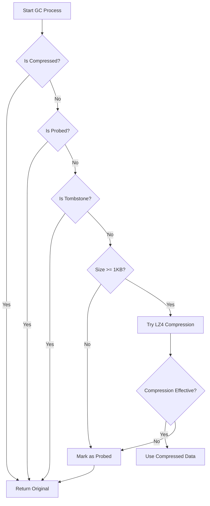

# jdb_gc: WAL Garbage Collection with LZ4 Compression

Efficient WAL garbage collection with intelligent LZ4 compression

## Table of Contents

- [Project Overview](#project-overview)
- [Features](#features)
- [Usage](#usage)
- [Design](#design)
- [API Reference](#api-reference)
- [Tech Stack](#tech-stack)
- [Directory Structure](#directory-structure)
- [Historical Context](#historical-context)

## Project Overview

jdb_gc provides garbage collection module for Write-Ahead Log (WAL) with intelligent LZ4 compression. The module implements a GC trait that enables flexible data processing during garbage collection, with built-in LZ4 compression that automatically optimizes storage efficiency.

The core functionality centers on the `Gc` trait, which defines the interface for data processing during GC operations. Two implementations are provided: `Lz4Gc` for automatic compression and `NoGc` for scenarios where compression is unnecessary.

## Features

- **Intelligent Compression**: Automatically applies LZ4 compression when beneficial
- **Compression Threshold**: Only compresses data larger than 1KB
- **Smart Skip**: Skips already compressed or probed data
- **Effectiveness Check**: Only uses compression when it reduces size by at least 10%
- **Probed Marking**: Marks incompressible data to avoid repeated attempts
- **Flexible Interface**: `Gc` trait allows custom implementations
- **Zero-Cost Abstraction**: `NoGc` provides no-op option without overhead

## Usage

### Basic Usage

```rust
use jdb_gc::{Gc, Lz4Gc, NoGc, MIN_COMPRESS_SIZE};
use jdb_base::Flag;

fn main() {
  // LZ4 compression GC
  let mut gc = Lz4Gc;
  let flag = Flag::default();
  let data = vec![0u8; 2048]; // 2KB data
  let mut buf = Vec::new();

  let (new_flag, compressed_len) = gc.process(flag, &data, &mut buf);

  // No-op GC (no compression)
  let mut no_gc = NoGc;
  let (flag, _) = no_gc.process(flag, &data, &mut buf);
}
```

### Compression Behavior

The `Lz4Gc` implementation follows these rules:

1. Skip if data is already compressed
2. Skip if data is smaller than `MIN_COMPRESS_SIZE` (1KB)
3. Attempt LZ4 compression
4. Only use compressed data if size reduces by at least 10%
5. Mark incompressible data as probed to avoid future attempts

## Design

### GC Processing Flow



### Module Architecture

The module consists of three main components:

1. **GC Trait**: Defines the `process` method for data handling
2. **Lz4Gc**: Implements intelligent LZ4 compression
3. **NoGc**: Provides no-op implementation

The `Gc` trait allows users to implement custom GC strategies for specific use cases.

## API Reference

### Constants

- `MIN_COMPRESS_SIZE: usize` - Minimum data size for compression (1024 bytes)

### Traits

#### Gc

Trait for data processing during garbage collection.

```rust
pub trait Gc: Default {
  fn process(&mut self, flag: Flag, data: &[u8], buf: &mut Vec<u8>) -> (Flag, Option<usize>);
}
```

**Parameters:**
- `flag`: Data flag from jdb_base
- `data`: Original data slice
- `buf`: Buffer for compressed data

**Returns:**
- `Flag`: Updated flag (may include compression or probed markers)
- `Option<usize>`: Compressed length if compression was applied, `None` otherwise

### Structs

#### Lz4Gc

LZ4 compression implementation with intelligent compression logic.

```rust
#[derive(Default)]
pub struct Lz4Gc;
```

Implements `Gc` trait with automatic compression when beneficial.

#### NoGc

No-op GC implementation that does not modify data.

```rust
#[derive(Default)]
pub struct NoGc;
```

Implements `Gc` trait without any compression or modification.

### Re-exports

From `jdb_base`:
- `Flag`: Data flag type
- `Head`: Data header type
- `Pos`: Position type

## Tech Stack

- **Language**: Rust 2024 Edition
- **Compression**: lz4_flex 0.12.0
- **Dependencies**: jdb_base 0.1.0

## Directory Structure

```
jdb_gc/
├── src/
│   ├── lib.rs       # Module exports and constants
│   └── gc.rs        # GC trait and implementations
├── tests/
│   └── main.rs      # Test cases
├── readme/
│   ├── en.md        # English documentation
│   └── zh.md        # Chinese documentation
├── Cargo.toml       # Package configuration
└── README.mdt       # Project metadata
```

## Historical Context

The concept of Write-Ahead Logging (WAL) dates back to the 1970s when database systems needed a reliable way to ensure ACID properties. WAL records all changes to a log before applying them to the main database, enabling crash recovery.

Garbage collection in WAL systems became crucial as logs grew unbounded. Early systems like PostgreSQL implemented simple vacuum operations, while modern databases like RocksDB introduced more sophisticated compaction strategies.

LZ4 compression, created by Yann Collet in 2011, revolutionized real-time compression with its exceptional speed (400+ MB/s) and reasonable compression ratios. The combination of LZ4 with WAL garbage collection represents an optimization that balances storage efficiency with performance—a critical trade-off in high-throughput database systems.

The `jdb_gc` module embodies this evolution, providing intelligent compression that only activates when beneficial, avoiding unnecessary CPU overhead while maximizing storage savings.