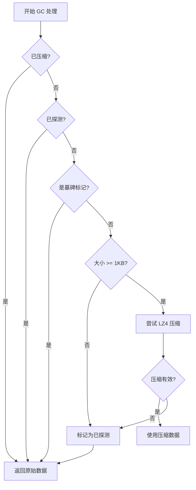

# jdb_gc: WAL 垃圾回收与 LZ4 压缩

高效的 WAL 垃圾回收，配备智能 LZ4 压缩

## 目录

- [项目概述](#项目概述)
- [特性](#特性)
- [使用示例](#使用示例)
- [设计思路](#设计思路)
- [API 参考](#api-参考)
- [技术栈](#技术栈)
- [目录结构](#目录结构)
- [历史背景](#历史背景)

## 项目概述

jdb_gc 为预写日志（Write-Ahead Log，WAL）提供垃圾回收模块，内置智能 LZ4 压缩。该模块实现了 GC trait，支持在垃圾回收过程中灵活处理数据，通过内置的 LZ4 压缩自动优化存储效率。

核心功能围绕 `Gc` trait 展开，该 trait 定义了垃圾回收操作期间数据处理的接口。提供两种实现：`Lz4Gc` 用于自动压缩，`NoGc` 用于无需压缩的场景。

## 特性

- **智能压缩**：仅在有益时自动应用 LZ4 压缩
- **压缩阈值**：仅压缩大于 1KB 的数据
- **智能跳过**：跳过已压缩或已探测的数据
- **有效性检查**：仅在压缩后体积减少至少 10% 时使用
- **探测标记**：标记不可压缩数据，避免重复尝试
- **灵活接口**：`Gc` trait 支持自定义实现
- **零成本抽象**：`NoGc` 提供无操作选项，无额外开销

## 使用示例

### 基础用法

```rust
use jdb_gc::{Gc, Lz4Gc, NoGc, MIN_COMPRESS_SIZE};
use jdb_base::Flag;

fn main() {
  // LZ4 压缩 GC
  let mut gc = Lz4Gc;
  let flag = Flag::default();
  let data = vec![0u8; 2048]; // 2KB 数据
  let mut buf = Vec::new();

  let (new_flag, compressed_len) = gc.process(flag, &data, &mut buf);

  // 无操作 GC（不压缩）
  let mut no_gc = NoGc;
  let (flag, _) = no_gc.process(flag, &data, &mut buf);
}
```

### 压缩行为

`Lz4Gc` 实现遵循以下规则：

1. 跳过已压缩的数据
2. 跳过小于 `MIN_COMPRESS_SIZE`（1KB）的数据
3. 尝试 LZ4 压缩
4. 仅在压缩后体积减少至少 10% 时使用压缩数据
5. 标记不可压缩数据为已探测，避免未来重复尝试

## 设计思路

### GC 处理流程



### 模块架构

模块由三个主要组件构成：

1. **GC Trait**：定义数据处理的 `process` 方法
2. **Lz4Gc**：实现智能 LZ4 压缩
3. **NoGc**：提供无操作实现

`Gc` trait 允许用户为特定用例实现自定义 GC 策略。

## API 参考

### 常量

- `MIN_COMPRESS_SIZE: usize` - 压缩最小数据大小（1024 字节）

### Trait

#### Gc

垃圾回收期间数据处理的 trait。

```rust
pub trait Gc: Default {
  fn process(&mut self, flag: Flag, data: &[u8], buf: &mut Vec<u8>) -> (Flag, Option<usize>);
}
```

**参数：**
- `flag`：来自 jdb_base 的数据标志
- `data`：原始数据切片
- `buf`：压缩数据缓冲区

**返回值：**
- `Flag`：更新后的标志（可能包含压缩或探测标记）
- `Option<usize>`：如果应用了压缩则返回压缩长度，否则返回 `None`

### 结构体

#### Lz4Gc

LZ4 压缩实现，具备智能压缩逻辑。

```rust
#[derive(Default)]
pub struct Lz4Gc;
```

实现 `Gc` trait，在有益时自动压缩。

#### NoGc

无操作 GC 实现，不修改数据。

```rust
#[derive(Default)]
pub struct NoGc;
```

实现 `Gc` trait，无压缩或修改。

### 重导出

来自 `jdb_base`：
- `Flag`：数据标志类型
- `Head`：数据头部类型
- `Pos`：位置类型

## 技术栈

- **语言**：Rust 2024 Edition
- **压缩**：lz4_flex 0.12.0
- **依赖**：jdb_base 0.1.0

## 目录结构

```
jdb_gc/
├── src/
│   ├── lib.rs       # 模块导出和常量
│   └── gc.rs        # GC trait 和实现
├── tests/
│   └── main.rs      # 测试用例
├── readme/
│   ├── en.md        # 英文文档
│   └── zh.md        # 中文文档
├── Cargo.toml       # 包配置
└── README.mdt       # 项目元数据
```

## 历史背景

预写日志（WAL）的概念可追溯至 1970 年代，当时数据库系统需要可靠方式确保 ACID 属性。WAL 在将更改应用于主数据库之前记录所有更改到日志，实现崩溃恢复。

随着日志无限增长，WAL 系统中的垃圾回收变得至关重要。早期系统如 PostgreSQL 实现了简单的清理操作，而现代数据库如 RocksDB 引入了更复杂的压缩策略。

LZ4 压缩由 Yann Collet 于 2011 年创建，以其卓越的速度（400+ MB/s）和合理的压缩比彻底改变了实时压缩。LZ4 与 WAL 垃圾回收的结合代表了存储效率与性能的优化平衡——这是高吞吐量数据库系统中的关键权衡。

`jdb_gc` 模块体现了这一演进，提供仅在有益时激活的智能压缩，避免不必要的 CPU 开销，同时最大化存储节省。