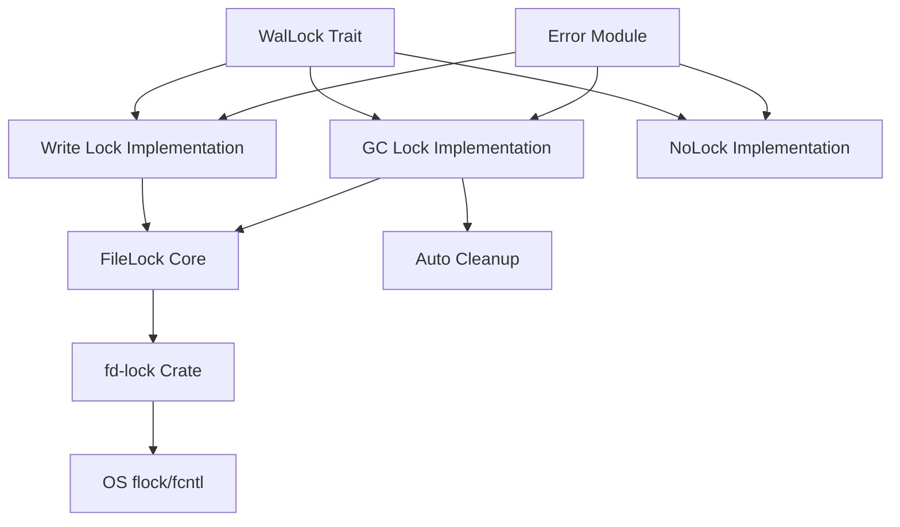
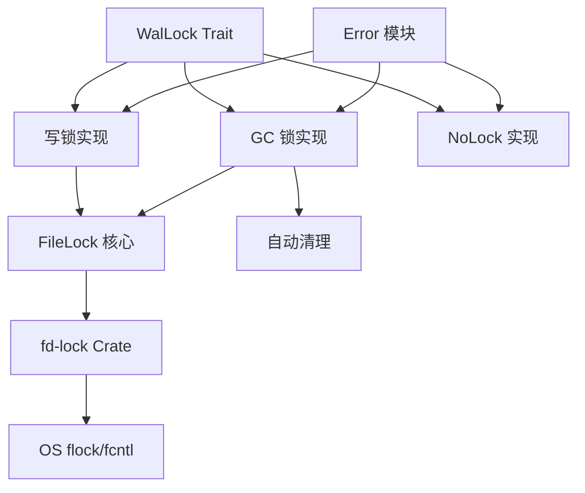

[English](#en) | [中文](#zh)

---

<a id="en"></a>

# jdb_lock: Cross-Process File Locking for Database Systems

## Table of Contents

- [Overview](#overview)
- [Features](#features)
- [Installation](#installation)
- [Architecture](#architecture)
- [API Documentation](#api-documentation)
- [Usage Examples](#usage-examples)
- [Design Philosophy](#design-philosophy)
- [Technical Stack](#technical-stack)
- [Project Structure](#project-structure)
- [Performance Considerations](#performance-considerations)
- [Error Handling](#error-handling)
- [Historical Context](#historical-context)

## Overview

`jdb_lock` provides efficient cross-process file locking mechanisms using `flock`/`fcntl` system calls. It's designed specifically for database systems to ensure safe concurrent access to WAL (Write-Ahead Log) files while maintaining high performance for frequent operations.

## Features

- **Cross-process locking**: Safe file locking across multiple processes using OS-level primitives
- **WAL-specific locks**: Specialized locks optimized for different WAL operations
- **GC lock**: Separate lock file mechanism for garbage collection operations
- **Write lock**: Direct exclusive lock on WAL files for writers
- **No-op lock**: Lightweight option for scenarios where locking is not required
- **Automatic cleanup**: Lock files automatically removed to prevent resource leaks
- **Thread safety**: All implementations are safe for concurrent usage

## Installation

Add this to your `Cargo.toml`:

```toml
[dependencies]
jdb_lock = "0.1.0"
```

## Architecture

The library implements a layered architecture for file locking:



## API Documentation

### Core Types

#### `WalLock` Trait
Common interface for all WAL file locking implementations:
```rust
pub trait WalLock: Default {
    fn try_lock(&mut self, path: &Path) -> Result<()>;
}
```

#### `FileLock` (Internal)
Internal write lock holder with safe memory management:
- Manages file guard lifecycle
- Ensures proper drop order
- Provides 'static lifetime guarantees

#### `Error` Enum
Comprehensive error handling for lock operations:
```rust
pub enum Error {
    Locked,    // File already locked by another process
    Io(IoError), // Underlying I/O error
}
```

#### `Result<T>` Type alias for convenient error handling.

### Lock Implementations

#### `w::Lock` - Write Lock
Provides exclusive write access to WAL files:
- Directly locks the target WAL file
- Prevents multiple writers on the same file
- Used for regular write operations on active WAL files

#### `gc::Lock` - Garbage Collection Lock
Prevents concurrent garbage collection on the same WAL:
- Creates separate lock file instead of locking WAL directly
- Allows readers to continue accessing WAL during GC operations
- Automatically cleans up lock file on drop

#### `NoLock` - No-op Implementation
Lightweight option for scenarios without locking requirements:
- Always succeeds without actual file system operations
- Useful for GC WAL operations or single-process scenarios

## Usage Examples

### Basic Write Lock

```rust
use jdb_lock::{w::Lock as WLock, WalLock};
use std::path::Path;

let mut lock = WLock::default();
let path = Path::new("/path/to/wal/file");

match lock.try_lock(path) {
    Ok(()) => println!("Lock acquired successfully"),
    Err(e) => println!("Failed to acquire lock: {}", e),
}
```

### GC Lock with Automatic Cleanup

```rust
use jdb_lock::gc::Lock as GcLock;
use std::path::PathBuf;

let lock_path = PathBuf::from("/path/to/lock/file");
match GcLock::try_new(lock_path) {
    Ok(gc_lock) => {
        // GC operations here
        // Lock file automatically cleaned up when gc_lock goes out of scope
    }
    Err(e) => println!("Failed to acquire GC lock: {}", e),
}
```

### No-op Lock for Single-Process Scenarios

```rust
use jdb_lock::{NoLock, WalLock};
use std::path::Path;

let mut lock = NoLock;
let path = Path::new("/path/to/wal/file");

// This always succeeds without actual file locking
lock.try_lock(path).unwrap();
```

## Design Philosophy

The library follows several key design principles:

1. **Safety First**: All unsafe operations are carefully documented and justified
2. **Minimal Overhead**: Lock acquisition and release are optimized for high-frequency operations
3. **Resource Management**: Automatic cleanup prevents resource leaks
4. **Flexibility**: Multiple lock implementations for different use cases
5. **Cross-Platform Compatibility**: Works consistently across Unix-like systems

## Technical Stack

- **Core Implementation**: Rust with edition 2024
- **File Locking**: `fd-lock` crate for cross-platform file locking
- **Error Handling**: `thiserror` for comprehensive error management
- **Testing Infrastructure**: `aok`, `compio`, `log`, `log_init`, `static_init`
- **License**: MulanPSL-2.0

## Project Structure

```
jdb_lock/
├── src/
│   ├── lib.rs      # Main library entry point and core types
│   ├── error.rs    # Error types and result handling
│   ├── gc.rs       # Garbage collection lock implementation
│   └── w.rs        # Write lock implementation
├── tests/
│   └── main.rs     # Test suite and examples
├── readme/
│   ├── en.md       # English documentation
│   └── zh.md       # Chinese documentation
└── Cargo.toml      # Project configuration
```

## Performance Considerations

The library is optimized for database workloads:

- **OS-Level Primitives**: Uses `flock`/`fcntl` for maximum efficiency
- **Minimal System Calls**: Optimized lock acquisition patterns
- **Memory Safety**: Careful lifetime management without runtime overhead
- **Concurrent Access**: Designed for high-contention scenarios
- **Resource Efficiency**: Automatic cleanup prevents accumulation of lock files

## Error Handling

The library provides comprehensive error handling:

- `Error::Locked`: Indicates the file is already locked by another process
- `Error::Io`: Wraps underlying I/O errors from the file system
- All errors provide clear, actionable messages for debugging

## Historical Context

File locking has been essential to database systems since the early days of multi-user computing. The concept of using advisory locks through `flock` originated in BSD Unix and was later adopted by other Unix-like systems. 

In database systems, WAL (Write-Ahead Logging) became popular in the 1970s as a recovery mechanism. The challenge of coordinating concurrent access to these log files led to various locking strategies. Modern databases like PostgreSQL and SQLite continue to use similar file-based locking mechanisms.

The `jdb_lock` library builds on this foundation, providing a Rust-native implementation that respects the established patterns while leveraging Rust's memory safety guarantees. The separation of GC locks from write locks reflects the evolution of database architecture, where garbage collection became a distinct operation requiring its own coordination mechanism.

The use of separate lock files for GC operations (rather than locking the WAL directly) is a pattern seen in many modern databases. This approach allows read operations to continue during maintenance operations, improving overall system availability - a critical requirement for 24/7 services.

---

## About

This project is an open-source component of [js0.site ⋅ Refactoring the Internet Plan](https://js0.site).

We are redefining the development paradigm of the Internet in a componentized way. Welcome to follow us:

* [Google Group](https://groups.google.com/g/js0-site)
* [js0site.bsky.social](https://bsky.app/profile/js0site.bsky.social)

---

<a id="zh"></a>

# jdb_lock: 数据库系统跨进程文件锁

## 目录

- [概述](#概述)
- [特性](#特性)
- [安装](#安装)
- [架构](#架构)
- [API 文档](#api-文档)
- [使用示例](#使用示例)
- [设计理念](#设计理念)
- [技术栈](#技术栈)
- [项目结构](#项目结构)
- [性能考虑](#性能考虑)
- [错误处理](#错误处理)
- [历史背景](#历史背景)

## 概述

`jdb_lock` 使用 `flock`/`fcntl` 系统调用提供高效的跨进程文件锁机制。专为数据库系统设计，确保对 WAL（预写日志）文件的安全并发访问，同时保持高频操作的高性能。

## 特性

- **跨进程锁定**：使用操作系统级原语实现多进程安全文件锁定
- **WAL 专用锁**：为不同 WAL 操作优化的专用锁机制
- **GC 锁**：垃圾回收操作的独立锁文件机制
- **写锁**：WAL 文件的直接排他锁
- **空锁**：不需要锁定场景下的轻量级选项
- **自动清理**：锁文件自动删除防止资源泄漏
- **线程安全**：所有实现均支持并发使用

## 安装

在 `Cargo.toml` 中添加：

```toml
[dependencies]
jdb_lock = "0.1.0"
```

## 架构

库采用分层架构实现文件锁定：



## API 文档

### 核心类型

#### `WalLock` Trait
所有 WAL 文件锁实现的通用接口：
```rust
pub trait WalLock: Default {
    fn try_lock(&mut self, path: &Path) -> Result<()>;
}
```

#### `FileLock`（内部）
内部写锁持有者，具备安全的内存管理：
- 管理文件守卫生命周期
- 确保正确的释放顺序
- 提供 'static 生命周期保证

#### `Error` 枚举
锁操作的综合错误处理：
```rust
pub enum Error {
    Locked,    // 文件已被其他进程锁定
    Io(IoError), // 底层 I/O 错误
}
```

#### `Result<T>` 类型别名，便于错误处理。

### 锁实现

#### `w::Lock` - 写锁
提供对 WAL 文件的排他写访问：
- 直接锁定目标 WAL 文件
- 防止同一文件上的多个写入者
- 用于活动 WAL 文件的常规写操作

#### `gc::Lock` - 垃圾回收锁
防止对同一 WAL 的并发垃圾回收：
- 创建独立锁文件而非直接锁定 WAL
- 允许读取者在 GC 操作期间继续访问 WAL
- 释放时自动清理锁文件

#### `NoLock` - 空操作实现
无锁定需求场景下的轻量级选项：
- 总是成功，不执行实际文件系统操作
- 适用于 GC WAL 操作或单进程场景

## 使用示例

### 基本写锁

```rust
use jdb_lock::{w::Lock as WLock, WalLock};
use std::path::Path;

let mut lock = WLock::default();
let path = Path::new("/path/to/wal/file");

match lock.try_lock(path) {
    Ok(()) => println!("锁获取成功"),
    Err(e) => println!("获取锁失败: {}", e),
}
```

### 带自动清理的 GC 锁

```rust
use jdb_lock::gc::Lock as GcLock;
use std::path::PathBuf;

let lock_path = PathBuf::from("/path/to/lock/file");
match GcLock::try_new(lock_path) {
    Ok(gc_lock) => {
        // 在这里执行 GC 操作
        // gc_lock 离开作用域时锁文件自动清理
    }
    Err(e) => println!("获取 GC 锁失败: {}", e),
}
```

### 单进程场景的空锁

```rust
use jdb_lock::{NoLock, WalLock};
use std::path::Path;

let mut lock = NoLock;
let path = Path::new("/path/to/wal/file");

// 总是成功，不进行实际文件锁定
lock.try_lock(path).unwrap();
```

## 设计理念

库遵循几个关键设计原则：

1. **安全第一**：所有不安全操作都经过仔细文档化和合理化
2. **最小开销**：锁获取和释放针对高频操作优化
3. **资源管理**：自动清理防止资源泄漏
4. **灵活性**：多种锁实现适应不同用例
5. **跨平台兼容性**：在类 Unix 系统上保持一致工作

## 技术栈

- **核心实现**：Rust 2024 版本
- **文件锁定**：`fd-lock` crate 实现跨平台文件锁定
- **错误处理**：`thiserror` 提供综合错误管理
- **测试基础设施**：`aok`、`compio`、`log`、`log_init`、`static_init`
- **许可证**：MulanPSL-2.0

## 项目结构

```
jdb_lock/
├── src/
│   ├── lib.rs      # 主库入口点和核心类型
│   ├── error.rs    # 错误类型和结果处理
│   ├── gc.rs       # 垃圾回收锁实现
│   └── w.rs        # 写锁实现
├── tests/
│   └── main.rs     # 测试套件和示例
├── readme/
│   ├── en.md       # 英文文档
│   └── zh.md       # 中文文档
└── Cargo.toml      # 项目配置
```

## 性能考虑

库针对数据库工作负载优化：

- **操作系统级原语**：使用 `flock`/`fcntl` 实现最大效率
- **最少系统调用**：优化的锁获取模式
- **内存安全**：仔细的生命周期管理，无运行时开销
- **并发访问**：为高争用场景设计
- **资源效率**：自动清理防止锁文件积累

## 错误处理

库提供全面的错误处理：

- `Error::Locked`：表示文件已被其他进程锁定
- `Error::Io`：包装来自文件系统的底层 I/O 错误
- 所有错误都提供清晰、可操作的调试信息

## 历史背景

文件锁定从多用户计算早期开始就是数据库系统的关键组成部分。通过 `flock` 使用建议锁的概念起源于 BSD Unix，后来被其他类 Unix 系统采用。

在数据库系统中，WAL（预写日志）在 1970 年代作为恢复机制流行起来。协调对这些日志文件的并发访问挑战导致了各种锁定策略。现代数据库如 PostgreSQL 和 SQLite 继续使用类似的基于文件的锁定机制。

`jdb_lock` 库在这一基础上构建，提供尊重既定模式的 Rust 原生实现，同时利用 Rust 的内存安全保证。GC 锁与写锁的分离反映了数据库架构的演变，其中垃圾回收成为需要自己协调机制的独立操作。

使用独立锁文件进行 GC 操作（而非直接锁定 WAL）是许多现代数据库中看到的模式。这种方法允许读操作在维护操作期间继续，提高整体系统可用性 - 这是 24/7 服务的关键要求。

---

## 关于

本项目为 [js0.site ⋅ 重构互联网计划](https://js0.site) 的开源组件。

我们正在以组件化的方式重新定义互联网的开发范式，欢迎关注：

* [谷歌邮件列表](https://groups.google.com/g/js0-site)
* [js0site.bsky.social](https://bsky.app/profile/js0site.bsky.social)
