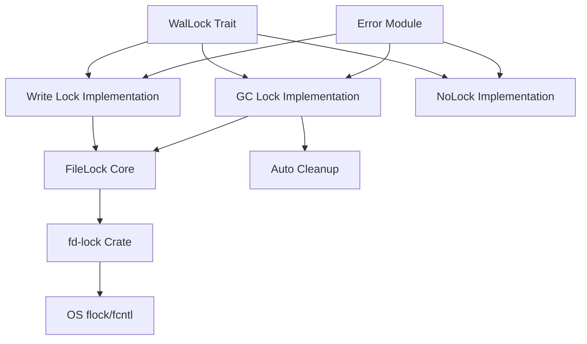

# jdb_lock: Cross-Process File Locking for Database Systems

## Table of Contents

- [Overview](#overview)
- [Features](#features)
- [Installation](#installation)
- [Architecture](#architecture)
- [API Documentation](#api-documentation)
- [Usage Examples](#usage-examples)
- [Design Philosophy](#design-philosophy)
- [Technical Stack](#technical-stack)
- [Project Structure](#project-structure)
- [Performance Considerations](#performance-considerations)
- [Error Handling](#error-handling)
- [Historical Context](#historical-context)

## Overview

`jdb_lock` provides efficient cross-process file locking mechanisms using `flock`/`fcntl` system calls. It's designed specifically for database systems to ensure safe concurrent access to WAL (Write-Ahead Log) files while maintaining high performance for frequent operations.

## Features

- **Cross-process locking**: Safe file locking across multiple processes using OS-level primitives
- **WAL-specific locks**: Specialized locks optimized for different WAL operations
- **GC lock**: Separate lock file mechanism for garbage collection operations
- **Write lock**: Direct exclusive lock on WAL files for writers
- **No-op lock**: Lightweight option for scenarios where locking is not required
- **Automatic cleanup**: Lock files automatically removed to prevent resource leaks
- **Thread safety**: All implementations are safe for concurrent usage

## Installation

Add this to your `Cargo.toml`:

```toml
[dependencies]
jdb_lock = "0.1.0"
```

## Architecture

The library implements a layered architecture for file locking:



## API Documentation

### Core Types

#### `WalLock` Trait
Common interface for all WAL file locking implementations:
```rust
pub trait WalLock: Default {
    fn try_lock(&mut self, path: &Path) -> Result<()>;
}
```

#### `FileLock` (Internal)
Internal write lock holder with safe memory management:
- Manages file guard lifecycle
- Ensures proper drop order
- Provides 'static lifetime guarantees

#### `Error` Enum
Comprehensive error handling for lock operations:
```rust
pub enum Error {
    Locked,    // File already locked by another process
    Io(IoError), // Underlying I/O error
}
```

#### `Result<T>` Type alias for convenient error handling.

### Lock Implementations

#### `w::Lock` - Write Lock
Provides exclusive write access to WAL files:
- Directly locks the target WAL file
- Prevents multiple writers on the same file
- Used for regular write operations on active WAL files

#### `gc::Lock` - Garbage Collection Lock
Prevents concurrent garbage collection on the same WAL:
- Creates separate lock file instead of locking WAL directly
- Allows readers to continue accessing WAL during GC operations
- Automatically cleans up lock file on drop

#### `NoLock` - No-op Implementation
Lightweight option for scenarios without locking requirements:
- Always succeeds without actual file system operations
- Useful for GC WAL operations or single-process scenarios

## Usage Examples

### Basic Write Lock

```rust
use jdb_lock::{w::Lock as WLock, WalLock};
use std::path::Path;

let mut lock = WLock::default();
let path = Path::new("/path/to/wal/file");

match lock.try_lock(path) {
    Ok(()) => println!("Lock acquired successfully"),
    Err(e) => println!("Failed to acquire lock: {}", e),
}
```

### GC Lock with Automatic Cleanup

```rust
use jdb_lock::gc::Lock as GcLock;
use std::path::PathBuf;

let lock_path = PathBuf::from("/path/to/lock/file");
match GcLock::try_new(lock_path) {
    Ok(gc_lock) => {
        // GC operations here
        // Lock file automatically cleaned up when gc_lock goes out of scope
    }
    Err(e) => println!("Failed to acquire GC lock: {}", e),
}
```

### No-op Lock for Single-Process Scenarios

```rust
use jdb_lock::{NoLock, WalLock};
use std::path::Path;

let mut lock = NoLock;
let path = Path::new("/path/to/wal/file");

// This always succeeds without actual file locking
lock.try_lock(path).unwrap();
```

## Design Philosophy

The library follows several key design principles:

1. **Safety First**: All unsafe operations are carefully documented and justified
2. **Minimal Overhead**: Lock acquisition and release are optimized for high-frequency operations
3. **Resource Management**: Automatic cleanup prevents resource leaks
4. **Flexibility**: Multiple lock implementations for different use cases
5. **Cross-Platform Compatibility**: Works consistently across Unix-like systems

## Technical Stack

- **Core Implementation**: Rust with edition 2024
- **File Locking**: `fd-lock` crate for cross-platform file locking
- **Error Handling**: `thiserror` for comprehensive error management
- **Testing Infrastructure**: `aok`, `compio`, `log`, `log_init`, `static_init`
- **License**: MulanPSL-2.0

## Project Structure

```
jdb_lock/
├── src/
│   ├── lib.rs      # Main library entry point and core types
│   ├── error.rs    # Error types and result handling
│   ├── gc.rs       # Garbage collection lock implementation
│   └── w.rs        # Write lock implementation
├── tests/
│   └── main.rs     # Test suite and examples
├── readme/
│   ├── en.md       # English documentation
│   └── zh.md       # Chinese documentation
└── Cargo.toml      # Project configuration
```

## Performance Considerations

The library is optimized for database workloads:

- **OS-Level Primitives**: Uses `flock`/`fcntl` for maximum efficiency
- **Minimal System Calls**: Optimized lock acquisition patterns
- **Memory Safety**: Careful lifetime management without runtime overhead
- **Concurrent Access**: Designed for high-contention scenarios
- **Resource Efficiency**: Automatic cleanup prevents accumulation of lock files

## Error Handling

The library provides comprehensive error handling:

- `Error::Locked`: Indicates the file is already locked by another process
- `Error::Io`: Wraps underlying I/O errors from the file system
- All errors provide clear, actionable messages for debugging

## Historical Context

File locking has been essential to database systems since the early days of multi-user computing. The concept of using advisory locks through `flock` originated in BSD Unix and was later adopted by other Unix-like systems. 

In database systems, WAL (Write-Ahead Logging) became popular in the 1970s as a recovery mechanism. The challenge of coordinating concurrent access to these log files led to various locking strategies. Modern databases like PostgreSQL and SQLite continue to use similar file-based locking mechanisms.

The `jdb_lock` library builds on this foundation, providing a Rust-native implementation that respects the established patterns while leveraging Rust's memory safety guarantees. The separation of GC locks from write locks reflects the evolution of database architecture, where garbage collection became a distinct operation requiring its own coordination mechanism.

The use of separate lock files for GC operations (rather than locking the WAL directly) is a pattern seen in many modern databases. This approach allows read operations to continue during maintenance operations, improving overall system availability - a critical requirement for 24/7 services.