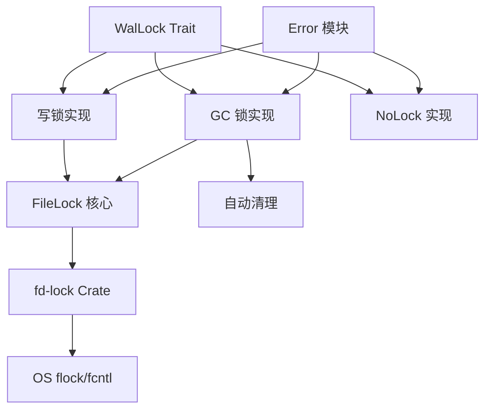

# jdb_lock: 数据库系统跨进程文件锁

## 目录

- [概述](#概述)
- [特性](#特性)
- [安装](#安装)
- [架构](#架构)
- [API 文档](#api-文档)
- [使用示例](#使用示例)
- [设计理念](#设计理念)
- [技术栈](#技术栈)
- [项目结构](#项目结构)
- [性能考虑](#性能考虑)
- [错误处理](#错误处理)
- [历史背景](#历史背景)

## 概述

`jdb_lock` 使用 `flock`/`fcntl` 系统调用提供高效的跨进程文件锁机制。专为数据库系统设计，确保对 WAL（预写日志）文件的安全并发访问，同时保持高频操作的高性能。

## 特性

- **跨进程锁定**：使用操作系统级原语实现多进程安全文件锁定
- **WAL 专用锁**：为不同 WAL 操作优化的专用锁机制
- **GC 锁**：垃圾回收操作的独立锁文件机制
- **写锁**：WAL 文件的直接排他锁
- **空锁**：不需要锁定场景下的轻量级选项
- **自动清理**：锁文件自动删除防止资源泄漏
- **线程安全**：所有实现均支持并发使用

## 安装

在 `Cargo.toml` 中添加：

```toml
[dependencies]
jdb_lock = "0.1.0"
```

## 架构

库采用分层架构实现文件锁定：



## API 文档

### 核心类型

#### `WalLock` Trait
所有 WAL 文件锁实现的通用接口：
```rust
pub trait WalLock: Default {
    fn try_lock(&mut self, path: &Path) -> Result<()>;
}
```

#### `FileLock`（内部）
内部写锁持有者，具备安全的内存管理：
- 管理文件守卫生命周期
- 确保正确的释放顺序
- 提供 'static 生命周期保证

#### `Error` 枚举
锁操作的综合错误处理：
```rust
pub enum Error {
    Locked,    // 文件已被其他进程锁定
    Io(IoError), // 底层 I/O 错误
}
```

#### `Result<T>` 类型别名，便于错误处理。

### 锁实现

#### `w::Lock` - 写锁
提供对 WAL 文件的排他写访问：
- 直接锁定目标 WAL 文件
- 防止同一文件上的多个写入者
- 用于活动 WAL 文件的常规写操作

#### `gc::Lock` - 垃圾回收锁
防止对同一 WAL 的并发垃圾回收：
- 创建独立锁文件而非直接锁定 WAL
- 允许读取者在 GC 操作期间继续访问 WAL
- 释放时自动清理锁文件

#### `NoLock` - 空操作实现
无锁定需求场景下的轻量级选项：
- 总是成功，不执行实际文件系统操作
- 适用于 GC WAL 操作或单进程场景

## 使用示例

### 基本写锁

```rust
use jdb_lock::{w::Lock as WLock, WalLock};
use std::path::Path;

let mut lock = WLock::default();
let path = Path::new("/path/to/wal/file");

match lock.try_lock(path) {
    Ok(()) => println!("锁获取成功"),
    Err(e) => println!("获取锁失败: {}", e),
}
```

### 带自动清理的 GC 锁

```rust
use jdb_lock::gc::Lock as GcLock;
use std::path::PathBuf;

let lock_path = PathBuf::from("/path/to/lock/file");
match GcLock::try_new(lock_path) {
    Ok(gc_lock) => {
        // 在这里执行 GC 操作
        // gc_lock 离开作用域时锁文件自动清理
    }
    Err(e) => println!("获取 GC 锁失败: {}", e),
}
```

### 单进程场景的空锁

```rust
use jdb_lock::{NoLock, WalLock};
use std::path::Path;

let mut lock = NoLock;
let path = Path::new("/path/to/wal/file");

// 总是成功，不进行实际文件锁定
lock.try_lock(path).unwrap();
```

## 设计理念

库遵循几个关键设计原则：

1. **安全第一**：所有不安全操作都经过仔细文档化和合理化
2. **最小开销**：锁获取和释放针对高频操作优化
3. **资源管理**：自动清理防止资源泄漏
4. **灵活性**：多种锁实现适应不同用例
5. **跨平台兼容性**：在类 Unix 系统上保持一致工作

## 技术栈

- **核心实现**：Rust 2024 版本
- **文件锁定**：`fd-lock` crate 实现跨平台文件锁定
- **错误处理**：`thiserror` 提供综合错误管理
- **测试基础设施**：`aok`、`compio`、`log`、`log_init`、`static_init`
- **许可证**：MulanPSL-2.0

## 项目结构

```
jdb_lock/
├── src/
│   ├── lib.rs      # 主库入口点和核心类型
│   ├── error.rs    # 错误类型和结果处理
│   ├── gc.rs       # 垃圾回收锁实现
│   └── w.rs        # 写锁实现
├── tests/
│   └── main.rs     # 测试套件和示例
├── readme/
│   ├── en.md       # 英文文档
│   └── zh.md       # 中文文档
└── Cargo.toml      # 项目配置
```

## 性能考虑

库针对数据库工作负载优化：

- **操作系统级原语**：使用 `flock`/`fcntl` 实现最大效率
- **最少系统调用**：优化的锁获取模式
- **内存安全**：仔细的生命周期管理，无运行时开销
- **并发访问**：为高争用场景设计
- **资源效率**：自动清理防止锁文件积累

## 错误处理

库提供全面的错误处理：

- `Error::Locked`：表示文件已被其他进程锁定
- `Error::Io`：包装来自文件系统的底层 I/O 错误
- 所有错误都提供清晰、可操作的调试信息

## 历史背景

文件锁定从多用户计算早期开始就是数据库系统的关键组成部分。通过 `flock` 使用建议锁的概念起源于 BSD Unix，后来被其他类 Unix 系统采用。

在数据库系统中，WAL（预写日志）在 1970 年代作为恢复机制流行起来。协调对这些日志文件的并发访问挑战导致了各种锁定策略。现代数据库如 PostgreSQL 和 SQLite 继续使用类似的基于文件的锁定机制。

`jdb_lock` 库在这一基础上构建，提供尊重既定模式的 Rust 原生实现，同时利用 Rust 的内存安全保证。GC 锁与写锁的分离反映了数据库架构的演变，其中垃圾回收成为需要自己协调机制的独立操作。

使用独立锁文件进行 GC 操作（而非直接锁定 WAL）是许多现代数据库中看到的模式。这种方法允许读操作在维护操作期间继续，提高整体系统可用性 - 这是 24/7 服务的关键要求。