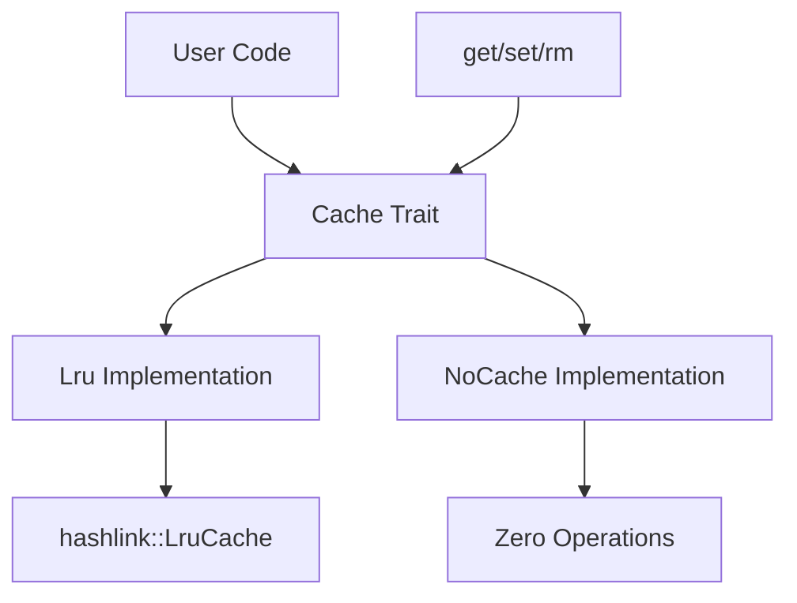

[English](#en) | [中文](#zh)

---

<a id="en"></a>

# jdb_lru : Efficient LRU Cache Implementation

## Table of Contents

- [Overview](#overview)
- [Features](#features)
- [Usage](#usage)
- [API Reference](#api-reference)
- [Design](#design)
- [Technology Stack](#technology-stack)
- [Project Structure](#project structure)
- [Historical Context](#historical-context)

## Overview

jdb_lru is a lightweight Rust library providing LRU (Least Recently Used) cache implementations with zero-allocation alternatives. The library offers a unified `Cache` trait interface supporting both functional LRU caching and no-op cache implementations for garbage collection friendly scenarios.

## Features

- **LRU Cache**: Efficient least recently used cache with automatic eviction
- **No-Cache Implementation**: Zero-overhead no-op cache for performance-critical paths
- **Generic Interface**: Support for any hashable key types and arbitrary value types
- **Memory Safe**: Built on Rust's ownership system with no unsafe code
- **Minimal Dependencies**: Only depends on the well-maintained `hashlink` crate

## Usage

### Basic LRU Cache

```rust
use jdb_lru::{Cache, Lru};

let mut cache = Lru::new(3);
cache.set("key1".to_string(), "value1");
cache.set("key2".to_string(), "value2");

assert_eq!(cache.get(&"key1".to_string()), Some(&"value1"));
```

### Capacity Management

```rust
let mut cache = Lru::new(2);
cache.set(1, "a");
cache.set(2, "b");

// Access key 1 to make it recently used
assert_eq!(cache.get(&1), Some(&"a"));

// Add third item, evicts least recently used (key 2)
cache.set(3, "c");
assert_eq!(cache.get(&2), None); // evicted
```

### No-Cache Implementation

```rust
use jdb_lru::{Cache, NoCache};

let mut cache: NoCache = NoCache;
cache.set("key", "value");
assert_eq!(<NoCache as Cache<String, String>>::get(&mut cache, &"key".to_string()), None);
```

## API Reference

### Cache Trait

The `Cache<K, V>` trait defines the cache interface:

- `get(&mut self, key: &K) -> Option<&V>`: Retrieve value by key
- `set(&mut self, key: K, val: V)`: Insert key-value pair
- `rm(&mut self, key: &K)`: Remove entry by key

### Lru Struct

- `new(cap: usize) -> Self`: Create LRU cache with specified capacity
- Automatic capacity adjustment (minimum 1)
- Built on `hashlink::LruCache` for O(1) operations

### NoCache Struct

- Zero-allocation cache implementation
- All operations are no-ops
- Always returns `None` for `get()` operations

## Design

### Architecture



### Module Flow

1. **Trait Definition**: `Cache<K, V>` trait defines unified interface
2. **LRU Implementation**: Uses `hashlink::LruCache` for O(1) operations
3. **No-Cache Implementation**: Zero-overhead alternative for disabled caching
4. **Generic Constraints**: Keys require `Hash + Eq`, values have no constraints

The design prioritizes performance and flexibility, allowing runtime selection between functional caching and zero-overhead no-op implementations.

## Technology Stack

- **Language**: Rust (Edition 2024)
- **Core Dependency**: hashlink 0.11.0
- **License**: MulanPSL-2.0
- **Testing**: Built-in Rust test framework with logging support
- **Documentation**: Rustdoc with feature flags

## Project Structure

```
jdb_lru/
├── src/
│   └── lib.rs          # Core library with Cache trait and implementations
├── tests/
│   └── main.rs         # Comprehensive test suite
├── readme/
│   ├── en.md          # English documentation
│   └── zh.md          # Chinese documentation
├── Cargo.toml         # Project configuration
└── README.mdt         # Documentation index
```

## Historical Context

The LRU (Least Recently Used) cache algorithm has its roots in operating system memory management, first described in the 1960s as part of page replacement strategies. The concept gained prominence with the development of virtual memory systems, where efficient eviction policies became crucial for performance.

In modern software systems, LRU caches are ubiquitous - from CPU caches and database buffer pools to web browser caches and content delivery networks. The hashlink crate that powers this implementation builds upon decades of research into cache-oblivious algorithms and lock-free data structures.

Rust's ownership system and zero-cost abstractions make it particularly well-suited for implementing cache systems, providing memory safety without runtime overhead. This library continues that tradition by offering both high-performance caching and zero-allocation alternatives in a single, unified interface.

---

## About

This project is an open-source component of [js0.site ⋅ Refactoring the Internet Plan](https://js0.site).

We are redefining the development paradigm of the Internet in a componentized way. Welcome to follow us:

* [Google Group](https://groups.google.com/g/js0-site)
* [js0site.bsky.social](https://bsky.app/profile/js0site.bsky.social)

---

<a id="zh"></a>

# jdb_lru : 高效LRU缓存实现

## 目录

- [项目概述](#项目概述)
- [功能特性](#功能特性)
- [使用方法](#使用方法)
- [API参考](#api参考)
- [设计思路](#设计思路)
- [技术堆栈](#技术堆栈)
- [目录结构](#目录结构)
- [历史背景](#历史背景)

## 项目概述

jdb_lru是轻量级Rust库，提供LRU（最近最少使用）缓存实现和零分配替代方案。库提供统一的`Cache` trait接口，支持功能性LRU缓存和垃圾回收友好的无操作缓存实现。

## 功能特性

- **LRU缓存**：高效的最近最少使用缓存，支持自动淘汰
- **无缓存实现**：零开销无操作缓存，适用于性能关键路径
- **通用接口**：支持任何可哈希键类型和任意值类型
- **内存安全**：基于Rust所有权系统，无不安全代码
- **最小依赖**：仅依赖维护良好的`hashlink`库

## 使用方法

### 基础LRU缓存

```rust
use jdb_lru::{Cache, Lru};

let mut cache = Lru::new(3);
cache.set("key1".to_string(), "value1");
cache.set("key2".to_string(), "value2");

assert_eq!(cache.get(&"key1".to_string()), Some(&"value1"));
```

### 容量管理

```rust
let mut cache = Lru::new(2);
cache.set(1, "a");
cache.set(2, "b");

// 访问key 1使其成为最近使用
assert_eq!(cache.get(&1), Some(&"a"));

// 添加第三项，淘汰最近最少使用的(key 2)
cache.set(3, "c");
assert_eq!(cache.get(&2), None); // 已淘汰
```

### 无缓存实现

```rust
use jdb_lru::{Cache, NoCache};

let mut cache: NoCache = NoCache;
cache.set("key", "value");
assert_eq!(<NoCache as Cache<String, String>>::get(&mut cache, &"key".to_string()), None);
```

## API参考

### Cache Trait

`Cache<K, V>` trait定义缓存接口：

- `get(&mut self, key: &K) -> Option<&V>`：按键检索值
- `set(&mut self, key: K, val: V)`：插入键值对
- `rm(&mut self, key: &K)`：按键删除条目

### Lru 结构体

- `new(cap: usize) -> Self`：创建指定容量的LRU缓存
- 自动容量调整（最小为1）
- 基于`hashlink::LruCache`实现O(1)操作

### NoCache 结构体

- 零分配缓存实现
- 所有操作均为无操作
- `get()`操作始终返回`None`

## 设计思路

### 架构设计


### 模块调用流程

1. **Trait定义**：`Cache<K, V>` trait定义统一接口
2. **LRU实现**：使用`hashlink::LruCache`实现O(1)操作
3. **无缓存实现**：零开销替代方案，用于禁用缓存场景
4. **泛型约束**：键需要`Hash + Eq`，值无约束

设计优先考虑性能和灵活性，允许在功能缓存和零开销无操作实现之间进行运行时选择。

## 技术堆栈

- **语言**：Rust（Edition 2024）
- **核心依赖**：hashlink 0.11.0
- **许可证**：MulanPSL-2.0
- **测试框架**：内置Rust测试框架，支持日志记录
- **文档生成**：Rustdoc与功能标志

## 目录结构

```
jdb_lru/
├── src/
│   └── lib.rs          # 核心库，包含Cache trait和实现
├── tests/
│   └── main.rs         # 综合测试套件
├── readme/
│   ├── en.md          # 英文文档
│   └── zh.md          # 中文文档
├── Cargo.toml         # 项目配置
└── README.mdt         # 文档索引
```

## 历史背景

LRU（最近最少使用）缓存算法起源于操作系统内存管理，最早在1960年代作为页面替换策略的一部分被描述。这个概念随着虚拟内存系统的发展而获得 prominence，其中高效的淘汰策略对性能变得至关重要。

在现代软件系统中，LRU缓存无处不在 - 从CPU缓存和数据库缓冲池到网页浏览器缓存和内容分发网络。驱动此实现的hashlink库建立在数十年的缓存无关算法和无锁数据结构研究基础之上。

Rust的所有权系统和零成本抽象使其特别适合实现缓存系统，在不产生运行时开销的情况下提供内存安全。本库延续了这一传统，在单一统一接口中同时提供高性能缓存和零分配替代方案。

---

## 关于

本项目为 [js0.site ⋅ 重构互联网计划](https://js0.site) 的开源组件。

我们正在以组件化的方式重新定义互联网的开发范式，欢迎关注：

* [谷歌邮件列表](https://groups.google.com/g/js0-site)
* [js0site.bsky.social](https://bsky.app/profile/js0site.bsky.social)
