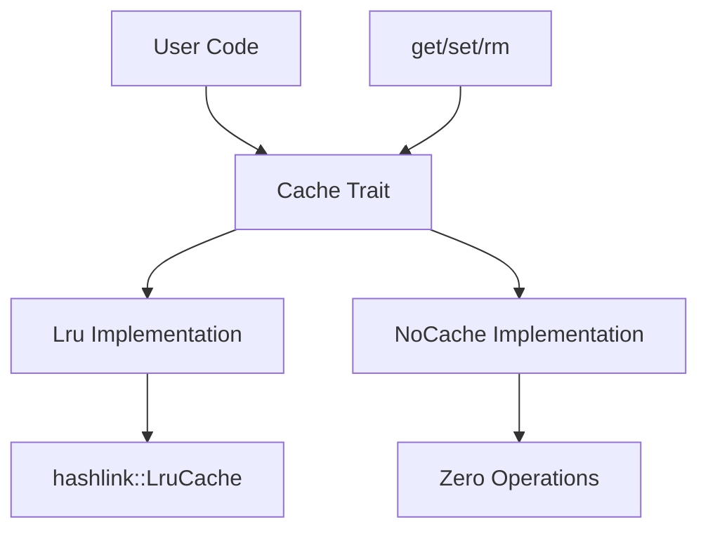

# jdb_lru : Efficient LRU Cache Implementation

## Table of Contents

- [Overview](#overview)
- [Features](#features)
- [Usage](#usage)
- [API Reference](#api-reference)
- [Design](#design)
- [Technology Stack](#technology-stack)
- [Project Structure](#project-structure)
- [Historical Context](#historical-context)

## Overview

jdb_lru is lightweight Rust library providing LRU (Least Recently Used) cache implementations with zero-allocation alternatives. The library offers unified `Cache` trait interface supporting both functional LRU caching and no-op cache implementations for garbage collection friendly scenarios.

## Features

- **LRU Cache**: Efficient least recently used cache with automatic eviction
- **No-Cache Implementation**: Zero-overhead no-op cache for performance-critical paths
- **Generic Interface**: Support for any hashable key types and arbitrary value types
- **Memory Safe**: Built on Rust's ownership system with no unsafe code
- **Minimal Dependencies**: Only depends on well-maintained `hashlink` crate

## Usage

### Basic LRU Cache

```rust
use jdb_lru::{Cache, Lru};

let mut cache = Lru::new(3);
cache.set("key1".to_string(), "value1");
cache.set("key2".to_string(), "value2");

assert_eq!(cache.get(&"key1".to_string()), Some(&"value1"));
```

### Capacity Management

```rust
let mut cache = Lru::new(2);
cache.set(1, "a");
cache.set(2, "b");

// Access key 1 to make it recently used
assert_eq!(cache.get(&1), Some(&"a"));

// Add third item, evicts least recently used (key 2)
cache.set(3, "c");
assert_eq!(cache.get(&2), None); // evicted
```

### No-Cache Implementation

```rust
use jdb_lru::{Cache, NoCache};

let mut cache: NoCache = NoCache;
cache.set("key", "value");
assert_eq!(<NoCache as Cache<String, String>>::get(&mut cache, &"key".to_string()), None);
```

## API Reference

### Cache Trait

The `Cache<K, V>` trait defines the cache interface:

- `get(&mut self, key: &K) -> Option<&V>`: Retrieve value by key
- `set(&mut self, key: K, val: V)`: Insert key-value pair
- `rm(&mut self, key: &K)`: Remove entry by key

All implementations guarantee O(1) complexity for these operations.

### Lru Struct

- `new(cap: usize) -> Self`: Create LRU cache with specified capacity
- Automatic capacity adjustment (minimum 1)
- Built on `hashlink::LruCache` for O(1) operations
- Generic over `K: Hash + Eq` and `V`

### NoCache Struct

- Zero-allocation cache implementation
- All operations are no-ops
- `get()` operation always returns `None`
- Useful for garbage collection friendly scenarios

## Design

### Architecture



### Module Flow

1. **Trait Definition**: `Cache<K, V>` trait defines unified interface
2. **LRU Implementation**: Uses `hashlink::LruCache` for O(1) operations
3. **No-Cache Implementation**: Zero-overhead alternative for disabled caching
4. **Generic Constraints**: Keys require `Hash + Eq`, values have no constraints

The design prioritizes performance and flexibility, allowing runtime selection between functional caching and zero-overhead no-op implementations.

### Performance Characteristics

| Cache   | get  | set  | rm   | Space |
|---------|------|------|------|-------|
| Lru     | O(1) | O(1) | O(1) | O(n)  |
| NoCache | O(1) | O(1) | O(1) | O(1)  |

## Technology Stack

- **Language**: Rust (Edition 2024)
- **Core Dependency**: hashlink 0.11.0
- **License**: MulanPSL-2.0
- **Testing**: Built-in Rust test framework with logging support
- **Documentation**: Rustdoc with feature flags

## Project Structure

```
jdb_lru/
├── src/
│   ├── lib.rs          # Core library with Cache trait and implementations
│   ├── cache.rs        # Cache trait definition
│   ├── lru.rs          # LRU cache implementation
│   └── no.rs           # NoCache implementation
├── tests/
│   └── main.rs         # Comprehensive test suite
├── readme/
│   ├── en.md          # English documentation
│   └── zh.md          # Chinese documentation
├── Cargo.toml         # Project configuration
└── README.mdt         # Documentation index
```

## Historical Context

The LRU (Least Recently Used) cache algorithm has its roots in operating system memory management, first described in the 1960s as part of page replacement strategies. The concept gained prominence with the development of virtual memory systems, where efficient eviction policies became crucial for performance.

In modern software systems, LRU caches are ubiquitous - from CPU caches and database buffer pools to web browser caches and content delivery networks. The hashlink crate that powers this implementation builds upon decades of research into cache-oblivious algorithms and lock-free data structures.

Rust's ownership system and zero-cost abstractions make it particularly well-suited for implementing cache systems, providing memory safety without runtime overhead. This library continues that tradition by offering both high-performance caching and zero-allocation alternatives in single, unified interface.