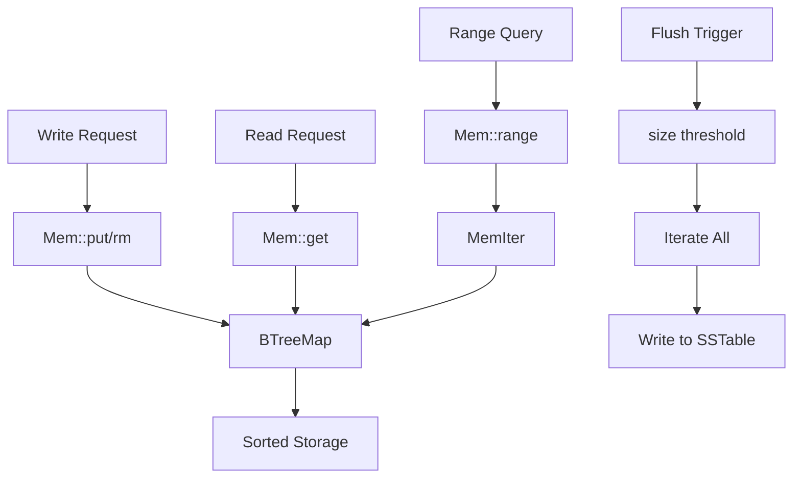

# jdb_mem : High-Performance In-Memory Table for LSM Storage Engine

## Table of Contents

- [Overview](#overview)
- [Features](#features)
- [Installation](#installation)
- [Usage](#usage)
- [API Reference](#api-reference)
- [Design](#design)
- [Tech Stack](#tech-stack)
- [Directory Structure](#directory-structure)
- [History](#history)

## Overview

`jdb_mem` is the memtable component of the jdb database engine. It provides sorted key-value storage in memory, serving as the write buffer before data is flushed to disk as SSTables.

Memtable is the first stop for all write operations in LSM-Tree based storage engines. It absorbs high-frequency writes and maintains keys in sorted order for efficient range queries and sequential disk writes.

## Features

- Sorted key-value storage with O(log n) operations
- Bidirectional iteration (forward and reverse)
- Range queries with flexible bounds
- Prefix scan support
- Tombstone markers for deletions
- Memory size tracking
- Zero-copy lazy iterators
- Arbitrary byte sequences as keys (including null bytes)

## Installation

Add to `Cargo.toml`:

```toml
[dependencies]
jdb_mem = "0.1"
```

## Usage

### Basic Operations

```rust
use std::ops::Bound;
use jdb_mem::Mem;
use jdb_base::Pos;
use jdb_base::table::{Table, TableMut};

// Create memtable with ID
let mut mem = Mem::new(1);

// Insert key-value pairs
mem.put(b"user:1".as_slice(), Pos::infile(1, 100, 10));
mem.put(b"user:2".as_slice(), Pos::infile(1, 200, 20));
mem.put(b"user:3".as_slice(), Pos::infile(1, 300, 30));

// Point lookup
if let Some(pos) = mem.get(b"user:1") {
  println!("offset: {}, len: {}", pos.offset(), pos.len());
}

// Delete (insert tombstone)
mem.rm(b"user:2".as_slice(), 1, 0);

// Check tombstone
let pos = mem.get(b"user:2").unwrap();
assert!(pos.is_tombstone());
```

### Iteration

```rust
use jdb_mem::Mem;
use jdb_base::Pos;
use jdb_base::table::{Table, TableMut};

let mut mem = Mem::new(1);
mem.put(b"c".as_slice(), Pos::infile(1, 300, 30));
mem.put(b"a".as_slice(), Pos::infile(1, 100, 10));
mem.put(b"b".as_slice(), Pos::infile(1, 200, 20));

// Forward iteration (sorted)
for (key, pos) in mem.iter() {
  println!("{:?} -> {:?}", key, pos);
}
// Output: a -> b -> c

// Reverse iteration
for (key, pos) in mem.iter().rev() {
  println!("{:?} -> {:?}", key, pos);
}
// Output: c -> b -> a
```

### Range Queries

```rust
use std::ops::Bound;
use jdb_mem::Mem;
use jdb_base::Pos;
use jdb_base::table::{Table, TableMut};

let mut mem = Mem::new(1);
mem.put(b"a".as_slice(), Pos::infile(1, 1, 1));
mem.put(b"b".as_slice(), Pos::infile(1, 2, 2));
mem.put(b"c".as_slice(), Pos::infile(1, 3, 3));
mem.put(b"d".as_slice(), Pos::infile(1, 4, 4));

// Range [b, d)
let items: Vec<_> = mem
  .range(
    Bound::Included(b"b".as_slice()),
    Bound::Excluded(b"d".as_slice()),
  )
  .collect();
// Result: [b, c]
```

### Prefix Scan

```rust
use jdb_mem::Mem;
use jdb_base::Pos;
use jdb_base::table::{Table, TableMut};

let mut mem = Mem::new(1);
mem.put(b"user:1".as_slice(), Pos::infile(1, 1, 1));
mem.put(b"user:2".as_slice(), Pos::infile(1, 2, 2));
mem.put(b"item:1".as_slice(), Pos::infile(1, 3, 3));

// Scan all keys with prefix "user:"
let users: Vec<_> = mem.prefix(b"user:").collect();
assert_eq!(users.len(), 2);
```

## API Reference

### Struct `Mem`

In-memory sorted key-value store.

| Method | Description |
|--------|-------------|
| `new(id: u64) -> Self` | Create memtable with ID |
| `id() -> u64` | Get memtable ID |
| `len() -> usize` | Get entry count |
| `is_empty() -> bool` | Check if empty |
| `size() -> u64` | Get approximate memory size in bytes |

### Trait `Table` (Read Operations)

| Method | Description |
|--------|-------------|
| `get(key: &[u8]) -> Option<Pos>` | Point lookup |
| `range(start, end) -> Iter` | Range query with bounds |
| `iter() -> Iter` | Full iteration |
| `prefix(prefix: &[u8]) -> Iter` | Prefix scan |

### Trait `TableMut` (Write Operations)

| Method | Description |
|--------|-------------|
| `put(key, pos: Pos)` | Insert or update |
| `rm(key, wal_id, offset)` | Delete (insert tombstone) |

### Struct `MemIter`

Bidirectional iterator for range queries. Implements `Iterator`, `DoubleEndedIterator`, and `FusedIterator`.

## Design

### Architecture



### Data Flow

1. Write operations call `put()` or `rm()`, inserting into `BTreeMap`
2. `BTreeMap` maintains lexicographic order automatically
3. Read operations perform O(log n) lookup
4. Range queries return lazy iterators wrapping `BTreeMap::Range`
5. When `size()` exceeds threshold, memtable is flushed to SSTable

### Why BTreeMap?

Radix trees (ART, etc.) offer better performance for string keys but have limitations:

- Cannot handle keys where one is prefix of another (e.g., `[0]` and `[0, 1]`)
- Some implementations panic on null bytes in keys

`BTreeMap` provides:

- Correct handling of all byte sequences
- Stable O(log n) operations
- Built-in sorted iteration
- No external dependencies

### Memory Tracking

Size is tracked approximately:

- New key: `size += key.len() + Pos::SIZE`
- Update existing key: size unchanged
- Delete: tombstone replaces value, size unchanged

This approximation is fast and sufficient for flush threshold decisions.

## Tech Stack

| Component | Technology |
|-----------|------------|
| Core Storage | `std::collections::BTreeMap` |
| Key Type | `hipstr::HipByt` (small string optimization) |
| Value Type | `jdb_base::Pos` (file position) |
| Traits | `jdb_base::table::{Table, TableMut}` |

## Directory Structure

```
jdb_mem/
├── Cargo.toml
├── src/
│   └── lib.rs        # Core implementation
├── tests/
│   └── main.rs       # Unit and property tests
└── readme/
    ├── en.md         # English documentation
    └── zh.md         # Chinese documentation
```

## History

The memtable concept originated from the LSM-Tree (Log-Structured Merge-Tree) paper by Patrick O'Neil et al. in 1996.

In 2006, Google published the Bigtable paper, introducing the terms "memtable" and "SSTable" to the industry. Bigtable's design influenced countless storage systems.

Jeff Dean and Sanjay Ghemawat, the legendary duo at Google, later created LevelDB in 2011, an open-source implementation of LSM storage. LevelDB's clean design became the foundation for RocksDB (Facebook, 2012), which powers systems like MySQL's MyRocks and TiKV.

The memtable serves as the "staging area" in this architecture. All writes land here first, sorted in memory, then flushed to immutable SSTables on disk. This write-optimized design trades read amplification for write throughput, making it ideal for write-heavy workloads.

Today, LSM-based storage engines power some of the world's largest databases: Cassandra, HBase, CockroachDB, and many more. The humble memtable remains at the heart of them all.
