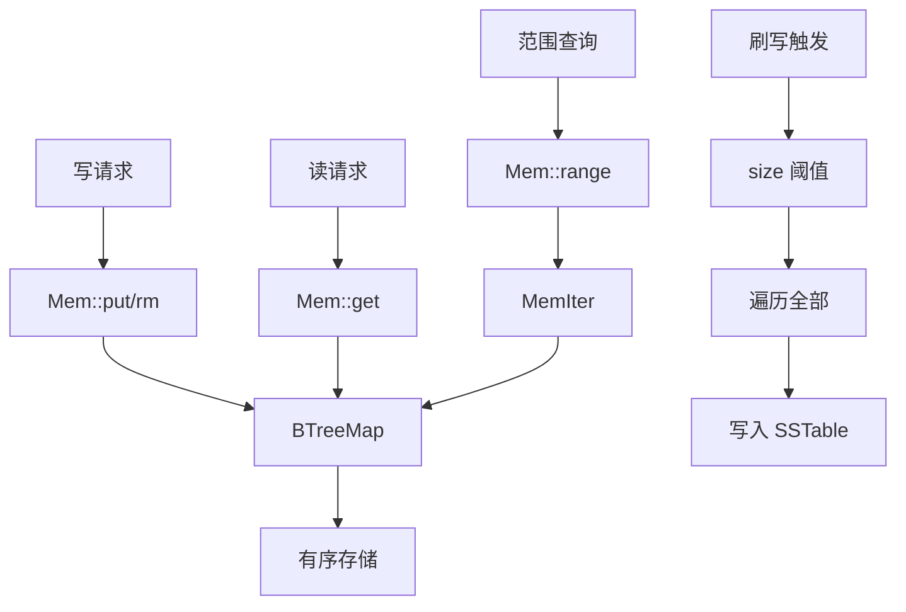

# jdb_mem : LSM 存储引擎的高性能内存表

## 目录

- [概述](#概述)
- [特性](#特性)
- [安装](#安装)
- [使用](#使用)
- [API 参考](#api-参考)
- [设计](#设计)
- [技术栈](#技术栈)
- [目录结构](#目录结构)
- [历史](#历史)

## 概述

`jdb_mem` 是 jdb 数据库引擎的内存表组件。提供内存中的有序键值存储，作为数据刷写到磁盘 SSTable 前的写缓冲区。

内存表是 LSM-Tree 存储引擎中所有写操作的第一站。它吸收高频写入，并保持键的有序性，以支持高效的范围查询和顺序磁盘写入。

## 特性

- 有序键值存储，O(log n) 操作复杂度
- 双向迭代（正向和反向）
- 灵活边界的范围查询
- 前缀扫描
- 删除标记（Tombstone）
- 内存大小追踪
- 零拷贝惰性迭代器
- 支持任意字节序列作为键（包括空字节）

## 安装

添加到 `Cargo.toml`：

```toml
[dependencies]
jdb_mem = "0.1"
```

## 使用

### 基本操作

```rust
use std::ops::Bound;
use jdb_mem::Mem;
use jdb_base::Pos;
use jdb_base::table::{Table, TableMut};

// 创建带 ID 的内存表
let mut mem = jdb_mem::mem::new(1);

// 插入键值对
mem.put(b"user:1".as_slice(), Pos::infile(1, 100, 10));
mem.put(b"user:2".as_slice(), Pos::infile(1, 200, 20));
mem.put(b"user:3".as_slice(), Pos::infile(1, 300, 30));

// 点查询
if let Some(pos) = mem.get(b"user:1") {
  println!("offset: {}, len: {}", pos.offset(), pos.len());
}

// 删除（插入墓碑标记）
mem.rm(b"user:2".as_slice(), 1, 0);

// 检查墓碑
let pos = mem.get(b"user:2").unwrap();
assert!(pos.is_tombstone());
```

### 迭代

```rust
use jdb_mem::Mem;
use jdb_base::Pos;
use jdb_base::table::{Table, TableMut};

let mut mem = jdb_mem::mem::new(1);
mem.put(b"c".as_slice(), Pos::infile(1, 300, 30));
mem.put(b"a".as_slice(), Pos::infile(1, 100, 10));
mem.put(b"b".as_slice(), Pos::infile(1, 200, 20));

// 正向迭代（有序）
for (key, pos) in mem.iter() {
  println!("{:?} -> {:?}", key, pos);
}
// 输出: a -> b -> c

// 反向迭代
for (key, pos) in mem.iter().rev() {
  println!("{:?} -> {:?}", key, pos);
}
// 输出: c -> b -> a
```

### 范围查询

```rust
use std::ops::Bound;
use jdb_mem::Mem;
use jdb_base::Pos;
use jdb_base::table::{Table, TableMut};

let mut mem = jdb_mem::mem::new(1);
mem.put(b"a".as_slice(), Pos::infile(1, 1, 1));
mem.put(b"b".as_slice(), Pos::infile(1, 2, 2));
mem.put(b"c".as_slice(), Pos::infile(1, 3, 3));
mem.put(b"d".as_slice(), Pos::infile(1, 4, 4));

// 范围 [b, d)
let items: Vec<_> = mem
  .range(
    Bound::Included(b"b".as_slice()),
    Bound::Excluded(b"d".as_slice()),
  )
  .collect();
// 结果: [b, c]
```

### 前缀扫描

```rust
use jdb_mem::Mem;
use jdb_base::Pos;
use jdb_base::table::{Table, TableMut};

let mut mem = jdb_mem::mem::new(1);
mem.put(b"user:1".as_slice(), Pos::infile(1, 1, 1));
mem.put(b"user:2".as_slice(), Pos::infile(1, 2, 2));
mem.put(b"item:1".as_slice(), Pos::infile(1, 3, 3));

// 扫描所有 "user:" 前缀的键
let users: Vec<_> = mem.prefix(b"user:").collect();
assert_eq!(users.len(), 2);
```

## API 参考

### 结构体 `Mem`

内存有序键值存储。

| 方法 | 描述 |
|------|------|
| `new(id: u64) -> Self` | 创建带 ID 的内存表 |
| `id() -> u64` | 获取内存表 ID |
| `len() -> usize` | 获取条目数量 |
| `is_empty() -> bool` | 检查是否为空 |
| `size() -> u64` | 获取近似内存大小（字节） |

### Trait `Table`（读操作）

| 方法 | 描述 |
|------|------|
| `get(key: &[u8]) -> Option<Pos>` | 点查询 |
| `range(start, end) -> Iter` | 带边界的范围查询 |
| `iter() -> Iter` | 全量迭代 |
| `prefix(prefix: &[u8]) -> Iter` | 前缀扫描 |

### Trait `TableMut`（写操作）

| 方法 | 描述 |
|------|------|
| `put(key, pos: Pos)` | 插入或更新 |
| `rm(key, wal_id, offset)` | 删除（插入墓碑标记） |

### 结构体 `MemIter`

范围查询的双向迭代器。实现 `Iterator`、`DoubleEndedIterator` 和 `FusedIterator`。

## 设计

### 架构



### 数据流

1. 写操作调用 `put()` 或 `rm()`，插入 `BTreeMap`
2. `BTreeMap` 自动维护字典序
3. 读操作执行 O(log n) 查找
4. 范围查询返回包装 `BTreeMap::Range` 的惰性迭代器
5. 当 `size()` 超过阈值时，内存表刷写到 SSTable

### 为什么选择 BTreeMap？

基数树（ART 等）对字符串键有更好的性能，但存在限制：

- 无法处理前缀关系的键（如 `[0]` 和 `[0, 1]`）
- 部分实现在键包含空字节时会 panic

`BTreeMap` 提供：

- 正确处理所有字节序列
- 稳定的 O(log n) 操作
- 内置有序迭代
- 无外部依赖

### 内存追踪

大小采用近似追踪：

- 新键：`size += key.len() + Pos::SIZE`
- 更新已有键：大小不变
- 删除：墓碑替换值，大小不变

这种近似方式快速且足以支持刷写阈值判断。

## 技术栈

| 组件 | 技术 |
|------|------|
| 核心存储 | `std::collections::BTreeMap` |
| 键类型 | `hipstr::HipByt`（小字符串优化） |
| 值类型 | `jdb_base::Pos`（文件位置） |
| Trait | `jdb_base::table::{Table, TableMut}` |

## 目录结构

```
jdb_mem/
├── Cargo.toml
├── src/
│   └── lib.rs        # 核心实现
├── tests/
│   └── main.rs       # 单元测试和属性测试
└── readme/
    ├── en.md         # 英文文档
    └── zh.md         # 中文文档
```

## 历史

内存表概念源自 Patrick O'Neil 等人于 1996 年发表的 LSM-Tree（日志结构合并树）论文。

2006 年，Google 发表 Bigtable 论文，向业界引入了 "memtable" 和 "SSTable" 术语。Bigtable 的设计影响了无数存储系统。

Jeff Dean 和 Sanjay Ghemawat，Google 的传奇双人组，于 2011 年创建了 LevelDB，这是 LSM 存储的开源实现。LevelDB 简洁的设计成为 RocksDB（Facebook，2012）的基础，后者驱动着 MySQL 的 MyRocks 和 TiKV 等系统。

内存表在这一架构中充当"暂存区"。所有写入首先落在这里，在内存中排序，然后刷写到磁盘上的不可变 SSTable。这种写优化设计以读放大换取写吞吐量，非常适合写密集型工作负载。

如今，基于 LSM 的存储引擎驱动着世界上最大的数据库：Cassandra、HBase、CockroachDB 等。朴素的内存表始终是它们的核心。
