[English](n) | [中文](#zh)

---

<a id="en"></a>


# jdb_pgm : Ultra-fast Learned Index for Sorted Keys

> A highly optimized, single-threaded Rust implementation of the Pgm-index (Piecewise Geometric Model index), designed for ultra-low latency lookups and minimal memory overhead.


- [Introduction](#introduction)
- [Usage](#usage)
- [Performance](#performance)
- [Features](#features)
- [Design](#design)
- [Technology Stack](#technology-stack)
- [Directory Structure](#directory-structure)
- [API Reference](#api-reference)
- [History](#history)

---

## Introduction

`jdb_pgm` is a specialized reimplementation of the Pgm-index data structure. It approximates the distribution of sorted keys using piecewise linear models, enabling search operations with **O(log ε)** complexity.

This crate focuses on **single-threaded performance**, preparing for a "one thread per CPU" architecture. By removing concurrency overhead and optimizing memory layout (e.g., SIMD-friendly loops), it achieves statistically significant speedups over standard binary search and traditional tree-based indexes.

## Usage

Add this to your `Cargo.toml`:

```toml
[dependencies]
jdb_pgm = "0.3.3"
```

### Basic Example

```rust
use jdb_pgm::PgmIndex;

fn main() {
  // 1. Prepare sorted data
  let data: Vec<u64> = (0..1_000_000).collect();

  // 2. Build the index
  // epsilon=32, check_sorted=true
  let index = PgmIndex::load(data, 32, true).unwrap();

  // 3. Query
  if let Some(pos) = index.get(123_456) {
    println!("Found at index: {}", pos);
  } else {
    println!("Not found");
  }
}
```

## Performance

Based on internal benchmarks with 1,000,000 `u64` keys:

*   **~2.3x Faster** than standard Binary Search.
*   **~1.2x - 1.4x Faster** than [pgm_index](https://crates.io/crates/pgm_index).
*   **~4.7x Faster** than BTreeMap.
*   **~2x Faster** than HashMap.
*   **0.3% Memory Overhead** (approx) for `ε=32`.

## 🆚 Comparison with `pgm_index`

This crate (`jdb_pgm`) is a specialized fork/rewrite of the original concept found in [`pgm_index`](https://crates.io/crates/pgm_index). While the original library aims for general-purpose usage with multi-threading support (Rayon), `jdb_pgm` takes a different approach:

### Key Differences Summary

| Feature | jdb_pgm | pgm_index |
|---------|---------------|-----------|
| Threading | Single-threaded | Multi-threaded (Rayon) |
| Segment Building | Shrinking Cone O(N) | Parallel Least Squares |
| Prediction Model | `slope * key + intercept` | `(key - intercept) / slope` |
| Prediction Accuracy | ε-bounded (guaranteed) | Heuristic (not guaranteed) |
| Memory | Arc-free, zero-copy | Arc<Vec<K>> wrapper |
| Dependencies | Minimal | rayon, num_cpus, num-traits |

### 1. Architectural Shift: Single-Threaded by Design
The original `pgm_index` introduces Rayon for parallel processing. However, in modern high-performance databases (like ScyllaDB or specialized engines), the **thread-per-core** architecture is often superior.
*   **One Thread, One CPU**: We removed all locking, synchronization, and thread-pool overhead.
*   **Deterministic Latency**: Without thread scheduling jitter, p99 latencies are significantly more stable.

### 2. Segment Building Algorithm

**jdb_pgm: Shrinking Cone (Optimal PLA)**
```
// O(N) streaming algorithm with guaranteed ε-bound
while end < n {
  slope_lo = (idx - first_idx - ε) / dx
  slope_hi = (idx - first_idx + ε) / dx
  if min_slope > max_slope: break  // cone collapsed
  // Update shrinking cone bounds
}
slope = (min_slope + max_slope) / 2
```

**pgm_index: Parallel Least Squares**
```
// Divides data into fixed chunks, fits each with least squares
target_segments = optimal_segment_count_adaptive(data, epsilon)
segments = (0..target_segments).par_iter().map(|i| {
  fit_segment(&data[start..end], start)  // least squares fit
}).collect()
```

The shrinking cone algorithm guarantees that prediction error never exceeds ε, while least squares fitting provides no such guarantee.

### 3. Prediction Formula

**jdb_pgm**: `pos = slope * key + intercept`
- Direct forward prediction
- Uses FMA (Fused Multiply-Add) for precision

**pgm_index**: `pos = (key - intercept) / slope`
- Inverse formula (solving for x given y)
- Division is slower than multiplication
- Risk of division by zero when slope ≈ 0

### 4. Prediction Accuracy Comparison

Due to the algorithmic differences, jdb_pgm achieves significantly better prediction accuracy:

| Data Size | Epsilon | jdb_pgm (Max Error) | jdb_pgm (Avg Error) | pgm_index (Max Error) | pgm_index (Avg Error) |
|-----------|---------|---------------------|---------------------|----------------------|----------------------|
| 1,000,000 | 32 | 32 | 11.29 | 891 | 326.85 |
| 1,000,000 | 64 | 64 | 22.54 | 891 | 326.85 |
| 1,000,000 | 128 | 128 | 46.44 | 891 | 326.85 |

*Note: pgm_index doesn't expose `predict_pos()`, so we measure using linear interpolation as baseline. The actual Pgm prediction may differ.*

### 5. Core Implementation Upgrades
While based on the same Pgm theory, our implementation details are significantly more aggressive:
*   **Eliminating Float Overhead**: We replaced expensive floating-point rounding operations (`round/floor`) with bitwise-based integer casting (`as isize + 0.5`), bringing a qualitative leap in instruction cycles.
*   **Transparent to Compiler**: The core loops are refactored to remove dependencies that block LLVM's auto-vectorization, generating AVX2/AVX-512 instructions without manual `intrinsic` code.
*   **Reducing Branch Misprediction**: We rewrote the `predict` and `search` phases with manual clamping and branchless logic, drastically reducing pipeline stalls.

### 6. Allocation Strategy
*   **Heuristic Pre-allocation**: The build process estimates segment count `(N / 2ε)` ahead of time, effectively eliminating vector reallocations during construction.
*   **Zero-Copy**: Keys (especially integers) are handled without unnecessary cloning.

## Features

*   **Single-Threaded Optimization**: Tuned for maximum throughput on a dedicated core.
*   **Zero-Copy Key Support**: Supports `u8`, `u16`, `u32`, `u64`, `i8`, `i16`, `i32`, `i64`.
*   **Predictable Error Bounds**: The `epsilon` parameter strictly controls the search range.
*   **Vectorized Sorting Check**: Uses SIMD-friendly sliding windows for validation.

## Design

The index construction and lookup process allows for extremely fast predictions of key positions.


1.  **Construction**: The dataset is scanned to create Piecewise Linear Models (segments) that approximate the key distribution within an error `ε`.
2.  **Lookup Table**: A secondary structure (LUT) allows O(1) access to the correct segment.
3.  **Query**:
    *   Find the relevant segment using the key.
    *   Predict the approximate position using the linear model `slope * key + intercept`.
    *   Perform a small binary search within the error bound `[pos - ε, pos + ε]`.

## Technology Stack

*   **Core**: Rust (Edition 2024)
*   **Algorithm**: Pgm-Index (Piecewise Geometric Model)
*   **Testing**: `aok`, `static_init`, `criterion` (for benchmarks)

## Directory Structure

```text
jdb_pgm/
├── src/
│   ├── lib.rs          # Exports and entry point
│   ├── pgm_index.rs    # Core PgmIndex struct and logic
│   └── pgm/            # Internal modules (build, search, types)
├── tests/              # Integration tests
├── benches/            # Criterion benchmarks
└── examples/           # Usage examples
```

## API Reference

### `PgmIndex<K>`

*   `load(data: Vec<K>, epsilon: usize, check_sorted: bool) -> Result<Self>`
    Constructs the index. `epsilon` controls the size/speed trade-off (typical values: 16-64).

*   `get(key: K) -> Option<usize>`
    Returns the index of the key if found, or `None`.

*   `get_many(keys: I) -> Iterator`
    Returns an iterator of results for batch lookups.

*   `stats() -> PgmStats`
    Returns internal statistics like segment count and memory usage.

## History

In the era of "Big Data," traditional B-Trees became a bottleneck due to their memory consumption and cache inefficiency. In 2020, Paolo Ferragina and Giorgio Vinciguerra introduced the **Piecewise Geometric Model (Pgm) index**. Their key insight was simple yet revolutionary: why store every key when the data's distribution often follows a predictable pattern?

By treating the index as a machine learning problem—learning the CDF of the data—they reduced the index size by orders of magnitude while maintaining O(log N) worst-case performance. This project, `jdb_pgm`, takes that concept and strips it down to its bare metal essentials for Rust, prioritizing raw speed on modern CPUs where every nanosecond counts.

## Bench

## Pgm-Index Benchmark

Performance comparison of Pgm-Index vs Binary Search with different epsilon values.

### Data Size: 1,000,000

| Algorithm | Epsilon | Mean Time | Std Dev | Throughput | Memory |
|-----------|---------|-----------|---------|------------|--------|
| jdb_pgm | 32 | 19.91ns | 66.98ns | 50.23M/s | 9.01 MB |
| jdb_pgm | 64 | 20.46ns | 71.18ns | 48.87M/s | 8.50 MB |
| jdb_pgm | 128 | 22.18ns | 72.06ns | 45.09M/s | 8.25 MB |
| pgm_index | 32 | 26.82ns | 190.03ns | 37.29M/s | 8.35 MB |
| pgm_index | 64 | 28.76ns | 83.53ns | 34.77M/s | 8.34 MB |
| pgm_index | 128 | 31.13ns | 82.36ns | 32.12M/s | 8.04 MB |
| Binary Search | null | 44.97ns | 117.01ns | 22.24M/s | - |
| HashMap | null | 46.13ns | 101.80ns | 21.68M/s | 40.00 MB |
| BTreeMap | null | 99.45ns | 155.36ns | 10.06M/s | 16.86 MB |

### Accuracy Comparison: jdb_pgm vs pgm_index

| Data Size | Epsilon | jdb_pgm (Max) | jdb_pgm (Avg) | pgm_index (Max) | pgm_index (Avg) |
|-----------|---------|---------------|---------------|-----------------|------------------|
| 1,000,000 | 128 | 128 | 46.44 | 891 | 326.85 |
| 1,000,000 | 32 | 32 | 11.29 | 891 | 326.85 |
| 1,000,000 | 64 | 64 | 22.54 | 891 | 326.85 |
### Build Time Comparison: jdb_pgm vs pgm_index

| Data Size | Epsilon | jdb_pgm (Time) | pgm_index (Time) | Speedup |
|-----------|---------|---------------------|-----------------|---------|
| 1,000,000 | 128 | 2.10ms | 1.21ms | 0.57x |
| 1,000,000 | 32 | 2.04ms | 1.18ms | 0.58x |
| 1,000,000 | 64 | 2.06ms | 1.28ms | 0.62x |
### Configuration
Query Count: 1500000
Data Sizes: 10,000, 100,000, 1,000,000
Epsilon Values: 32, 64, 128


---

### Epsilon (ε) Explained

*Epsilon (ε) controls the accuracy-speed trade-off:*

*Mathematical definition: ε defines the maximum absolute error between the predicted position and the actual position in the data array. When calling `load(data, epsilon, ...)`, ε guarantees |pred - actual| ≤ ε, where positions are indices within the data array of length `data.len()`.*

*Example: For 1M elements with ε=32, if the actual key is at position 1000:*
- ε=32 predicts position between 968-1032, then checks up to 64 elements
- ε=128 predicts position between 872-1128, then checks up to 256 elements


### Notes
#### What is Pgm-Index?
Pgm-Index (Piecewise Geometric Model Index) is a learned index structure that approximates the distribution of keys with piecewise linear models.
It provides O(log ε) search time with guaranteed error bounds, where ε controls the trade-off between memory and speed.

#### Why Compare with Binary Search?
Binary search is the baseline for sorted array lookup. Pgm-Index aims to:
- Match or exceed binary search performance
- Reduce memory overhead compared to traditional indexes
- Provide better cache locality for large datasets

#### Environment
- OS: macOS 26.1 (arm64)
- CPU: Apple M2 Max
- Cores: 12
- Memory: 64.0GB
- Rust: rustc 1.94.0-nightly (8d670b93d 2025-12-31)

#### References
- [Pgm-Index Paper](https://doi.org/10.1145/3373718.3394764)
- [Official Pgm-Index Site](https://pgm.di.unipi.it/)
- [Learned Indexes](https://arxiv.org/abs/1712.01208)

---

## About

This project is an open-source component of [js0.site ⋅ Refactoring the Internet Plan](https://js0.site).

We are redefining the development paradigm of the Internet in a componentized way. Welcome to follow us:

* [Google Group](https://groups.google.com/g/js0-site)
* [js0site.bsky.social](https://bsky.app/profile/js0site.bsky.social)

---

<a id="zh"></a>

# jdb_pgm : 面向排序键的超快学习型索引

> 一个经过高度优化的 Rust 版 Pgm 索引（分段几何模型索引）单线程实现，专为超低延迟查找和极小的内存开销而设计。


- [简介](#简介)
- [使用方法](#使用方法)
- [性能](#性能)
- [与 pgm_index 的对比](#与-pgm_index-的对比)
- [特性](#特性)
- [设计](#设计)
- [技术栈](#技术栈)
- [目录结构](#目录结构)
- [API 参考](#api-参考)
- [历史背景](#历史背景)

---

## 简介

`jdb_pgm` 是 Pgm-index 数据结构的专用重构版本。它使用分段线性模型近似排序键的分布，从而实现 **O(log ε)** 复杂度的搜索操作。

本 crate 专注于 **单线程性能**，为“一线程一核 (One Thread Per CPU)”的架构做准备。通过移除并发开销并优化内存布局（如 SIMD 友好的循环），与标准二分查找和传统树状索引相比，它实现了具有统计意义的显著速度提升。

## 使用方法

在 `Cargo.toml` 中添加依赖：

```toml
[dependencies]
jdb_pgm = "0.3.3"
```

### 基础示例

```rust
use jdb_pgm::PgmIndex;

fn main() {
  // 1. 准备已排序数据
  let data: Vec<u64> = (0..1_000_000).collect();

  // 2. 构建索引
  // epsilon=32, check_sorted=true
  let index = PgmIndex::load(data, 32, true).unwrap();

  // 3. 查询
  if let Some(pos) = index.get(123_456) {
    println!("Found at index: {}", pos);
  } else {
    println!("Not found");
  }
}
```

## 性能

基于 1,000,000 个 `u64` 键的内部基准测试：

*   比标准二分查找 **快 ~2.3 倍**。
*   比 [pgm_index](https://crates.io/crates/pgm_index) **快 ~1.2 - 1.4 倍**。
*   比 BTreeMap **快 ~4.7 倍**。
*   比 HashMap **快 ~2 倍**。
*   在 `ε=32` 时，内存开销仅为 **0.3%** 左右。

## 🆚 与 `pgm_index` 的对比

本 crate (`jdb_pgm`) 是原版 [`pgm_index`](https://crates.io/crates/pgm_index) 概念的一个专用分叉/重写版本。原版库旨在通用并支持多线程（Rayon），而 `jdb_pgm` 采取了截然不同的优化路径：

### 核心差异总结

| 特性 | jdb_pgm | pgm_index |
|------|---------------|-----------|
| 线程模型 | 单线程 | 多线程 (Rayon) |
| 段构建算法 | 收缩锥 O(N) | 并行最小二乘法 |
| 预测公式 | `slope * key + intercept` | `(key - intercept) / slope` |
| 预测精度 | ε 有界（保证） | 启发式（无保证） |
| 内存 | 无 Arc，零拷贝 | Arc<Vec<K>> 包装 |
| 依赖 | 最小化 | rayon, num_cpus, num-traits |

### 1. 架构转型：原生单线程设计
原版 `pgm_index` 引入了 Rayon 进行并行处理。然而，在现代高性能数据库（如 ScyllaDB 或专用引擎）中，**线程绑定核心 (Thread-per-Core)** 架构往往更具优势。
*   **一线程一 CPU**：我们移除了所有的锁、同步原语和线程池开销。
*   **确定的延迟**：没有了线程调度的抖动，p99 延迟显著更加稳定。

### 2. 段构建算法

**jdb_pgm: 收缩锥算法 (Optimal PLA)**
```
// O(N) 流式算法，保证 ε 有界
while end < n {
  slope_lo = (idx - first_idx - ε) / dx
  slope_hi = (idx - first_idx + ε) / dx
  if min_slope > max_slope: break  // 锥体收缩至崩塌
  // 更新收缩锥边界
}
slope = (min_slope + max_slope) / 2
```

**pgm_index: 并行最小二乘法**
```
// 将数据分成固定块，对每块进行最小二乘拟合
target_segments = optimal_segment_count_adaptive(data, epsilon)
segments = (0..target_segments).par_iter().map(|i| {
  fit_segment(&data[start..end], start)  // 最小二乘拟合
}).collect()
```

收缩锥算法保证预测误差永远不超过 ε，而最小二乘拟合无法提供这种保证。

### 3. 预测公式

**jdb_pgm**: `pos = slope * key + intercept`
- 直接正向预测
- 使用 FMA（融合乘加）提高精度

**pgm_index**: `pos = (key - intercept) / slope`
- 逆向公式（给定 y 求 x）
- 除法比乘法慢
- 当 slope ≈ 0 时有除零风险

### 4. 预测精度对比

由于算法差异，jdb_pgm 实现了显著更好的预测精度：

| 数据大小 | Epsilon | jdb_pgm (最大误差) | jdb_pgm (平均误差) | pgm_index (最大误差) | pgm_index (平均误差) |
|----------|---------|-------------------|-------------------|---------------------|---------------------|
| 1,000,000 | 32 | 32 | 11.29 | 891 | 326.85 |
| 1,000,000 | 64 | 64 | 22.54 | 891 | 326.85 |
| 1,000,000 | 128 | 128 | 46.44 | 891 | 326.85 |

*注：pgm_index 不暴露 `predict_pos()`，因此我们使用线性插值作为基准测量。实际 Pgm 预测可能有所不同。*

### 5. 核心算法实现升级
虽然基于相同的 Pgm 理论，但在**具体代码实现**层面上，我们的算法更加激进：
*   **消除浮点开销**：我们将所有昂贵的浮点取整操作 (`round/floor`) 替换为基于位操作的整数转换 (`as isize + 0.5`)，这在指令周期层面带来了质的飞跃。
*   **对编译器透明**：核心循环结构经过重构，移除了阻碍 LLVM 自动向量化的依赖，无需编写 `intrinsic` 代码即可生成 AVX2/AVX-512 指令。
*   **减少分支预测失败**：通过手动 clamp 和无分支逻辑重写了 `predict` 和 `search` 阶段，大幅降低了流水线停顿。

### 6. 分配策略
*   **启发式预分配**：构建过程会提前估算段的数量 `(N / 2ε)`，有效消除了构建过程中的向量重分配 (Reallocation)。
*   **零拷贝**：键（尤其是整数）的处理避免了不必要的克隆。

## 特性

*   **单线程优化**：针对专用核心的吞吐量进行了极致调优。
*   **零拷贝支持**：支持 `u8`, `u16`, `u32`, `u64`, `i8`, `i16`, `i32`, `i64`。
*   **可预测的误差界限**：`epsilon` 参数严格控制搜索范围。
*   **向量化排序检查**：使用 SIMD 友好的滑动窗口进行验证。

## 设计

索引构建和查找过程允许极快地预测键的位置。

```mermaid
graph TD
    subgraph Construction [构建]
    A[已排序数据] -->|build_segments| B[线性段模型]
    B -->|build_lut| C[查找表 LUT]
    end

    subgraph Query [查询]
    Q[搜索键] -->|find_seg| S[选择段]
    S -->|predict| P[近似位置]
    P -->|binary_search| F[最终位置]
    end

    C -.-> S
    B -.-> S
```



1.  **构建**: 扫描数据集以创建分段线性模型（Segments），在误差 `ε` 内近似键的分布。
2.  **查找表**: 一个辅助结构（LUT）允许以 O(1) 的时间找到正确的段。
3.  **查询**:
    *   使用键找到对应的段。
    *   使用线性模型 `slope * key + intercept` 预测近似位置。
    *   在误差范围 `[pos - ε, pos + ε]` 内执行小范围二分查找。

## 技术栈

*   **核心**: Rust (Edition 2024)
*   **算法**: Pgm-Index (分段几何模型)
*   **测试**: `aok`, `static_init`, `criterion` (用于基准测试)

## 目录结构

```text
jdb_pgm/
├── src/
│   ├── lib.rs          # 导出和入口点
│   ├── pgm_index.rs    # 核心 PgmIndex 结构体和逻辑
│   └── pgm/            # 内部模块 (build, search, types)
├── tests/              # 集成测试
├── benches/            # Criterion 基准测试
└── examples/           # 使用示例
```

## API 参考

### `PgmIndex<K>`

*   `load(data: Vec<K>, epsilon: usize, check_sorted: bool) -> Result<Self>`
    构建索引。`epsilon` 控制大小/速度的权衡（典型值：16-64）。

*   `get(key: K) -> Option<usize>`
    如果找到，返回键的索引；否则返回 `None`。

*   `get_many(keys: I) -> Iterator`
    返回批量查找的结果迭代器。

*   `stats() -> PgmStats`
    返回内部统计信息，如段数和内存使用情况。

## 历史背景

在“大数据”时代，传统的 B-Tree 由于其内存消耗和缓存效率低逐渐成为瓶颈。2020 年，Paolo Ferragina 和 Giorgio Vinciguerra 提出了 **分段几何模型 (Pgm) 索引**。他们的核心见解简单而具有革命性：如果数据分布通常遵循可预测的模式，为什么还要存储每个键呢？

通过将索引视为一个机器学习问题——学习数据的 CDF（累积分布函数）——他们在保持 O(log N) 最坏情况性能的同时，将索引大小减少了几个数量级。本项目 `jdb_pgm` 借鉴了这一概念，并将其剥离至最本质的 Rust 实现，在每一纳秒都至关重要的现代 CPU 上优先考虑原始速度。

## 评测

## Pgm 索引评测

Pgm-Index 与二分查找在不同 epsilon 值下的性能对比。

### 数据大小: 1,000,000

| 算法 | Epsilon | 平均时间 | 标准差 | 吞吐量 | 内存 |
|------|---------|----------|--------|--------|------|
| jdb_pgm | 32 | 19.91ns | 66.98ns | 50.23M/s | 9.01 MB |
| jdb_pgm | 64 | 20.46ns | 71.18ns | 48.87M/s | 8.50 MB |
| jdb_pgm | 128 | 22.18ns | 72.06ns | 45.09M/s | 8.25 MB |
| pgm_index | 32 | 26.82ns | 190.03ns | 37.29M/s | 8.35 MB |
| pgm_index | 64 | 28.76ns | 83.53ns | 34.77M/s | 8.34 MB |
| pgm_index | 128 | 31.13ns | 82.36ns | 32.12M/s | 8.04 MB |
| 二分查找 | null | 44.97ns | 117.01ns | 22.24M/s | - |
| HashMap | null | 46.13ns | 101.80ns | 21.68M/s | 40.00 MB |
| BTreeMap | null | 99.45ns | 155.36ns | 10.06M/s | 16.86 MB |

### 精度对比: jdb_pgm vs pgm_index

| 数据大小 | Epsilon | jdb_pgm (最大) | jdb_pgm (平均) | pgm_index (最大) | pgm_index (平均) |
|----------|---------|----------------|----------------|------------------|-------------------|
| 1,000,000 | 128 | 128 | 46.44 | 891 | 326.85 |
| 1,000,000 | 32 | 32 | 11.29 | 891 | 326.85 |
| 1,000,000 | 64 | 64 | 22.54 | 891 | 326.85 |
### 构建时间对比: jdb_pgm vs pgm_index

| 数据大小 | Epsilon | jdb_pgm (时间) | pgm_index (时间) | 加速比 |
|----------|---------|---------------------|-----------------|--------|
| 1,000,000 | 128 | 2.10ms | 1.21ms | 0.57x |
| 1,000,000 | 32 | 2.04ms | 1.18ms | 0.58x |
| 1,000,000 | 64 | 2.06ms | 1.28ms | 0.62x |
### 配置
查询次数: 1500000
数据大小: 10,000, 100,000, 1,000,000
Epsilon 值: 32, 64, 128


---

### Epsilon (ε) 说明

*Epsilon (ε) 控制精度与速度的权衡：*

*数学定义：ε 定义了预测位置与实际位置在数据数组中的最大绝对误差。调用 `load(data, epsilon, ...)` 时，ε 保证 |pred - actual| ≤ ε，其中位置是长度为 `data.len()` 的数据数组中的索引。*

*举例说明：对于 100 万个元素，ε=32 时，如果实际键在位置 1000：*
- ε=32 预测位置在 968-1032 之间，然后检查最多 64 个元素
- ε=128 预测位置在 872-1128 之间，然后检查最多 256 个元素


### 备注
#### 什么是 Pgm-Index?
Pgm-Index（分段几何模型索引）是一种学习型索引结构，使用分段线性模型近似键的分布。
它提供 O(log ε) 的搜索时间，并保证误差边界，其中 ε 控制内存和速度之间的权衡。

#### 为什么与二分查找对比?
二分查找是已排序数组查找的基准。Pgm-Index 旨在：
- 匹配或超过二分查找的性能
- 相比传统索引减少内存开销
- 为大数据集提供更好的缓存局部性

#### 环境
- 系统: macOS 26.1 (arm64)
- CPU: Apple M2 Max
- 核心数: 12
- 内存: 64.0GB
- Rust版本: rustc 1.94.0-nightly (8d670b93d 2025-12-31)

#### 参考
- [Pgm-Index 论文](https://doi.org/10.1145/3373718.3394764)
- [Pgm-Index 官方网站](https://pgm.di.unipi.it/)
- [学习型索引](https://arxiv.org/abs/1712.01208)

---

## 关于

本项目为 [js0.site ⋅ 重构互联网计划](https://js0.site) 的开源组件。

我们正在以组件化的方式重新定义互联网的开发范式，欢迎关注：

* [谷歌邮件列表](https://groups.google.com/g/js0-site)
* [js0site.bsky.social](https://bsky.app/profile/js0site.bsky.social)
