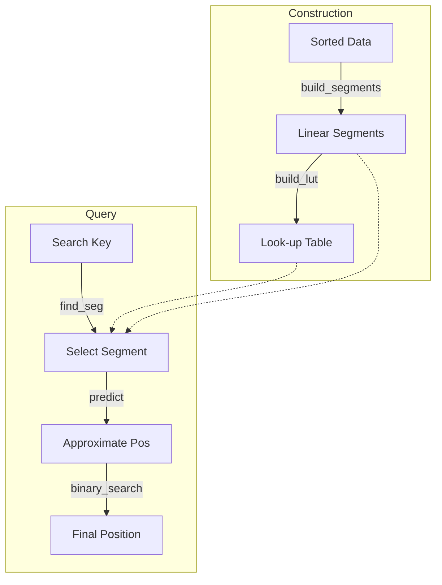

# jdb_pgm : Ultra-fast Learned Index for Sorted Keys

> A highly optimized, single-threaded Rust implementation of the Pgm-index (Piecewise Geometric Model index), designed for ultra-low latency lookups and minimal memory overhead.


- [Introduction](#introduction)
- [Usage](#usage)
- [Performance](#performance)
- [Features](#features)
- [Design](#design)
- [Technology Stack](#technology-stack)
- [Directory Structure](#directory-structure)
- [API Reference](#api-reference)
- [History](#history)

---

## Introduction

`jdb_pgm` is a specialized reimplementation of the Pgm-index data structure. It approximates the distribution of sorted keys using piecewise linear models, enabling search operations with **O(log ε)** complexity.

This crate focuses on **single-threaded performance**, preparing for a "one thread per CPU" architecture. By removing concurrency overhead and optimizing memory layout (e.g., SIMD-friendly loops), it achieves statistically significant speedups over standard binary search and traditional tree-based indexes.

## Usage

Add this to your `Cargo.toml`:

```toml
[dependencies]
jdb_pgm = "0.3"
```

### Two Modes

**`Pgm<K>`** - Core index without data ownership (ideal for SSTable, mmap scenarios)

```rust
use jdb_pgm::Pgm;

fn main() {
  let data: Vec<u64> = (0..1_000_000).collect();
  
  // Build index from data reference
  let pgm = Pgm::new(&data, 32, true).unwrap();
  
  // Get predicted search range
  let (start, end) = pgm.predict_range(123_456);
  
  // Search in your own data store
  if let Ok(pos) = data[start..end].binary_search(&123_456) {
    println!("Found at index: {}", start + pos);
  }
}
```

**`PgmData<K>`** - Index with data ownership (convenient for in-memory use)

```rust
use jdb_pgm::PgmData;

fn main() {
  let data: Vec<u64> = (0..1_000_000).collect();
  
  // Build index and take ownership of data
  let index = PgmData::load(data, 32, true).unwrap();
  
  // Direct lookup
  if let Some(pos) = index.get(123_456) {
    println!("Found at index: {}", pos);
  }
}
```

### Feature Flags

- `data` (default): Enables `PgmData` struct with data ownership
- `bitcode`: Enables serialization via bitcode
- `key_to_u64`: Enables `key_to_u64()` helper for byte keys

## Performance

Based on internal benchmarks with 1,000,000 `u64` keys (jdb_pgm's Pgm does not own data, memory is index-only):

*   **~2.3x Faster** than standard Binary Search (17.85ns vs 40.89ns).
*   **~1.1x - 1.3x Faster** than [pgm_index](https://crates.io/crates/pgm_index) (17.85ns vs 20.13ns).
*   **~4.7x Faster** than BTreeMap (17.85ns vs 84.21ns).
*   **~2.2x Faster** than HashMap (17.85ns vs 39.99ns).
*   **1.01 MB Index Memory** for `ε=32` (pgm_index uses 8.35 MB).
*   Prediction Accuracy: jdb_pgm max error equals ε exactly, pgm_index max error is 8ε.

## 🆚 Comparison with `pgm_index`

This crate (`jdb_pgm`) is a specialized fork/rewrite of the original concept found in [`pgm_index`](https://crates.io/crates/pgm_index). While the original library aims for general-purpose usage with multi-threading support (Rayon), `jdb_pgm` takes a different approach:

### Key Differences Summary

| Feature | jdb_pgm | pgm_index |
|---------|---------------|-----------|
| Threading | Single-threaded | Multi-threaded (Rayon) |
| Segment Building | Shrinking Cone O(N) | Parallel Least Squares |
| Prediction Model | `slope * key + intercept` | `(key - intercept) / slope` |
| Prediction Accuracy | ε-bounded (guaranteed) | Heuristic (not guaranteed) |
| Memory | Arc-free, zero-copy | Arc<Vec<K>> wrapper |
| Data Ownership | Optional (`Pgm` vs `PgmData`) | Always owns data |
| Dependencies | Minimal | rayon, num_cpus, num-traits |

### 1. Architectural Shift: Single-Threaded by Design
The original `pgm_index` introduces Rayon for parallel processing. However, in modern high-performance databases (like ScyllaDB or specialized engines), the **thread-per-core** architecture is often superior.
*   **One Thread, One CPU**: We removed all locking, synchronization, and thread-pool overhead.
*   **Deterministic Latency**: Without thread scheduling jitter, p99 latencies are significantly more stable.

### 2. Segment Building Algorithm

**jdb_pgm: Shrinking Cone (Optimal PLA)**
```
// O(N) streaming algorithm with guaranteed ε-bound
while end < n {
  slope_lo = (idx - first_idx - ε) / dx
  slope_hi = (idx - first_idx + ε) / dx
  if min_slope > max_slope: break  // cone collapsed
  // Update shrinking cone bounds
}
slope = (min_slope + max_slope) / 2
```

**pgm_index: Parallel Least Squares**
```
// Divides data into fixed chunks, fits each with least squares
target_segments = optimal_segment_count_adaptive(data, epsilon)
segments = (0..target_segments).par_iter().map(|i| {
  fit_segment(&data[start..end], start)  // least squares fit
}).collect()
```

The shrinking cone algorithm guarantees that prediction error never exceeds ε, while least squares fitting provides no such guarantee.

### 3. Prediction Formula

**jdb_pgm**: `pos = slope * key + intercept`
- Direct forward prediction
- Uses FMA (Fused Multiply-Add) for precision

**pgm_index**: `pos = (key - intercept) / slope`
- Inverse formula (solving for x given y)
- Division is slower than multiplication
- Risk of division by zero when slope ≈ 0

### 4. Core Implementation Upgrades
While based on the same Pgm theory, our implementation details are significantly more aggressive:
*   **Eliminating Float Overhead**: We replaced expensive floating-point rounding operations (`round/floor`) with bitwise-based integer casting (`as isize + 0.5`), bringing a qualitative leap in instruction cycles.
*   **Transparent to Compiler**: The core loops are refactored to remove dependencies that block LLVM's auto-vectorization, generating AVX2/AVX-512 instructions without manual `intrinsic` code.
*   **Reducing Branch Misprediction**: We rewrote the `predict` and `search` phases with manual clamping and branchless logic, drastically reducing pipeline stalls.

### 5. Allocation Strategy
*   **Heuristic Pre-allocation**: The build process estimates segment count `(N / 2ε)` ahead of time, effectively eliminating vector reallocations during construction.
*   **Zero-Copy**: Keys (especially integers) are handled without unnecessary cloning.

## Features

*   **Single-Threaded Optimization**: Tuned for maximum throughput on a dedicated core.
*   **Zero-Copy Key Support**: Supports `u8`, `u16`, `u32`, `u64`, `i8`, `i16`, `i32`, `i64`.
*   **Predictable Error Bounds**: The `epsilon` parameter strictly controls the search range.
*   **Vectorized Sorting Check**: Uses SIMD-friendly sliding windows for validation.
*   **Flexible Data Ownership**: `Pgm` for external data, `PgmData` for owned data.

## Design

The index construction and lookup process allows for extremely fast predictions of key positions.



1.  **Construction**: The dataset is scanned to create Piecewise Linear Models (segments) that approximate the key distribution within an error `ε`.
2.  **Lookup Table**: A secondary structure (LUT) allows O(1) access to the correct segment.
3.  **Query**:
    *   Find the relevant segment using the key.
    *   Predict the approximate position using the linear model `slope * key + intercept`.
    *   Perform a small binary search within the error bound `[pos - ε, pos + ε]`.

## Technology Stack

*   **Core**: Rust (Edition 2024)
*   **Algorithm**: Pgm-Index (Piecewise Geometric Model)
*   **Testing**: `aok`, `static_init`, `criterion` (for benchmarks)

## Directory Structure

```text
jdb_pgm/
├── src/
│   ├── lib.rs      # Exports and entry point
│   ├── pgm.rs      # Core Pgm struct (no data ownership)
│   ├── data.rs     # PgmData struct (with data ownership)
│   ├── build.rs    # Segment building algorithm
│   ├── types.rs    # Key trait, Segment, PgmStats
│   ├── consts.rs   # Constants
│   └── error.rs    # Error types
├── tests/          # Integration tests
├── benches/        # Criterion benchmarks
└── examples/       # Usage examples
```

## API Reference

### `Pgm<K>` (Core, no data ownership)

*   `new(data: &[K], epsilon: usize, check_sorted: bool) -> Result<Self>`
    Constructs the index from a data slice. Index does not own the data.

*   `predict(key: K) -> usize`
    Returns the predicted position for a key.

*   `predict_range(key: K) -> (usize, usize)`
    Returns the search range `[start, end)` for a key.

*   `segment_count() -> usize`
    Returns the number of segments.

*   `mem_usage() -> usize`
    Returns memory usage of the index (excluding data).

### `PgmData<K>` (With data ownership, requires `data` feature)

*   `load(data: Vec<K>, epsilon: usize, check_sorted: bool) -> Result<Self>`
    Constructs the index and takes ownership of data.

*   `get(key: K) -> Option<usize>`
    Returns the index of the key if found, or `None`.

*   `get_many(keys: I) -> Iterator`
    Returns an iterator of results for batch lookups.

*   `stats() -> PgmStats`
    Returns internal statistics like segment count and memory usage.

*   All `Pgm` methods are available via `Deref`.

## History

In the era of "Big Data," traditional B-Trees became a bottleneck due to their memory consumption and cache inefficiency. In 2020, Paolo Ferragina and Giorgio Vinciguerra introduced the **Piecewise Geometric Model (Pgm) index**. Their key insight was simple yet revolutionary: why store every key when the data's distribution often follows a predictable pattern?

By treating the index as a machine learning problem—learning the CDF of the data—they reduced the index size by orders of magnitude while maintaining O(log N) worst-case performance. This project, `jdb_pgm`, takes that concept and strips it down to its bare metal essentials for Rust, prioritizing raw speed on modern CPUs where every nanosecond counts.
