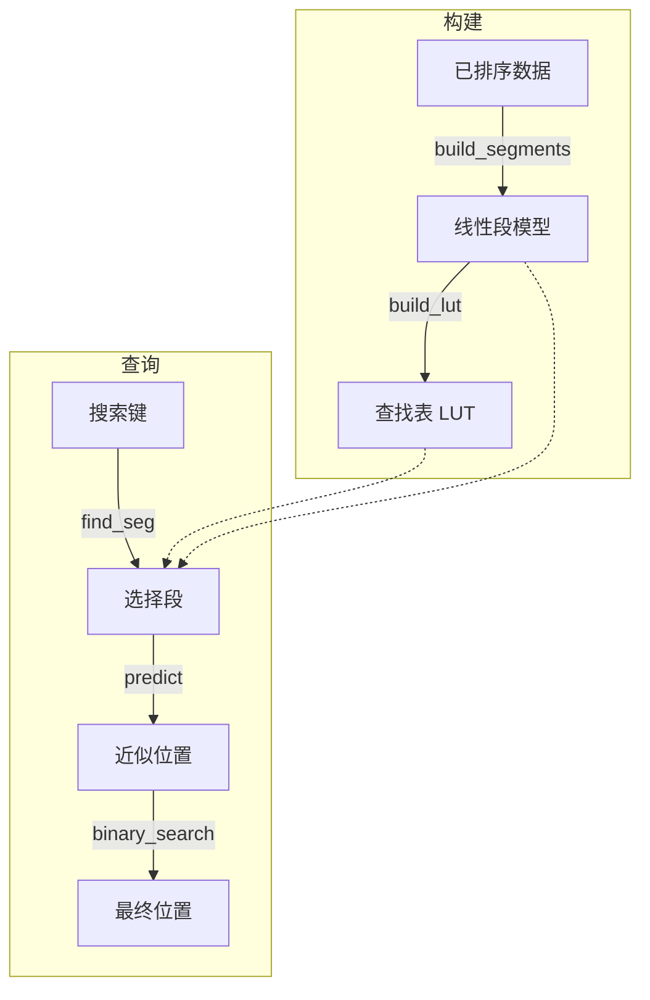

# jdb_pgm : 面向排序键的超快学习型索引

> 一个经过高度优化的 Rust 版 Pgm 索引（分段几何模型索引）单线程实现，专为超低延迟查找和极小的内存开销而设计。


- [简介](#简介)
- [使用方法](#使用方法)
- [性能](#性能)
- [与 pgm_index 的对比](#与-pgm_index-的对比)
- [特性](#特性)
- [设计](#设计)
- [技术栈](#技术栈)
- [目录结构](#目录结构)
- [API 参考](#api-参考)
- [历史背景](#历史背景)

---

## 简介

`jdb_pgm` 是 Pgm-index 数据结构的专用重构版本。它使用分段线性模型近似排序键的分布，从而实现 **O(log ε)** 复杂度的搜索操作。

本 crate 专注于 **单线程性能**，为"一线程一核 (One Thread Per CPU)"的架构做准备。通过移除并发开销并优化内存布局（如 SIMD 友好的循环），与标准二分查找和传统树状索引相比，它实现了具有统计意义的显著速度提升。

## 使用方法

在 `Cargo.toml` 中添加依赖：

```toml
[dependencies]
jdb_pgm = "0.3"
```

### 两种模式

**`Pgm<K>`** - 核心索引，不持有数据（适用于 SSTable、mmap 场景）

```rust
use jdb_pgm::Pgm;

fn main() {
  let data: Vec<u64> = (0..1_000_000).collect();
  
  // 从数据引用构建索引
  let pgm = Pgm::new(&data, 32, true).unwrap();
  
  // 获取预测的搜索范围
  let (start, end) = pgm.predict_range(123_456);
  
  // 在你自己的数据存储中搜索
  if let Ok(pos) = data[start..end].binary_search(&123_456) {
    println!("Found at index: {}", start + pos);
  }
}
```

**`PgmData<K>`** - 持有数据的索引（适用于内存使用场景）

```rust
use jdb_pgm::PgmData;

fn main() {
  let data: Vec<u64> = (0..1_000_000).collect();
  
  // 构建索引并获取数据所有权
  let index = PgmData::load(data, 32, true).unwrap();
  
  // 直接查找
  if let Some(pos) = index.get(123_456) {
    println!("Found at index: {}", pos);
  }
}
```

### Feature 标志

- `data`（默认）：启用持有数据的 `PgmData` 结构体
- `bitcode`：启用 bitcode 序列化
- `key_to_u64`：启用 `key_to_u64()` 辅助函数用于字节键

## 性能

基于 1,000,000 个 `u64` 键的内部基准测试（jdb_pgm 的 Pgm 不持有数据，仅统计索引内存）：

*   比标准二分查找 **快 ~2.3 倍**（17.85ns vs 40.89ns）。
*   比 [pgm_index](https://crates.io/crates/pgm_index) **快 ~1.1 - 1.3 倍**（17.85ns vs 20.13ns）。
*   比 BTreeMap **快 ~4.7 倍**（17.85ns vs 84.21ns）。
*   比 HashMap **快 ~2.2 倍**（17.85ns vs 39.99ns）。
*   在 `ε=32` 时，索引内存仅 **1.01 MB**（pgm_index 为 8.35 MB）。
*   预测精度：jdb_pgm 最大误差严格等于 ε，pgm_index 最大误差为 8ε。

## 🆚 与 `pgm_index` 的对比

本 crate (`jdb_pgm`) 是原版 [`pgm_index`](https://crates.io/crates/pgm_index) 概念的一个专用分叉/重写版本。原版库旨在通用并支持多线程（Rayon），而 `jdb_pgm` 采取了截然不同的优化路径：

### 核心差异总结

| 特性 | jdb_pgm | pgm_index |
|------|---------------|-----------|
| 线程模型 | 单线程 | 多线程 (Rayon) |
| 段构建算法 | 收缩锥 O(N) | 并行最小二乘法 |
| 预测公式 | `slope * key + intercept` | `(key - intercept) / slope` |
| 预测精度 | ε 有界（保证） | 启发式（无保证） |
| 内存 | 无 Arc，零拷贝 | Arc<Vec<K>> 包装 |
| 数据所有权 | 可选（`Pgm` vs `PgmData`） | 始终持有数据 |
| 依赖 | 最小化 | rayon, num_cpus, num-traits |

### 1. 架构转型：原生单线程设计
原版 `pgm_index` 引入了 Rayon 进行并行处理。然而，在现代高性能数据库（如 ScyllaDB 或专用引擎）中，**线程绑定核心 (Thread-per-Core)** 架构往往更具优势。
*   **一线程一 CPU**：我们移除了所有的锁、同步原语和线程池开销。
*   **确定的延迟**：没有了线程调度的抖动，p99 延迟显著更加稳定。

### 2. 段构建算法

**jdb_pgm: 收缩锥算法 (Optimal PLA)**
```
// O(N) 流式算法，保证 ε 有界
while end < n {
  slope_lo = (idx - first_idx - ε) / dx
  slope_hi = (idx - first_idx + ε) / dx
  if min_slope > max_slope: break  // 锥体收缩至崩塌
  // 更新收缩锥边界
}
slope = (min_slope + max_slope) / 2
```

**pgm_index: 并行最小二乘法**
```
// 将数据分成固定块，对每块进行最小二乘拟合
target_segments = optimal_segment_count_adaptive(data, epsilon)
segments = (0..target_segments).par_iter().map(|i| {
  fit_segment(&data[start..end], start)  // 最小二乘拟合
}).collect()
```

收缩锥算法保证预测误差永远不超过 ε，而最小二乘拟合无法提供这种保证。

### 3. 预测公式

**jdb_pgm**: `pos = slope * key + intercept`
- 直接正向预测
- 使用 FMA（融合乘加）提高精度

**pgm_index**: `pos = (key - intercept) / slope`
- 逆向公式（给定 y 求 x）
- 除法比乘法慢
- 当 slope ≈ 0 时有除零风险

### 4. 核心算法实现升级
虽然基于相同的 Pgm 理论，但在**具体代码实现**层面上，我们的算法更加激进：
*   **消除浮点开销**：我们将所有昂贵的浮点取整操作 (`round/floor`) 替换为基于位操作的整数转换 (`as isize + 0.5`)，这在指令周期层面带来了质的飞跃。
*   **对编译器透明**：核心循环结构经过重构，移除了阻碍 LLVM 自动向量化的依赖，无需编写 `intrinsic` 代码即可生成 AVX2/AVX-512 指令。
*   **减少分支预测失败**：通过手动 clamp 和无分支逻辑重写了 `predict` 和 `search` 阶段，大幅降低了流水线停顿。

### 5. 分配策略
*   **启发式预分配**：构建过程会提前估算段的数量 `(N / 2ε)`，有效消除了构建过程中的向量重分配 (Reallocation)。
*   **零拷贝**：键（尤其是整数）的处理避免了不必要的克隆。

## 特性

*   **单线程优化**：针对专用核心的吞吐量进行了极致调优。
*   **零拷贝支持**：支持 `u8`, `u16`, `u32`, `u64`, `i8`, `i16`, `i32`, `i64`。
*   **可预测的误差界限**：`epsilon` 参数严格控制搜索范围。
*   **向量化排序检查**：使用 SIMD 友好的滑动窗口进行验证。
*   **灵活的数据所有权**：`Pgm` 用于外部数据，`PgmData` 用于持有数据。

## 设计

索引构建和查找过程允许极快地预测键的位置。



1.  **构建**: 扫描数据集以创建分段线性模型（Segments），在误差 `ε` 内近似键的分布。
2.  **查找表**: 一个辅助结构（LUT）允许以 O(1) 的时间找到正确的段。
3.  **查询**:
    *   使用键找到对应的段。
    *   使用线性模型 `slope * key + intercept` 预测近似位置。
    *   在误差范围 `[pos - ε, pos + ε]` 内执行小范围二分查找。

## 技术栈

*   **核心**: Rust (Edition 2024)
*   **算法**: Pgm-Index (分段几何模型)
*   **测试**: `aok`, `static_init`, `criterion` (用于基准测试)

## 目录结构

```text
jdb_pgm/
├── src/
│   ├── lib.rs      # 导出和入口点
│   ├── pgm.rs      # 核心 Pgm 结构体（不持有数据）
│   ├── data.rs     # PgmData 结构体（持有数据）
│   ├── build.rs    # 段构建算法
│   ├── types.rs    # Key trait, Segment, PgmStats
│   ├── consts.rs   # 常量
│   └── error.rs    # 错误类型
├── tests/          # 集成测试
├── benches/        # Criterion 基准测试
└── examples/       # 使用示例
```

## API 参考

### `Pgm<K>`（核心，不持有数据）

*   `new(data: &[K], epsilon: usize, check_sorted: bool) -> Result<Self>`
    从数据切片构建索引。索引不持有数据。

*   `predict(key: K) -> usize`
    返回键的预测位置。

*   `predict_range(key: K) -> (usize, usize)`
    返回键的搜索范围 `[start, end)`。

*   `segment_count() -> usize`
    返回段的数量。

*   `mem_usage() -> usize`
    返回索引的内存使用量（不含数据）。

### `PgmData<K>`（持有数据，需要 `data` feature）

*   `load(data: Vec<K>, epsilon: usize, check_sorted: bool) -> Result<Self>`
    构建索引并获取数据所有权。

*   `get(key: K) -> Option<usize>`
    如果找到，返回键的索引；否则返回 `None`。

*   `get_many(keys: I) -> Iterator`
    返回批量查找的结果迭代器。

*   `stats() -> PgmStats`
    返回内部统计信息，如段数和内存使用情况。

*   通过 `Deref` 可访问所有 `Pgm` 方法。

## 历史背景

在"大数据"时代，传统的 B-Tree 由于其内存消耗和缓存效率低逐渐成为瓶颈。2020 年，Paolo Ferragina 和 Giorgio Vinciguerra 提出了 **分段几何模型 (Pgm) 索引**。他们的核心见解简单而具有革命性：如果数据分布通常遵循可预测的模式，为什么还要存储每个键呢？

通过将索引视为一个机器学习问题——学习数据的 CDF（累积分布函数）——他们在保持 O(log N) 最坏情况性能的同时，将索引大小减少了几个数量级。本项目 `jdb_pgm` 借鉴了这一概念，并将其剥离至最本质的 Rust 实现，在每一纳秒都至关重要的现代 CPU 上优先考虑原始速度。
