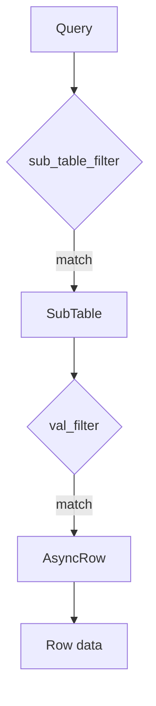
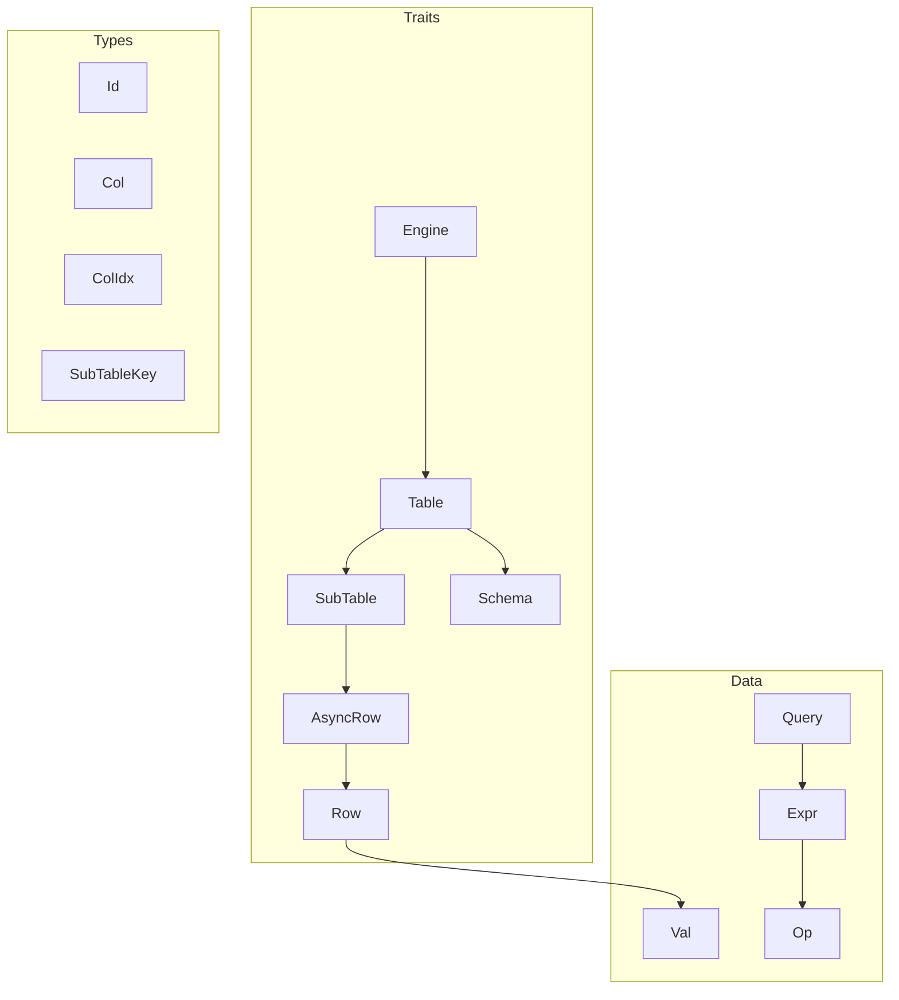

# jdb_trait: Database Abstraction Layer for Async Storage Engines

## Table of Contents

- [Overview](#overview)
- [Features](#features)
- [Installation](#installation)
- [Core Concepts](#core-concepts)
- [API Reference](#api-reference)
- [Architecture](#architecture)
- [Tech Stack](#tech-stack)
- [Directory Structure](#directory-structure)
- [History](#history)

## Overview

jdb_trait defines async trait interfaces for building database storage engines. It provides abstractions for tables, sub-tables (partitions), schemas, queries, and row data with support for key-value separation.

## Features

- Async-first design with `Future`-based APIs
- Sub-table partitioning for horizontal scaling
- Schema versioning with TTL and depth control
- Flexible query expressions with AND/OR/NOT logic
- Key-value separation via `AsyncRow` trait
- Zero-copy string/binary types using `HipStr`/`HipByt`
- Type-safe value representation with `Val` enum

## Installation

```toml
[dependencies]
jdb_trait = "0.1"
```

## Core Concepts

### Engine → Table → SubTable

```
Engine
  └── Table (with Schema)
        └── SubTable (partition by SubTableKey)
              └── Row (Vec<Val>)
```

- `Engine`: Entry point for opening/creating tables
- `Table`: Manages schema and routes operations to sub-tables
- `SubTable`: Partition holding actual row data
- `Row`: Synchronous row data (`Vec<Val>`)
- `AsyncRow`: Async row accessor for key-value separation

### Query Flow



## API Reference

### Types

| Type | Description |
|------|-------------|
| `Id` | Record identifier (`u64`) |
| `Col` | Column name (`HipByt<'static>`) |
| `ColIdx` | Column index (`u16`) |
| `Row` | Synchronous row data (`Vec<Val>`) |
| `SubTableKey` | Partition routing key (`Row`) |

### Val

Atomic database value supporting multiple types:

```rust
pub enum Val {
  Bool(bool),
  I8(i8), I16(i16), I32(i32), I64(i64), I128(i128),
  U8(u8), U16(u16), U32(u32), U64(u64), U128(u128),
  F32(OrderedFloat<f32>), F64(OrderedFloat<f64>),
  Str(HipStr<'static>),
  Bin(HipByt<'static>),
}
```

### Schema

Table schema:

```rust
pub struct Schema {
  pub name: HipByt<'static>,
  pub col_li: Vec<Field>,
  pub sub_table_key_li: Vec<Field>,
  pub index_li: Vec<Index>,
  pub max_depth: Option<usize>,
  pub ttl: Option<Duration>,
}
```

### Query & Expr

Query builder with filter expressions:

```rust
pub struct Query {
  pub sub_table_filter: Option<Expr>,
  pub val_filter: Option<Expr>,
  pub limit: Option<usize>,
  pub offset: Option<usize>,
  pub order: Order,
}
```

Expression operators:

| Op | Description |
|----|-------------|
| `Eq(Val)` | Equality |
| `In(HashSet<Val>)` | Set membership |
| `Range(Val, Val)` | Half-open interval `[start, end)` |
| `RangeInclusive(Val, Val)` | Closed interval `[start, end]` |
| `RangeFrom(Val)` | `[start, +∞)` |
| `RangeTo(Val)` | `(-∞, end)` |
| `RangeToInclusive(Val)` | `(-∞, end]` |

### Traits

#### Engine

```rust
pub trait Engine: Sized + Send + Sync {
  type Error: Debug + Send + Sync;
  type Gen: IdGen;
  type Table: Table;

  fn id_gen(&self) -> &Self::Gen;
  fn open<F, Fut>(&self, name: &[u8], create: F)
    -> impl Future<Output = Result<Self::Table, Self::Error>> + Send;
}
```

#### Table

```rust
pub trait Table: Sized + Send + Sync {
  type Error: Debug + Send + Sync;
  type SubTable: SubTable;
  type AsyncRow: AsyncRow;
  type Stream: Stream<Item = Result<AsyncItem<Self::AsyncRow>, Self::Error>> + Send;

  fn schema(&self) -> impl Future<Output = Schema> + Send;
  fn put(&self, key: &SubTableKey, data: &[Row])
    -> impl Future<Output = Result<Vec<Id>, Self::Error>> + Send;
  fn get(&self, key: &SubTableKey, id: Id)
    -> impl Future<Output = Result<Option<AsyncItem<Self::AsyncRow>>, Self::Error>> + Send;
  fn select(&self, q: &Query) -> impl Future<Output = Self::Stream> + Send;
  fn scan(&self, begin_id: u64, order: Order) -> impl Future<Output = Self::Stream> + Send;
  fn rm(&self, q: &Query) -> impl Future<Output = Result<u64, Self::Error>> + Send;
  // ...
}
```

#### SubTable

```rust
pub trait SubTable: Send + Sync {
  type Error: Debug + Send + Sync;
  type AsyncRow: AsyncRow;
  type Stream: Stream<Item = Result<(Id, Self::AsyncRow), Self::Error>> + Send;

  fn put(&self, data: &[Row])
    -> impl Future<Output = Result<Vec<Id>, Self::Error>> + Send;
  fn get(&self, id: Id)
    -> impl Future<Output = Result<Option<(Id, Self::AsyncRow)>, Self::Error>> + Send;
  fn select(&self, q: &Query) -> impl Future<Output = Self::Stream> + Send;
  fn key(&self) -> &SubTableKey;
  // ...
}
```

#### AsyncRow

```rust
pub trait AsyncRow: Send + Sync + Debug {
  type Error: Debug + Send + Sync;
  fn row(&self) -> impl Future<Output = Result<Row, Self::Error>> + Send;
}
```

## Architecture



### Call Flow

1. `Engine::open()` creates or opens `Table`
2. `Table` routes by `SubTableKey` to `SubTable`
3. `SubTable` executes CRUD operations
4. Query results return `AsyncRow` for lazy loading
5. `AsyncRow::row()` fetches actual `Row` data

## Tech Stack

| Dependency | Purpose |
|------------|---------|
| `futures-core` | Stream trait for async iteration |
| `hipstr` | Zero-copy string/binary types |
| `ordered-float` | Orderable float wrapper |
| `gxhash` | Fast hash for `HashSet<Val>` |

## Directory Structure

```
jdb_trait/
├── src/
│   ├── lib.rs        # Public exports, Engine, IdGen, AsyncItem
│   ├── val.rs        # Val enum with From impls
│   ├── row.rs        # Row type alias, AsyncRow trait
│   ├── expr.rs       # Expr, Op, Order
│   ├── query.rs      # Query struct
│   ├── schema.rs     # Schema, Field, Index
│   ├── sub_table.rs  # SubTable trait
│   └── table.rs      # Table trait
├── readme/
│   ├── en.md
│   └── zh.md
└── Cargo.toml
```

## History

The concept of database abstraction layers traces back to the 1970s when E.F. Codd proposed the relational model. The separation of logical and physical data representation became foundational to modern databases.

Key-value separation, central to `AsyncRow`, emerged from LSM-tree optimizations. WiscKey (2016) demonstrated that separating keys from values in SSTable-based storage significantly improves write amplification and space efficiency for large values.

The async trait pattern in Rust evolved significantly. Before Rust 1.75 (December 2023), async methods in traits required workarounds like `async-trait` crate. Native support for `impl Trait` in trait methods enabled cleaner APIs like those in jdb_trait.

Sub-table partitioning reflects distributed database designs from Google's Bigtable (2006) and Apache HBase, where row key prefixes route data to specific tablets/regions for horizontal scaling.
