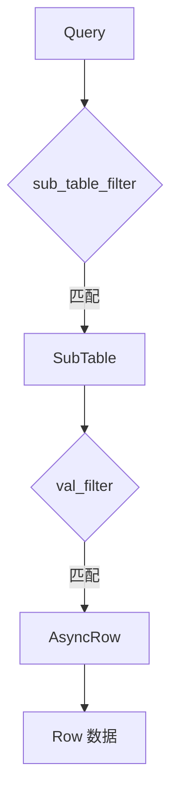
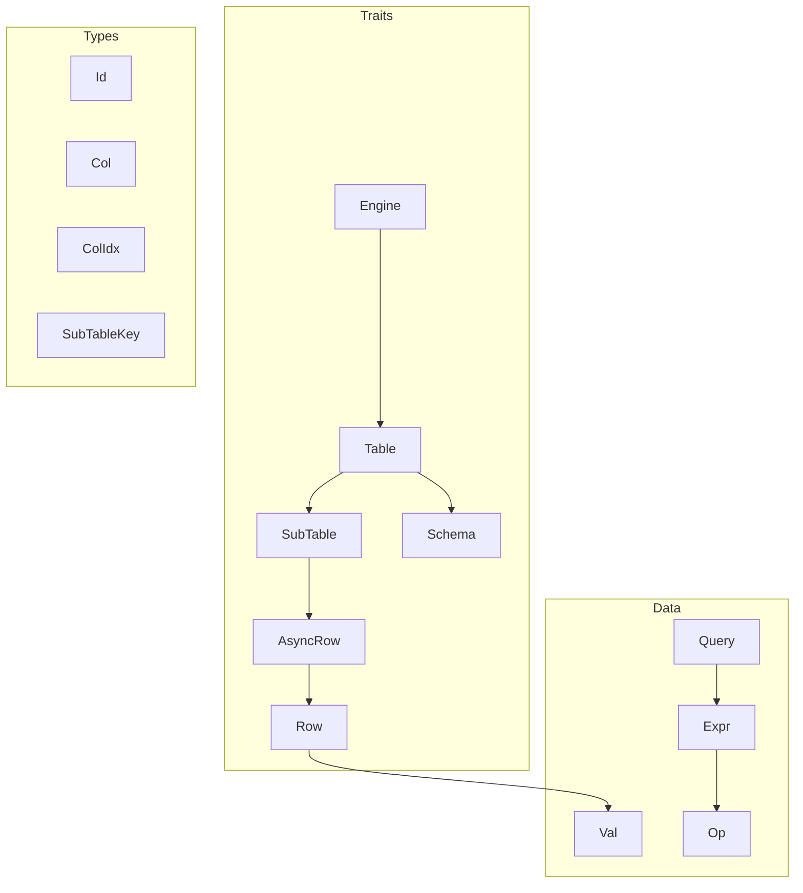

# jdb_trait: 异步存储引擎数据库抽象层

## 目录

- [概述](#概述)
- [特性](#特性)
- [安装](#安装)
- [核心概念](#核心概念)
- [API 参考](#api-参考)
- [架构](#架构)
- [技术栈](#技术栈)
- [目录结构](#目录结构)
- [历史](#历史)

## 概述

jdb_trait 定义异步 trait 接口，用于构建数据库存储引擎。提供表、子表（分区）、Schema、查询、行数据等抽象，支持键值分离。

## 特性

- 异步优先设计，基于 `Future` 的 API
- 子表分区，支持水平扩展
- Schema 版本控制，支持 TTL 和深度限制
- 灵活的查询表达式，支持 AND/OR/NOT 逻辑
- 通过 `AsyncRow` trait 实现键值分离
- 使用 `HipStr`/`HipByt` 实现零拷贝字符串/二进制
- 类型安全的 `Val` 枚举值表示

## 安装

```toml
[dependencies]
jdb_trait = "0.1"
```

## 核心概念

### Engine → Table → SubTable

```
Engine
  └── Table (含 Schema)
        └── SubTable (按 SubTableKey 分区)
              └── Row (Vec<Val>)
```

- `Engine`: 打开/创建表的入口
- `Table`: 管理 Schema，路由操作到子表
- `SubTable`: 存储实际行数据的分区
- `Row`: 同步行数据 (`Vec<Val>`)
- `AsyncRow`: 异步行访问器，用于键值分离

### 查询流程



## API 参考

### 类型

| 类型 | 说明 |
|------|------|
| `Id` | 记录标识符 (`u64`) |
| `Col` | 列名 (`HipByt<'static>`) |
| `ColIdx` | 列索引 (`u16`) |
| `Row` | 同步行数据 (`Vec<Val>`) |
| `SubTableKey` | 分区路由键 (`Row`) |

### Val

支持多种类型的原子数据库值：

```rust
pub enum Val {
  Bool(bool),
  I8(i8), I16(i16), I32(i32), I64(i64), I128(i128),
  U8(u8), U16(u16), U32(u32), U64(u64), U128(u128),
  F32(OrderedFloat<f32>), F64(OrderedFloat<f64>),
  Str(HipStr<'static>),
  Bin(HipByt<'static>),
}
```

### Schema

表结构：

```rust
pub struct Schema {
  pub name: HipByt<'static>,
  pub col_li: Vec<Field>,
  pub sub_table_key_li: Vec<Field>,
  pub index_li: Vec<Index>,
  pub max_depth: Option<usize>,
  pub ttl: Option<Duration>,
}
```

### Query & Expr

查询构建器与过滤表达式：

```rust
pub struct Query {
  pub sub_table_filter: Option<Expr>,
  pub val_filter: Option<Expr>,
  pub limit: Option<usize>,
  pub offset: Option<usize>,
  pub order: Order,
}
```

表达式操作符：

| Op | 说明 |
|----|------|
| `Eq(Val)` | 相等 |
| `In(HashSet<Val>)` | 集合成员 |
| `Range(Val, Val)` | 半开区间 `[start, end)` |
| `RangeInclusive(Val, Val)` | 闭区间 `[start, end]` |
| `RangeFrom(Val)` | `[start, +∞)` |
| `RangeTo(Val)` | `(-∞, end)` |
| `RangeToInclusive(Val)` | `(-∞, end]` |

### Traits

#### Engine

```rust
pub trait Engine: Sized + Send + Sync {
  type Error: Debug + Send + Sync;
  type Gen: IdGen;
  type Table: Table;

  fn id_gen(&self) -> &Self::Gen;
  fn open<F, Fut>(&self, name: &[u8], create: F)
    -> impl Future<Output = Result<Self::Table, Self::Error>> + Send;
}
```

#### Table

```rust
pub trait Table: Sized + Send + Sync {
  type Error: Debug + Send + Sync;
  type SubTable: SubTable;
  type AsyncRow: AsyncRow;
  type Stream: Stream<Item = Result<AsyncItem<Self::AsyncRow>, Self::Error>> + Send;

  fn schema(&self) -> impl Future<Output = Schema> + Send;
  fn put(&self, key: &SubTableKey, data: &[Row])
    -> impl Future<Output = Result<Vec<Id>, Self::Error>> + Send;
  fn get(&self, key: &SubTableKey, id: Id)
    -> impl Future<Output = Result<Option<AsyncItem<Self::AsyncRow>>, Self::Error>> + Send;
  fn select(&self, q: &Query) -> impl Future<Output = Self::Stream> + Send;
  fn scan(&self, begin_id: u64, order: Order) -> impl Future<Output = Self::Stream> + Send;
  fn rm(&self, q: &Query) -> impl Future<Output = Result<u64, Self::Error>> + Send;
  // ...
}
```

#### SubTable

```rust
pub trait SubTable: Send + Sync {
  type Error: Debug + Send + Sync;
  type AsyncRow: AsyncRow;
  type Stream: Stream<Item = Result<(Id, Self::AsyncRow), Self::Error>> + Send;

  fn put(&self, data: &[Row])
    -> impl Future<Output = Result<Vec<Id>, Self::Error>> + Send;
  fn get(&self, id: Id)
    -> impl Future<Output = Result<Option<(Id, Self::AsyncRow)>, Self::Error>> + Send;
  fn select(&self, q: &Query) -> impl Future<Output = Self::Stream> + Send;
  fn key(&self) -> &SubTableKey;
  // ...
}
```

#### AsyncRow

```rust
pub trait AsyncRow: Send + Sync + Debug {
  type Error: Debug + Send + Sync;
  fn row(&self) -> impl Future<Output = Result<Row, Self::Error>> + Send;
}
```

## 架构



### 调用流程

1. `Engine::open()` 创建或打开 `Table`
2. `Table` 按 `SubTableKey` 路由到 `SubTable`
3. `SubTable` 执行 CRUD 操作
4. 查询结果返回 `AsyncRow` 实现延迟加载
5. `AsyncRow::row()` 获取实际 `Row` 数据

## 技术栈

| 依赖 | 用途 |
|------|------|
| `futures-core` | 异步迭代的 Stream trait |
| `hipstr` | 零拷贝字符串/二进制类型 |
| `ordered-float` | 可排序浮点数包装 |
| `gxhash` | `HashSet<Val>` 的快速哈希 |

## 目录结构

```
jdb_trait/
├── src/
│   ├── lib.rs        # 公开导出、Engine、IdGen、AsyncItem
│   ├── val.rs        # Val 枚举及 From 实现
│   ├── row.rs        # Row 类型别名、AsyncRow trait
│   ├── expr.rs       # Expr、Op、Order
│   ├── query.rs      # Query 结构体
│   ├── schema.rs     # Schema、Field、Index
│   ├── sub_table.rs  # SubTable trait
│   └── table.rs      # Table trait
├── readme/
│   ├── en.md
│   └── zh.md
└── Cargo.toml
```

## 历史

数据库抽象层概念可追溯至 1970 年代 E.F. Codd 提出的关系模型。逻辑与物理数据表示的分离成为现代数据库的基石。

键值分离是 `AsyncRow` 的核心思想，源于 LSM-tree 优化。WiscKey（2016）证明在基于 SSTable 的存储中分离键值，能显著改善大值场景下的写放大和空间效率。

Rust 的 async trait 模式经历重大演进。在 Rust 1.75（2023 年 12 月）之前，trait 中的异步方法需要 `async-trait` crate 等变通方案。原生支持 trait 方法中的 `impl Trait` 后，jdb_trait 这类更简洁的 API 成为可能。

子表分区反映了 Google Bigtable（2006）和 Apache HBase 等分布式数据库设计，通过行键前缀将数据路由到特定 tablet/region 实现水平扩展。
