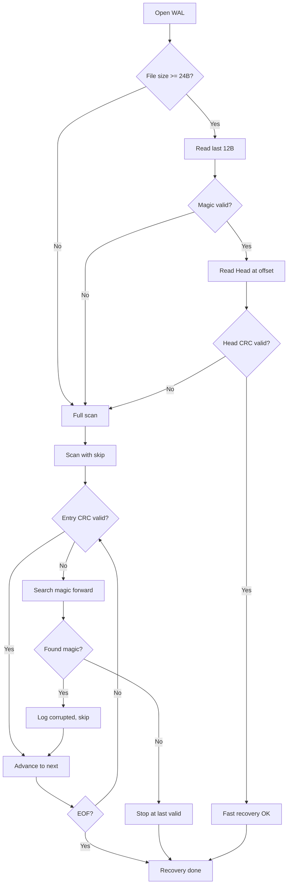

# Design Document: WAL End Marker

## Overview

为 WAL 文件添加尾部标记机制，实现 O(1) 快速恢复。每个数据条目写入后追加 12 字节的 End Marker，包含该条目 Head 的起始偏移和魔数。启动时通过读取文件末尾快速定位最后有效条目，失败时回退到正向扫描。

## Architecture

```
WAL File Layout:
┌─────────────────────────────────────────────────────────────────┐
│ Header (12B)                                                     │
├─────────────────────────────────────────────────────────────────┤
│ Entry 1: Head (64B) + [inline/infile data] + End (12B)          │
├─────────────────────────────────────────────────────────────────┤
│ Entry 2: Head (64B) + [inline/infile data] + End (12B)          │
├─────────────────────────────────────────────────────────────────┤
│ ...                                                              │
└─────────────────────────────────────────────────────────────────┘

End Marker Layout (12 bytes):
┌────────────────────┬────────────────┐
│ head_offset (u64)  │ magic (u32)    │
│ 8 bytes LE         │ 0xEDEDEDED     │
└────────────────────┴────────────────┘
```

### Recovery Flow



## Components and Interfaces

### End Marker Module (`src/wal/end.rs`)

```rust
// End marker size / 尾部标记大小
pub const END_SIZE: usize = 12;

// Magic value / 魔数值
pub const END_MAGIC: u32 = 0xED_ED_ED_ED;

// Build end marker / 构建尾部标记
pub fn build_end(head_offset: u64) -> [u8; END_SIZE];

// Parse end marker, returns head_offset if valid / 解析尾部标记
pub fn parse_end(buf: &[u8]) -> Option<u64>;
```

### Modified Write Flow

```rust
// In write.rs - write_head modification
impl Wal {
    pub async fn write_head(&mut self, head: &Head) -> Result<Pos> {
        // Check space for head + end marker
        if self.cur_pos + Head::SIZE as u64 + END_SIZE as u64 > self.max_size {
            self.rotate().await?;
        }
        
        let head_pos = self.cur_pos;
        // Write head
        file.write_all_at(head.as_bytes(), head_pos).await?;
        self.cur_pos += Head::SIZE as u64;
        
        // Write infile data if any...
        
        // Write end marker
        let end = build_end(head_pos);
        file.write_all_at(end, self.cur_pos).await?;
        self.cur_pos += END_SIZE as u64;
        
        Ok(Pos::new(self.cur_id, head_pos))
    }
}
```

### Modified Recovery Flow

**关键点**: 
- 快速恢复成功时，`cur_pos = file_len`（文件末尾，不覆盖已有数据）
- 正向扫描时，`cur_pos = last_valid_entry_end`（最后有效条目结尾）

```rust
// In open.rs - fast recovery attempt
// Returns Some(file_len) if valid, None to fallback to scan
async fn try_fast_recover(file: &File, len: u64) -> Option<u64> {
    if len < (HEADER_SIZE + Head::SIZE + END_SIZE) as u64 {
        return None;
    }
    
    // Read last 12 bytes
    let buf = file.read_exact_at(vec![0u8; END_SIZE], len - END_SIZE as u64).await.ok()?;
    let head_offset = parse_end(&buf)?;
    
    // Validate head at offset
    if head_offset < HEADER_SIZE as u64 || head_offset + Head::SIZE as u64 > len {
        return None;
    }
    
    let head_buf = file.read_exact_at(vec![0u8; Head::SIZE], head_offset).await.ok()?;
    let head = Head::read_from_bytes(&head_buf).ok()?;
    
    // Verify CRC
    let crc = crc32fast::hash(&head_buf[..Head::CRC_RANGE]);
    if crc != head.head_crc32.get() {
        return None;
    }
    
    // Fast recovery OK: cur_pos = file_len (preserve all data)
    // 快速恢复成功：cur_pos = 文件长度（保留所有数据）
    Some(len)
}
```

### Scan with Magic Skip

**关键点**: 正向扫描时，`cur_pos = last_valid_entry_end`（最后有效条目的结尾位置）

```rust
// Scan forward, skip corrupted entries by finding magic
// Returns last valid entry end position / 返回最后有效条目结尾位置
async fn recover_scan_with_skip(file: &File, len: u64) -> u64 {
    let mut pos = HEADER_SIZE as u64;
    let mut valid_pos = pos; // Last valid entry end / 最后有效条目结尾
    
    while pos < len {
        // Try read head
        let head_result = try_read_head(file, pos).await;
        
        match head_result {
            Ok((head, data_len)) => {
                // Entry valid, update valid_pos to entry end
                // 条目有效，更新 valid_pos 到条目结尾
                let entry_end = pos + Head::SIZE as u64 + data_len + END_SIZE as u64;
                valid_pos = entry_end;
                pos = entry_end;
            }
            Err(_) => {
                // Corrupted, search for magic
                if let Some(magic_pos) = search_magic(file, pos, len).await {
                    let skip_len = magic_pos + 4 - pos;
                    log::warn!("Corrupted entry at {pos}, len ~{skip_len}, skipped");
                    pos = magic_pos + 4; // After magic, continue scan
                    // Note: valid_pos NOT updated (corrupted entry skipped)
                    // 注意：valid_pos 不更新（跳过损坏条目）
                } else {
                    break; // No more valid entries
                }
            }
        }
    }
    
    valid_pos // Return last valid entry end / 返回最后有效条目结尾
}

// Search for magic bytes forward / 向前搜索魔数
async fn search_magic(file: &File, start: u64, end: u64) -> Option<u64> {
    // Read in chunks, search for 0xEDEDEDED pattern
    // ...
}
```

## Data Models

### End Marker

| Field       | Type | Offset | Size | Description              |
|-------------|------|--------|------|--------------------------|
| head_offset | u64  | 0      | 8    | Head 起始位置 (LE)        |
| magic       | u32  | 8      | 4    | 魔数 0xEDEDEDED          |

### Entry Layout Change

Before:
```
[Head 64B] [infile_key?] [infile_val?]
```

After:
```
[Head 64B] [infile_key?] [infile_val?] [End 12B]
```

## Correctness Properties

*A property is a characteristic or behavior that should hold true across all valid executions of a system—essentially, a formal statement about what the system should do. Properties serve as the bridge between human-readable specifications and machine-verifiable correctness guarantees.*

### Property 1: End Marker Round-Trip

*For any* valid u64 offset value, calling `build_end(offset)` then `parse_end(&buf)` SHALL return `Some(offset)` with the original value.

**Validates: Requirements 1.1, 1.2**

### Property 2: Write Produces Valid End Marker

*For any* key-value pair written via `put()`, the resulting file SHALL contain a valid End_Marker at position `head_pos + Head::SIZE + infile_data_len`, where the End_Marker's `head_offset` equals `head_pos`.

**Validates: Requirements 2.1, 2.2, 2.3**

### Property 3: Fast Recovery Correctness

*For any* WAL file with valid End_Marker (correct magic and valid Head CRC at offset), fast recovery SHALL set `cur_pos` to `file_len` (file end, preserving all data).

**Validates: Requirements 3.2, 3.3**

### Property 4: Scan Recovery Position

*For any* WAL file requiring forward scan (invalid End_Marker), scan recovery SHALL set `cur_pos` to the end position of the last valid entry.

**Validates: Requirements 4.1, 4.2**

### Property 5: Corrupted Entry Skip

*For any* WAL file containing a corrupted entry followed by valid entries, forward scan SHALL skip the corrupted entry by finding the next magic marker and continue to find all subsequent valid entries.

**Validates: Requirements 4.3, 4.4, 4.5**


## Error Handling

| Scenario | Handling |
|----------|----------|
| File too small for End_Marker | Fallback to full scan |
| Invalid magic in last 12 bytes | Fallback to full scan |
| head_offset out of bounds | Fallback to full scan |
| Head CRC mismatch at offset | Fallback to full scan |
| Corrupted entry during scan | Search magic, skip, log warning |
| No magic found after corruption | Stop at last valid position |
| I/O error during recovery | Propagate error |

### Error Types (in error.rs)

```rust
// No new error types needed - existing errors cover all cases:
// - InvalidHead: for CRC mismatch
// - InvalidHeader: for file structure issues
// - Io: for I/O errors
```

## Testing Strategy

### Unit Tests

1. `build_end` produces correct 12-byte buffer
2. `parse_end` returns None for invalid magic
3. `parse_end` returns None for buffer < 12 bytes
4. Fast recovery with valid End_Marker
5. Fallback to scan with invalid magic
6. Fallback to scan with corrupted Head
7. Skip corrupted entry and find next valid

### Property-Based Tests

Use `proptest` crate for property-based testing:

1. **Property 1**: Round-trip test for End_Marker serialization
   - Generate random u64 offsets
   - Verify build_end → parse_end identity

2. **Property 2**: Write produces valid End_Marker
   - Generate random key-value pairs
   - Write and verify End_Marker position and content

3. **Property 3**: Fast recovery correctness
   - Generate valid WAL files
   - Verify cur_pos after recovery

4. **Property 4**: Corrupted entry skip
   - Generate WAL files with corrupted entries
   - Verify all valid entries are found

### Test Configuration

- Minimum 100 iterations per property test
- Tag format: `Feature: wal-end-marker, Property N: description`
