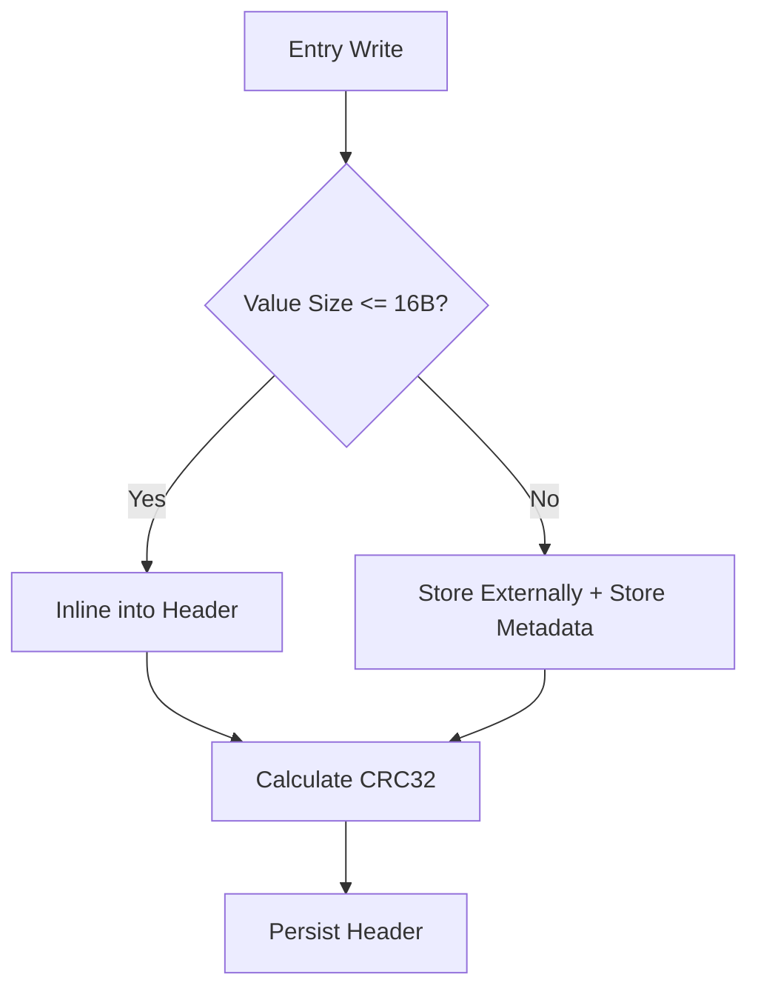

# Head : Metadata Header Definition for JDB KV Storage

- [Introduction](#introduction)
- [Features](#features)
- [Usage](#usage)
- [Design](#design)
- [API Overview](#api-overview)
- [Project Structure](#project-structure)
- [Tech Stack](#tech-stack)
- [History Snippet](#history-snippet)

## Introduction

`jdb_val` defines the standardized 128-byte metadata header (Head) for JDB, an embedded key-value storage engine. It provides high-performance serialization and deserialization of entry metadata, including versioning, TTL, and inline storage optimizations.

## Features

- **Standardized Layout**: Fixed 128-byte header aligned for CPU cache lines.
- **Inline Optimization**: Transparently inlines small keys (up to 64B) and values (up to 16B).
- **High Performance**: Zero-copy operations using `zerocopy` and hardware-accelerated CRC32.
- **Unified Access**: Enum-based reference API for unified handling of inline and external storage.

## Usage

```rust
use jdb_val::{Head, Kind, Compress, KeyRef, ValRef, Key};

fn main() -> Result<(), jdb_val::Error> {
  // Construct inline key
  let key_bytes = b"user:1001";
  let mut key = Key::default();
  key.new_inline(key_bytes);

  // One-shot initialization: handles CRC, timestamps, and inlining
  let meta = Head::new(
    1, 
    0xABCDEF, 
    key_bytes.len() as u16,
    key,
    b"active",    // val bytes
    3600,         // ttl (Expiration = ts + ttl)
    0,            // prev_offset
    0,            // prev_file
  )?;
  
  let bin = meta.as_bytes();
  let meta_loaded = Head::load(bin)?;
  
  // Access data via unified enum API
  match meta_loaded.key_ref() {
    KeyRef::Inline(k) => assert_eq!(k, b"user:1001"),
    _ => unreachable!(),
  }
  Ok(())
}
```

## Design

The metadata header is split into two 64-byte cache lines for optimal memory access patterns.



### Layout
1. **Cache Line 0**: Metadata (crc, ttl, ts, seq_id, hash, prev, flag, val).
2. **Cache Line 1**: Data (key buffer).

## API Overview

### Data Structures

- `Head`: Core 128-byte metadata structure.
- `Kind`: Record type enum (Val, Rm, Inline, Blob).
- `Compress`: Compression algorithm enum (None, Lz4, Zstd).
- `Key`: 64-byte key storage structure.
- `Val`: 16-byte value storage structure (internal).

### Principal Methods

- `Head::new(...)`: Creates a new record. Automatically injects `coarsetime` timestamp.
- `Head::rm(...)`: Creates a removal record.
- `Head::load(bin)`: Deserializes from binary data.
- `key_ref()`: Returns `KeyRef` enum (unified inline/external key reference).
- `val_ref()`: Returns `ValRef` enum (unified inline/external value reference).
- `kind()`: Retrieves record type.
- `compress()`: Retrieves compression algorithm.

## Project Structure

- `src/head.rs`: Core `Head` implementation.
- `src/kind.rs`: Record type `Kind` definition.
- `src/val.rs` / `src/key.rs`: Internal storage structures.
- `src/val_ref.rs` / `src/key_ref.rs`: Unified reference enums.

## Tech Stack

- **Rust**: Implementation language.
- **zerocopy**: Safe zero-copy abstractions.
- **crc32fast**: SIMD-accelerated checksums.
- **coarsetime**: Low-overhead high-performance timestamps.

## History Snippet

Modern designs like the 128-byte fixed header in `jdb_val` follow the "fixed-width" philosophy seen in high-performance engines like WiredTiger, ensuring predictable memory offsets and maximizing CPU cache efficiency.