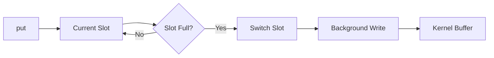
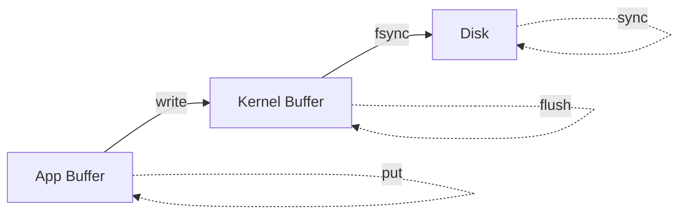
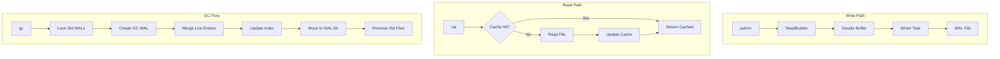

# jdb_val : High-Performance Async WAL Value Storage

[](https://crates.io/crates/jdb_val)
[](LICENSE)

WAL-based value storage engine for KV separation architecture. Built with [compio](https://github.com/compio-rs/compio) for single-threaded async I/O.

## Table of Contents

- [Features](#features)
- [Installation](#installation)
- [Quick Start](#quick-start)
- [Storage Modes](#storage-modes)
- [API Reference](#api-reference)
- [Write Mechanism](#write-mechanism)
- [Architecture](#architecture)
- [Directory Structure](#directory-structure)
- [Tech Stack](#tech-stack)
- [History](#history)

## Features

- Async I/O based on compio (io_uring/IOCP)
- Double-buffered write queue for high throughput
- LHD (Learned Hyperbolic Discounting) cache eviction
- Automatic file rotation with configurable size limits
- CRC32 integrity verification
- Crash recovery with backward scanning
- GC (Garbage Collection) with live entry merging
- Streaming read/write for large values
- Tombstone support for deletions

## Installation

```sh
cargo add jdb_val
```

## Quick Start

```rust
use std::path::Path;
use jdb_val::{Wal, Conf, Result};
use futures::StreamExt;

#[compio::main]
async fn main() -> Result<()> {
  let dir = Path::new("./data");

  // Open checkpoint manager, returns (ckp_manager, last_checkpoint)
  let (mut ckp, last) = jdb_ckp::open(dir, &[]).await?;

  // Open WAL with checkpoint for incremental recovery
  let (mut wal, stream) = Wal::open(dir, &[Conf::MaxSize(512 * 1024 * 1024)], last.as_ref()).await?;

  // Replay entries after checkpoint to rebuild index
  // stream yields HeadEnd { head, end }
  futures::pin_mut!(stream);
  while let Some(entry) = stream.next().await {
    let head = &entry.head;  // Head: id, key_len, val_len, flag...
    let end = entry.end;     // Entry end position
    // Rebuild index using head.id and end
  }

  // Write
  let pos = wal.put(b"key", b"value").await?;

  // Read
  let val = wal.val(pos).await?;

  // Delete
  wal.rm(b"key").await?;

  // Sync and save checkpoint
  wal.sync().await?;
  ckp.set_wal_ptr(wal.cur_id(), wal.cur_pos()).await?;

  Ok(())
}
```

## Storage Modes

| Mode   | Condition    | Description                    |
|--------|--------------|--------------------------------|
| INFILE | val ≤ 4MB    | Value stored in WAL file       |
| FILE   | val > 4MB    | Value stored in separate file  |

## API Reference

### Core Types

#### `Wal`

WAL manager with LRU cache.

```rust
// Open, returns (wal, recovery_stream)
let (mut wal, stream) = Wal::open(dir, &[Conf::MaxSize(512 * 1024 * 1024)], None).await?;

// Write key-value
let pos = wal.put(key, val).await?;

// Read value by position
let val = wal.val(pos).await?;

// Delete key
wal.rm(key).await?;

// Iterate WAL file IDs
for id in wal.iter() { /* ... */ }

// Scan entries in WAL file
wal.scan(id, |pos, head, record| { /* ... */ true }).await?;

// GC merge old WAL files
let (reclaimed, total) = wal.gc(&ids, &checker, &index).await?;
```

#### `Conf`

Configuration options.

```rust
Conf::MaxSize(u64)      // Max WAL file size (default: 512MB)
Conf::CacheSize(u64)    // Total cache size (default: 8MB)
Conf::FileLru(usize)    // File handle cache capacity
Conf::BufCap(usize)     // Write buffer initial capacity
Conf::BufMax(usize)     // Write buffer size limit, blocks when exceeded
```

#### `Record`

Position pointer for GC scan (16 bytes).

```rust
let record = Record::new(wal_id, head_offset);
let id = record.id();
let offset = record.offset();
```

#### `WalPtr`

WAL checkpoint pointer.

```rust
let ptr = WalPtr::new(id, offset);
```

### GC Traits

#### `Gcable`

Check if key should be removed during GC.

```rust
impl Gcable for MyChecker {
  fn is_rm(&self, key: &[u8]) -> impl Future<Output = bool> + Send {
    async move { /* check if deleted */ }
  }
}
```

#### `IndexUpdate`

Batch update index after GC.

```rust
impl IndexUpdate for MyIndex {
  fn update(&self, mapping: &[PosMap]) {
    // Update index with new positions
  }
}
```

## Write Mechanism

### Double Buffering



1. `put` writes to current slot (memory), returns immediately
2. Background task flushes slot to disk
3. Two slots alternate, write and flush run in parallel

### Durability Guarantees

| Method        | Guarantee                              |
|---------------|----------------------------------------|
| `put`         | In memory buffer only                  |
| `flush`       | Wait for buffer write to kernel, no fsync |
| `sync`        | flush + fsync                          |

### Kernel Buffer vs Disk



- `write()` to kernel: Data in OS page cache, survives app crash but lost on power failure
- `fsync()` to disk: Data persisted to storage, survives power failure

Linux kernel flushes dirty pages to disk periodically (default ~5 seconds via `dirty_writeback_centisecs`). Without explicit `sync_*`, data loss window depends on this interval.

Comparison with other systems:

| System           | Default Behavior                       | Data Loss Window    |
|------------------|----------------------------------------|---------------------|
| Redis AOF        | fsync every second                     | ~1 second           |
| jdb_val          | Async double buffer, batch to kernel   | A few milliseconds  |
| RocksDB          | Write to kernel buffer (sync=false)    | OS flush interval   |

The double buffer design balances throughput and durability:

- Less data loss than Redis AOF (everysec): Redis loses up to 1 second, jdb_val loses only milliseconds
- Faster than RocksDB (sync=false): RocksDB issues syscall per write; jdb_val batches writes to kernel, reducing syscall overhead

jdb_val prioritizes throughput over immediate durability. For critical data, call `sync()` after writes. For batch operations, sync once after the batch completes.

### Data Loss on Power Failure

Without explicit `sync()` calls, power failure may lose:

- Data in write buffer (up to `BufMax`, default 8MB)
- On modern NVMe (3-7 GB/s), 8MB flushes in ~1-3ms
- Typical loss window: a few milliseconds of writes

For durability-critical applications, call `sync()` after important writes.

### Configuration

```rust
Conf::BufCap(4096)           // Initial buffer capacity (entries)
Conf::BufMax(8 * 1024 * 1024) // Buffer size limit (8MB default)
```

When buffer exceeds `BufMax`, `put` awaits until flush completes, providing backpressure.

## Architecture



### Write Flow

1. `put(key, val)` builds record with HeadBuilder
2. Record pushed to double buffer (current slot)
3. Writer task writes slot to file when ready
4. Automatic rotation when file exceeds MaxSize

### Read Flow

1. Check LHD cache for value
2. Cache miss: read from write buffer or file
3. Update cache with read value

### Recovery Flow

1. Validate WAL header (version + CRC)
2. Forward scan from checkpoint offset
3. Backward scan on corruption to find valid end
4. Return recovery stream for index rebuild

## Directory Structure

```
data/
├── wal/           # WAL files (ID-based naming)
│   ├── 00/
│   │   └── 00/
│   │       └── 01
│   └── ...
├── bin/           # Large value files (FILE mode)
│   └── ...
├── gc/            # Temporary GC directory
│   └── wal/
└── lock/          # File locks for GC
    └── wal/
```

## Tech Stack

| Component       | Library                                                    |
|-----------------|------------------------------------------------------------|
| Async Runtime   | [compio](https://github.com/compio-rs/compio) (io_uring)   |
| Cache           | [size_lru](https://crates.io/crates/size_lru) (LHD)        |
| Serialization   | [zerocopy](https://crates.io/crates/zerocopy)              |
| CRC             | [crc32fast](https://crates.io/crates/crc32fast) (SIMD)     |
| Error Handling  | [thiserror](https://crates.io/crates/thiserror)            |
| String          | [hipstr](https://crates.io/crates/hipstr)                  |

## History

Write-Ahead Logging (WAL) originated from IBM's System R project in the mid-1970s, one of the first relational database systems. The core principle is simple: record changes to a log before applying them to the database, ensuring atomicity and durability.

The technique became fundamental to database systems. PostgreSQL, MySQL, SQLite all implement WAL for crash recovery. Modern file systems like ext4 and NTFS use journaling, a variant of WAL, for metadata consistency.

KV separation architecture, where keys and values are stored separately, emerged to optimize LSM-tree based storage engines. WiscKey (2016) pioneered this approach, storing values in a separate log to reduce write amplification. jdb_val follows this design, providing dedicated value storage with efficient GC.

The compio async runtime leverages io_uring on Linux, a revolutionary I/O interface introduced in kernel 5.1 (2019). Unlike traditional epoll, io_uring uses shared ring buffers between kernel and userspace, eliminating syscall overhead for high-throughput scenarios.
