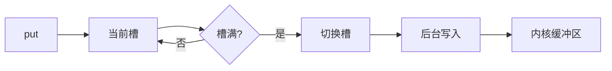
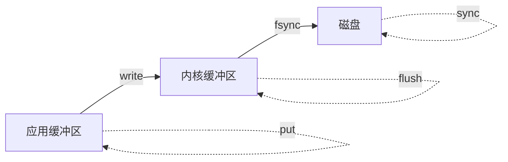
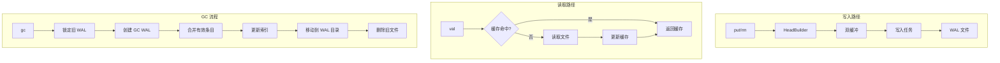

# jdb_val : 高性能异步 WAL 值存储引擎

[](https://crates.io/crates/jdb_val)
[](LICENSE)

基于 WAL 的值存储引擎，用于 KV 分离架构。使用 [compio](https://github.com/compio-rs/compio) 实现单线程异步 I/O。

## 目录

- [特性](#特性)
- [安装](#安装)
- [快速开始](#快速开始)
- [存储模式](#存储模式)
- [API 参考](#api-参考)
- [写入机制](#写入机制)
- [架构设计](#架构设计)
- [目录结构](#目录结构)
- [技术栈](#技术栈)
- [历史](#历史)

## 特性

- 基于 compio 的异步 I/O（io_uring/IOCP）
- 双缓冲写入队列，高吞吐
- LHD（Learned Hyperbolic Discounting）缓存淘汰
- 自动文件轮转，可配置大小限制
- CRC32 完整性校验
- 崩溃恢复，支持反向扫描
- GC（垃圾回收），合并有效条目
- 流式读写，支持大值
- 墓碑标记，支持删除

## 安装

```sh
cargo add jdb_val
```

## 快速开始

```rust
use std::path::Path;
use jdb_val::{Wal, Conf, Result};
use futures::StreamExt;

#[compio::main]
async fn main() -> Result<()> {
  let dir = Path::new("./data");

  // 打开检查点管理器，返回 (ckp_manager, 上次检查点)
  let (mut ckp, last) = jdb_ckp::open(dir, &[]).await?;

  // 打开 WAL，传入检查点用于增量恢复
  let (mut wal, stream) = Wal::open(dir, &[Conf::MaxSize(512 * 1024 * 1024)], last.as_ref()).await?;

  // 回放检查点之后的数据重建索引
  // stream 产出 HeadEnd { head, end }
  futures::pin_mut!(stream);
  while let Some(entry) = stream.next().await {
    let head = &entry.head;  // Head: id, key_len, val_len, flag...
    let end = entry.end;     // 条目结束位置
    // 用 head.id 和 end 重建索引
  }

  // 写入
  let pos = wal.put(b"key", b"value").await?;

  // 读取
  let val = wal.val(pos).await?;

  // 删除
  wal.rm(b"key").await?;

  // 同步并保存检查点
  wal.sync().await?;
  ckp.set_wal_ptr(wal.cur_id(), wal.cur_pos()).await?;

  Ok(())
}
```

## 存储模式

| 模式   | 条件         | 说明                 |
|--------|--------------|----------------------|
| INFILE | val ≤ 4MB    | 值存储在 WAL 文件中  |
| FILE   | val > 4MB    | 值存储在独立文件中   |

## API 参考

### 核心类型

#### `Wal`

带 LRU 缓存的 WAL 管理器。

```rust
// 打开，返回 (wal, 恢复流)
let (mut wal, stream) = Wal::open(dir, &[Conf::MaxSize(512 * 1024 * 1024)], None).await?;

// 写入键值对
let pos = wal.put(key, val).await?;

// 根据位置读取值
let val = wal.val(pos).await?;

// 删除键
wal.rm(key).await?;

// 遍历 WAL 文件 ID
for id in wal.iter() { /* ... */ }

// 扫描 WAL 文件中的条目
wal.scan(id, |pos, head, record| { /* ... */ true }).await?;

// GC 合并旧 WAL 文件
let (reclaimed, total) = wal.gc(&ids, &checker, &index).await?;
```

#### `Conf`

配置选项。

```rust
Conf::MaxSize(u64)      // 最大 WAL 文件大小（默认：512MB）
Conf::CacheSize(u64)    // 总缓存大小（默认：8MB）
Conf::FileLru(usize)    // 文件句柄缓存容量
Conf::BufCap(usize)     // 写入缓冲区初始容量
Conf::BufMax(usize)     // 写入缓冲区大小上限，超过则等待刷盘
```

#### `Record`

GC 扫描的位置指针（16 字节）。

```rust
let record = Record::new(wal_id, head_offset);
let id = record.id();
let offset = record.offset();
```

#### `WalPtr`

WAL 检查点指针。

```rust
let ptr = WalPtr::new(id, offset);
```

### GC Traits

#### `Gcable`

GC 时检查键是否应被删除。

```rust
impl Gcable for MyChecker {
  fn is_rm(&self, key: &[u8]) -> impl Future<Output = bool> + Send {
    async move { /* 检查是否已删除 */ }
  }
}
```

#### `IndexUpdate`

GC 后批量更新索引。

```rust
impl IndexUpdate for MyIndex {
  fn update(&self, mapping: &[PosMap]) {
    // 用新位置更新索引
  }
}
```

## 写入机制

### 双缓冲



1. `put` 写入当前槽（内存），立即返回
2. 后台任务将槽数据刷到磁盘
3. 两个槽交替使用，写入和刷盘并行

### 持久化保证

| 方法          | 保证                                   |
|---------------|----------------------------------------|
| `put`         | 仅写入内存缓冲区                       |
| `flush`       | 等待缓冲区写入内核，不 fsync           |
| `sync`        | flush + fsync                          |

### 内核缓冲区 vs 落盘



- `write()` 写入内核：数据在 OS 页缓存中，应用崩溃不丢失，断电会丢失
- `fsync()` 落盘：数据持久化到存储设备，断电不丢失

Linux 内核定期将脏页刷到磁盘（默认约 5 秒，由 `dirty_writeback_centisecs` 控制）。未显式调用 `sync_*` 时，数据丢失窗口取决于此间隔。

与其他系统对比：

| 系统             | 默认行为                               | 数据丢失窗口        |
|------------------|----------------------------------------|---------------------|
| Redis AOF        | 每秒 fsync                             | ~1 秒               |
| jdb_val          | 异步双缓冲，批量写入内核               | 几毫秒              |
| RocksDB          | 写入内核缓冲区（默认 sync=false）      | OS 缓冲区刷盘周期   |

jdb_val 的双缓冲设计兼顾了吞吐量和持久性：

- 比 Redis AOF (everysec) 丢失更少：Redis 最多丢 1 秒数据，jdb_val 仅丢几毫秒
- 比 RocksDB (sync=false) 更快：RocksDB 每次写入都需系统调用；jdb_val 批量提交到内核，减少系统调用开销

jdb_val 优先考虑吞吐量而非即时持久化。对于关键数据，写入后调用 `sync()`。批量操作时，在批次完成后统一 sync。

### 断电数据丢失

未显式调用 `sync()` 时，断电可能丢失：

- 写入缓冲区中的数据（最多 `BufMax`，默认 8MB）
- 现代 NVMe（3-7 GB/s）刷盘 8MB 约 1-3ms
- 典型丢失窗口：几毫秒的写入量

对持久化要求高的场景，在重要写入后调用 `sync()`。

### 配置

```rust
Conf::BufCap(4096)           // 缓冲区初始容量（条目数）
Conf::BufMax(8 * 1024 * 1024) // 缓冲区大小上限（默认 8MB）
```

当缓冲区超过 `BufMax` 时，`put` 会 await 等待刷盘完成，实现背压控制。

## 架构设计



### 写入流程

1. `put(key, val)` 通过 HeadBuilder 构建记录
2. 记录推送到双缓冲（当前槽）
3. 写入任务在就绪时将槽写入文件
4. 文件超过 MaxSize 时自动轮转

### 读取流程

1. 检查 LHD 缓存
2. 缓存未命中：从写缓冲或文件读取
3. 用读取的值更新缓存

### 恢复流程

1. 验证 WAL 头（版本 + CRC）
2. 从检查点偏移向前扫描
3. 遇到损坏时反向扫描找到有效结束位置
4. 返回恢复流用于索引重建

## 目录结构

```
data/
├── wal/           # WAL 文件（基于 ID 命名）
│   ├── 00/
│   │   └── 00/
│   │       └── 01
│   └── ...
├── bin/           # 大值文件（FILE 模式）
│   └── ...
├── gc/            # GC 临时目录
│   └── wal/
└── lock/          # GC 文件锁
    └── wal/
```

## 技术栈

| 组件       | 库                                                         |
|------------|------------------------------------------------------------|
| 异步运行时 | [compio](https://github.com/compio-rs/compio) (io_uring)   |
| 缓存       | [size_lru](https://crates.io/crates/size_lru) (LHD)        |
| 序列化     | [zerocopy](https://crates.io/crates/zerocopy)              |
| CRC        | [crc32fast](https://crates.io/crates/crc32fast) (SIMD)     |
| 错误处理   | [thiserror](https://crates.io/crates/thiserror)            |
| 字符串     | [hipstr](https://crates.io/crates/hipstr)                  |

## 历史

预写日志（WAL）起源于 1970 年代中期 IBM 的 System R 项目，这是最早的关系型数据库系统之一。核心原则很简单：在将更改应用到数据库之前，先将其记录到日志中，以确保原子性和持久性。

这项技术成为数据库系统的基础。PostgreSQL、MySQL、SQLite 都实现了 WAL 用于崩溃恢复。现代文件系统如 ext4 和 NTFS 使用日志（journaling），这是 WAL 的变体，用于元数据一致性。

KV 分离架构，即键和值分开存储，是为了优化基于 LSM-tree 的存储引擎而出现的。WiscKey（2016）开创了这种方法，将值存储在单独的日志中以减少写放大。jdb_val 遵循这一设计，提供专用的值存储和高效的 GC。

compio 异步运行时在 Linux 上利用 io_uring，这是内核 5.1（2019）引入的革命性 I/O 接口。与传统的 epoll 不同，io_uring 使用内核和用户空间之间的共享环形缓冲区，消除了高吞吐场景下的系统调用开销。
