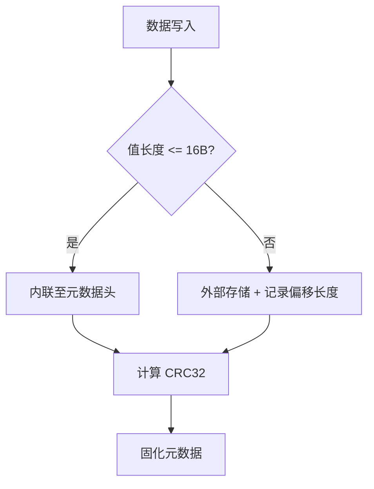

# Head : JDB 键值存储系统的元数据头定义

- [项目简介](#项目简介)
- [核心特性](#核心特性)
- [使用演示](#使用演示)
- [设计思路](#设计思路)
- [API 概览](#api-概览)
- [目录结构](#目录结构)
- [技术堆栈](#技术堆栈)
- [历史小故事](#历史小故事)

## 项目简介

`jdb_val` 为 JDB 嵌入式键值数据库定义标准的 128 字节元数据头（Head）。它提供高性能的元数据序列化与反序列化，支持版本控制、生存周期管理以及内联存储优化。

## 核心特性

- **标准布局**：固定 128 字节长度，针对 CPU 缓存行（Cache Line）进行对齐优化。
- **内联优化**：透明处理小尺寸键（≤64B）与值（≤16B）的内联存储，大幅减少磁盘 I/O。
- **极高性能**：基于 `zerocopy` 实现零拷贝操作，并利用 `crc32fast` 进行硬件加速校验。
- **透明处理**：内置多种记录类型与压缩元数据支持，提供统一的枚举访问接口。

## 使用演示

```rust
use jdb_val::{Head, Kind, Compress, KeyRef, ValRef, Key};

fn main() -> Result<(), jdb_val::Error> {
  // 构造内联键
  let key_bytes = b"user:1001";
  let mut key = Key::default();
  key.new_inline(key_bytes);

  // 一次性初始化：自动处理 CRC、时间戳和内联逻辑
  let meta = Head::new(
    1, 
    0xABCDEF, 
    key_bytes.len() as u16,
    key,
    b"active",    // val_bytes
    3600,         // ttl (Expiration = ts + ttl)
    0,            // prev_offset
    0,            // prev_file
  )?;

  let bin = meta.as_bytes();
  let meta_loaded = Head::load(bin)?;
  
  // 使用 enum-based API 获取数据引用
  match meta_loaded.key_ref() {
    KeyRef::Inline(k) => assert_eq!(k, b"user:1001"),
    _ => unreachable!(),
  }
  Ok(())
}
```

## 设计思路

元数据头被划分为两个 64 字节的缓存行，确保内存访问的高效性。



### 物理布局
1. **Cache Line 0**: 元数据区（含校验和、过期时间、时间戳、序列号、哈希值、前序版本偏移、键长度、标识位等）。
2. **Cache Line 1**: 数据区（内联键缓冲区）。

## API 概览

### 数据结构

- `Head`: 核心 128 字节元数据结构。
- `Kind`: 记录类型枚举（Val, Rm, Inline, Blob）。
- `Compress`: 压缩算法枚举（None, Lz4, Zstd）。
- `Key`: 64 字节键存储结构。
- `Val`: 16 字节值存储结构（内部用于 `val` 字段）。

### 核心方法

- `Head::new(...)`: 创建新记录。自动注入 `coarsetime` 时间戳，处理存储逻辑。
- `Head::new_rm(...)`: 创建删除标记。
- `Head::load(bin)`: 从二进制反序列化。
- `key_ref()`: 返回 `KeyRef` 枚举，统一处理内联/外部键引用。
- `val_ref()`: 返回 `ValRef` 枚举，统一处理内联/外部值引用。
- `kind()`: 获取记录类型。
- `compress()`: 获取压缩算法。

## 目录结构

- `src/head.rs`: 核心 `Head` 逻辑。
- `src/kind.rs`: 记录类型 `Kind` 定义。
- `src/val.rs` / `src/key.rs`: 内部存储结构封装。
- `src/val_ref.rs` / `src/key_ref.rs`: 统一引用的枚举定义。

## 技术堆栈

- **Rust**: 实现语言。
- **zerocopy**: 安全的零拷贝抽象。
- **crc32fast**: SIMD 加速校验。
- **coarsetime**: 高性能时间戳。

## 历史小故事

现代数据库设计借鉴了高性能引擎（如 WiredTiger）的“等宽”设计哲学。`jdb_val` 的固定 128 字节方案旨在通过可预测的内存偏移量最大化利用 CPU 缓存。