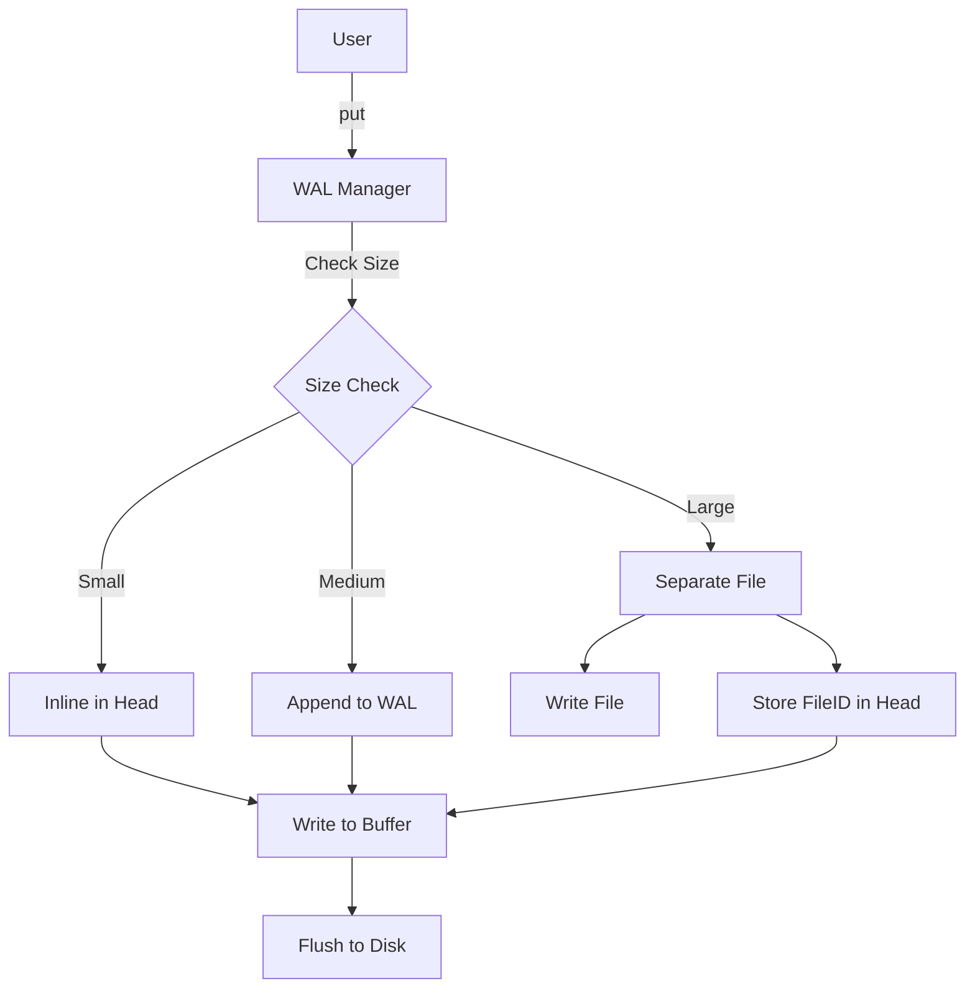

# JDB : Fast, Async, Embedded Key-Value Storage

**JDB** is a high-performance, embedded key-value storage engine written in Rust. It leverages contemporary asynchronous I/O (via `compio`) and optimized storage layouts to deliver exceptional throughput and low latency.

## Table of Contents

- [Features](#features)
- [Usage](#usage)
- [Design](#design)
- [Tech Stack](#tech-stack)
- [Directory Structure](#directory-structure)
- [API Reference](#api-reference)
- [History](#history)

## Features

- **Asynchronous & Thread-Safe**: Built on `compio` for efficient single-threaded async runtime.
- **Adaptive Storage Modes**: Automatically selects the best storage strategy based on data size:
  - **INLINE**: Embedded directly in the metadata head (Zero Disk I/O for reading if head cached).
  - **INFILE**: Stored within the Write-Ahead Log (WAL) file.
  - **FILE**: Stored as a separate file for large values.
- **Compression**: Native support for LZ4 and ZSTD compression.
- **Robustness**: Full recovery capabilities via WAL.
- **GC**: Automatic Garbage Collection with `Gcable` trait integration.

## Usage

```rust
use jdb_val::Wal;

#[compio::main]
async fn main() {
  let dir = "/tmp/jdb_test";
  let mut wal = Wal::new(dir, &[]);
  wal.open().await.unwrap();

  // Put a key-value pair
  let loc = wal.put(b"hello", b"world").await.unwrap();

  // Read the head metadata
  let head = wal.read_head(loc).await.unwrap();

  // Retrieve the value
  let val = wal.head_val(&head).await.unwrap();
  assert_eq!(val, b"world");
}
```

## Design

### Data Flow



## Tech Stack

- **Rust**: Systems programming language.
- **Compio**: Asynchronous runtime for efficient I/O.
- **Hipstr**: Zero-copy string optimization.
- **Fast32**: Efficient Base32 encoding.
- **LZ4/ZSTD**: High-performance compression algorithms.

## Directory Structure

- `jdb_val/`: Core Value Storage Engine (WAL, Head, GC).
- `jdb_lru/`: High-performance LRU cache implementation.
- `zbin/`: Zero-copy binary traits and utilities.
- `jdb_bench/`: Comprehensive benchmark suite.

## API Reference

### `jdb_val`

- **Wal**: Main entry point for WAL operations. Manages the write buffer, file rotation, and recovery.
- **Head**: 64-byte Metadata header structure containing flags, position, and checksums.
- **Pos**: Represents a logical position in the WAL, used to locate data.
- **Gcable**: Trait for Garbage Collection integration, allowing custom logic for reclaiming space.

## History

In the early days of database systems, crashing was a persistent nightmare. The concept of **Write-Ahead Logging (WAL)** became a cornerstone of reliability. A famous anecdote from the development of **IBM System R** (the influential precursor to modern SQL databases) involves a corrupted table after a cluster crash. The team realized that rather than discarding the corrupted state, they could replay the sequentially written log to reconstruct the data. This validated the "log-first" philosophy. JDB continues this tradition by placing the Log at the center of its design, ensuring that "if it's logged, it's safe" while optimizing for modern NVMe speeds.
