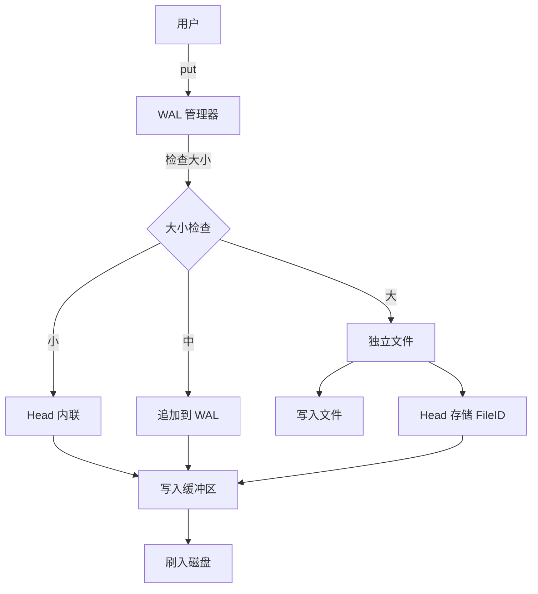

# JDB : 高性能异步嵌入式键值存储

**JDB** 是一个用 Rust 编写的高性能嵌入式键值存储引擎。它利用现代异步 I/O（基于 `compio`）和优化的存储布局，提供卓越的吞吐量和低延迟。

## 目录

- [功能特性](#功能特性)
- [使用演示](#使用演示)
- [设计思路](#设计思路)
- [技术堆栈](#技术堆栈)
- [目录结构](#目录结构)
- [API 参考](#api-参考)
- [历史轶事](#历史轶事)

## 功能特性

- **异步与线程安全**：基于 `compio` 构建，提供高效的单线程异步运行时。
- **自适应存储模式**：根据数据大小自动选择最佳存储策略：
  - **INLINE**：直接内联在元数据头中（如果头被缓存，读取时零磁盘 I/O）。
  - **INFILE**：存储在预写日志（WAL）文件内。
  - **FILE**：大值存储为独立文件。
- **压缩支持**：原生支持 LZ4 和 ZSTD 压缩。
- **健壮性**：通过 WAL 提供完整的数据恢复能力。
- **GC**：支持通过 `Gcable` trait 集成自动垃圾回收。

## 使用演示

```rust
use jdb_val::Wal;

#[compio::main]
async fn main() {
  let dir = "/tmp/jdb_test";
  let mut wal = Wal::new(dir, &[]);
  wal.open().await.unwrap();

  // 写入键值对
  let loc = wal.put(b"hello", b"world").await.unwrap();

  // 读取元数据头
  let head = wal.read_head(loc).await.unwrap();

  // 获取值
  let val = wal.head_val(&head).await.unwrap();
  assert_eq!(val, b"world");
}
```

## 设计思路

### 数据流向



## 技术堆栈

- **Rust**：系统编程语言。
- **Compio**：用于高效 I/O 的异步运行时。
- **Hipstr**：零拷贝字符串优化。
- **Fast32**：高效的 Base32 编码。
- **LZ4/ZSTD**：高性能压缩算法。

## 目录结构

- `jdb_val/`: 核心值存储引擎（WAL, Head, GC）。
- `jdb_lru/`: 高性能 LRU 缓存实现。
- `zbin/`: 零拷贝二进制 trait 和工具。
- `jdb_bench/`: 综合基准测试套件。

## API 参考

### `jdb_val`

- **Wal**: WAL 操作的主要入口点。管理写入缓冲区、文件轮转和恢复。
- **Head**: 64 字节的元数据头结构，包含标志、位置和校验和。
- **Pos**: 表示 WAL 中的逻辑位置，用于定位数据。
- **Gcable**: 垃圾回收集成 trait，允许自定义空间回收逻辑。

## 历史轶事

在数据库系统的早期，系统崩溃是一场持久的噩梦。**预写日志 (WAL)** 的概念成为了可靠性的基石。关于 **IBM System R**（现代 SQL 数据库的有影响力的前身）的开发有一个著名的轶事：通过集群崩溃后，一张表损坏了。团队意识到，他们不用丢弃损坏的状态，而是可以通过重放顺序写入的日志来重建数据。这验证了“日志优先”的哲学。JDB 延续了这一传统，将日志置于其设计的中心，确保“只要记录了，就是安全的”，同时针对现代 NVMe 速度进行了优化。
