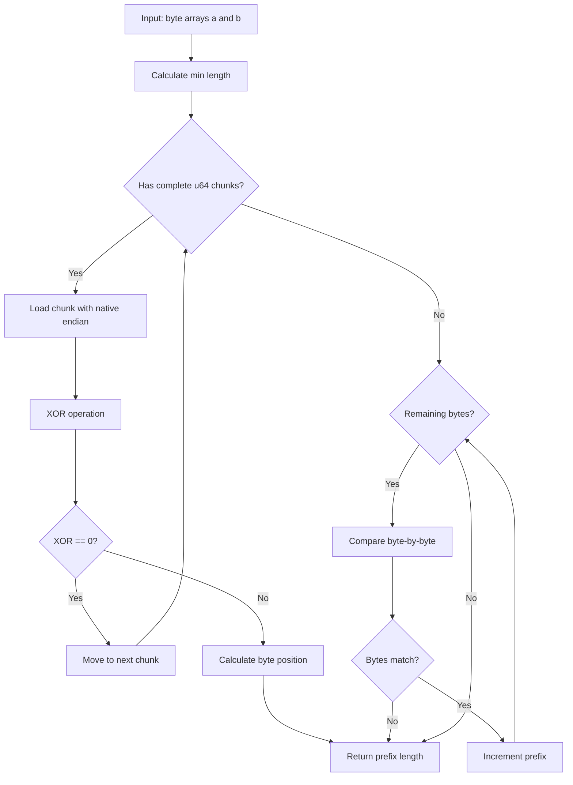
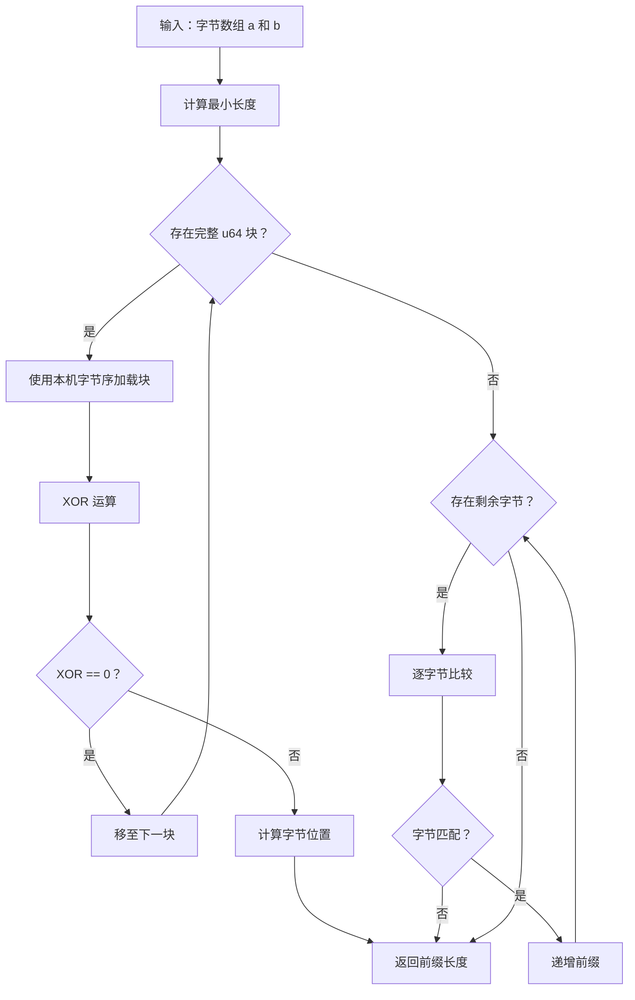

[English](#en) | [中文](#zh)

---

<a id="en"></a>

# shared_prefix_len : High-performance shared prefix length calculation

## Table of Contents

- [Features](#features)
- [Usage](#usage)
- [Design](#design)
- [Technology Stack](#technology-stack)
- [Project Structure](#project-structure)
- [API](#api)

## Features

- **High Performance**: Uses u64 chunk comparison for optimal speed on 64-bit systems
- **Zero Dependencies**: No external dependencies in production code
- **Cross-Platform**: Handles both little-endian and big-endian architectures
- **Binary Safe**: Works with any byte sequence, including UTF-8 and binary data

## Usage

```rust
use shared_prefix_len::shared_prefix_len;

// Empty strings
assert_eq!(shared_prefix_len(b"", b""), 0);

// Identical strings
assert_eq!(shared_prefix_len(b"hello", b"hello"), 5);

// Partial prefix match
assert_eq!(shared_prefix_len(b"hello", b"help"), 3);

// Different strings
assert_eq!(shared_prefix_len(b"abc", b"xyz"), 0);

// Different lengths
assert_eq!(shared_prefix_len(b"short", b"shorter"), 5);

// Binary data
assert_eq!(shared_prefix_len(&[0, 1, 2, 3], &[0, 1, 2, 4]), 3);

// UTF-8 text
let a = "你好世界".as_bytes();
let b = "你好世界abc".as_bytes();
assert_eq!(shared_prefix_len(a, b), 12);
```

## Design

The algorithm uses a two-stage comparison strategy:

1. **Chunk Comparison**: Compare 8 bytes (u64) at a time using native-endian loads. This provides significant performance improvements on 64-bit systems.

2. **Byte-by-Byte Fallback**: For remaining bytes that don't form a complete chunk, fall back to byte-by-byte comparison.

When a chunk mismatch is detected, the algorithm uses XOR operation combined with trailing_zeros (little-endian) or leading_zeros (big-endian) to quickly locate the exact byte position of the first difference.



## Technology Stack

- **Language**: Rust 2024 Edition
- **Architecture**: Zero-dependency pure Rust implementation
- **Optimization**: Uses u64 chunk comparison with native-endian loads
- **Platform Support**: Handles both little-endian and big-endian systems

## Project Structure

```
shared_prefix_len/
├── src/
│   └── lib.rs          # Core implementation
├── tests/
│   └── main.rs         # Comprehensive test suite
├── readme/
│   ├── en.md           # English documentation
│   └── zh.md           # Chinese documentation
├── Cargo.toml          # Package configuration
└── README.mdt          # Documentation index
```

## API

### `shared_prefix_len`

Calculates the length of the shared prefix between two byte slices.

```rust
pub fn shared_prefix_len(a: &[u8], b: &[u8]) -> usize
```

**Parameters:**
- `a`: First byte slice
- `b`: Second byte slice

**Returns:**
- Length of the longest common prefix

**Performance Characteristics:**
- Time complexity: O(min(len(a), len(b)))
- Space complexity: O(1)
- Optimized for 64-bit systems using u64 chunk comparisons

**Implementation Details:**

The function uses `chunks_exact` to iterate over 8-byte blocks, loading each block using `from_ne_bytes` for maximum performance. When a mismatch is found:

- On little-endian systems: Uses `trailing_zeros()` to find the first differing byte
- On big-endian systems: Uses `leading_zeros()` to find the first differing byte

After processing all complete chunks, any remaining bytes are compared individually.

---

## Historical Context

The concept of comparing byte sequences to find common prefixes has roots in early computer science and data structure design. The prefix comparison technique is fundamental to:

- **Trie Data Structures**: Patricia tries (Practical Algorithm to Retrieve Information Coded in Alphanumeric) use prefix compression to store keys efficiently, invented by Donald R. Morrison in 1968.

- **String Matching Algorithms**: Early text processing systems in the 1960s and 1970s required efficient methods to compare strings for indexing and searching.

- **Network Protocols**: IP routing uses longest-prefix matching (LPM) since the early days of the internet, requiring fast prefix comparison algorithms.

The chunk-based optimization approach used in this library reflects modern CPU architecture considerations. The technique of comparing multiple bytes simultaneously became practical with the advent of 32-bit and 64-bit processors in the 1990s, and is now standard in high-performance string processing libraries.

This particular implementation's use of XOR with trailing_zeros/leading_zeros is a classic bit manipulation trick that has been employed in optimized string libraries for decades, demonstrating how understanding CPU instruction sets can lead to significant performance gains.

---

## About

This project is an open-source component of [js0.site ⋅ Refactoring the Internet Plan](https://js0.site).

We are redefining the development paradigm of the Internet in a componentized way. Welcome to follow us:

* [Google Group](https://groups.google.com/g/js0-site)
* [js0site.bsky.social](https://bsky.app/profile/js0site.bsky.social)

---

<a id="zh"></a>

# shared_prefix_len : 高性能共享前缀长度计算

## 目录

- [特性](#特性)
- [使用示例](#使用示例)
- [设计思路](#设计思路)
- [技术堆栈](#技术堆栈)
- [目录结构](#目录结构)
- [API 说明](#api)

## 特性

- **高性能**：使用 u64 块比较，在 64 位系统上实现最优速度
- **零依赖**：生产代码无外部依赖
- **跨平台**：支持小端序和大端序架构
- **二进制安全**：适用于任意字节序列，包括 UTF-8 和二进制数据

## 使用示例

```rust
use shared_prefix_len::shared_prefix_len;

// 空字符串
assert_eq!(shared_prefix_len(b"", b""), 0);

// 相同字符串
assert_eq!(shared_prefix_len(b"hello", b"hello"), 5);

// 部分前缀匹配
assert_eq!(shared_prefix_len(b"hello", b"help"), 3);

// 不同字符串
assert_eq!(shared_prefix_len(b"abc", b"xyz"), 0);

// 不同长度
assert_eq!(shared_prefix_len(b"short", b"shorter"), 5);

// 二进制数据
assert_eq!(shared_prefix_len(&[0, 1, 2, 3], &[0, 1, 2, 4]), 3);

// UTF-8 文本
let a = "你好世界".as_bytes();
let b = "你好世界abc".as_bytes();
assert_eq!(shared_prefix_len(a, b), 12);
```

## 设计思路

算法采用两阶段比较策略：

1. **块比较**：使用本机字节序加载，每次比较 8 字节（u64）。在 64 位系统上显著提升性能。

2. **逐字节回退**：对无法组成完整块的剩余字节，回退到逐字节比较。

当检测到块不匹配时，算法使用 XOR 运算结合 trailing_zeros（小端序）或 leading_zeros（大端序）快速定位首个差异的确切字节位置。



## 技术堆栈

- **语言**：Rust 2024 Edition
- **架构**：零依赖纯 Rust 实现
- **优化**：使用 u64 块比较配合本机字节序加载
- **平台支持**：支持小端序和大端序系统

## 目录结构

```
shared_prefix_len/
├── src/
│   └── lib.rs          # 核心实现
├── tests/
│   └── main.rs         # 完整测试套件
├── readme/
│   ├── en.md           # 英文文档
│   └── zh.md           # 中文文档
├── Cargo.toml          # 包配置
└── README.mdt          # 文档索引
```

## API

### `shared_prefix_len`

计算两个字节切片之间的共享前缀长度。

```rust
pub fn shared_prefix_len(a: &[u8], b: &[u8]) -> usize
```

**参数：**
- `a`：第一个字节切片
- `b`：第二个字节切片

**返回值：**
- 最长公共前缀的长度

**性能特征：**
- 时间复杂度：O(min(len(a), len(b)))
- 空间复杂度：O(1)
- 针对 64 位系统使用 u64 块比较优化

**实现细节：**

函数使用 `chunks_exact` 迭代 8 字节块，使用 `from_ne_bytes` 加载每个块以获得最佳性能。发现不匹配时：

- 小端序系统：使用 `trailing_zeros()` 查找首个差异字节
- 大端序系统：使用 `leading_zeros()` 查找首个差异字节

处理完所有完整块后，逐个比较剩余字节。

---

## 历史背景

比较字节序列以查找公共前缀的概念源于早期计算机科学和数据结构设计。前缀比较技术是以下领域的基础：

- **Trie 数据结构**：Patricia trie（实用字母数字信息检索算法）使用前缀压缩高效存储键，由 Donald R. Morrison 于 1968 年发明。

- **字符串匹配算法**：20 世纪 60 年代和 70 年代的早期文本处理系统需要高效方法来比较字符串以进行索引和搜索。

- **网络协议**：IP 路由自互联网早期以来使用最长前缀匹配（LPM），需要快速前缀比较算法。

本库使用的基于块的优化方法反映了现代 CPU 架构的考虑。随着 20 世纪 90 年代 32 位和 64 位处理器的出现，同时比较多个字节的技术变得实用，现已成为高性能字符串处理库的标准方法。

本实现使用 XOR 配合 trailing_zeros/leading_zeros 的技术是经典的位操作技巧，已在优化的字符串库中使用数十年，展示了理解 CPU 指令集如何带来显著的性能提升。

---

## 关于

本项目为 [js0.site ⋅ 重构互联网计划](https://js0.site) 的开源组件。

我们正在以组件化的方式重新定义互联网的开发范式，欢迎关注：

* [谷歌邮件列表](https://groups.google.com/g/js0-site)
* [js0site.bsky.social](https://bsky.app/profile/js0site.bsky.social)
