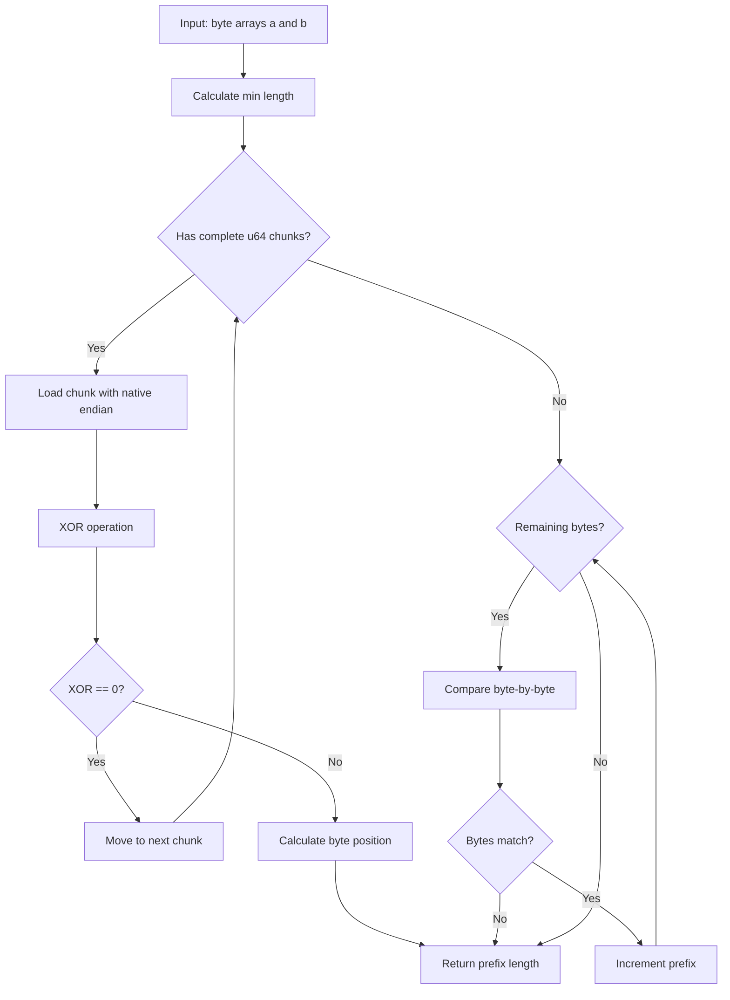

# shared_prefix_len : High-performance shared prefix length calculation

## Table of Contents

- [Features](#features)
- [Usage](#usage)
- [Design](#design)
- [Technology Stack](#technology-stack)
- [Project Structure](#project-structure)
- [API](#api)

## Features

- **High Performance**: Uses u64 chunk comparison for optimal speed on 64-bit systems
- **Zero Dependencies**: No external dependencies in production code
- **Cross-Platform**: Handles both little-endian and big-endian architectures
- **Binary Safe**: Works with any byte sequence, including UTF-8 and binary data

## Usage

```rust
use shared_prefix_len::shared_prefix_len;

// Empty strings
assert_eq!(shared_prefix_len(b"", b""), 0);

// Identical strings
assert_eq!(shared_prefix_len(b"hello", b"hello"), 5);

// Partial prefix match
assert_eq!(shared_prefix_len(b"hello", b"help"), 3);

// Different strings
assert_eq!(shared_prefix_len(b"abc", b"xyz"), 0);

// Different lengths
assert_eq!(shared_prefix_len(b"short", b"shorter"), 5);

// Binary data
assert_eq!(shared_prefix_len(&[0, 1, 2, 3], &[0, 1, 2, 4]), 3);

// UTF-8 text
let a = "你好世界".as_bytes();
let b = "你好世界abc".as_bytes();
assert_eq!(shared_prefix_len(a, b), 12);
```

## Design

The algorithm uses a two-stage comparison strategy:

1. **Chunk Comparison**: Compare 8 bytes (u64) at a time using native-endian loads. This provides significant performance improvements on 64-bit systems.

2. **Byte-by-Byte Fallback**: For remaining bytes that don't form a complete chunk, fall back to byte-by-byte comparison.

When a chunk mismatch is detected, the algorithm uses XOR operation combined with trailing_zeros (little-endian) or leading_zeros (big-endian) to quickly locate the exact byte position of the first difference.



## Technology Stack

- **Language**: Rust 2024 Edition
- **Architecture**: Zero-dependency pure Rust implementation
- **Optimization**: Uses u64 chunk comparison with native-endian loads
- **Platform Support**: Handles both little-endian and big-endian systems

## Project Structure

```
shared_prefix_len/
├── src/
│   └── lib.rs          # Core implementation
├── tests/
│   └── main.rs         # Comprehensive test suite
├── readme/
│   ├── en.md           # English documentation
│   └── zh.md           # Chinese documentation
├── Cargo.toml          # Package configuration
└── README.mdt          # Documentation index
```

## API

### `shared_prefix_len`

Calculates the length of the shared prefix between two byte slices.

```rust
pub fn shared_prefix_len(a: &[u8], b: &[u8]) -> usize
```

**Parameters:**
- `a`: First byte slice
- `b`: Second byte slice

**Returns:**
- Length of the longest common prefix

**Performance Characteristics:**
- Time complexity: O(min(len(a), len(b)))
- Space complexity: O(1)
- Optimized for 64-bit systems using u64 chunk comparisons

**Implementation Details:**

The function uses `chunks_exact` to iterate over 8-byte blocks, loading each block using `from_ne_bytes` for maximum performance. When a mismatch is found:

- On little-endian systems: Uses `trailing_zeros()` to find the first differing byte
- On big-endian systems: Uses `leading_zeros()` to find the first differing byte

After processing all complete chunks, any remaining bytes are compared individually.

---

## Historical Context

The concept of comparing byte sequences to find common prefixes has roots in early computer science and data structure design. The prefix comparison technique is fundamental to:

- **Trie Data Structures**: Patricia tries (Practical Algorithm to Retrieve Information Coded in Alphanumeric) use prefix compression to store keys efficiently, invented by Donald R. Morrison in 1968.

- **String Matching Algorithms**: Early text processing systems in the 1960s and 1970s required efficient methods to compare strings for indexing and searching.

- **Network Protocols**: IP routing uses longest-prefix matching (LPM) since the early days of the internet, requiring fast prefix comparison algorithms.

The chunk-based optimization approach used in this library reflects modern CPU architecture considerations. The technique of comparing multiple bytes simultaneously became practical with the advent of 32-bit and 64-bit processors in the 1990s, and is now standard in high-performance string processing libraries.

This particular implementation's use of XOR with trailing_zeros/leading_zeros is a classic bit manipulation trick that has been employed in optimized string libraries for decades, demonstrating how understanding CPU instruction sets can lead to significant performance gains.