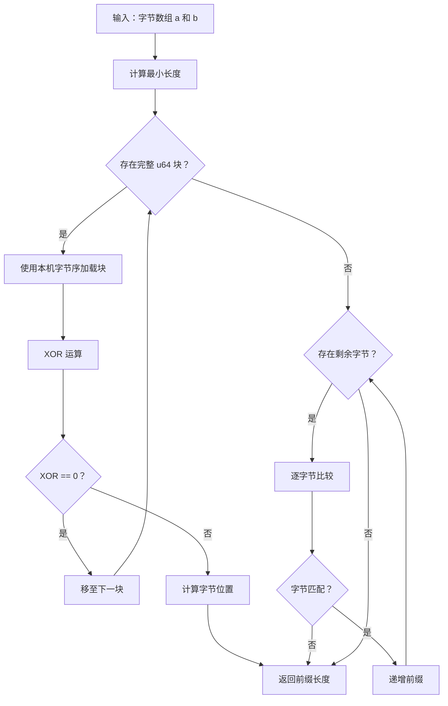

# shared_prefix_len : 高性能共享前缀长度计算

## 目录

- [特性](#特性)
- [使用示例](#使用示例)
- [设计思路](#设计思路)
- [技术堆栈](#技术堆栈)
- [目录结构](#目录结构)
- [API 说明](#api)

## 特性

- **高性能**：使用 u64 块比较，在 64 位系统上实现最优速度
- **零依赖**：生产代码无外部依赖
- **跨平台**：支持小端序和大端序架构
- **二进制安全**：适用于任意字节序列，包括 UTF-8 和二进制数据

## 使用示例

```rust
use shared_prefix_len::shared_prefix_len;

// 空字符串
assert_eq!(shared_prefix_len(b"", b""), 0);

// 相同字符串
assert_eq!(shared_prefix_len(b"hello", b"hello"), 5);

// 部分前缀匹配
assert_eq!(shared_prefix_len(b"hello", b"help"), 3);

// 不同字符串
assert_eq!(shared_prefix_len(b"abc", b"xyz"), 0);

// 不同长度
assert_eq!(shared_prefix_len(b"short", b"shorter"), 5);

// 二进制数据
assert_eq!(shared_prefix_len(&[0, 1, 2, 3], &[0, 1, 2, 4]), 3);

// UTF-8 文本
let a = "你好世界".as_bytes();
let b = "你好世界abc".as_bytes();
assert_eq!(shared_prefix_len(a, b), 12);
```

## 设计思路

算法采用两阶段比较策略：

1. **块比较**：使用本机字节序加载，每次比较 8 字节（u64）。在 64 位系统上显著提升性能。

2. **逐字节回退**：对无法组成完整块的剩余字节，回退到逐字节比较。

当检测到块不匹配时，算法使用 XOR 运算结合 trailing_zeros（小端序）或 leading_zeros（大端序）快速定位首个差异的确切字节位置。



## 技术堆栈

- **语言**：Rust 2024 Edition
- **架构**：零依赖纯 Rust 实现
- **优化**：使用 u64 块比较配合本机字节序加载
- **平台支持**：支持小端序和大端序系统

## 目录结构

```
shared_prefix_len/
├── src/
│   └── lib.rs          # 核心实现
├── tests/
│   └── main.rs         # 完整测试套件
├── readme/
│   ├── en.md           # 英文文档
│   └── zh.md           # 中文文档
├── Cargo.toml          # 包配置
└── README.mdt          # 文档索引
```

## API

### `shared_prefix_len`

计算两个字节切片之间的共享前缀长度。

```rust
pub fn shared_prefix_len(a: &[u8], b: &[u8]) -> usize
```

**参数：**
- `a`：第一个字节切片
- `b`：第二个字节切片

**返回值：**
- 最长公共前缀的长度

**性能特征：**
- 时间复杂度：O(min(len(a), len(b)))
- 空间复杂度：O(1)
- 针对 64 位系统使用 u64 块比较优化

**实现细节：**

函数使用 `chunks_exact` 迭代 8 字节块，使用 `from_ne_bytes` 加载每个块以获得最佳性能。发现不匹配时：

- 小端序系统：使用 `trailing_zeros()` 查找首个差异字节
- 大端序系统：使用 `leading_zeros()` 查找首个差异字节

处理完所有完整块后，逐个比较剩余字节。

---

## 历史背景

比较字节序列以查找公共前缀的概念源于早期计算机科学和数据结构设计。前缀比较技术是以下领域的基础：

- **Trie 数据结构**：Patricia trie（实用字母数字信息检索算法）使用前缀压缩高效存储键，由 Donald R. Morrison 于 1968 年发明。

- **字符串匹配算法**：20 世纪 60 年代和 70 年代的早期文本处理系统需要高效方法来比较字符串以进行索引和搜索。

- **网络协议**：IP 路由自互联网早期以来使用最长前缀匹配（LPM），需要快速前缀比较算法。

本库使用的基于块的优化方法反映了现代 CPU 架构的考虑。随着 20 世纪 90 年代 32 位和 64 位处理器的出现，同时比较多个字节的技术变得实用，现已成为高性能字符串处理库的标准方法。

本实现使用 XOR 配合 trailing_zeros/leading_zeros 的技术是经典的位操作技巧，已在优化的字符串库中使用数十年，展示了理解 CPU 指令集如何带来显著的性能提升。