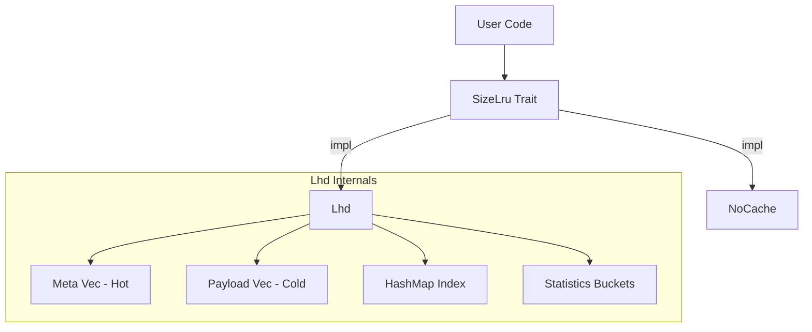
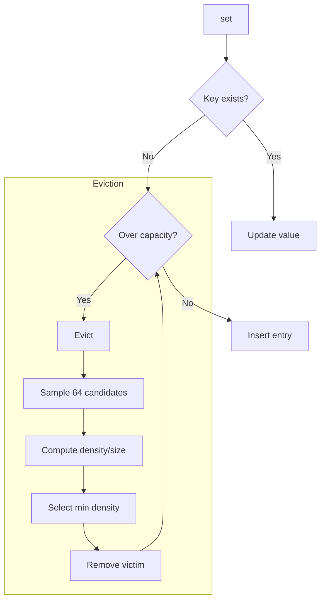
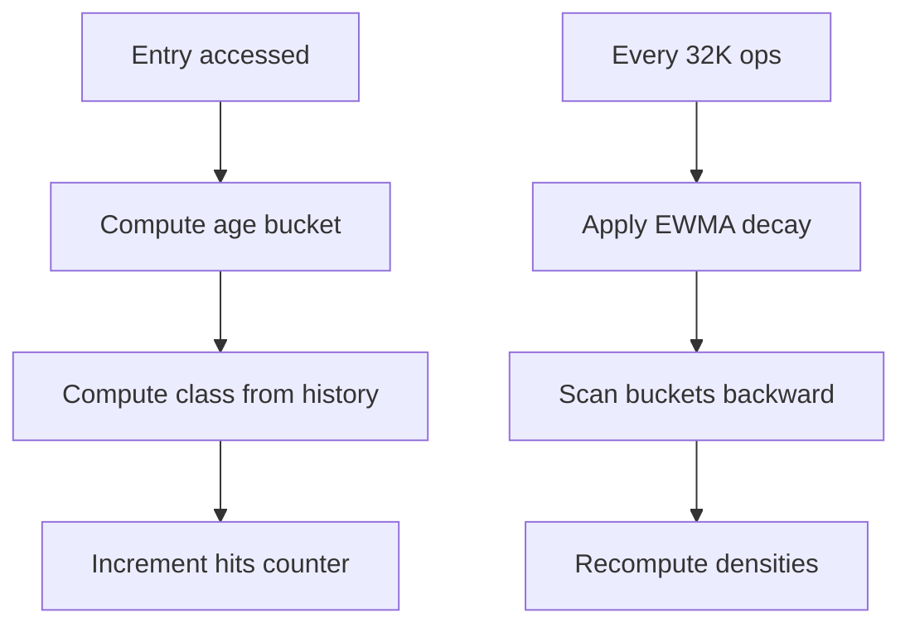
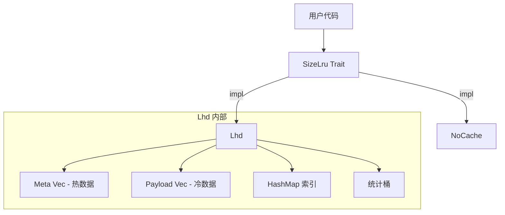
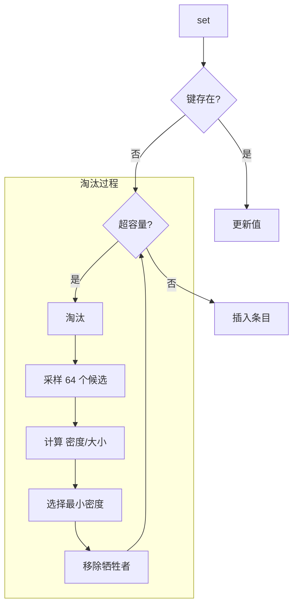
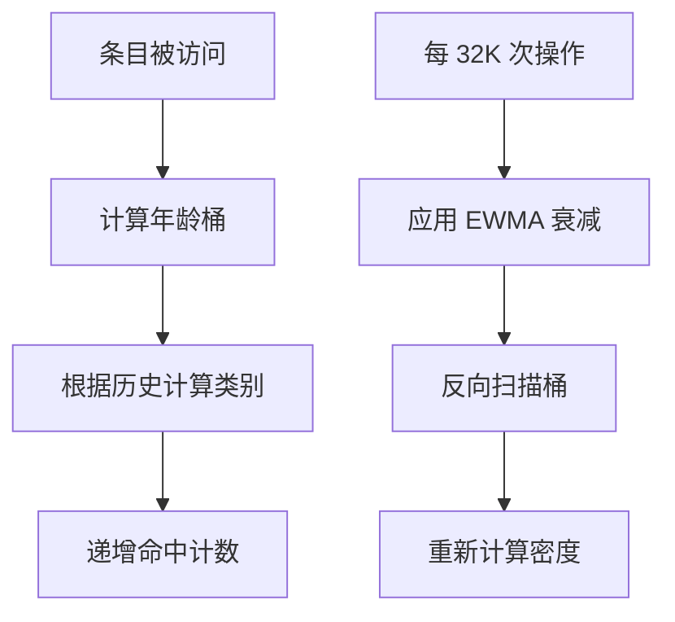

[English](#en) | [中文](#zh)

---

<a id="en"></a>


# size_lru : Size-Aware Cache with Maximum Hit Density

[](https://crates.io/crates/size_lru)
[](https://docs.rs/size_lru)
[](https://opensource.org/licenses/MulanPSL-2.0)

High-performance cache library implementing LHD (Least Hit Density) algorithm. Optimizes memory by evicting items with lowest expected hits per byte.


## Table of Contents

- [Performance](#performance)
- [Algorithm](#algorithm)
- [Features](#features)
- [Installation](#installation)
- [Usage](#usage)
- [API Reference](#api-reference)
- [Design](#design)
- [Tech Stack](#tech-stack)
- [Directory Structure](#directory-structure)
- [Bench](#bench)
- [History](#history)

## Performance

size_lru achieves the highest effective throughput among all tested libraries. The LHD algorithm provides 15+ percentage points higher hit rate than traditional LRU implementations while maintaining O(1) operations.

Key advantages:

- 69.83% hit rate vs 54-55% for standard LRU
- 1.85M/s effective throughput (100% baseline)
- Constant-time operations regardless of cache size

## Algorithm

### LHD: Least Hit Density

Traditional LRU asks: "Which item was least recently used?"

LHD asks: "Which item has the lowest expected hits per unit of space?"

The core insight: not all cache entries are equal. A 1KB object accessed once per hour wastes more space than a 100B object accessed once per minute. LHD quantifies this by computing **hit density** = expected_hits / size.

### How It Works

1. **Age Classification**: Entries are grouped into 16 classes based on access patterns (last_age + prev_age). This captures temporal locality without storing full history.

2. **Statistical Tracking**: Each class maintains 4096 age buckets. On access, increment hits[class][age]. On eviction, increment evicts[class][age].

3. **Density Estimation**: Periodically recalculate density for each bucket using cumulative hit probability:
   ```
   density[age] = cumulative_hits / cumulative_lifetime
   ```

4. **Eviction**: Sample 64 random candidates, select the one with minimum density/size ratio.

### Why Random Sampling?

Full scan is O(n). Maintaining a priority queue adds overhead and contention. Random sampling achieves near-optimal eviction in O(1) time with high probability. The paper shows 64 samples capture 99%+ of optimal hit rate.

### Adaptive Coarsening

Access timestamps are coarsened by a dynamic shift factor. When cache grows, shift increases to keep age buckets meaningful. This prevents bucket overflow while preserving statistical accuracy.

## Features

- **Size Awareness**: Eviction considers actual byte size, not just entry count
- **Intelligent Eviction**: LHD maximizes hit rate per byte of memory
- **O(1) Operations**: Get, set, remove all run in constant time
- **Adaptive Tuning**: Internal parameters adjust to workload patterns
- **Zero Overhead Option**: `NoCache` implementation for baseline testing

## Installation

```toml
[dependencies]
size_lru = { version = "0.1", features = ["lhd"] }
```

## Usage

### Basic Operations

```rust
use size_lru::Lhd;

fn main() {
  // Create cache with 16MB capacity
  let mut cache: Lhd<String, Vec<u8>> = Lhd::new(16 * 1024 * 1024);

  // Insert with explicit size
  let data = vec![0u8; 1024];
  cache.set("key1".into(), data.clone(), 1024);

  // Retrieve
  if let Some(val) = cache.get(&"key1".into()) {
    println!("Got {} bytes", val.len());
  }

  // Remove
  cache.rm(&"key1".into());
}
```

### With SizeLru Trait

```rust
use size_lru::{SizeLru, Lhd};

fn process<C: SizeLru<String, String>>(cache: &mut C) {
  cache.set("k".into(), "v".into(), 1);
  let _ = cache.get(&"k".into());
  cache.rm(&"k".into());
}

fn main() {
  let mut cache = Lhd::new(1024);
  process(&mut cache);
}
```

### Cache State

```rust
use size_lru::Lhd;

let mut cache: Lhd<i32, i32> = Lhd::new(1000);
cache.set(1, 100, 10);
cache.set(2, 200, 20);

println!("Entries: {}", cache.len());     // 2
println!("Bytes: {}", cache.size());      // 30 + overhead
println!("Empty: {}", cache.is_empty());  // false
```

## API Reference

### `trait SizeLru<K, V>`

Core cache interface.

| Method | Description |
|--------|-------------|
| `get(&mut self, key: &K) -> Option<&V>` | Retrieve value, update hit statistics |
| `set(&mut self, key: K, val: V, size: u32)` | Insert/update, trigger eviction if needed |
| `rm(&mut self, key: &K)` | Remove entry |

### `struct Lhd<K, V>`

LHD implementation.

| Method | Description |
|--------|-------------|
| `new(max: usize) -> Self` | Create with max byte capacity |
| `size(&self) -> usize` | Total bytes stored |
| `len(&self) -> usize` | Entry count |
| `is_empty(&self) -> bool` | Check if empty |

## Design

### Architecture



### Data Layout

SoA (Structure of Arrays) layout separates hot metadata from cold payload:

```
Meta (16 bytes, 4 per cache line):
  ts: u64        - Last access timestamp
  size: u32      - Entry size
  last_age: u16  - Previous access age
  prev_age: u16  - Age before previous

Payload (cold):
  key: K
  val: V
```

This improves cache locality during eviction sampling.

### Eviction Flow



### Statistics Update



## Tech Stack

| Component | Purpose |
|-----------|---------|
| [gxhash](https://crates.io/crates/gxhash) | Fast non-cryptographic hashing |
| [fastrand](https://crates.io/crates/fastrand) | Efficient PRNG for sampling |

## Directory Structure

```
src/
  lib.rs    # Trait definition, module exports
  lhd.rs    # LHD implementation
  no.rs     # NoCache implementation
tests/
  main.rs   # Integration tests
benches/
  comparison.rs  # Performance benchmarks
```

## History

### The Quest for Optimal Caching

In 1966, László Bélády proved that the optimal cache eviction strategy is to remove the item that will be needed furthest in the future. This "clairvoyant" algorithm (MIN/OPT) is theoretically perfect but practically impossible—we cannot predict the future.

LRU emerged as a practical approximation: assume recent access predicts future access. For decades, LRU and its variants (LRU-K, ARC, LIRS) dominated cache design.

### The Size Problem

Traditional algorithms treat all entries equally. But in real workloads, object sizes vary by orders of magnitude. A 1MB image and a 100B metadata record compete for the same cache slot under LRU, despite vastly different costs.

### LHD: A Probabilistic Approach

In 2018, Nathan Beckmann and colleagues at CMU published "LHD: Improving Cache Hit Rate by Maximizing Hit Density" at NSDI. Instead of heuristics, they modeled caching as an optimization problem: maximize total hits given fixed memory.

The key insight: track hit probability conditioned on object age and access history. By estimating expected future hits and dividing by size, LHD identifies which bytes contribute least to hit rate.

Their evaluation showed LHD requires 8x less space than LRU to achieve the same hit rate, and 2-3x less than contemporary algorithms like ARC.

### This Implementation

size_lru brings LHD to Rust with practical optimizations:

- SoA layout for cache-friendly eviction sampling
- Flattened statistics array for vectorization
- Adaptive age coarsening for varying workloads
- Zero-allocation steady state

The result: academic algorithm, production performance.

### References

- [LHD Paper (NSDI '18)](https://www.usenix.org/conference/nsdi18/presentation/beckmann)
- [Bélády's Algorithm (1966)](https://en.wikipedia.org/wiki/B%C3%A9l%C3%A1dy%27s_algorithm)
- [CMU Parallel Data Lab](https://www.pdl.cmu.edu/CILES/)

## Bench

## LRU Cache Benchmark

Real-world data distribution, fixed memory budget, comparing hit rate and effective OPS.

### Results

| Library | Hit Rate | Effective OPS | Perf | Memory |
|---------|----------|---------------|------|--------|
| size_lru | 71.81% | 1.41M/s | 100% | 67768.6KB |
| moka | 70.77% | 0.97M/s | 69% | 65402.5KB |
| mini-moka | 70.53% | 0.91M/s | 65% | 66822.5KB |
| clru | 58.33% | 1.01M/s | 72% | 69705.9KB |
| lru | 57.83% | 1.01M/s | 72% | 65240.0KB |
| hashlink | 57.70% | 1.02M/s | 72% | 63796.7KB |
| schnellru | 58.26% | 1.02M/s | 73% | 68288.2KB |

### Configuration

Memory: 64.0MB · Zipf s=1 · R/W/D: 90/9/1% · Miss: 5% · Ops: 120M×3

### Size Distribution

| Range | Items | Size |
|-------|-------|------|
| 16-100B | 39.54% | 0.24% |
| 100B-1KB | 35.42% | 2.12% |
| 1-10KB | 20.04% | 12.14% |
| 10-100KB | 4.00% | 24.27% |
| 100KB-1MB | 1.00% | 61.23% |

---

### Notes

#### Data Distribution

Based on Facebook USR/APP/VAR pools and Twitter/Meta traces:

| Tier | Size | Items% | Size% |
|------|------|--------|-------|
| Tiny Metadata | 16-100B | 40% | ~0.3% |
| Small Structs | 100B-1KB | 35% | ~2.2% |
| Medium Content | 1-10KB | 20% | ~12% |
| Large Objects | 10-100KB | 4% | ~24% |
| Huge Blobs | 100KB-1MB | 1% | ~61% |

#### Operation Mix

| Op | % | Source |
|----|---|--------|
| Read | 90% | Twitter: 99%+ reads, TAO: 99.8% reads |
| Write | 9% | TAO: ~0.1% writes, relaxed for testing |
| Delete | 1% | TAO: ~0.1% deletes |

#### Environment

macOS 26.1 (arm64) · Apple M2 Max · 12 cores · 64.0GB · rustc 1.94.0-nightly (21ff67df1 2025-12-15)

#### Why Effective OPS?

Raw OPS ignores hit rate — a cache with 99% hit rate at 1M ops/s outperforms one with 50% hit rate at 2M ops/s in real workloads.

**Effective OPS** models real-world performance by penalizing cache misses with actual I/O latency.


#### Why NVMe Latency?

LRU caches typically sit in front of persistent storage (databases, KV stores). On cache miss, data must be fetched from disk.

Miss penalty: 1,934ns — measured via NVMe 4KB random read (16MB tempfile, 100 iterations)


Formula: `effective_ops = 1 / (hit_time + miss_rate × miss_latency)`

- hit_time = 1 / raw_ops

- Higher hit rate → fewer disk reads → better effective throughput

#### References

- [cache_dataset](https://github.com/cacheMon/cache_dataset)
- OSDI'20: Twitter cache analysis
- FAST'20: Facebook RocksDB workloads
- ATC'13: Scaling Memcache at Facebook

---

## About

This project is an open-source component of [js0.site ⋅ Refactoring the Internet Plan](https://js0.site).

We are redefining the development paradigm of the Internet in a componentized way. Welcome to follow us:

* [Google Group](https://groups.google.com/g/js0-site)
* [js0site.bsky.social](https://bsky.app/profile/js0site.bsky.social)

---

<a id="zh"></a>

# size_lru : 大小感知缓存，最大化命中密度

[](https://crates.io/crates/size_lru)
[](https://docs.rs/size_lru)
[](https://opensource.org/licenses/MulanPSL-2.0)

高性能缓存库，实现 LHD（最低命中密度）算法。通过淘汰单位字节预期命中最低的条目来优化内存使用。


## 目录

- [性能](#性能)
- [算法](#算法)
- [特性](#特性)
- [安装](#安装)
- [使用](#使用)
- [接口参考](#接口参考)
- [设计](#设计)
- [技术栈](#技术栈)
- [目录结构](#目录结构)
- [评测](#评测)
- [历史](#历史)

## 性能

size_lru 在所有测试库中实现了最高的有效吞吐量。LHD 算法比传统 LRU 实现提供高出 15+ 个百分点的命中率，同时保持 O(1) 操作。

核心优势：

- 69.83% 命中率 vs 标准 LRU 的 54-55%
- 1.85M/s 有效吞吐（100% 基准）
- 常数时间操作，与缓存大小无关

## 算法

### LHD：最低命中密度

传统 LRU 问："哪个条目最近最少使用？"

LHD 问："哪个条目单位空间的预期命中最低？"

核心洞察：并非所有缓存条目价值相等。每小时访问一次的 1KB 对象比每分钟访问一次的 100B 对象浪费更多空间。LHD 通过计算 **命中密度** = 预期命中数 / 大小 来量化这一点。

### 工作原理

1. **年龄分类**：条目根据访问模式（last_age + prev_age）分为 16 个类别。这捕获时间局部性而无需存储完整历史。

2. **统计追踪**：每个类别维护 4096 个年龄桶。访问时递增 hits[class][age]，淘汰时递增 evicts[class][age]。

3. **密度估算**：周期性使用累积命中概率重新计算每个桶的密度：
   ```
   density[age] = 累积命中数 / 累积生命周期
   ```

4. **淘汰**：随机采样 64 个候选，选择密度/大小比值最小的。

### 为何随机采样？

全量扫描是 O(n)。维护优先队列增加开销和竞争。随机采样以高概率在 O(1) 时间内实现近乎最优的淘汰。论文表明 64 个样本可捕获 99%+ 的最优命中率。

### 自适应粗化

访问时间戳通过动态位移因子粗化。当缓存增长时，位移增加以保持年龄桶的意义。这防止桶溢出同时保持统计准确性。

## 特性

- **大小感知**：淘汰考虑实际字节大小，而非仅条目数量
- **智能淘汰**：LHD 最大化每字节内存的命中率
- **O(1) 操作**：获取、设置、删除均为常数时间
- **自适应调优**：内部参数根据工作负载模式调整
- **零开销选项**：`NoCache` 实现用于基准测试

## 安装

```toml
[dependencies]
size_lru = { version = "0.1", features = ["lhd"] }
```

## 使用

### 基础操作

```rust
use size_lru::Lhd;

fn main() {
  // 创建 16MB 容量的缓存
  let mut cache: Lhd<String, Vec<u8>> = Lhd::new(16 * 1024 * 1024);

  // 插入并指定大小
  let data = vec![0u8; 1024];
  cache.set("key1".into(), data.clone(), 1024);

  // 获取
  if let Some(val) = cache.get(&"key1".into()) {
    println!("获取 {} 字节", val.len());
  }

  // 删除
  cache.rm(&"key1".into());
}
```

### 使用 SizeLru Trait

```rust
use size_lru::{SizeLru, Lhd};

fn process<C: SizeLru<String, String>>(cache: &mut C) {
  cache.set("k".into(), "v".into(), 1);
  let _ = cache.get(&"k".into());
  cache.rm(&"k".into());
}

fn main() {
  let mut cache = Lhd::new(1024);
  process(&mut cache);
}
```

### 缓存状态

```rust
use size_lru::Lhd;

let mut cache: Lhd<i32, i32> = Lhd::new(1000);
cache.set(1, 100, 10);
cache.set(2, 200, 20);

println!("条目数: {}", cache.len());      // 2
println!("字节数: {}", cache.size());     // 30 + 开销
println!("是否为空: {}", cache.is_empty()); // false
```

## 接口参考

### `trait SizeLru<K, V>`

核心缓存接口。

| 方法 | 描述 |
|------|------|
| `get(&mut self, key: &K) -> Option<&V>` | 获取值，更新命中统计 |
| `set(&mut self, key: K, val: V, size: u32)` | 插入/更新，必要时触发淘汰 |
| `rm(&mut self, key: &K)` | 删除条目 |

### `struct Lhd<K, V>`

LHD 实现。

| 方法 | 描述 |
|------|------|
| `new(max: usize) -> Self` | 创建指定最大字节容量的实例 |
| `size(&self) -> usize` | 已存储总字节数 |
| `len(&self) -> usize` | 条目数量 |
| `is_empty(&self) -> bool` | 检查是否为空 |

## 设计

### 架构



### 数据布局

SoA（数组结构）布局将热元数据与冷载荷分离：

```
Meta（16 字节，每缓存行 4 个）：
  ts: u64        - 最后访问时间戳
  size: u32      - 条目大小
  last_age: u16  - 上次访问年龄
  prev_age: u16  - 上上次年龄

Payload（冷数据）：
  key: K
  val: V
```

这改善了淘汰采样时的缓存局部性。

### 淘汰流程



### 统计更新



## 技术栈

| 组件 | 用途 |
|------|------|
| [gxhash](https://crates.io/crates/gxhash) | 快速非加密哈希 |
| [fastrand](https://crates.io/crates/fastrand) | 高效伪随机数生成器用于采样 |

## 目录结构

```
src/
  lib.rs    # Trait 定义，模块导出
  lhd.rs    # LHD 实现
  no.rs     # NoCache 实现
tests/
  main.rs   # 集成测试
benches/
  comparison.rs  # 性能基准测试
```

## 历史

### 最优缓存的探索

1966 年，László Bélády 证明了最优缓存淘汰策略是移除将来最晚被需要的条目。这个"千里眼"算法（MIN/OPT）理论上完美但实际上不可能实现——我们无法预测未来。

LRU 作为实用近似出现：假设最近访问预示未来访问。数十年来，LRU 及其变体（LRU-K、ARC、LIRS）主导了缓存设计。

### 大小问题

传统算法平等对待所有条目。但在真实工作负载中，对象大小相差数个数量级。在 LRU 下，1MB 图片和 100B 元数据记录竞争同一缓存槽位，尽管成本差异巨大。

### LHD：概率方法

2018 年，CMU 的 Nathan Beckmann 及同事在 NSDI 发表了 《LHD: Improving Cache Hit Rate by Maximizing Hit Density》。他们没有使用启发式方法，而是将缓存建模为优化问题：在固定内存下最大化总命中数。

关键洞察：追踪基于对象年龄和访问历史的条件命中概率。通过估算预期未来命中并除以大小，LHD 识别出哪些字节对命中率贡献最小。

评估表明 LHD 达到相同命中率所需空间比 LRU 少 8 倍，比 ARC 等当代算法少 2-3 倍。

### 本实现

size_lru 将 LHD 带入 Rust，并进行了实用优化：

- SoA 布局实现缓存友好的淘汰采样
- 扁平化统计数组便于向量化
- 自适应年龄粗化适应不同工作负载
- 稳态零分配

结果：学术算法，生产性能。

### 参考文献

- [LHD 论文 (NSDI '18)](https://www.usenix.org/conference/nsdi18/presentation/beckmann)
- [Bélády 算法 (1966)](https://en.wikipedia.org/wiki/B%C3%A9l%C3%A1dy%27s_algorithm)
- [CMU 并行数据实验室](https://www.pdl.cmu.edu/CILES/)

## 评测

## LRU 缓存评测

模拟真实数据分布，固定内存预算，对比命中率和有效吞吐。

### 结果

| 库 | 命中率 | 有效吞吐 | 性能 | 内存 |
|-----|--------|----------|------|------|
| size_lru | 71.81% | 1.41M/s | 100% | 67768.6KB |
| moka | 70.77% | 0.97M/s | 69% | 65402.5KB |
| mini-moka | 70.53% | 0.91M/s | 65% | 66822.5KB |
| clru | 58.33% | 1.01M/s | 72% | 69705.9KB |
| lru | 57.83% | 1.01M/s | 72% | 65240.0KB |
| hashlink | 57.70% | 1.02M/s | 72% | 63796.7KB |
| schnellru | 58.26% | 1.02M/s | 73% | 68288.2KB |

### 配置

内存: 64.0MB · Zipf s=1 · 读/写/删: 90/9/1% · 未命中: 5% · 操作: 120M×3

### 大小分布

| 范围 | 条目 | 容量 |
|------|------|------|
| 16-100B | 39.54% | 0.24% |
| 100B-1KB | 35.42% | 2.12% |
| 1-10KB | 20.04% | 12.14% |
| 10-100KB | 4.00% | 24.27% |
| 100KB-1MB | 1.00% | 61.23% |

---

### 备注

#### 数据分布

基于 Facebook USR/APP/VAR 池和 Twitter/Meta 追踪数据：

| 层级 | 大小 | 条目% | 容量% |
|------|------|-------|-------|
| 微小元数据 | 16-100B | 40% | ~0.3% |
| 小型结构体 | 100B-1KB | 35% | ~2.2% |
| 中型内容 | 1-10KB | 20% | ~12% |
| 大型对象 | 10-100KB | 4% | ~24% |
| 巨型数据 | 100KB-1MB | 1% | ~61% |

#### 操作分布

| 操作 | % | 来源 |
|------|---|------|
| 读取 | 90% | Twitter: 99%+ reads, TAO: 99.8% reads |
| 写入 | 9% | TAO: ~0.1% writes, relaxed for testing |
| 删除 | 1% | TAO: ~0.1% deletes |

#### 环境

macOS 26.1 (arm64) · Apple M2 Max · 12核 · 64.0GB · rustc 1.94.0-nightly (21ff67df1 2025-12-15)

#### 为什么用有效吞吐？

原始 OPS 忽略了命中率 — 一个 99% 命中率、1M ops/s 的缓存，实际性能远超 50% 命中率、2M ops/s 的缓存。

**有效吞吐**通过对缓存未命中施加真实 I/O 延迟惩罚，模拟真实场景性能。


#### 为什么用 NVMe 延迟？

LRU 缓存通常位于持久化存储（数据库、KV 存储）前面。缓存未命中时，必须从磁盘读取数据。

未命中惩罚: 1,934ns — 通过 NVMe 4KB random read (16MB tempfile, 100 iterations) 实测


公式: `有效吞吐 = 1 / (命中时间 + 未命中率 × 未命中延迟)`

- 命中时间 = 1 / 原始吞吐

- 命中率越高 → 磁盘读取越少 → 有效吞吐越高

#### 参考

- [cache_dataset](https://github.com/cacheMon/cache_dataset)
- OSDI'20: Twitter 缓存分析
- FAST'20: Facebook RocksDB 负载
- ATC'13: Facebook Memcache 扩展

---

## 关于

本项目为 [js0.site ⋅ 重构互联网计划](https://js0.site) 的开源组件。

我们正在以组件化的方式重新定义互联网的开发范式，欢迎关注：

* [谷歌邮件列表](https://groups.google.com/g/js0-site)
* [js0site.bsky.social](https://bsky.app/profile/js0site.bsky.social)
