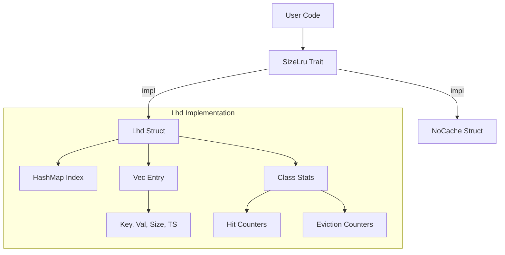
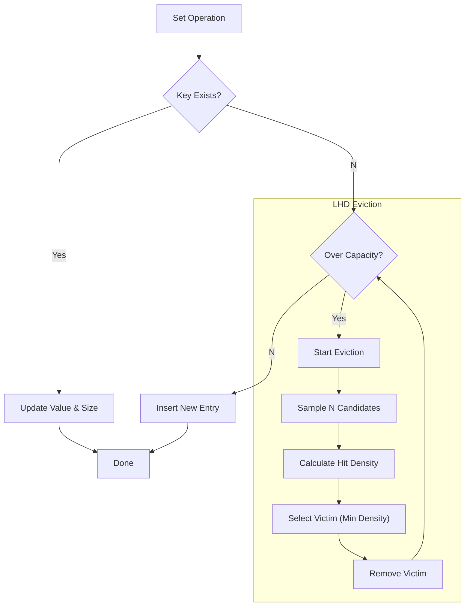
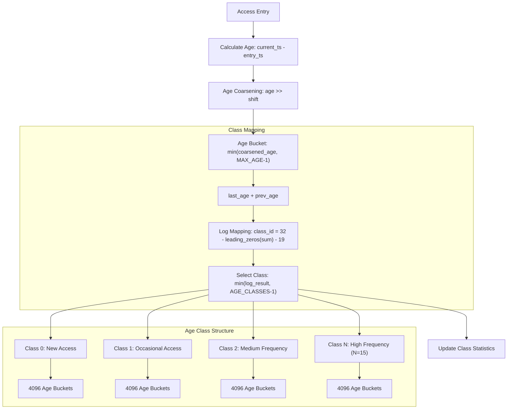
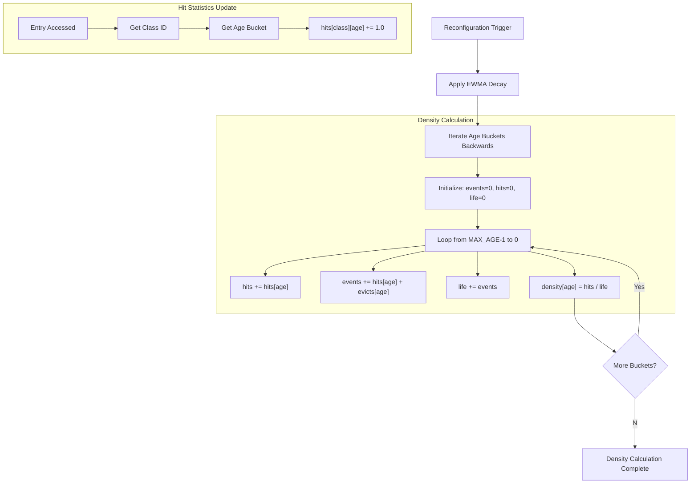
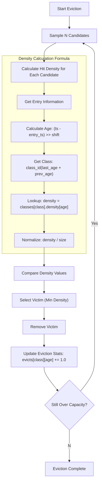
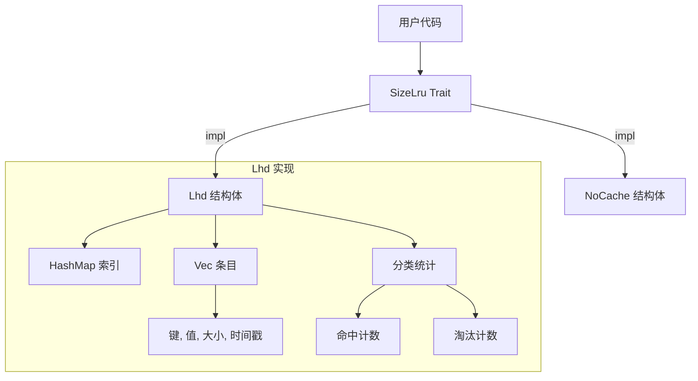
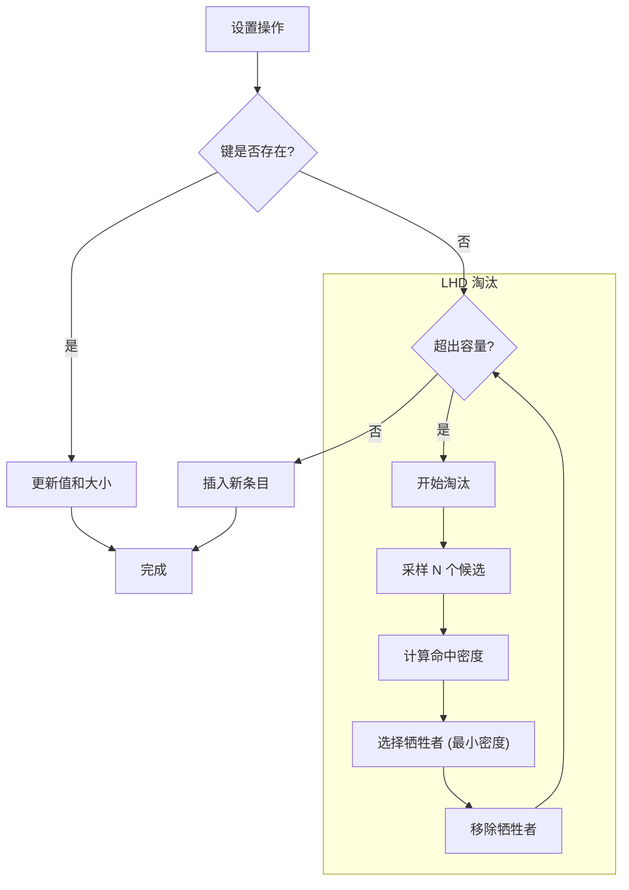
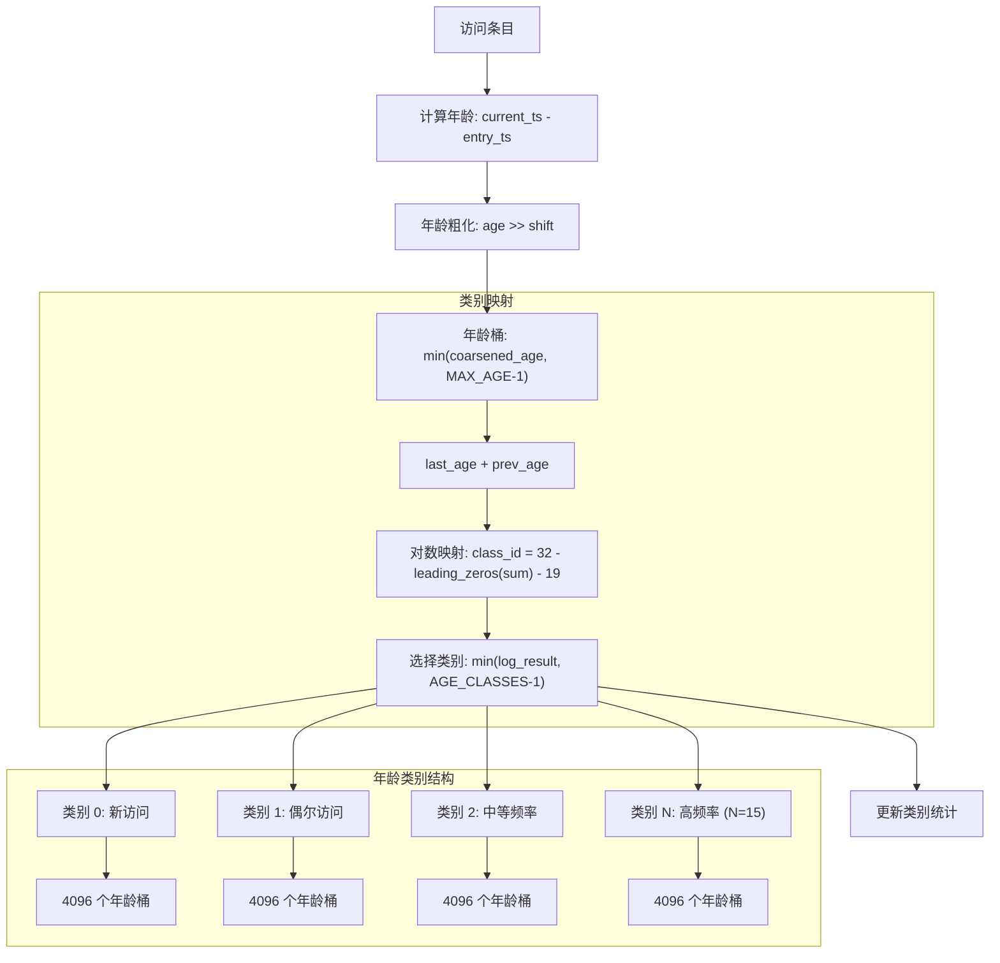
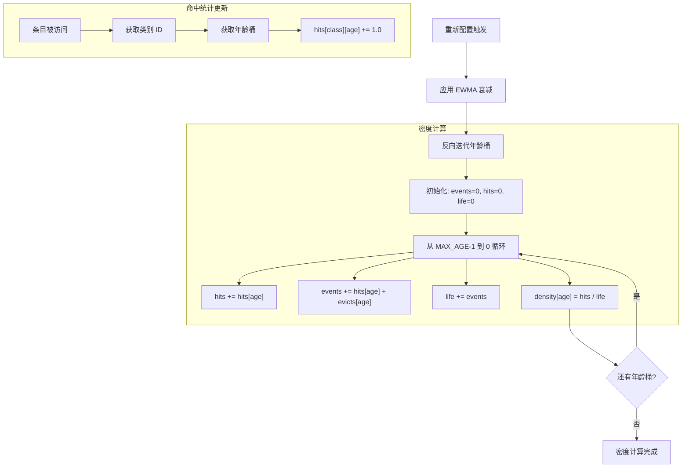
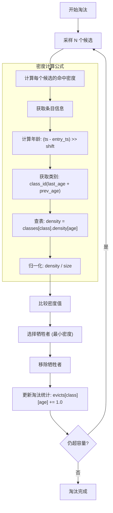

[English](#en) | [中文](#zh)

---

<a id="en"></a>

# size_lru : Intelligent Size-Aware Cache Library

High-performance, size-aware cache library implementing intelligent eviction strategies for optimal memory usage.

## Table of Contents

- [Features](#features)
- [Installation](#installation)
- [Usage](#usage)
- [API Reference](#api-reference)
- [Design](#design)
- [Technology Stack](#technology-stack)
- [Directory Structure](#directory-structure)
- [History](#history)

## Features

- **Size Awareness**: Optimizes storage based on actual object size rather than count.
- **Intelligent Eviction**: Implements LHD (Least Hit Density) algorithm to maximize hit rate.
- **Constant Complexity**: Guarantees O(1) time access for get, set, and remove operations.
- **Adaptive Tuning**: Automatically adjusts internal parameters to match workload patterns.
- **Zero Overhead**: Provides `NoCache` implementation for performance baselining.

## Installation

Add to `Cargo.toml`:

```toml
[dependencies]
size_lru = { version = "0.1.0", features = ["lhd"] }
```

## Usage

Demonstration code based on `tests/main.rs`.

### Basic Operations

```rust
use size_lru::Lhd;

fn main() {
  // Initialize cache with capacity
  let mut cache: Lhd<&str, &str> = Lhd::new(1024);

  // Set values with explicit size
  cache.set("k1", "v1", 10);
  cache.set("k2", "v2", 20);

  // Retrieve value
  assert_eq!(cache.get(&"k1"), Some(&"v1"));

  // Check state
  assert_eq!(cache.len(), 2);
  assert_eq!(cache.size(), 30);

  // Remove value
  cache.rm(&"k2");
  assert_eq!(cache.get(&"k2"), None);
}
```

### Generic Trait Usage

```rust
use size_lru::{SizeLru, Lhd};

fn cache_op<K, V>(cache: &mut impl SizeLru<K, V>, key: K, val: V, size: u32) {
  cache.set(key, val, size);
}
```

## API Reference

### `trait SizeLru<K, V>`

Core interface for cache implementations.

- `fn get(&mut self, key: &K) -> Option<&V>`: Retrieve reference to value. Updates hit statistics.
- `fn set(&mut self, key: K, val: V, size: u32)`: Insert or update value. Triggers eviction if capacity exceeded.
- `fn rm(&mut self, key: &K)`: Remove value by key.

### `struct Lhd<K, V>`

LHD algorithm implementation.

- `fn new(max: usize) -> Self`: Create new instance with maximum byte capacity.
- `fn size(&self) -> usize`: Return total size of stored items in bytes.
- `fn len(&self) -> usize`: Return count of stored items.
- `fn is_empty(&self) -> bool`: Return true if cache contains no items.

## Design

### Architecture



### Eviction Logic



### Generational Mechanism



### Hit Rate Calculation Mechanism



### Density Calculation and Eviction Flow



## Technology Stack

- **Rust**: Systems programming language.
- **gxhash**: High-performance, non-cryptographic hashing.
- **fastrand**: Efficient pseudo-random number generation.

## Directory Structure

```
src/
  lib.rs    # Trait definitions and module exports
  lhd.rs    # LHD algorithm implementation
  no.rs     # No-op implementation
tests/
  main.rs   # Integration tests and demos
readme/
  en.md     # English documentation
  zh.md     # Chinese documentation
```

## History

The **LHD (Least Hit Density)** algorithm originates from the NSDI '18 paper "LHD: Improving Cache Hit Rate by Maximizing Hit Density". The authors (Beckmann et al.) proposed replacing complex heuristics with a probabilistic framework. Instead of asking "which item was least recently used?", LHD asks "which item has the least expected hits per unit of space?". By estimating the probability of future hits based on object age and size, LHD maximizes the total hit rate of the cache. This implementation brings these theoretical gains to a practical Rust library.

### References

- **Paper**: [LHD: Improving Cache Hit Rate by Maximizing Hit Density](https://www.usenix.org/conference/nsdi18/presentation/beckmann) (NSDI '18)
- **PDF**: [Download Paper](https://www.usenix.org/system/files/conference/nsdi18/nsdi18-beckmann.pdf)

---

## About

This project is an open-source component of [js0.site ⋅ Refactoring the Internet Plan](https://js0.site).

We are redefining the development paradigm of the Internet in a componentized way. Welcome to follow us:

* [Google Group](https://groups.google.com/g/js0-site)
* [js0site.bsky.social](https://bsky.app/profile/js0site.bsky.social)

---

<a id="zh"></a>

# size_lru : 智能大小感知缓存库

具备智能淘汰策略的高性能大小感知缓存库，优化内存使用。

## 目录

- [功能特性](#功能特性)
- [安装指南](#安装指南)
- [使用演示](#使用演示)
- [接口参考](#接口参考)
- [设计架构](#设计架构)
- [技术堆栈](#技术堆栈)
- [目录结构](#目录结构)
- [历史背景](#历史背景)

## 功能特性

- **大小感知**：基于对象实际大小而非数量优化存储。
- **智能淘汰**：实现 LHD (最低命中密度) 算法以最大化命中率。
- **常数复杂度**：确保获取、设置和删除操作的 O(1) 时间复杂度。
- **自适应调整**：自动调整内部参数以匹配工作负载模式。
- **零开销**：提供 `NoCache` 实现用于性能基准测试。

## 安装指南

在 `Cargo.toml` 中添加：

```toml
[dependencies]
size_lru = { version = "0.1.0", features = ["lhd"] }
```

## 使用演示

演示代码基于 `tests/main.rs`。

### 基础操作

```rust
use size_lru::Lhd;

fn main() {
  // 初始化指定容量的缓存
  let mut cache: Lhd<&str, &str> = Lhd::new(1024);

  // 设置带有明确大小的值
  cache.set("k1", "v1", 10);
  cache.set("k2", "v2", 20);

  // 获取值
  assert_eq!(cache.get(&"k1"), Some(&"v1"));

  // 检查状态
  assert_eq!(cache.len(), 2);
  assert_eq!(cache.size(), 30);

  // 删除值
  cache.rm(&"k2");
  assert_eq!(cache.get(&"k2"), None);
}
```

### 通用 Trait 用法

```rust
use size_lru::{SizeLru, Lhd};

fn cache_op<K, V>(cache: &mut impl SizeLru<K, V>, key: K, val: V, size: u32) {
  cache.set(key, val, size);
}
```

## 接口参考

### `trait SizeLru<K, V>`

缓存实现的各项核心接口。

- `fn get(&mut self, key: &K) -> Option<&V>`: 获取值引用。更新命中统计信息。
- `fn set(&mut self, key: K, val: V, size: u32)`: 插入或更新值。若超出容量将触发淘汰。
- `fn rm(&mut self, key: &K)`: 按键删除值。

### `struct Lhd<K, V>`

LHD 算法实现。

- `fn new(max: usize) -> Self`: 创建具有最大字节容量的新实例。
- `fn size(&self) -> usize`: 返回存储项目的总大小（字节）。
- `fn len(&self) -> usize`: 返回存储项目的数量。
- `fn is_empty(&self) -> bool`: 如果缓存不包含任何项目，返回真。

## 设计架构

### 架构图



### 淘汰逻辑



### 分代机制详解



### 命中率计算机制



### 密度计算与淘汰流程



## 技术堆栈

- **Rust**: 系统编程语言。
- **gxhash**: 高性能非加密哈希。
- **fastrand**: 高效伪随机数生成。

## 目录结构

```
src/
  lib.rs    # Trait 定义和模块导出
  lhd.rs    # LHD 算法实现
  no.rs     # 空操作实现
tests/
  main.rs   # 集成测试和演示
readme/
  en.md     # 英文文档
  zh.md     # 中文文档
```

## 历史背景

**LHD (最低命中密度)** 算法源自 NSDI '18 论文 《LHD: Improving Cache Hit Rate by Maximizing Hit Density》。作者 (Beckmann 等人) 提议用概率框架替代复杂的启发式算法。LHD 不问“哪一项最近最少使用？”，而是问“哪一项单位空间的预期命中率最低？”。通过根据对象年龄和大小估算未来命中的概率，LHD 最大化了缓存的总命中率。本实现将这些理论成果转化为实用的 Rust 库。

### 参考文献

- **论文**: [LHD: Improving Cache Hit Rate by Maximizing Hit Density](https://www.usenix.org/conference/nsdi18/presentation/beckmann) (NSDI '18)
- **PDF**: [下载论文](https://www.usenix.org/system/files/conference/nsdi18/nsdi18-beckmann.pdf)

---

## 关于

本项目为 [js0.site ⋅ 重构互联网计划](https://js0.site) 的开源组件。

我们正在以组件化的方式重新定义互联网的开发范式，欢迎关注：

* [谷歌邮件列表](https://groups.google.com/g/js0-site)
* [js0site.bsky.social](https://bsky.app/profile/js0site.bsky.social)
