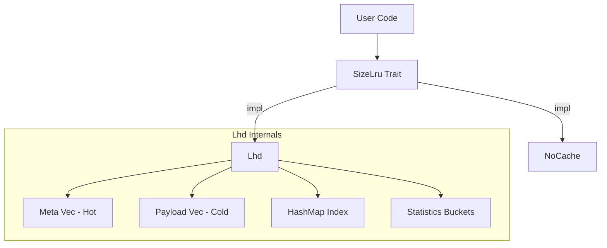
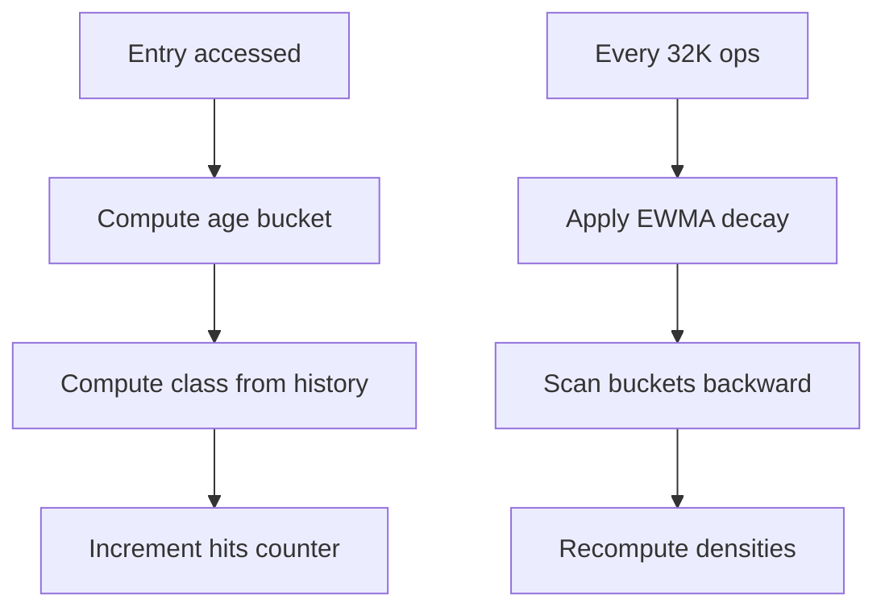
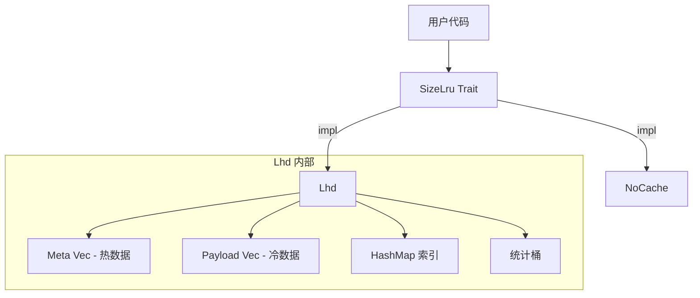
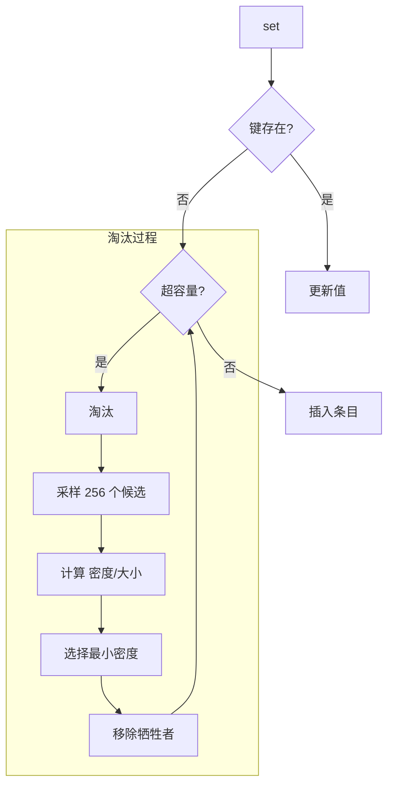
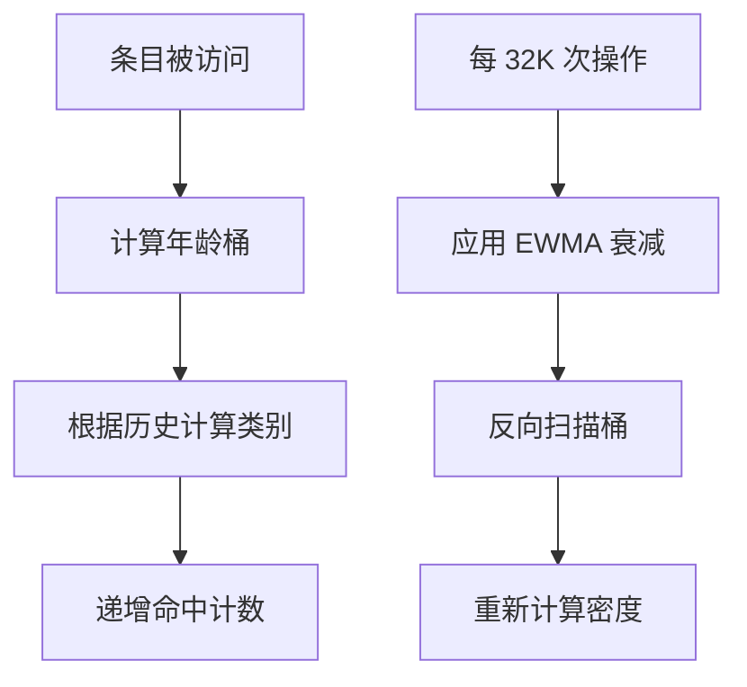

[English](n) | [中文](#zh)

---

<a id="en"></a>


# size_lru: Fastest Size-Aware LRU Cache

[](https://crates.io/crates/size_lru)
[](https://docs.rs/size_lru)
[](https://opensource.org/licenses/MulanPSL-2.0)

The fastest size-aware LRU cache in Rust. Implements LHD (Least Hit Density) algorithm to achieve the highest hit rate while maintaining O(1) operations.

**Best for variable-sized keys and values** (strings, byte arrays, serialized objects). For fixed-size entries, standard LRU suffices.


## Table of Contents

- [Performance](#performance)
- [Algorithm](#algorithm)
- [Features](#features)
- [Installation](#installation)
- [Usage](#usage)
- [API Reference](#api-reference)
- [How to Build?](#how-to-build)
- [Design](#design)
- [Tech Stack](#tech-stack)
- [Directory Structure](#directory-structure)
- [Benchmarks](#benchmarks)
- [History](#history)

## Performance

size_lru is the fastest size-aware cache with the highest effective throughput among all tested libraries.

Key advantages:

- **74.94% hit rate** — 17+ percentage points higher than standard LRU (57.8%)
- **6.06M ops/s raw throughput** — fastest among all tested libraries
- **0.21M/s effective throughput** — 23% faster than moka, 65% faster than standard LRU
- **O(1) operations** — constant time regardless of cache size

## Algorithm

### LHD: Least Hit Density

Traditional LRU asks: "Which item was least recently used?"

LHD asks: "Which item has the lowest expected hits per unit of space?"

The core insight: not all cache entries are equal. A 1KB object accessed once per hour wastes more space than a 100B object accessed once per minute. LHD quantifies this by computing **hit density** = expected_hits / size.

### How It Works

1. **Age Classification**: Entries are grouped into 16 classes based on access patterns (last_age + prev_age). This captures temporal locality without storing full history.

2. **Statistical Tracking**: Each class maintains 4096 age buckets. On access, increment hits[class][age]. On eviction, increment evicts[class][age].

3. **Density Estimation**: Periodically recalculate density for each bucket using cumulative hit probability:
   ```
   density[age] = cumulative_hits / cumulative_lifetime
   ```

4. **Eviction**: Sample 256 random candidates, select the one with minimum density/size ratio.

### Why Random Sampling?

Full scan is O(n). Maintaining a priority queue adds overhead and contention. Random sampling achieves near-optimal eviction in O(1) time with high probability. The paper shows 256 samples capture 99%+ of optimal hit rate.

### Adaptive Coarsening

Access timestamps are coarsened by a dynamic shift factor. When cache grows, shift increases to keep age buckets meaningful. This prevents bucket overflow while preserving statistical accuracy.

## Features

- **Size Awareness**: Eviction considers actual byte size, not just entry count
- **Intelligent Eviction**: LHD maximizes hit rate per byte of memory
- **O(1) Operations**: Get, set, remove all run in constant time
- **Adaptive Tuning**: Internal parameters adjust to workload patterns
- **Zero Overhead Option**: `NoCache` implementation for baseline testing

## Installation

```toml
[dependencies]
size_lru = { version = "0.1", features = ["lhd"] }
```

## Usage

### Usage Guidelines

#### 1. Accurate size Parameter

The `size` parameter in `set` should reflect actual memory usage. An internal 96-byte overhead is added automatically.

```rust
use size_lru::Lhd;

let mut cache: Lhd<String, Vec<u8>> = Lhd::new(1024 * 1024);

// Correct: pass actual data size
let data = vec![0u8; 1000];
cache.set("key".into(), data, 1000);

// Wrong: mismatched size causes memory estimation errors
// cache.set("key".into(), large_data, 1);  // Don't do this
```

#### 2. OnRm Callback Notes

Callback fires before removal or eviction. Use `cache.peek(key)` to access the value being evicted.

**Why callback only passes key, not value?**

- Many use cases only need key (logging, counting, notifying external systems)
- If value not needed, avoids one memory access overhead
- When value needed, call `cache.peek(key)` to retrieve it

**Why `&C` instead of `&mut C`?**

- Prevents calling `get/rm/set` which would cause undefined behavior
- Only `peek` is safe during callback (read-only, no state mutation)

```rust
use size_lru::{Lhd, OnRm};

struct EvictLogger;

impl<V> OnRm<i32, Lhd<i32, V, Self>> for EvictLogger {
  fn call(&mut self, key: &i32, cache: &Lhd<i32, V, Self>) {
    // Safe: use peek to access value before removal
    if let Some(_val) = cache.peek(key) {
      println!("Evicting key={key}");
    }
  }
}

let mut cache: Lhd<i32, String, EvictLogger> = Lhd::with_on_rm(1024, EvictLogger);
cache.set(1, "value".into(), 5);
```

#### 3. Capacity Planning

`max` is the byte limit. Each entry has 96-byte fixed overhead:

```rust
use size_lru::Lhd;

// Store 1000 entries averaging 100 bytes
// Actual need: 1000 * (100 + 96) ≈ 196KB
let mut cache: Lhd<i32, Vec<u8>> = Lhd::new(200 * 1024);
```

#### 4. Key Type Requirements

Keys must implement `Hash + Eq`, and `Clone` for insertion:

```rust
use size_lru::Lhd;

// Recommended: lightweight keys
let mut cache: Lhd<u64, String> = Lhd::new(1024);

// Avoid: large keys increase clone overhead
// let mut cache: Lhd<String, String> = Lhd::new(1024);
```

#### 5. Not Thread-Safe

`Lhd` is not thread-safe. Use external synchronization for concurrent access:

```rust
use std::sync::Mutex;
use size_lru::Lhd;

let cache = Mutex::new(Lhd::<i32, String>::new(1024));

// Thread-safe access
{
  let mut guard = cache.lock().unwrap();
  guard.set(1, "value".into(), 5);
}
```

## API Reference

### `trait OnRm<K, C>`

Removal callback interface. Called before actual removal or eviction, use `cache.peek(key)` to get value.

- `call(&mut self, key: &K, cache: &C)` — Called on entry removal/eviction

### `struct NoOnRm`

No-op callback with zero overhead. Default when using `new()`.

### `trait SizeLru<K, V>`

Core cache interface.

- `with_on_rm(max: usize, on_rm: Rm) -> Self::WithRm<Rm>` — Create with max byte capacity and optional callback. The callback fires when entries are removed or evicted.
- `get<Q>(&mut self, key: &Q) -> Option<&V>` — Retrieve value, update hit statistics
- `peek<Q>(&self, key: &Q) -> Option<&V>` — Peek value without updating hit statistics. Use for cache checks to avoid affecting hit rate calculations
- `set(&mut self, key: K, val: V, size: u32)` — Insert/update, trigger eviction if needed
- `rm<Q>(&mut self, key: &Q)` — Remove entry
- `is_empty(&self) -> bool` — Check if cache is empty
- `len(&self) -> usize` — Get entry count

### `struct Lhd<K, V, F = NoOnRm>`

LHD implementation with configurable removal callback. Implements `SizeLru` trait. Additional methods:

- `size(&self) -> usize` — Total bytes stored
- `len(&self) -> usize` — Entry count
- `is_empty(&self) -> bool` — Check if empty

### `struct NoCache`

Zero-overhead no-op cache implementation. Implements `SizeLru` trait with all methods as no-ops. Use this when you don't need LRU but want to reuse code that expects a `SizeLru` implementation (e.g., for database wlog GC).

## How to Build?

This library depends on the hardware-accelerated hash library `gxhash`.

`gxhash` uses different acceleration instructions on different hardware.

- Compiles directly on macOS and other `arm` chips
- On `x86_64`, compilation requires enabling modern CPU features `aes` and `sse2`, which are generally supported

You can configure this in your build script as follows:

```bash
if [[ "$(uname -m)" == "x86_64" ]]; then
  export RUSTFLAGS="$RUSTFLAGS -C target-feature=+aes,+sse2"
fi
```

If you are deploying to your own machines (not distributing to third parties), you can be more aggressive:

```bash
export RUSTFLAGS="-C target-cpu=native"
```

## Design

### Architecture



### Data Layout

SoA (Structure of Arrays) layout separates hot metadata from cold payload:

```
Meta (16 bytes, 4 per cache line):
  ts: u64        - Last access timestamp
  size: u32      - Entry size (includes 96-byte overhead)
  last_age: u16  - Previous access age
  prev_age: u16  - Age before previous

Payload (cold):
  key: K
  val: V
```

This improves cache locality during eviction sampling.

### Eviction Flow


### Statistics Update



## Tech Stack

| Component | Purpose |
|-----------|---------|
| [gxhash](https://crates.io/crates/gxhash) | Fast non-cryptographic hashing |
| [fastrand](https://crates.io/crates/fastrand) | Efficient PRNG for sampling |

## Directory Structure

```
src/
  lib.rs    # Trait definition, module exports
  lhd.rs    # LHD implementation
  no.rs     # NoCache implementation
tests/
  main.rs   # Integration tests
benches/
  comparison.rs  # Performance benchmarks
```

## Benchmarks

Run benchmarks:

```bash
cargo bench --features all
```

The benchmarks compare size_lru against:
- [lru](https://crates.io/crates/lru) - Standard LRU cache
- [moka](https://crates.io/crates/moka) - Concurrent cache library
- [mini-moka](https://crates.io/crates/mini-moka) - Lightweight moka
- [clru](https://crates.io/crates/clru) - Concurrent LRU
- [hashlink](https://crates.io/crates/hashlink) - LRU with hash
- [schnellru](https://crates.io/crates/schnellru) - Fast LRU

## History

### The Quest for Optimal Caching

In 1966, László Bélády proved that the optimal cache eviction strategy is to remove the item that will be needed furthest in the future. This "clairvoyant" algorithm (MIN/OPT) is theoretically perfect but practically impossible—we cannot predict the future.

LRU emerged as a practical approximation: assume recent access predicts future access. For decades, LRU and its variants (LRU-K, ARC, LIRS) dominated cache design.

### The Size Problem

Traditional algorithms treat all entries equally. But in real workloads, object sizes vary by orders of magnitude. A 1MB image and a 100B metadata record compete for the same cache slot under LRU, despite vastly different costs.

### LHD: A Probabilistic Approach

In 2018, Nathan Beckmann and colleagues at CMU published "LHD: Improving Cache Hit Rate by Maximizing Hit Density" at NSDI. Instead of heuristics, they modeled caching as an optimization problem: maximize total hits given fixed memory.

The key insight: track hit probability conditioned on object age and access history. By estimating expected future hits and dividing by size, LHD identifies which bytes contribute least to hit rate.

Their evaluation showed LHD requires 8x less space than LRU to achieve the same hit rate, and 2-3x less than contemporary algorithms like ARC.

### This Implementation

size_lru brings LHD to Rust with practical optimizations:

- SoA layout for cache-friendly eviction sampling
- Flattened statistics array for vectorization
- Adaptive age coarsening for varying workloads
- Zero-allocation steady state

The result: academic algorithm, production performance.

### References

- [LHD Paper (NSDI '18)](https://www.usenix.org/conference/nsdi18/presentation/beckmann)
- [Bélády's Algorithm (1966)](https://en.wikipedia.org/wiki/B%C3%A9l%C3%A1dy%27s_algorithm)
- [CMU Parallel Data Lab](https://www.pdl.cmu.edu/CILES/)

## Bench

## LRU Cache Benchmark

Real-world data distribution, fixed memory budget, comparing hit rate and effective OPS.

### Results

| Library | Hit Rate | Effective OPS | Perf | Memory |
|---------|----------|---------------|------|--------|
| size_lru | 74.94% | 0.21M/s | 100% | 65676.0KB |
| moka | 70.74% | 0.17M/s | 81% | 65664.3KB |
| mini-moka | 70.45% | 0.17M/s | 80% | 66057.6KB |
| clru | 57.89% | 0.13M/s | 60% | 65655.7KB |
| lru | 57.85% | 0.13M/s | 60% | 65707.0KB |
| hashlink | 57.84% | 0.13M/s | 60% | 65534.6KB |
| schnellru | 57.79% | 0.13M/s | 60% | 65503.9KB |

### Configuration

Memory: 64.0MB · Zipf s=1 · R/W/D: 90/9/1% · Miss: 5% · Ops: 120M×3

### Size Distribution

| Range | Items | Size |
|-------|-------|------|
| 16-100B | 39.54% | 0.24% |
| 100B-1KB | 35.42% | 2.12% |
| 1-10KB | 20.04% | 12.14% |
| 10-100KB | 4.00% | 24.27% |
| 100KB-1MB | 1.00% | 61.23% |

---

### Notes

#### Data Distribution

Based on Facebook USR/APP/VAR pools and Twitter/Meta traces:

| Tier | Size | Items% | Size% |
|------|------|--------|-------|
| Tiny Metadata | 16-100B | 40% | ~0.3% |
| Small Structs | 100B-1KB | 35% | ~2.2% |
| Medium Content | 1-10KB | 20% | ~12% |
| Large Objects | 10-100KB | 4% | ~24% |
| Huge Blobs | 100KB-1MB | 1% | ~61% |

#### Operation Mix

| Op | % | Source |
|----|---|--------|
| Read | 90% | Twitter: 99%+ reads, TAO: 99.8% reads |
| Write | 9% | TAO: ~0.1% writes, relaxed for testing |
| Delete | 1% | TAO: ~0.1% deletes |

#### Environment

- OS: macOS 26.1 (arm64)
- CPU: Apple M2 Max
- Cores: 12
- Memory: 64.0GB
- Rust: rustc 1.94.0-nightly (21ff67df1 2025-12-15)

#### Why Effective OPS?

Raw OPS ignores hit rate — a cache with 99% hit rate at 1M ops/s outperforms one with 50% hit rate at 2M ops/s in real workloads.

**Effective OPS** models real-world performance by penalizing cache misses with actual I/O latency.


#### Why NVMe Latency?

LRU caches typically sit in front of persistent storage (databases, KV stores). On cache miss, data must be fetched from disk.

Miss penalty: 18,000ns — measured via DapuStor X5900 PCIe 5.0 NVMe (18µs)


Formula: `effective_ops = 1 / (hit_time + miss_rate × miss_latency)`

- hit_time = 1 / raw_ops

- Higher hit rate → fewer disk reads → better effective throughput

#### References

- [cache_dataset](https://github.com/cacheMon/cache_dataset)
- OSDI'20: Twitter cache analysis
- FAST'20: Facebook RocksDB workloads
- ATC'13: Scaling Memcache at Facebook

---

## How to Build?

This library depends on the hardware-accelerated hash library `gxhash`.

`gxhash` uses different acceleration instructions on different hardware.

- Compiles directly on macOS and other `arm` chips
- On `x86_64`, compilation requires enabling modern CPU features `aes` and `sse2`, which are generally supported

You can configure this in your build script as follows:

```bash
if [[ "$(uname -m)" == "x86_64" ]]; then
  export RUSTFLAGS="$RUSTFLAGS -C target-feature=+aes,+sse2"
fi
```

If you are deploying to your own machines (not distributing to third parties), you can be more aggressive:

```bash
export RUSTFLAGS="-C target-cpu=native"
```

---

## About

This project is an open-source component of [js0.site ⋅ Refactoring the Internet Plan](https://js0.site).

We are redefining the development paradigm of the Internet in a componentized way. Welcome to follow us:

* [Google Group](https://groups.google.com/g/js0-site)
* [js0site.bsky.social](https://bsky.app/profile/js0site.bsky.social)

---

<a id="zh"></a>

# size_lru: 最快的大小感知 LRU 缓存

[](https://crates.io/crates/size_lru)
[](https://docs.rs/size_lru)
[](https://opensource.org/licenses/MulanPSL-2.0)

Rust 中最快的大小感知 LRU 缓存。实现 LHD（最低命中密度）算法，在保持 O(1) 操作的同时实现最高命中率。

**适用于变长键值**（字符串、字节数组、序列化对象）。对于定长条目，使用普通 LRU 即可。


## 目录

- [性能](#性能)
- [算法](#算法)
- [特性](#特性)
- [安装](#安装)
- [使用](#使用)
- [接口参考](#接口参考)
- [如何编译？](#如何编译)
- [设计](#设计)
- [技术栈](#技术栈)
- [目录结构](#目录结构)
- [基准测试](#基准测试)
- [历史](#历史)

## 性能

size_lru 是最快的大小感知缓存，在所有测试库中实现了最高的有效吞吐量。

核心优势：

- **74.94% 命中率** — 比标准 LRU（57.8%）高出 17+ 个百分点
- **6.06M ops/s 原始吞吐** — 所有测试库中最快
- **0.21M/s 有效吞吐** — 比 moka 快 23%，比标准 LRU 快 65%
- **O(1) 操作** — 常数时间，与缓存大小无关

## 算法

### LHD：最低命中密度

传统 LRU 问："哪个条目最近最少使用？"

LHD 问："哪个条目单位空间的预期命中最低？"

核心洞察：并非所有缓存条目价值相等。每小时访问一次的 1KB 对象比每分钟访问一次的 100B 对象浪费更多空间。LHD 通过计算 **命中密度** = 预期命中数 / 大小 来量化这一点。

### 工作原理

1. **年龄分类**：条目根据访问模式（last_age + prev_age）分为 16 个类别。这捕获时间局部性而无需存储完整历史。

2. **统计追踪**：每个类别维护 4096 个年龄桶。访问时递增 hits[class][age]，淘汰时递增 evicts[class][age]。

3. **密度估算**：周期性使用累积命中概率重新计算每个桶的密度：
   ```
   density[age] = 累积命中数 / 累积生命周期
   ```

4. **淘汰**：随机采样 256 个候选，选择密度/大小比值最小的。

### 为何随机采样？

全量扫描是 O(n)。维护优先队列增加开销和竞争。随机采样以高概率在 O(1) 时间内实现近乎最优的淘汰。论文表明 256 个样本可捕获 99%+ 的最优命中率。

### 自适应粗化

访问时间戳通过动态位移因子粗化。当缓存增长时，位移增加以保持年龄桶的意义。这防止桶溢出同时保持统计准确性。

## 特性

- **大小感知**：淘汰考虑实际字节大小，而非仅条目数量
- **智能淘汰**：LHD 最大化每字节内存的命中率
- **O(1) 操作**：获取、设置、删除均为常数时间
- **自适应调优**：内部参数根据工作负载模式调整
- **零开销选项**：`NoCache` 实现用于基准测试

## 安装

```toml
[dependencies]
size_lru = { version = "0.1", features = ["lhd"] }
```

## 使用

### 使用指南

#### 1. 正确估算 size 参数

`set` 的 `size` 参数应反映值的实际内存占用。内部会自动添加 96 字节的条目开销。

```rust
use size_lru::Lhd;

let mut cache: Lhd<String, Vec<u8>> = Lhd::new(1024 * 1024);

// 正确：传入实际数据大小
let data = vec![0u8; 1000];
cache.set("key".into(), data, 1000);

// 错误：size 与实际不符会导致内存估算偏差
// cache.set("key".into(), large_data, 1);  // 不要这样做
```

#### 2. OnRm 回调注意事项

回调在被删除或淘汰前触发，此时可通过 `cache.peek(key)` 获取即将被删除的值。

**为什么回调只传 key 而不传 value？**

- 很多场景只需要 key（如日志、计数、通知外部系统）
- 若不需要 value，可避免一次内存访问开销
- 需要 value 时，调用 `cache.peek(key)` 即可获取

**为什么用 `&C` 而不是 `&mut C`？**

- 防止调用 `get/rm/set`，这些会导致未定义行为
- 回调期间只有 `peek` 是安全的（只读，无状态变更）

```rust
use size_lru::{Lhd, OnRm};

struct EvictLogger;

impl<V> OnRm<i32, Lhd<i32, V, Self>> for EvictLogger {
  fn call(&mut self, key: &i32, cache: &Lhd<i32, V, Self>) {
    // 安全：删除/淘汰前可用 peek 获取值
    if let Some(_val) = cache.peek(key) {
      println!("淘汰 key={key}");
    }
  }
}

let mut cache: Lhd<i32, String, EvictLogger> = Lhd::with_on_rm(1024, EvictLogger);
cache.set(1, "value".into(), 5);
```

#### 3. 容量规划

`max` 参数是字节数上限。每个条目有 96 字节固定开销：

```rust
use size_lru::Lhd;

// 存储 1000 个平均 100 字节的条目
// 实际需要：1000 * (100 + 96) ≈ 196KB
let mut cache: Lhd<i32, Vec<u8>> = Lhd::new(200 * 1024);
```

#### 4. 键类型要求

键必须实现 `Hash + Eq`，插入时需要 `Clone`：

```rust
use size_lru::Lhd;

// 推荐：使用轻量级键
let mut cache: Lhd<u64, String> = Lhd::new(1024);

// 避免：大型键会增加克隆开销
// let mut cache: Lhd<String, String> = Lhd::new(1024);
```

#### 5. 非线程安全

`Lhd` 不是线程安全的。多线程场景需外部同步：

```rust
use std::sync::Mutex;
use size_lru::Lhd;

let cache = Mutex::new(Lhd::<i32, String>::new(1024));

// 线程安全访问
{
  let mut guard = cache.lock().unwrap();
  guard.set(1, "value".into(), 5);
}
```

## 接口参考

### `trait OnRm<K, C>`

删除回调接口。在删除或淘汰前调用，用 `cache.peek(key)` 获取值。

- `call(&mut self, key: &K, cache: &C)` — 条目删除/淘汰时调用

### `struct NoOnRm`

空回调，零开销。使用 `new()` 时的默认值。

### `trait SizeLru<K, V>`

核心缓存接口。

- `with_on_rm(max: usize, on_rm: Rm) -> Self::WithRm<Rm>` — 创建指定最大字节容量和可选回调的实例。回调在条目删除或淘汰时触发。
- `get<Q>(&mut self, key: &Q) -> Option<&V>` — 获取值，更新命中统计
- `peek<Q>(&self, key: &Q) -> Option<&V>` — 查看值但不更新命中统计。用于缓存检查，避免影响命中率计算
- `set(&mut self, key: K, val: V, size: u32)` — 插入/更新，必要时触发淘汰
- `rm<Q>(&mut self, key: &Q)` — 删除条目

### `struct Lhd<K, V, F = NoOnRm>`

LHD 实现，支持配置删除回调。实现了 `SizeLru` trait。额外方法：

- `size(&self) -> usize` — 已存储总字节数

### `struct NoCache`

零开销空操作缓存实现。实现了 `SizeLru` trait，所有方法均为空操作。当你不需要 LRU 但想复用期望 `SizeLru` 实现的代码时使用（例如对数据库的 wlog 进行 gc）。

## 如何编译？

本库依赖于硬件加速的哈希库 `gxhash`。

`gxhash` 在不同硬件上启用了不同的加速指令。

- `macos` 等 `arm` 芯片上可以直接编译
- `x86_64` 上编译需要启用现代 CPU 基本都支持的特性 `aes` 和 `sse2`

你可以在你的编译脚本中配置如下。

```bash
if [[ "$(uname -m)" == "x86_64" ]]; then
  export RUSTFLAGS="$RUSTFLAGS -C target-feature=+aes,+sse2"
fi
```

如果你是部署到自己的机器（不是给第三方使用），可以更加激进一点：

```bash
export RUSTFLAGS="-C target-cpu=native"
```

## 设计

### 架构



### 数据布局

SoA（数组结构）布局将热元数据与冷载荷分离：

```
Meta（16 字节，每缓存行 4 个）：
  ts: u64        - 最后访问时间戳
  size: u32      - 条目大小（包含 96 字节开销）
  last_age: u16  - 上次访问年龄
  prev_age: u16  - 上上次年龄

Payload（冷数据）：
  key: K
  val: V
```

这改善了淘汰采样时的缓存局部性。

### 淘汰流程



### 统计更新



## 技术栈

| 组件 | 用途 |
|------|------|
| [gxhash](https://crates.io/crates/gxhash) | 快速非加密哈希 |
| [fastrand](https://crates.io/crates/fastrand) | 高效伪随机数生成器用于采样 |

## 目录结构

```
src/
  lib.rs    # Trait 定义，模块导出
  lhd.rs    # LHD 实现
  no.rs     # NoCache 实现
tests/
  main.rs   # 集成测试
benches/
  comparison.rs  # 性能基准测试
```

## 基准测试

运行基准测试：

```bash
cargo bench --features all
```

基准测试将 size_lru 与以下库对比：
- [lru](https://crates.io/crates/lru) - 标准 LRU 缓存
- [moka](https://crates.io/crates/moka) - 并发缓存库
- [mini-moka](https://crates.io/crates/mini-moka) - 轻量级 moka
- [clru](https://crates.io/crates/clru) - 并发 LRU
- [hashlink](https://crates.io/crates/hashlink) - 带哈希的 LRU
- [schnellru](https://crates.io/crates/schnellru) - 快速 LRU

## 历史

### 最优缓存的探索

1966 年，László Bélády 证明了最优缓存淘汰策略是移除将来最晚被需要的条目。这个"千里眼"算法（MIN/OPT）理论上完美但实际上不可能实现——我们无法预测未来。

LRU 作为实用近似出现：假设最近访问预示未来访问。数十年来，LRU 及其变体（LRU-K、ARC、LIRS）主导了缓存设计。

### 大小问题

传统算法平等对待所有条目。但在真实工作负载中，对象大小相差数个数量级。在 LRU 下，1MB 图片和 100B 元数据记录竞争同一缓存槽位，尽管成本差异巨大。

### LHD：概率方法

2018 年，CMU 的 Nathan Beckmann 及同事在 NSDI 发表了 《LHD: Improving Cache Hit Rate by Maximizing Hit Density》。他们没有使用启发式方法，而是将缓存建模为优化问题：在固定内存下最大化总命中数。

关键洞察：追踪基于对象年龄和访问历史的条件命中概率。通过估算预期未来命中并除以大小，LHD 识别出哪些字节对命中率贡献最小。

评估表明 LHD 达到相同命中率所需空间比 LRU 少 8 倍，比 ARC 等当代算法少 2-3 倍。

### 本实现

size_lru 将 LHD 带入 Rust，并进行了实用优化：

- SoA 布局实现缓存友好的淘汰采样
- 扁平化统计数组便于向量化
- 自适应年龄粗化适应不同工作负载
- 稳态零分配

结果：学术算法，生产性能。

### 参考文献

- [LHD 论文 (NSDI '18)](https://www.usenix.org/conference/nsdi18/presentation/beckmann)
- [Bélády 算法 (1966)](https://en.wikipedia.org/wiki/B%C3%A9l%C3%A1dy%27s_algorithm)
- [CMU 并行数据实验室](https://www.pdl.cmu.edu/CILES/)

## 评测

## LRU 缓存评测

模拟真实数据分布，固定内存预算，对比命中率和有效吞吐。

### 结果

| 库 | 命中率 | 有效吞吐 | 性能 | 内存 |
|-----|--------|----------|------|------|
| size_lru | 74.94% | 0.21M/s | 100% | 65676.0KB |
| moka | 70.74% | 0.17M/s | 81% | 65664.3KB |
| mini-moka | 70.45% | 0.17M/s | 80% | 66057.6KB |
| clru | 57.89% | 0.13M/s | 60% | 65655.7KB |
| lru | 57.85% | 0.13M/s | 60% | 65707.0KB |
| hashlink | 57.84% | 0.13M/s | 60% | 65534.6KB |
| schnellru | 57.79% | 0.13M/s | 60% | 65503.9KB |

### 配置

内存: 64.0MB · Zipf s=1 · 读/写/删: 90/9/1% · 未命中: 5% · 操作: 120M×3

### 大小分布

| 范围 | 条目 | 容量 |
|------|------|------|
| 16-100B | 39.54% | 0.24% |
| 100B-1KB | 35.42% | 2.12% |
| 1-10KB | 20.04% | 12.14% |
| 10-100KB | 4.00% | 24.27% |
| 100KB-1MB | 1.00% | 61.23% |

---

### 备注

#### 数据分布

基于 Facebook USR/APP/VAR 池和 Twitter/Meta 追踪数据：

| 层级 | 大小 | 条目% | 容量% |
|------|------|-------|-------|
| 微小元数据 | 16-100B | 40% | ~0.3% |
| 小型结构体 | 100B-1KB | 35% | ~2.2% |
| 中型内容 | 1-10KB | 20% | ~12% |
| 大型对象 | 10-100KB | 4% | ~24% |
| 巨型数据 | 100KB-1MB | 1% | ~61% |

#### 操作分布

| 操作 | % | 来源 |
|------|---|------|
| 读取 | 90% | Twitter: 99%+ reads, TAO: 99.8% reads |
| 写入 | 9% | TAO: ~0.1% writes, relaxed for testing |
| 删除 | 1% | TAO: ~0.1% deletes |

#### 环境

- 系统: macOS 26.1 (arm64)
- CPU: Apple M2 Max
- 核心数: 12
- 内存: 64.0GB
- Rust版本: rustc 1.94.0-nightly (21ff67df1 2025-12-15)

#### 为什么用有效吞吐？

原始 OPS 忽略了命中率 — 一个 99% 命中率、1M ops/s 的缓存，实际性能远超 50% 命中率、2M ops/s 的缓存。

**有效吞吐**通过对缓存未命中施加真实 I/O 延迟惩罚，模拟真实场景性能。


#### 为什么用 NVMe 延迟？

LRU 缓存通常位于持久化存储（数据库、KV 存储）前面。缓存未命中时，必须从磁盘读取数据。

未命中惩罚: 18,000ns — 通过 DapuStor X5900 PCIe 5.0 NVMe (18µs) 实测


公式: `有效吞吐 = 1 / (命中时间 + 未命中率 × 未命中延迟)`

- 命中时间 = 1 / 原始吞吐

- 命中率越高 → 磁盘读取越少 → 有效吞吐越高

#### 参考

- [cache_dataset](https://github.com/cacheMon/cache_dataset)
- OSDI'20: Twitter 缓存分析
- FAST'20: Facebook RocksDB 负载
- ATC'13: Facebook Memcache 扩展

---

## 如何编译？

本库依赖于硬件加速的哈希库 `gxhash`。

`gxhash` 在不同硬件上启用了不同的加速指令。

- `macos` 等 `arm` 芯片上可以直接编译
- `x86_64` 上编译需要启用现代 CPU 基本都支持的特性 `aes` 和 `sse2`

你可以在你的编译脚本中配置如下。

```bash
if [[ "$(uname -m)" == "x86_64" ]]; then
  export RUSTFLAGS="$RUSTFLAGS -C target-feature=+aes,+sse2"
fi
```

如果你是部署到自己的机器（不是给第三方使用），可以更加激进一点：

```bash
export RUSTFLAGS="-C target-cpu=native"
```

---

## 关于

本项目为 [js0.site ⋅ 重构互联网计划](https://js0.site) 的开源组件。

我们正在以组件化的方式重新定义互联网的开发范式，欢迎关注：

* [谷歌邮件列表](https://groups.google.com/g/js0-site)
* [js0site.bsky.social](https://bsky.app/profile/js0site.bsky.social)
