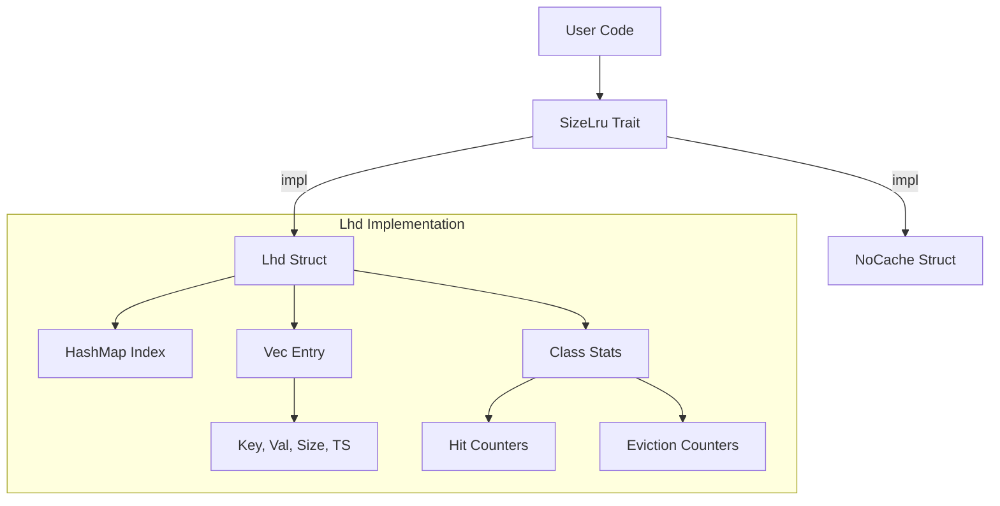
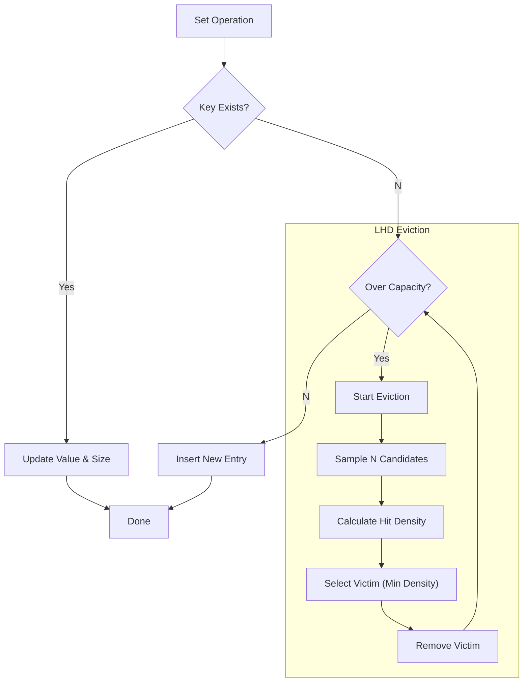
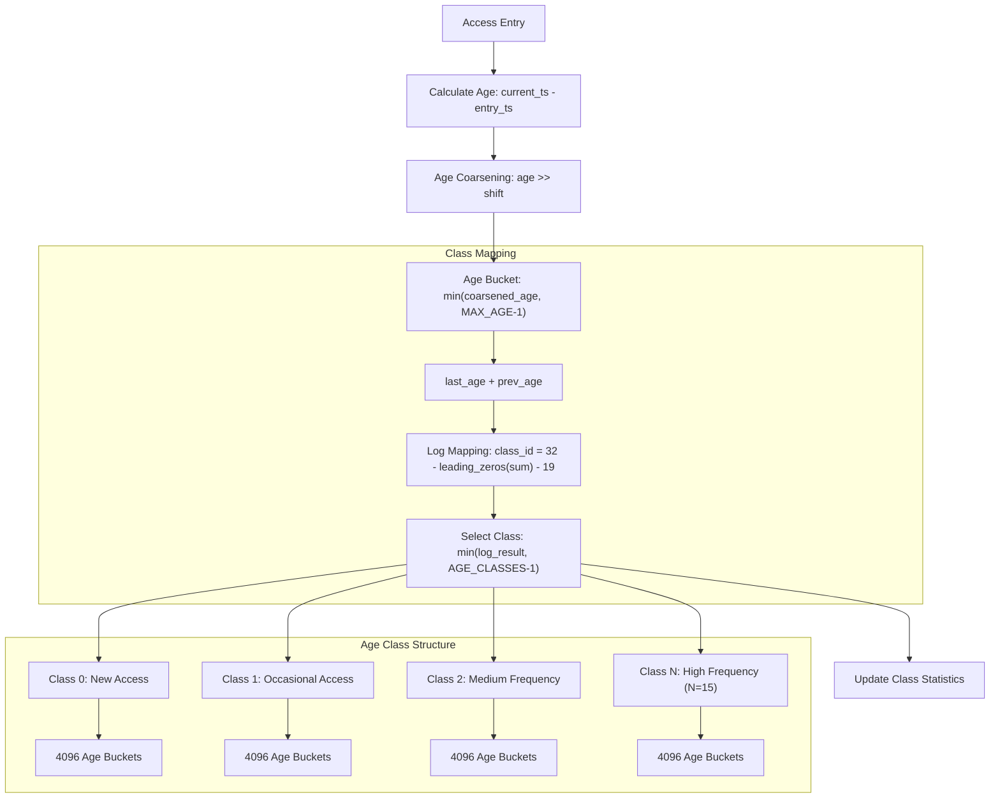
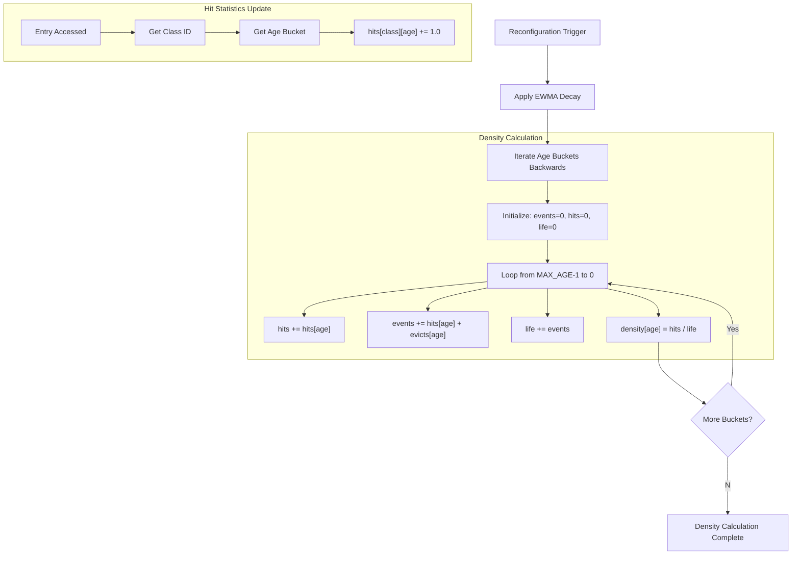
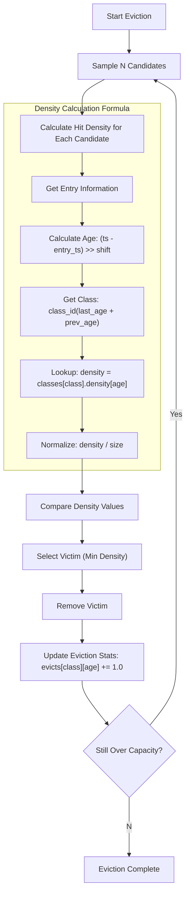

# size_lru : Intelligent Size-Aware Cache Library

High-performance, size-aware cache library implementing intelligent eviction strategies for optimal memory usage.

## Table of Contents

- [Features](#features)
- [Installation](#installation)
- [Usage](#usage)
- [API Reference](#api-reference)
- [Design](#design)
- [Technology Stack](#technology-stack)
- [Directory Structure](#directory-structure)
- [History](#history)

## Features

- **Size Awareness**: Optimizes storage based on actual object size rather than count.
- **Intelligent Eviction**: Implements LHD (Least Hit Density) algorithm to maximize hit rate.
- **Constant Complexity**: Guarantees O(1) time access for get, set, and remove operations.
- **Adaptive Tuning**: Automatically adjusts internal parameters to match workload patterns.
- **Zero Overhead**: Provides `NoCache` implementation for performance baselining.

## Installation

Add to `Cargo.toml`:

```toml
[dependencies]
size_lru = { version = "0.1.0", features = ["lhd"] }
```

## Usage

Demonstration code based on `tests/main.rs`.

### Basic Operations

```rust
use size_lru::Lhd;

fn main() {
  // Initialize cache with capacity
  let mut cache: Lhd<&str, &str> = Lhd::new(1024);

  // Set values with explicit size
  cache.set("k1", "v1", 10);
  cache.set("k2", "v2", 20);

  // Retrieve value
  assert_eq!(cache.get(&"k1"), Some(&"v1"));

  // Check state
  assert_eq!(cache.len(), 2);
  assert_eq!(cache.size(), 30);

  // Remove value
  cache.rm(&"k2");
  assert_eq!(cache.get(&"k2"), None);
}
```

### Generic Trait Usage

```rust
use size_lru::{SizeLru, Lhd};

fn cache_op<K, V>(cache: &mut impl SizeLru<K, V>, key: K, val: V, size: u32) {
  cache.set(key, val, size);
}
```

## API Reference

### `trait SizeLru<K, V>`

Core interface for cache implementations.

- `fn get(&mut self, key: &K) -> Option<&V>`: Retrieve reference to value. Updates hit statistics.
- `fn set(&mut self, key: K, val: V, size: u32)`: Insert or update value. Triggers eviction if capacity exceeded.
- `fn rm(&mut self, key: &K)`: Remove value by key.

### `struct Lhd<K, V>`

LHD algorithm implementation.

- `fn new(max: usize) -> Self`: Create new instance with maximum byte capacity.
- `fn size(&self) -> usize`: Return total size of stored items in bytes.
- `fn len(&self) -> usize`: Return count of stored items.
- `fn is_empty(&self) -> bool`: Return true if cache contains no items.

## Design

### Architecture



### Eviction Logic



### Generational Mechanism



### Hit Rate Calculation Mechanism



### Density Calculation and Eviction Flow



## Technology Stack

- **Rust**: Systems programming language.
- **gxhash**: High-performance, non-cryptographic hashing.
- **fastrand**: Efficient pseudo-random number generation.

## Directory Structure

```
src/
  lib.rs    # Trait definitions and module exports
  lhd.rs    # LHD algorithm implementation
  no.rs     # No-op implementation
tests/
  main.rs   # Integration tests and demos
readme/
  en.md     # English documentation
  zh.md     # Chinese documentation
```

## History

The **LHD (Least Hit Density)** algorithm originates from the NSDI '18 paper "LHD: Improving Cache Hit Rate by Maximizing Hit Density". The authors (Beckmann et al.) proposed replacing complex heuristics with a probabilistic framework. Instead of asking "which item was least recently used?", LHD asks "which item has the least expected hits per unit of space?". By estimating the probability of future hits based on object age and size, LHD maximizes the total hit rate of the cache. This implementation brings these theoretical gains to a practical Rust library.

### References

- **Paper**: [LHD: Improving Cache Hit Rate by Maximizing Hit Density](https://www.usenix.org/conference/nsdi18/presentation/beckmann) (NSDI '18)
- **Implementation**: [Official Simulation Code](https://github.com/beckmann/cache_replacement)
- **PDF**: [Download Paper](https://www.usenix.org/system/files/conference/nsdi18/nsdi18-beckmann.pdf)